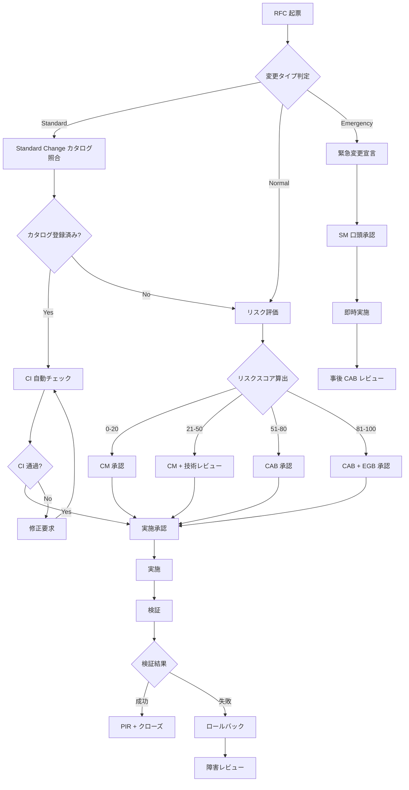
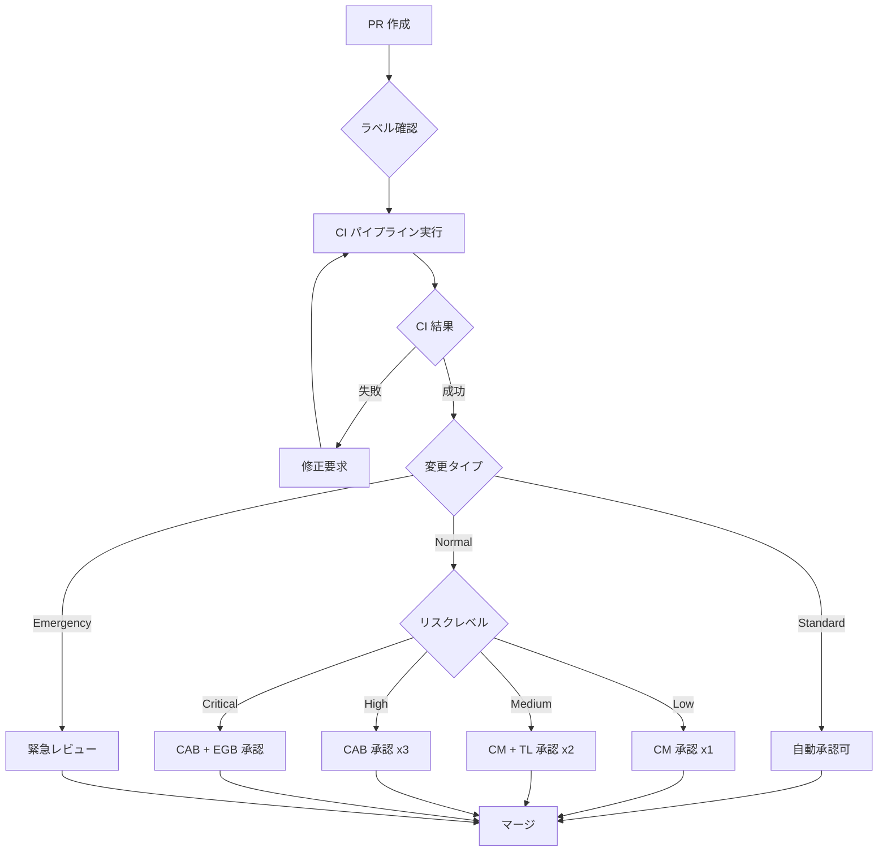

# ServiceMatrix 承認制御モデル（Approval Control Model）

Version: 1.0
Status: Active
Owner: Service Governance Authority
Classification: Governance Design Document
Last Updated: 2026-03-02

---

## 1. 文書の目的

本文書は、ServiceMatrix における承認制御の全体モデルを定義する。
変更タイプ別の承認要件、承認フロー、緊急変更手順、
および GitHub PR と承認フローの連携を体系的に記述する。

承認制御は統治の中核メカニズムであり、
不正な変更、リスクの見落とし、統治の形骸化を防止する。

---

## 2. 承認制御の基本原則

### 2.1 原則

1. **必要十分の原則**: 承認は必要な範囲で行い、過度な承認フローを避ける
2. **職務分掌の原則**: 申請者と承認者は分離する
3. **記録の原則**: すべての承認判断は記録される
4. **リスクベースの原則**: リスクに応じて承認レベルを変動させる
5. **タイムバウンドの原則**: 承認には期限を設定し、放置を防止する

### 2.2 承認の構成要素

すべての承認判断は、以下の要素を含む。

| 要素 | 説明 |
|------|------|
| 対象 | 何を承認するか |
| 申請者 | 誰が承認を求めるか |
| 承認者 | 誰が承認するか |
| 判断基準 | 何を基に判断するか |
| 記録 | 承認の証跡をどう残すか |
| 期限 | いつまでに承認するか |

---

## 3. 変更タイプ別承認モデル

### 3.1 変更タイプの分類

ServiceMatrix では、変更を以下の3タイプに分類する。

| 変更タイプ | 定義 | 例 |
|-----------|------|-----|
| Standard Change | リスクが低く、手順が事前承認済みの定型変更 | 定期パッチ適用、設定値の軽微変更、文書更新 |
| Normal Change | 通常の変更プロセスを経て実施される変更 | 機能追加、アーキテクチャ変更、設定変更 |
| Emergency Change | サービス復旧のために緊急に実施する変更 | 本番障害の緊急修正、セキュリティ脆弱性対応 |

### 3.2 Standard Change の承認

**承認モデル**: 事前承認型

Standard Change は、事前に承認された手順に従って実施される。
個々の変更ごとの承認は不要だが、手順の事前承認と実施記録は必要。

**事前承認の条件**:
- リスクスコアが 0-20（低リスク）
- 手順書が文書化・承認済み
- ロールバック手順が定義済み
- 過去の実施で問題が発生していない

**承認フロー**:

```
手順の事前承認:
  作成者 → CM レビュー → CAB 承認 → Standard Change カタログ登録

個々の実施:
  実施者 → PR 作成 → CI 通過 → 自動承認 → 実施 → 記録
```

**GitHub PR 連携**:
- `type:standard-change` ラベルを付与
- CI パイプラインがすべて通過すれば自動マージ可
- CODEOWNERS によるレビューは省略可（設定による）

### 3.3 Normal Change の承認

**承認モデル**: リスクベース段階承認型

Normal Change は、リスクスコアに応じて異なる承認レベルが適用される。

| リスクスコア | リスクレベル | 承認要件 |
|-------------|-------------|---------|
| 0-20 | 低 | CM 単独承認 |
| 21-50 | 中 | CM 承認 + 技術レビュー |
| 51-80 | 高 | CAB 承認 |
| 81-100 | 極高 | CAB 承認 + EGB 承認 |

**低リスク Normal Change フロー**:

```
起票者 → RFC 作成 → AI リスク評価 → CM レビュー → CM 承認
→ 実施計画策定 → 実施 → 検証 → PIR → クローズ
```

**中リスク Normal Change フロー**:

```
起票者 → RFC 作成 → AI リスク評価 → CM レビュー
→ 技術レビュー（TL + SEC） → CM 承認
→ 実施計画策定 → 実施 → 検証 → PIR → クローズ
```

**高リスク Normal Change フロー**:

```
起票者 → RFC 作成 → AI リスク評価 → CM レビュー
→ CAB 提出 → CAB 審査 → CAB 承認
→ 実施計画策定 → 実施 → 検証 → PIR → クローズ
```

**極高リスク Normal Change フロー**:

```
起票者 → RFC 作成 → AI リスク評価 → CM レビュー
→ CAB 提出 → CAB 審査 → CAB 承認
→ EGB 提出 → EGB 承認
→ 実施計画策定 → 実施 → 検証 → PIR → クローズ
```

**GitHub PR 連携**:
- `type:normal-change` ラベルを付与
- リスクスコアに応じた `risk:low` / `risk:medium` / `risk:high` / `risk:critical` ラベル
- CI パイプライン通過必須
- CODEOWNERS によるレビュー承認必須
- 高リスク以上は CAB メンバーの承認も必須

### 3.4 Emergency Change の承認

**承認モデル**: 簡略承認 + 事後正式承認型

Emergency Change は、サービス復旧を最優先とし、
簡略化された承認フローで迅速に実施する。
ただし、事後に正式な CAB レビューが必須。

**Emergency Change の発動条件**:
- P1 インシデントが発生し、サービスが中断している
- セキュリティ脆弱性の緊急対応が必要
- SLA の重大な逸脱が発生している

**承認フロー**:

```
緊急事態発生:

  IM/CM → 緊急変更宣言 → SM 口頭承認（記録必須）
  → 即時実施 → 検証 → 事後記録
  → 事後 CAB レビュー（72時間以内）
```

**事後承認の要件**:

| 項目 | 内容 |
|------|------|
| 事後レビュー期限 | 緊急変更実施後 72時間以内 |
| レビュー参加者 | CAB メンバー、IM、CM、実施者 |
| レビュー内容 | 緊急変更の妥当性、影響範囲、恒久対策の必要性 |
| 記録 | 事後レビュー議事録を Issue に記録 |

**GitHub PR 連携**:
- `type:emergency-change` ラベルを付与
- CI パイプラインは可能な限り実行（スキップは SM 承認が必要）
- 最低1名の承認者によるレビュー承認
- 事後レビュー Issue が自動作成される

---

## 4. 承認フロー詳細図

### 4.1 統合承認フロー



### 4.2 PR 承認フロー



---

## 5. リスクスコアリング

### 5.1 リスクスコアの算出方法

AI（ClaudeCode）がリスクスコアを自動算出する。
スコアは 0-100 の範囲で、以下の要素を評価する。

| 評価要素 | 重み | 説明 |
|---------|------|------|
| 影響範囲 | 25% | 影響を受けるサービス・ユーザー数 |
| 変更の複雑度 | 20% | コード変更量、設定変更箇所数 |
| 過去の成功率 | 15% | 類似変更の過去の成功/失敗率 |
| ロールバック容易性 | 15% | ロールバック手順の明確さと実行可能性 |
| テストカバレッジ | 15% | 変更に対するテストの網羅度 |
| 外部依存度 | 10% | 外部サービス・チームへの依存度 |

### 5.2 スコア算出の例

| シナリオ | 影響 | 複雑度 | 過去実績 | ロールバック | テスト | 外部依存 | 合計 |
|---------|------|--------|---------|-------------|--------|---------|------|
| 文書更新 | 2 | 2 | 20 | 25 | 25 | 10 | 8 |
| 軽微な設定変更 | 5 | 5 | 15 | 20 | 12 | 8 | 18 |
| 新機能追加 | 15 | 15 | 10 | 10 | 10 | 5 | 45 |
| アーキテクチャ変更 | 22 | 18 | 5 | 5 | 8 | 8 | 72 |
| DB スキーマ変更 | 25 | 20 | 3 | 3 | 5 | 10 | 88 |

### 5.3 スコアの検証

AI が算出したリスクスコアは、以下の場合に人間がオーバーライドできる。

- AI の評価に異議がある場合
- 追加のリスク要因が存在する場合
- 過去の類似変更で問題が発生した場合

オーバーライドの記録は必須であり、理由が記載されなければならない。

---

## 6. 承認者の要件と権限

### 6.1 承認者の資格

| 承認レベル | 資格要件 |
|-----------|---------|
| CM 承認 | Change Manager として任命されている |
| 技術レビュー | Technical Lead または SME として認定されている |
| CAB 承認 | CAB メンバーとして登録されている |
| EGB 承認 | Executive Governance Board のメンバーである |
| SM 承認（緊急） | Service Manager として任命されている |

### 6.2 承認者の責任

承認者は以下の責任を負う。

1. 変更内容の理解に基づいた判断を行う
2. リスク評価を検証する
3. ロールバック計画の妥当性を確認する
4. SoD の制約を遵守する
5. 承認の記録を残す

### 6.3 承認の委任

承認者が不在の場合、以下のルールに従い委任が可能。

| 承認者 | 委任先 | 条件 |
|--------|--------|------|
| CM | 指定された CM 代理 | 事前に書面で委任を登録 |
| CAB メンバー | 指定された代理メンバー | CAB 議長の承認 |
| SM | 指定された SM 代理 | 事前に書面で委任を登録 |
| EGB メンバー | 委任不可 | - |

---

## 7. GitHub PR と承認フローの連携

### 7.1 PR テンプレート

すべての変更 PR は、以下のテンプレートに従って作成する。

```markdown
## 変更概要
[変更内容の簡潔な説明]

## 変更タイプ
- [ ] Standard Change
- [ ] Normal Change
- [ ] Emergency Change

## リスク評価
- AI リスクスコア: [自動入力]
- リスクレベル: [Low / Medium / High / Critical]

## 影響範囲
[影響を受けるサービス・コンポーネント]

## ロールバック計画
[ロールバックの手順]

## テスト計画
[テスト内容と結果]

## 関連 Issue
closes #[Issue番号]

## チェックリスト
- [ ] CI パイプライン通過
- [ ] コードレビュー完了
- [ ] リスク評価確認
- [ ] ロールバック計画確認
- [ ] SoD 制約確認
```

### 7.2 ラベルによる承認制御

| ラベル | 効果 |
|--------|------|
| `type:standard-change` | 最小承認フロー適用 |
| `type:normal-change` | リスクベース承認フロー適用 |
| `type:emergency-change` | 緊急承認フロー適用 |
| `risk:low` | CM 承認のみ |
| `risk:medium` | CM + TL 承認 |
| `risk:high` | CAB 承認 |
| `risk:critical` | CAB + EGB 承認 |
| `cab:required` | CAB レビューが必要 |
| `cab:approved` | CAB 承認済み |
| `cab:rejected` | CAB 却下 |

### 7.3 Branch Protection Rules

| 設定項目 | 値 |
|---------|-----|
| Require pull request before merging | 有効 |
| Required approvals | リスクレベルに応じて 1-3 |
| Dismiss stale approvals | 有効 |
| Require review from CODEOWNERS | 有効 |
| Require status checks | CI パイプライン通過 |
| Require branches to be up to date | 有効 |
| Restrict push access | 保護ブランチへの直接 push 禁止 |

### 7.4 CODEOWNERS 設定

```
# 全体の変更はCM承認が必要
* @change-manager

# 統治文書の変更はSM承認が必要
/docs/00_foundation/ @service-manager
/docs/01_governance/ @service-manager

# セキュリティ関連はSEC承認が必要
/docs/06_security_compliance/ @security-officer
/.github/workflows/ @security-officer @technical-lead

# AI 設定の変更はAIGとSM承認が必要
/docs/04_agents_ai/ @ai-governance @service-manager
/.claude/ @ai-governance @service-manager
```

---

## 8. 承認の SLA

### 8.1 承認時間目標

| 承認タイプ | 目標時間 | エスカレーション |
|-----------|---------|----------------|
| Standard Change（CI 自動） | 即時 | 15分でCI未完了時アラート |
| Normal Change（低リスク） | 4時間 | 超過時 SM に通知 |
| Normal Change（中リスク） | 8時間 | 超過時 SM に通知 |
| Normal Change（高リスク） | 24時間 | 超過時 EGB に通知 |
| Normal Change（極高リスク） | 48時間 | 超過時 EGB 議長に通知 |
| Emergency Change | 30分 | 超過時自動エスカレーション |
| CAB レビュー | 次回 CAB 会議 | 緊急 CAB 招集可能 |

### 8.2 承認放置の防止

承認が放置されることを防止するため、以下のメカニズムを実装する。

1. 承認期限のラベル自動付与
2. 承認期限接近時の自動リマインド
3. 承認期限超過時の自動エスカレーション
4. 承認放置 KPI のモニタリング

---

## 9. 監査と記録

### 9.1 承認記録の保全

すべての承認判断は、以下の情報とともに永続的に記録される。

| 項目 | 記録先 |
|------|--------|
| 承認対象（変更ID / PR番号） | GitHub Issue / PR |
| 承認者 | GitHub PR Review |
| 承認日時 | GitHub タイムスタンプ |
| 承認コメント | PR Review コメント |
| リスクスコア | Issue ラベル + コメント |
| CI 結果 | GitHub Actions ログ |

### 9.2 監査対応

内部監査・外部監査の際に、以下の情報を提供できる。

- 特定期間の全変更とその承認記録
- 変更タイプ別の承認フロー遵守率
- SoD 違反の有無
- 緊急変更の事後レビュー状況
- 承認 SLA の達成率

---

## 10. 継続的改善

### 10.1 改善のトリガー

- 承認 SLA の未達成が継続する場合
- 変更失敗率が上昇する場合
- SoD 違反が検出される場合
- 監査で指摘を受けた場合
- ステークホルダーから改善要望がある場合

### 10.2 改善プロセス

1. 問題の特定と分析
2. 改善提案の作成
3. 影響分析
4. 承認（本文書の改定は EGB 承認）
5. 実装
6. 効果測定

---

## 付録: 関連文書

| 文書名 | 参照パス |
|--------|----------|
| 統治モデル | docs/01_governance/GOVERNANCE_MODEL.md |
| 変更権限構造 | docs/01_governance/CHANGE_AUTHORITY_STRUCTURE.md |
| 職務分掌 | docs/01_governance/SEGREGATION_OF_DUTIES.md |
| 状態遷移モデル | docs/01_governance/STATE_TRANSITION_MODEL.md |
| RACI マトリクス | docs/00_foundation/RACI_MATRIX.md |
