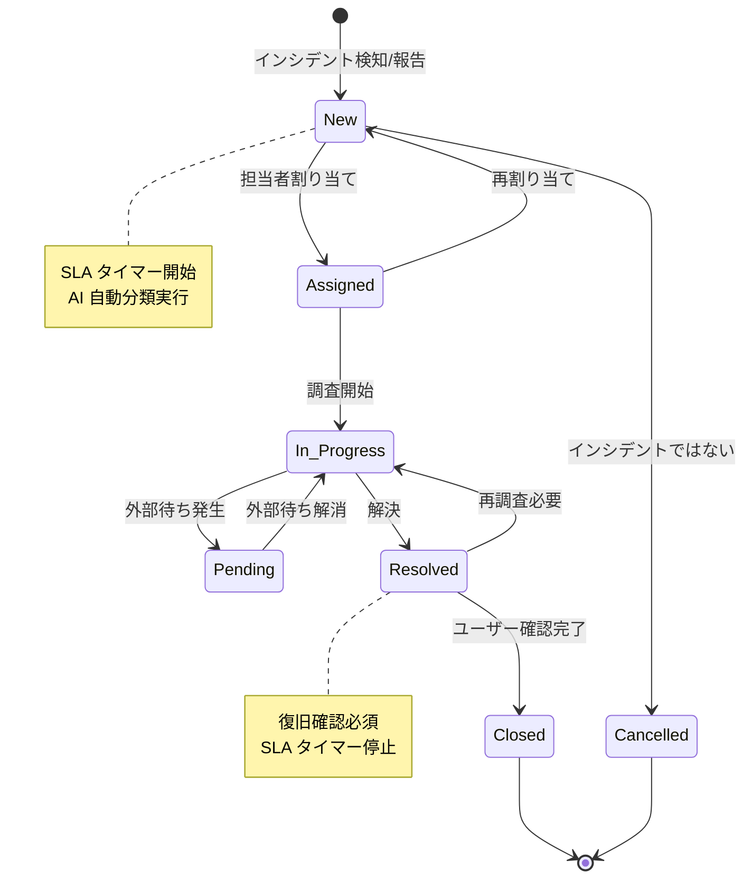
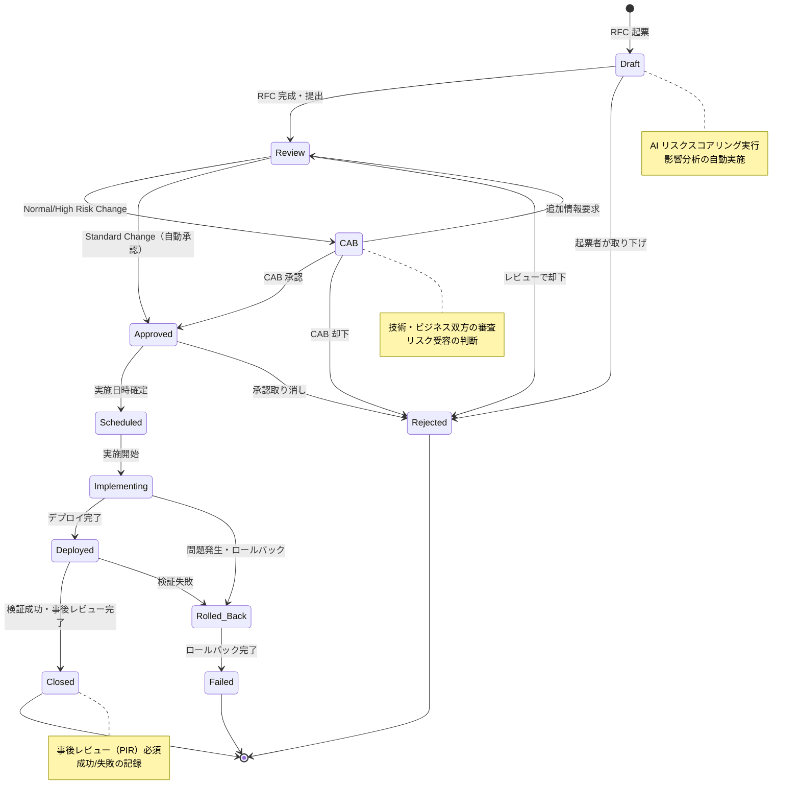
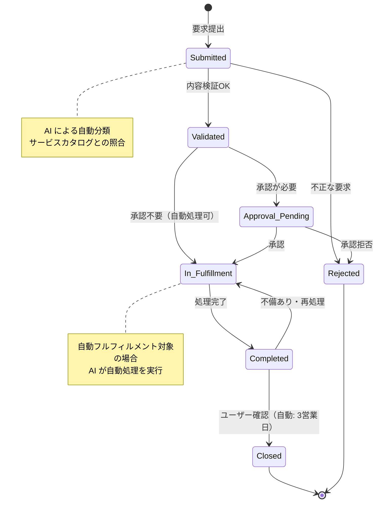
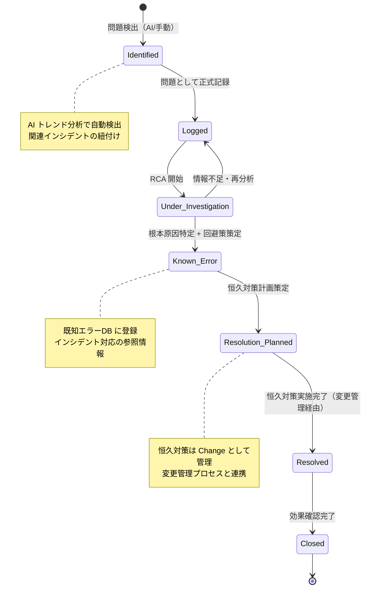
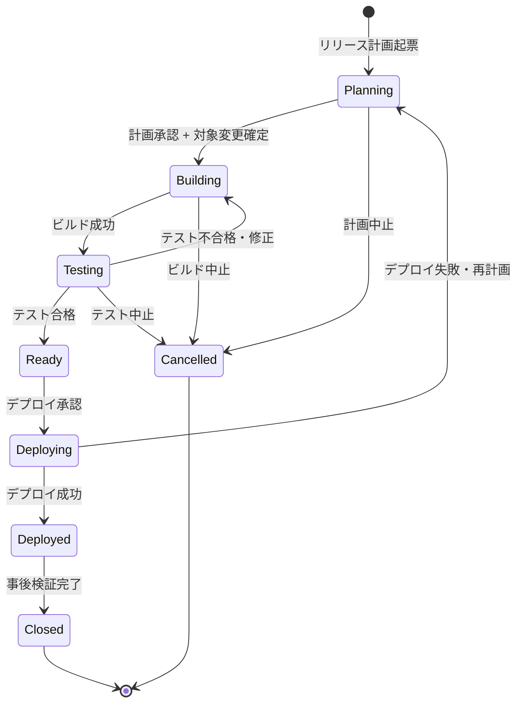

# ServiceMatrix 状態遷移モデル（State Transition Model）

Version: 1.0
Status: Active
Owner: Service Governance Authority
Classification: Governance Design Document
Last Updated: 2026-03-02

---

## 1. 文書の目的

本文書は、ServiceMatrix の各コアプロセスにおける
チケット（Issue）の状態遷移を定義する。

すべてのサービス状態変更は、本文書に定義された遷移ルールに従い、
記録・追跡・可視化されなければならない。

---

## 2. 状態遷移の共通原則

### 2.1 基本原則

1. すべての状態遷移は記録される（遷移日時、実行者、理由）
2. 定義されていない状態遷移は許可しない
3. 状態遷移には条件（Guard Condition）が設定される
4. 逆方向の遷移は制限される（再オープン等は明示的な条件が必要）
5. クローズ状態への遷移は承認が必要

### 2.2 共通属性

すべてのチケットは以下の共通属性を持つ。

| 属性 | 説明 |
|------|------|
| ID | 一意の識別子（GitHub Issue Number） |
| Type | プロセスタイプ（Incident / Change / Problem / Request） |
| Status | 現在の状態 |
| Priority | 優先度（P1-P5） |
| Assignee | 担当者 |
| Created | 作成日時 |
| Updated | 最終更新日時 |
| SLA Deadline | SLA 期限（該当する場合） |

### 2.3 GitHub Labels による状態管理

状態は GitHub Labels で管理される。

| Label Prefix | 用途 |
|-------------|------|
| `status:` | 現在の状態（例: `status:new`, `status:in-progress`） |
| `type:` | プロセスタイプ（例: `type:incident`, `type:change`） |
| `priority:` | 優先度（例: `priority:p1`, `priority:p3`） |
| `category:` | カテゴリ分類 |

---

## 3. Incident（インシデント）状態遷移

### 3.1 状態定義

| 状態 | 説明 | GitHub Label |
|------|------|-------------|
| New | 新規受付。分類・割り当て前 | `status:new` |
| Assigned | 担当者に割り当て済み。調査開始前 | `status:assigned` |
| In Progress | 調査・対応中 | `status:in-progress` |
| Pending | 外部待ち（ユーザー応答待ち、ベンダー対応待ち等） | `status:pending` |
| Resolved | 解決済み。ユーザー確認待ち | `status:resolved` |
| Closed | クローズ完了 | `status:closed` |
| Cancelled | 取り消し（インシデントではないと判断） | `status:cancelled` |

### 3.2 状態遷移図



### 3.3 遷移条件

| # | 遷移元 | 遷移先 | 条件 | 実行者 |
|---|--------|--------|------|--------|
| I-1 | New | Assigned | 分類・優先度設定完了 | IM / AI |
| I-2 | New | Cancelled | インシデントではないと判断 | IM |
| I-3 | Assigned | In Progress | 担当者が調査を開始 | Assignee |
| I-4 | Assigned | New | 担当者の変更が必要 | IM |
| I-5 | In Progress | Pending | 外部要因で作業停止 | Assignee |
| I-6 | In Progress | Resolved | サービス復旧確認 | Assignee + IM |
| I-7 | Pending | In Progress | 外部待ちが解消 | Assignee |
| I-8 | Resolved | Closed | ユーザー確認完了（自動クローズ: 5営業日） | IM |
| I-9 | Resolved | In Progress | 解決が不十分と判明 | IM / User |

### 3.4 SLA との連動

| 優先度 | 応答時間目標 | 解決時間目標 | SLA 計測区間 |
|--------|------------|------------|-------------|
| P1 | 15分 | 4時間 | New → Resolved |
| P2 | 30分 | 8時間 | New → Resolved |
| P3 | 2時間 | 24時間 | New → Resolved |
| P4 | 4時間 | 72時間 | New → Resolved |
| P5 | 8時間 | 計画対応 | New → Resolved |

Pending 状態の間は SLA タイマーを一時停止する。

---

## 4. Change（変更）状態遷移

### 4.1 状態定義

| 状態 | 説明 | GitHub Label |
|------|------|-------------|
| Draft | 草案。RFC 情報の入力中 | `status:draft` |
| Review | レビュー中。影響分析・リスク評価を実施 | `status:review` |
| CAB | CAB レビュー中（Normal Change の場合） | `status:cab` |
| Approved | 承認済み。実施待ち | `status:approved` |
| Scheduled | 実施日時が確定 | `status:scheduled` |
| Implementing | 実施中 | `status:implementing` |
| Deployed | デプロイ完了。検証中 | `status:deployed` |
| Closed | クローズ完了（成功） | `status:closed` |
| Rejected | 却下 | `status:rejected` |
| Rolled Back | ロールバック実施 | `status:rolled-back` |
| Failed | 失敗（事後レビュー対象） | `status:failed` |

### 4.2 状態遷移図



### 4.3 遷移条件

| # | 遷移元 | 遷移先 | 条件 | 実行者 |
|---|--------|--------|------|--------|
| C-1 | Draft | Review | 必須項目の入力完了 | 起票者 |
| C-2 | Draft | Rejected | 起票者による取り下げ | 起票者 |
| C-3 | Review | CAB | Normal Change + リスク評価完了 | CM |
| C-4 | Review | Approved | Standard Change + CI 通過 | CM / AI |
| C-5 | Review | Rejected | リスクが許容不可 | CM |
| C-6 | CAB | Approved | CAB メンバーの過半数承認 | CAB |
| C-7 | CAB | Rejected | CAB が却下 | CAB |
| C-8 | CAB | Review | 追加情報が必要 | CAB |
| C-9 | Approved | Scheduled | 実施日時・ロールバック計画確定 | CM |
| C-10 | Scheduled | Implementing | 実施開始（スケジュール到達） | 実装者 |
| C-11 | Implementing | Deployed | デプロイ完了 | 実装者 |
| C-12 | Implementing | Rolled Back | 問題検知・ロールバック判断 | CM / IM |
| C-13 | Deployed | Closed | 検証完了 + PIR 完了 | CM |
| C-14 | Deployed | Rolled Back | 検証で問題検知 | CM |
| C-15 | Rolled Back | Failed | ロールバック処理完了 | CM |

### 4.4 変更タイプ別フロー

| 変更タイプ | 経由する状態 | 特徴 |
|-----------|------------|------|
| Standard Change | Draft → Review → Approved → Scheduled → Implementing → Deployed → Closed | CAB をスキップ、事前承認済み |
| Normal Change | Draft → Review → CAB → Approved → Scheduled → Implementing → Deployed → Closed | フルフロー |
| Emergency Change | Draft → Review → Approved → Implementing → Deployed → Closed | CAB は事後実施、優先実行 |

---

## 5. Request（サービス要求）状態遷移

### 5.1 状態定義

| 状態 | 説明 | GitHub Label |
|------|------|-------------|
| Submitted | 要求提出済み | `status:submitted` |
| Validated | 内容検証済み。処理可能と判断 | `status:validated` |
| Approval Pending | 承認待ち（承認が必要な場合） | `status:approval-pending` |
| In Fulfillment | 処理・実行中 | `status:in-fulfillment` |
| Completed | 処理完了。ユーザー確認待ち | `status:completed` |
| Closed | クローズ完了 | `status:closed` |
| Rejected | 却下 | `status:rejected` |

### 5.2 状態遷移図



### 5.3 遷移条件

| # | 遷移元 | 遷移先 | 条件 | 実行者 |
|---|--------|--------|------|--------|
| R-1 | Submitted | Validated | カタログ準拠 + 必要情報あり | SD / AI |
| R-2 | Submitted | Rejected | 不正要求またはカタログ外 | SD |
| R-3 | Validated | Approval Pending | 承認が必要なサービス | SD |
| R-4 | Validated | In Fulfillment | 承認不要 + 自動処理可 | AI |
| R-5 | Approval Pending | In Fulfillment | 承認者による承認 | SRO |
| R-6 | Approval Pending | Rejected | 承認者による拒否 | SRO |
| R-7 | In Fulfillment | Completed | 処理完了 | OPS / AI |
| R-8 | Completed | Closed | ユーザー確認OK | SD |
| R-9 | Completed | In Fulfillment | 不備による再処理 | SD |

---

## 6. Problem（問題）状態遷移

### 6.1 状態定義

| 状態 | 説明 | GitHub Label |
|------|------|-------------|
| Identified | 問題として特定・起票 | `status:identified` |
| Logged | 正式に記録。分析待ち | `status:logged` |
| Under Investigation | 根本原因分析中 | `status:under-investigation` |
| Known Error | 根本原因特定。回避策あり | `status:known-error` |
| Resolution Planned | 恒久対策計画済み | `status:resolution-planned` |
| Resolved | 恒久対策完了 | `status:resolved` |
| Closed | クローズ完了 | `status:closed` |

### 6.2 状態遷移図



### 6.3 遷移条件

| # | 遷移元 | 遷移先 | 条件 | 実行者 |
|---|--------|--------|------|--------|
| P-1 | Identified | Logged | 問題として承認・分類完了 | PM |
| P-2 | Logged | Under Investigation | RCA 担当者割り当て + 開始 | PM / TL |
| P-3 | Under Investigation | Known Error | 根本原因特定 + 回避策文書化 | TL |
| P-4 | Under Investigation | Logged | 情報不足で再分析が必要 | PM |
| P-5 | Known Error | Resolution Planned | 恒久対策計画の承認 | PM |
| P-6 | Resolution Planned | Resolved | 恒久対策の実施完了（Change Closed） | PM + CM |
| P-7 | Resolved | Closed | 効果確認完了 + 再発なし確認 | PM |

---

## 7. Release（リリース）状態遷移

### 7.1 状態定義

| 状態 | 説明 | GitHub Label |
|------|------|-------------|
| Planning | リリース計画策定中 | `status:planning` |
| Building | ビルド・パッケージング中 | `status:building` |
| Testing | テスト実施中 | `status:testing` |
| Ready | リリース準備完了。承認待ち | `status:ready` |
| Deploying | デプロイ実施中 | `status:deploying` |
| Deployed | デプロイ完了 | `status:deployed` |
| Closed | リリースクローズ | `status:closed` |
| Cancelled | リリース中止 | `status:cancelled` |

### 7.2 状態遷移図



---

## 8. 状態遷移の監視と監査

### 8.1 自動監視

| 監視対象 | 条件 | アクション |
|---------|------|-----------|
| 長期滞留 | 同一状態が規定時間を超過 | 自動アラート |
| 不正遷移 | 定義外の状態遷移が試行 | 遷移拒否 + アラート |
| SLA 逸脱リスク | SLA 期限の70%到達 | エスカレーション |
| 逆行遷移 | Resolved → In Progress 等 | 理由の記録を強制 |

### 8.2 監査証跡

すべての状態遷移について、以下が記録される。

| 項目 | 内容 |
|------|------|
| チケットID | GitHub Issue Number |
| 遷移前状態 | 変更前の状態 |
| 遷移後状態 | 変更後の状態 |
| 遷移日時 | ISO 8601 形式 |
| 実行者 | 人間またはAIエージェント |
| 理由 | 遷移の理由（コメントまたは自動記録） |

---

## 9. 状態遷移の技術的実装

### 9.1 GitHub Labels による実装

状態は GitHub Labels で管理され、GitHub Actions により
遷移ルールが強制される。

```yaml
# 状態遷移チェックの概念
on:
  issues:
    types: [labeled]
jobs:
  validate-transition:
    # 現在の状態ラベルと新しい状態ラベルを検証
    # 許可された遷移のみを受け入れる
    # 不正な遷移はラベルを元に戻す
```

### 9.2 自動遷移

以下の状態遷移は自動で実行される。

| トリガー | 遷移 | 条件 |
|---------|------|------|
| Issue 作成 | → New / Submitted / Draft | ラベルに基づく自動判定 |
| PR マージ | Implementing → Deployed | 関連 Issue の自動更新 |
| CI 通過 | Building → Testing | 自動遷移 |
| SLA 期限超過 | 自動エスカレーション | アラート生成 |
| 無応答タイムアウト | Resolved → Closed | 5営業日経過 |

---

## 付録: 状態ラベル一覧

| Label | 色 | 対象プロセス |
|-------|----|------------|
| `status:new` | #0E8A16 | Incident |
| `status:assigned` | #1D76DB | Incident |
| `status:in-progress` | #FBCA04 | Incident |
| `status:pending` | #D93F0B | Incident |
| `status:resolved` | #0075CA | Incident |
| `status:closed` | #6A737D | All |
| `status:cancelled` | #E4E669 | All |
| `status:draft` | #C2E0C6 | Change |
| `status:review` | #BFD4F2 | Change |
| `status:cab` | #D4C5F9 | Change |
| `status:approved` | #0E8A16 | Change |
| `status:scheduled` | #1D76DB | Change |
| `status:implementing` | #FBCA04 | Change |
| `status:deployed` | #0075CA | Change / Release |
| `status:rejected` | #B60205 | Change / Request |
| `status:rolled-back` | #D93F0B | Change |
| `status:failed` | #B60205 | Change |
| `status:submitted` | #0E8A16 | Request |
| `status:validated` | #1D76DB | Request |
| `status:approval-pending` | #D4C5F9 | Request |
| `status:in-fulfillment` | #FBCA04 | Request |
| `status:completed` | #0075CA | Request |
| `status:identified` | #0E8A16 | Problem |
| `status:logged` | #1D76DB | Problem |
| `status:under-investigation` | #FBCA04 | Problem |
| `status:known-error` | #D93F0B | Problem |
| `status:resolution-planned` | #0075CA | Problem |
| `status:planning` | #C2E0C6 | Release |
| `status:building` | #BFD4F2 | Release |
| `status:testing` | #FBCA04 | Release |
| `status:ready` | #0075CA | Release |
| `status:deploying` | #1D76DB | Release |
