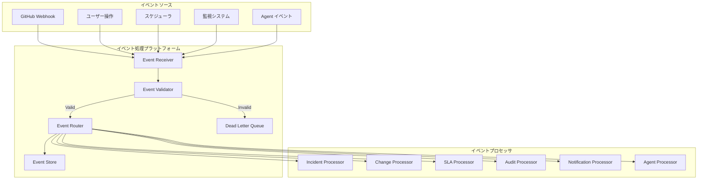
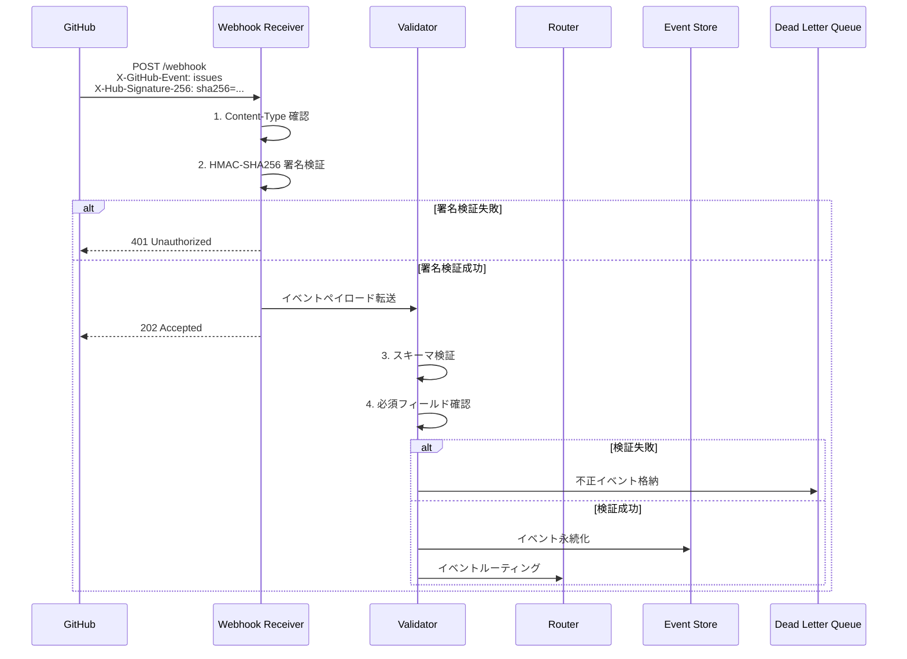
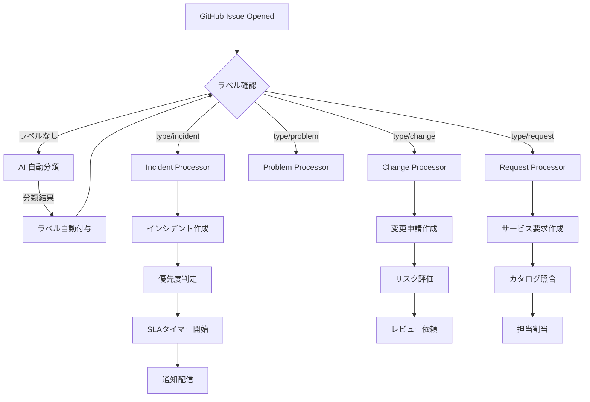
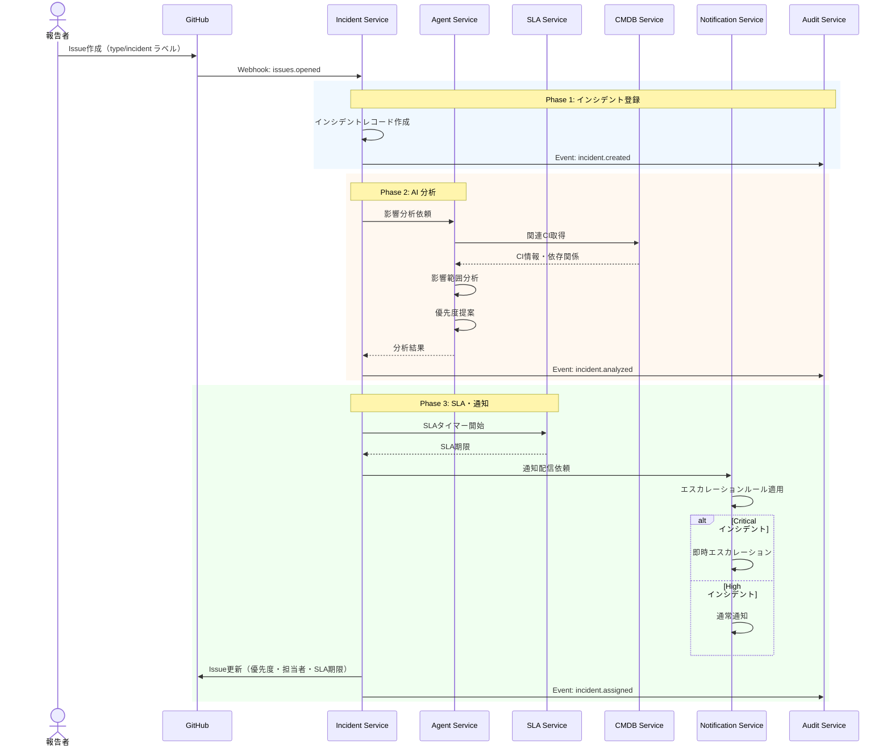
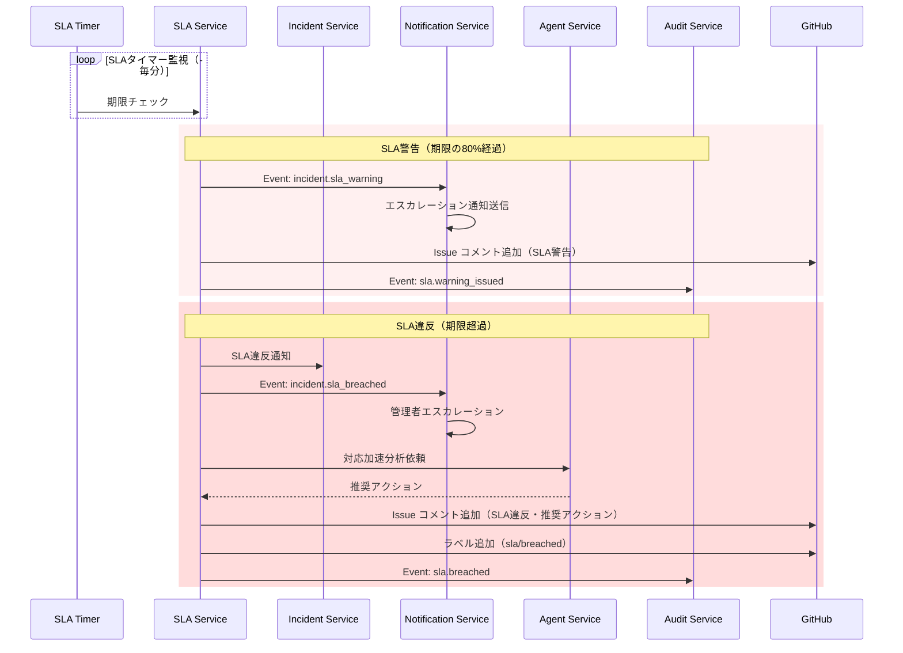
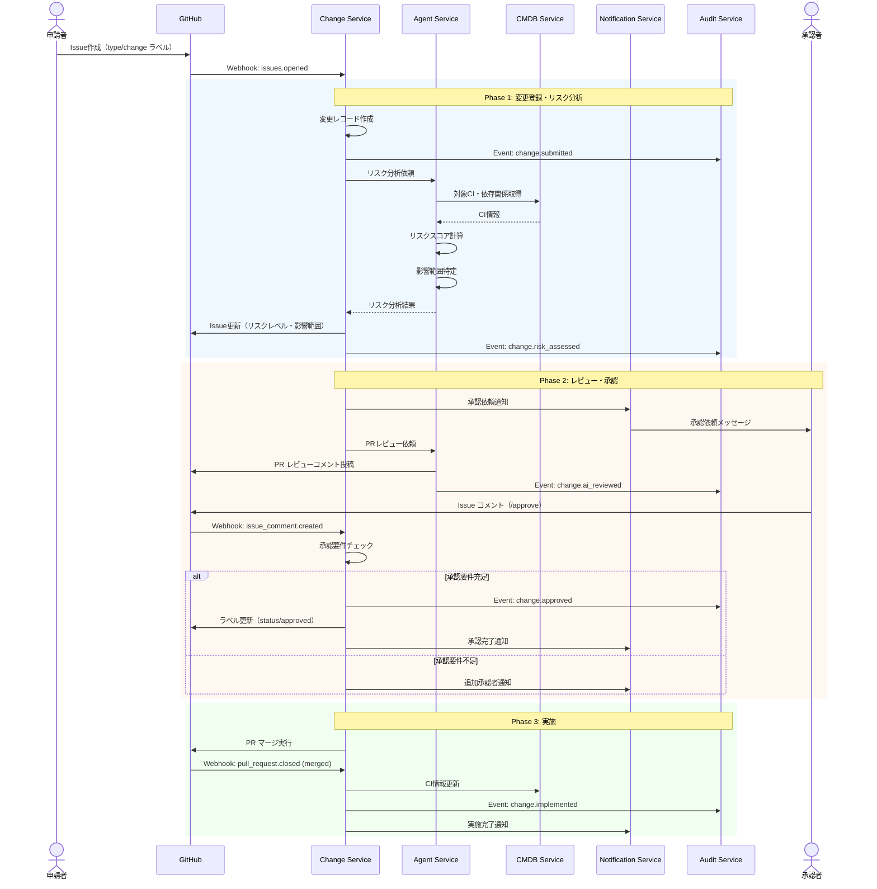
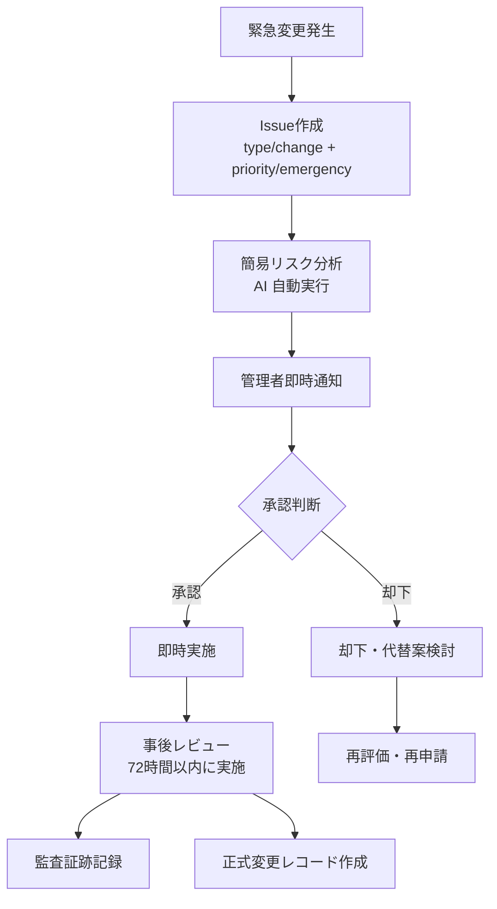
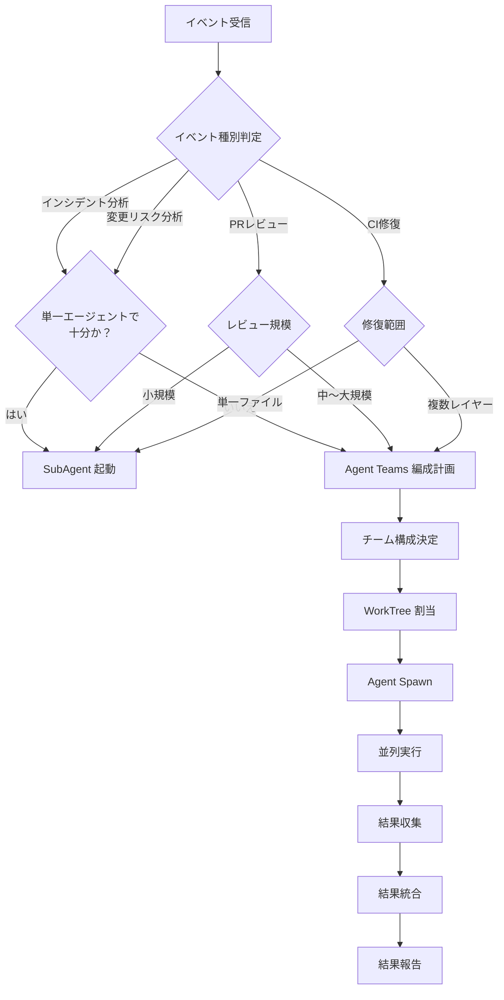
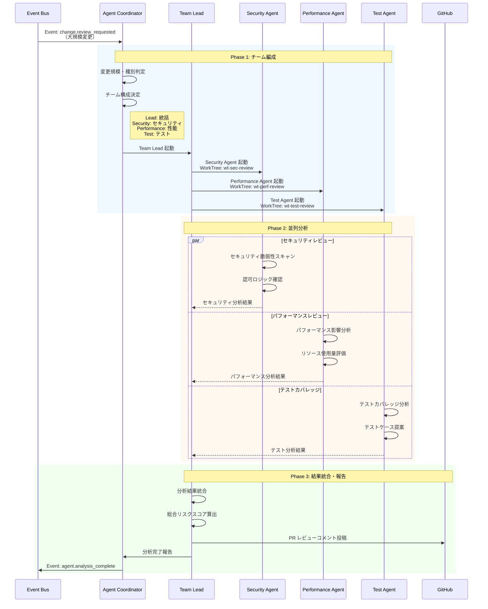

# イベントフローアーキテクチャ

ServiceMatrix Event Flow Architecture

Version: 1.0
Status: Active
Classification: Internal Architecture Document

---

## 1. はじめに

本ドキュメントは ServiceMatrix におけるイベント駆動アーキテクチャの設計を定義する。
GitHub Webhook を起点としたイベント処理フロー、主要なビジネスプロセスのイベントフロー、
および AI Agent Teams の起動フローを明確にする。

---

## 2. イベント駆動アーキテクチャの概要

ServiceMatrix はイベント駆動アーキテクチャ（EDA）を採用し、
システム内のすべての状態変化をイベントとして捕捉・伝播する。

### 2.1 設計原則

1. **すべての状態変化はイベントとして記録される**: 暗黙の変更は許容しない
2. **イベントは不変（Immutable）である**: 一度発行されたイベントは変更されない
3. **購読者はべき等に処理する**: 同一イベントの重複配信に対応する
4. **イベントは監査証跡を兼ねる**: 全イベントが自動的に監査ログとなる
5. **非同期処理を基本とする**: 疎結合を維持し、可用性を向上させる

### 2.2 イベントアーキテクチャ全体図



---

## 3. GitHub Webhook イベント処理フロー

### 3.1 Webhook 受信・検証フロー



### 3.2 GitHub Webhook イベント種別と処理マッピング

| GitHub イベント | アクション | ServiceMatrix 処理 | 内部イベント |
|---|---|---|---|
| `issues` | opened | ラベル判定 → Issue分類 | `issue.classified` |
| `issues` | labeled | ラベルに応じた処理起動 | `issue.labeled` |
| `issues` | closed | プロセス完了処理 | `incident.resolved` / `change.completed` |
| `issue_comment` | created | コメント解析・コマンド実行 | `comment.processed` |
| `pull_request` | opened | 変更レビュー開始 | `change.review_started` |
| `pull_request` | closed (merged) | 変更実施完了 | `change.implemented` |
| `pull_request_review` | submitted | レビュー結果反映 | `change.reviewed` |
| `push` | - | CI パイプライン起動 | `ci.triggered` |
| `workflow_run` | completed | CI 結果反映 | `ci.completed` |
| `check_suite` | completed | チェック結果反映 | `ci.check_completed` |

### 3.3 Issue ラベルベースの分類フロー



---

## 4. インシデント発生時のイベントフロー

### 4.1 インシデントライフサイクル イベントフロー



### 4.2 SLA 違反検知フロー



---

## 5. 変更承認時のイベントフロー

### 5.1 変更申請〜承認フロー



### 5.2 Emergency 変更フロー



---

## 6. AI Agent Teams 起動フロー

### 6.1 Agent Teams 起動判断フロー



### 6.2 Agent Teams 編成フロー（詳細）



### 6.3 Agent 起動条件

| トリガーイベント | 起動条件 | Agent 種別 | チーム編成 |
|---|---|---|---|
| `incident.created` (Critical) | 優先度が Critical | Analysis Agent | SubAgent |
| `incident.sla_warning` | SLA 80%経過 | Analysis Agent | SubAgent |
| `change.submitted` (High Risk) | リスクレベル High | Risk Agent | SubAgent |
| `change.review_requested` (大規模) | 変更ファイル数 > 10 | Review Agents | Agent Teams |
| `ci.failed` | CI パイプライン失敗 | Repair Agent | SubAgent |
| `ci.failed` (複合) | 複数ジョブ失敗 | Repair Agents | Agent Teams |
| `audit.compliance_alert` | コンプライアンス違反 | Audit Agent | SubAgent |

---

## 7. イベント永続化とリプレイ

### 7.1 Event Store 設計

| フィールド | 型 | 説明 |
|---|---|---|
| event_id | UUID | イベント一意識別子 |
| event_type | String | イベント種別 |
| aggregate_id | UUID | 集約ID（Incident ID, Change ID 等） |
| aggregate_type | String | 集約種別 |
| version | Integer | 集約バージョン |
| timestamp | DateTime | イベント発生時刻 |
| actor_type | Enum | user / agent / system |
| actor_id | String | 実行者ID |
| payload | JSONB | イベントデータ |
| metadata | JSONB | メタデータ |
| correlation_id | UUID | 相関ID（一連の処理を紐付け） |

### 7.2 イベントリプレイ

障害復旧やデバッグのため、Event Store からイベントをリプレイする機能を提供する。

```mermaid
flowchart LR
    ES[Event Store] -->|時系列順取得| REPLAY[Replay Engine]
    REPLAY -->|イベント再配信| PROC[Event Processor]
    PROC -->|状態再構築| STATE[Aggregate State]

    FILTER[フィルタ条件] --> REPLAY
    Note right of FILTER: 時間範囲<br/>集約ID<br/>イベント種別
```

---

## 8. イベント監視とアラート

### 8.1 イベントメトリクス

| メトリクス | 説明 | アラート閾値 |
|---|---|---|
| `events.received.count` | 受信イベント数/分 | 異常増加時 |
| `events.processed.count` | 処理完了イベント数/分 | 処理率低下時 |
| `events.failed.count` | 処理失敗イベント数/分 | 1件以上 |
| `events.dlq.count` | DLQイベント数 | 1件以上 |
| `events.processing_time.p95` | 処理時間95パーセンタイル | 5秒超過 |
| `events.lag` | イベント処理遅延 | 1分超過 |

### 8.2 ヘルスチェック

各イベントプロセッサはヘルスチェックエンドポイントを提供する。

| チェック項目 | 確認内容 | 頻度 |
|---|---|---|
| プロセッサ生存確認 | プロセスの実行状態 | 30秒ごと |
| キュー接続確認 | Event Bus への接続状態 | 30秒ごと |
| 処理バックログ | 未処理イベント数 | 1分ごと |
| DLQ サイズ | Dead Letter Queue のサイズ | 5分ごと |

---

## 8.3 イベント種別定義カタログ

ServiceMatrix で扱うイベントを以下の5種別に分類する。

#### 種別 1: Incident Events（インシデントイベント）

| イベント種別 | トリガー | 発行元 | 優先処理 |
|------------|--------|-------|---------|
| `incident.created` | インシデントチケット作成 | Incident Service | P1/P2 は即時処理 |
| `incident.assigned` | 担当者アサイン | Incident Service | 通常 |
| `incident.escalated` | エスカレーション実行 | Escalation Engine | 高優先 |
| `incident.updated` | 状態・情報更新 | Incident Service | 通常 |
| `incident.resolved` | 解決ステータスへ遷移 | Incident Service | 通常 |
| `incident.closed` | クローズ | Incident Service | 通常 |
| `incident.sla_warning` | SLA 80% 到達 | SLA Service | 高優先 |
| `incident.sla_breached` | SLA 違反 | SLA Service | 最高優先 |
| `incident.reopened` | 再オープン | Incident Service | 高優先 |

#### 種別 2: Change Events（変更イベント）

| イベント種別 | トリガー | 発行元 | 優先処理 |
|------------|--------|-------|---------|
| `change.submitted` | 変更申請作成 | Change Service | 通常 |
| `change.risk_assessed` | リスク評価完了 | Agent Service | 通常 |
| `change.ai_reviewed` | AI レビュー完了 | Agent Service | 通常 |
| `change.approved` | 承認完了 | Change Service | 通常 |
| `change.rejected` | 却下 | Change Service | 通常 |
| `change.scheduled` | リリース日程確定 | Change Service | 通常 |
| `change.implemented` | 変更実施完了 | Change Service | 通常 |
| `change.failed` | 変更実施失敗 | Change Service | 高優先 |
| `change.rolled_back` | ロールバック実施 | Change Service | 高優先 |
| `change.emergency_created` | 緊急変更作成 | Change Service | 最高優先 |

#### 種別 3: Problem Events（問題イベント）

| イベント種別 | トリガー | 発行元 | 優先処理 |
|------------|--------|-------|---------|
| `problem.identified` | 問題として登録 | Problem Service | 高優先 |
| `problem.rca_started` | RCA 開始 | Problem Service | 通常 |
| `problem.root_cause_found` | 根本原因特定 | Problem Service | 通常 |
| `problem.kedb_registered` | KEDB 登録 | Problem Service | 通常 |
| `problem.resolved` | 問題解決 | Problem Service | 通常 |
| `problem.closed` | 問題クローズ | Problem Service | 通常 |

#### 種別 4: Request Events（リクエストイベント）

| イベント種別 | トリガー | 発行元 | 優先処理 |
|------------|--------|-------|---------|
| `request.submitted` | リクエスト提出 | Request Service | 通常 |
| `request.approved` | 承認完了 | Request Service | 通常 |
| `request.rejected` | 却下 | Request Service | 通常 |
| `request.in_progress` | 処理開始 | Request Service | 通常 |
| `request.fulfilled` | 完了 | Request Service | 通常 |
| `request.cancelled` | キャンセル | Request Service | 通常 |
| `request.sla_warning` | SLA 80% 到達 | SLA Service | 通常 |

#### 種別 5: System Events（システムイベント）

| イベント種別 | トリガー | 発行元 | 優先処理 |
|------------|--------|-------|---------|
| `ci.triggered` | CI パイプライン起動 | CI/CD Service | 通常 |
| `ci.failed` | CI 失敗 | CI/CD Service | 高優先 |
| `ci.completed` | CI 完了 | CI/CD Service | 通常 |
| `agent.analysis_complete` | AI 分析完了 | Agent Service | 通常 |
| `audit.compliance_alert` | コンプライアンス違反 | Audit Service | 最高優先 |
| `release.deployed` | リリースデプロイ完了 | Release Service | 通常 |
| `cmdb.ci_updated` | CI 情報更新 | CMDB Service | 通常 |
| `sla.timer_started` | SLA タイマー開始 | SLA Service | 通常 |
| `notification.sent` | 通知配信完了 | Notification Service | 低 |

---

## 8.4 監査証跡イベント記録モデル

### 8.4.1 監査証跡の原則

ServiceMatrix における監査証跡は、イベントソーシングパターンを基盤とし、以下の原則に従う：

1. **記録の完全性**: すべての状態変化はイベントとして永続化される。削除不可。
2. **不変性（Immutability）**: 一度記録した監査ログは変更・削除を許可しない
3. **追跡可能性**: どの操作がいつ・誰によって行われたかを完全に追跡できる
4. **相関性**: 一連の操作は `correlation_id` によって紐付けて追跡できる
5. **J-SOX 準拠**: 財務・ガバナンス関連の変更は7年間保持する

### 8.4.2 監査ログレコード構造

```json
{
  "audit_id": "audit-uuid-v4",
  "event_id": "event-uuid-v4（元イベントへの参照）",
  "event_type": "change.approved",
  "timestamp": "2026-03-02T10:30:00.123Z",
  "correlation_id": "correlation-uuid-v4（一連操作の紐付け）",
  "trace_id": "trace-uuid-v4（分散トレーシング）",

  "actor": {
    "type": "user",
    "id": "user-12345",
    "name": "yamada.taro@example.com",
    "roles": ["change_manager"],
    "ip_address": "192.168.1.100（ハッシュ化）",
    "user_agent": "Mozilla/5.0..."
  },

  "entity": {
    "type": "Change",
    "id": "CHG-2026-0042",
    "version_before": 3,
    "version_after": 4
  },

  "operation": {
    "action": "approve",
    "result": "success",
    "reason": "変更リスクが許容範囲内であることを確認"
  },

  "diff": {
    "status": {"before": "pending_approval", "after": "approved"},
    "approved_by": {"before": null, "after": "yamada.taro"},
    "approved_at": {"before": null, "after": "2026-03-02T10:30:00Z"}
  },

  "context": {
    "environment": "production",
    "service": "change-service",
    "request_id": "req-uuid-v4"
  },

  "compliance": {
    "sox_relevant": true,
    "retention_years": 7,
    "classification": "change_management"
  }
}
```

### 8.4.3 監査必須イベント一覧

J-SOX および ISO/IEC 20000 準拠のため、以下のイベントは必ず監査ログに記録する。

| カテゴリ | 記録必須イベント | 保持期間 |
|---------|--------------|---------|
| 認証・認可 | ログイン成功/失敗、ロール変更、権限昇格 | 5年 |
| 変更管理 | 変更の承認/却下/実施/ロールバック | 7年 |
| リリース管理 | デプロイ実行、ロールバック、Go/NoGo 判定 | 7年 |
| インシデント | P1/P2 の作成・解決・SLA 違反 | 7年 |
| 問題管理 | 根本原因の認定・KEDB 登録 | 7年 |
| 設定変更 | システム設定の変更 | 7年 |
| データアクセス | 機密データへのアクセス | 3年 |
| AI 判断 | AI による重要判断・提案の採用/却下 | 3年 |

### 8.4.4 監査ログ検索インターフェース

```
検索パラメータ:
  - entity_type: 対象エンティティ種別（Incident / Change / Request 等）
  - entity_id: 対象エンティティ ID
  - actor_id: 操作者 ID
  - event_type: イベント種別
  - date_from / date_to: 期間絞り込み
  - correlation_id: 一連操作の追跡
  - sox_relevant: J-SOX 関連フラグ

エクスポート形式:
  - JSON Lines（機械処理用）
  - CSV（人間可読用）
  - PDF（監査対応用、改ざん防止ハッシュ付き）
```

---

## 9. 関連ドキュメント

| ドキュメント | 参照先 |
|---|---|
| サービス間連携図 | [SERVICE_INTERACTION_DIAGRAM.md](./SERVICE_INTERACTION_DIAGRAM.md) |
| システムアーキテクチャ概要 | [SYSTEM_ARCHITECTURE_OVERVIEW.md](./SYSTEM_ARCHITECTURE_OVERVIEW.md) |
| CI自己修復ループ | [../05_devops/CI_SELF_HEALING_LOOP.md](../05_devops/CI_SELF_HEALING_LOOP.md) |
| WorkTree戦略 | [../05_devops/WORKTREE_STRATEGY.md](../05_devops/WORKTREE_STRATEGY.md) |

---

*本ドキュメントは ServiceMatrix プロジェクトの統治原則に基づき管理される。*
*変更は Change Issue → PR → CI検証 → 承認 のフローに従うこと。*
