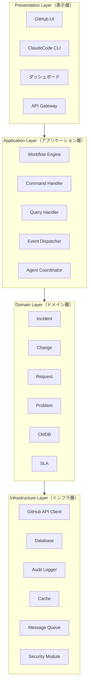
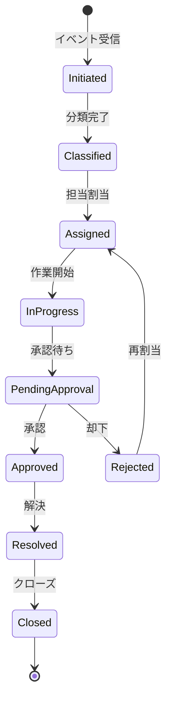
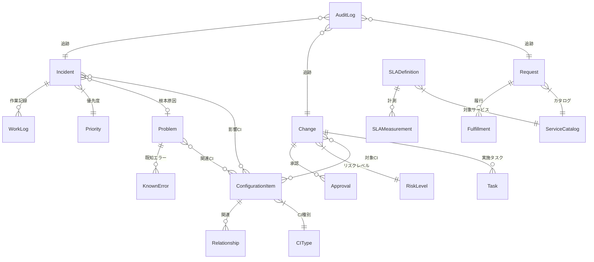
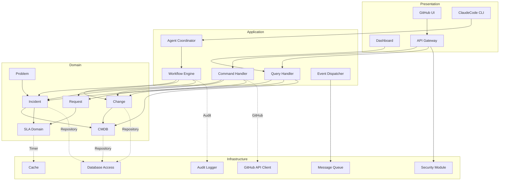

# 論理アーキテクチャ

ServiceMatrix Logical Architecture

Version: 1.0
Status: Active
Classification: Internal Architecture Document

---

## 1. はじめに

本ドキュメントは ServiceMatrix の論理アーキテクチャを定義する。
レイヤー構成、各レイヤーのコンポーネント詳細、ドメインモデル、
および依存関係を明確にし、開発・運用の指針とする。

---

## 2. レイヤー構成

ServiceMatrix は4層レイヤーアーキテクチャを採用する。



---

## 3. Presentation Layer（表示層）

### 3.1 責務

- ユーザーインターフェースの提供
- リクエストの受信とバリデーション
- レスポンスのフォーマットと返却
- 認証トークンの検証

### 3.2 コンポーネント詳細

#### 3.2.1 GitHub UI 連携

GitHub Issues / Pull Requests のネイティブ UI を ServiceMatrix のフロントエンドとして活用する。
カスタム Issue テンプレート、PR テンプレート、ラベル体系により統治インターフェースを実現する。

- Issue テンプレート: インシデント報告、変更申請、サービス要求
- PR テンプレート: 変更内容、影響範囲、テスト結果
- ラベル体系: priority/*, type/*, status/*, sla/*

#### 3.2.2 ClaudeCode CLI

ClaudeCode Agent Teams との対話インターフェースを提供する。

- エージェントコマンドの受信
- 実行結果のフォーマット
- コンテキスト情報の提供

#### 3.2.3 ダッシュボード

運用メトリクス、SLA 状況、監査証跡を可視化するダッシュボードを提供する。

- SLA 達成率表示
- インシデントトレンド表示
- 変更カレンダー表示
- エージェント稼働状況表示

#### 3.2.4 API Gateway

外部システムとの REST API 連携ポイントを提供する。

- リクエストルーティング
- レート制限
- 認証・認可チェック
- リクエスト/レスポンスログ

---

## 4. Application Layer（アプリケーション層）

### 4.1 責務

- ユースケースの実行制御
- トランザクション管理
- ドメインオブジェクトの調整
- イベントの発行と処理

### 4.2 コンポーネント詳細

#### 4.2.1 Workflow Engine

プロセスフローの制御と状態遷移管理を担当する。



主な責務:

- 状態遷移ルールの適用
- 承認ゲートの制御
- タイムアウト監視
- エスカレーション発火

#### 4.2.2 Command Handler

書き込み操作を処理する CQRS の Command 側を担当する。

- インシデント登録コマンド
- 変更申請コマンド
- 承認/却下コマンド
- ステータス更新コマンド

#### 4.2.3 Query Handler

読み取り操作を処理する CQRS の Query 側を担当する。

- インシデント一覧取得
- SLA状況照会
- 監査ログ検索
- CMDB検索

#### 4.2.4 Event Dispatcher

ドメインイベントの発行と購読者への配信を担当する。

- イベントの永続化
- 購読者への非同期配信
- リトライ制御
- デッドレターキュー管理

#### 4.2.5 Agent Coordinator

ClaudeCode Agent Teams の編成と指揮を担当する。

- エージェントチーム編成
- タスク割当と進捗監視
- WorkTree の割当管理
- エージェント間メッセージ中継

---

## 5. Domain Layer（ドメイン層）

### 5.1 責務

- ビジネスルールの実装
- ドメインオブジェクトのライフサイクル管理
- 整合性制約の適用
- ドメインイベントの発生

### 5.2 ドメインモデル概要



### 5.3 ドメインオブジェクト詳細

#### 5.3.1 Incident（インシデント）

| 属性 | 型 | 説明 |
|---|---|---|
| id | UUID | 一意識別子 |
| title | String | インシデントタイトル |
| description | Text | 詳細説明 |
| priority | Enum | Critical / High / Medium / Low |
| status | Enum | Open / Assigned / InProgress / Resolved / Closed |
| assignee | Reference | 担当者 |
| affectedCIs | Collection | 影響を受けるCI一覧 |
| slaDeadline | DateTime | SLA期限 |
| createdAt | DateTime | 作成日時 |
| resolvedAt | DateTime | 解決日時 |

ビジネスルール:

- Critical インシデントは自動エスカレーション対象
- SLA期限超過時はアラート発火
- 解決時は影響CIの状態確認が必須
- 関連する Problem が存在する場合はリンク必須

#### 5.3.2 Change（変更）

| 属性 | 型 | 説明 |
|---|---|---|
| id | UUID | 一意識別子 |
| title | String | 変更タイトル |
| description | Text | 変更内容詳細 |
| type | Enum | Standard / Normal / Emergency |
| riskLevel | Enum | High / Medium / Low |
| status | Enum | Submitted / UnderReview / Approved / Implementing / Completed / Failed |
| requester | Reference | 申請者 |
| approvers | Collection | 承認者一覧 |
| targetCIs | Collection | 対象CI一覧 |
| scheduledDate | DateTime | 実施予定日 |

ビジネスルール:

- Normal/Emergency 変更は CAB 承認必須
- Standard 変更は事前承認済みテンプレート適用
- リスクレベル High は最低2名の承認必須
- 実施前にロールバック計画の存在確認が必須

#### 5.3.3 Request（サービス要求）

| 属性 | 型 | 説明 |
|---|---|---|
| id | UUID | 一意識別子 |
| title | String | 要求タイトル |
| catalogItem | Reference | サービスカタログ項目 |
| status | Enum | Submitted / Approved / Fulfilling / Completed / Cancelled |
| requester | Reference | 要求者 |
| fulfillmentGroup | Reference | 履行グループ |
| dueDate | DateTime | 期限 |

#### 5.3.4 CMDB / ConfigurationItem

| 属性 | 型 | 説明 |
|---|---|---|
| id | UUID | 一意識別子 |
| name | String | CI名称 |
| type | Enum | Server / Application / Service / Network / Database |
| status | Enum | Active / Inactive / Maintenance / Retired |
| owner | Reference | オーナー |
| relationships | Collection | 関連CI一覧（依存/影響/構成） |
| attributes | Map | CI種別固有属性 |

---

## 6. Infrastructure Layer（インフラ層）

### 6.1 責務

- 外部システムとの通信
- データの永続化
- キャッシュ管理
- ログ管理
- セキュリティ制御

### 6.2 コンポーネント詳細

#### 6.2.1 GitHub API Client

GitHub REST API / GraphQL API との通信を担当する。

- Issue CRUD操作
- PR CRUD操作
- Actions ワークフロー操作
- Webhook 受信処理
- レート制限対応

#### 6.2.2 Database

ドメインデータの永続化を担当する。

- ドメインオブジェクトのCRUD
- トランザクション管理
- インデックス管理
- マイグレーション管理

#### 6.2.3 Audit Logger

監査証跡の記録と保全を担当する。

- 全操作の自動記録
- タイムスタンプ付与
- 実行主体の記録
- 改竄防止ハッシュ生成

#### 6.2.4 Cache

パフォーマンス最適化のためのキャッシュを担当する。

- SLAタイマー状態のキャッシュ
- GitHub API レスポンスのキャッシュ
- 頻繁アクセスデータのキャッシュ
- TTL ベースの自動無効化

#### 6.2.5 Security Module

認証・認可・暗号化を担当する。

- GitHub OAuth トークン管理
- API キー検証
- データ暗号化/復号
- アクセス制御リスト管理

---

## 7. 依存関係図



### 7.1 依存関係の原則

1. **依存方向**: 上位レイヤーは下位レイヤーに依存する（Presentation → Application → Domain → Infrastructure）
2. **ドメイン独立性**: Domain Layer は Infrastructure Layer に直接依存しない（Repository インターフェースを介する）
3. **依存性逆転**: Infrastructure の実装詳細は Domain のインターフェースに依存する
4. **循環禁止**: レイヤー間の循環依存は禁止
5. **横断的関心事**: ログ、セキュリティ、監査は横断的関心事として全レイヤーからアクセス可能

---

## 8. パッケージ構成

```
servicematrix/
├── presentation/
│   ├── api/              # API エンドポイント定義
│   ├── webhook/          # Webhook 受信ハンドラ
│   ├── template/         # Issue/PR テンプレート
│   └── dashboard/        # ダッシュボード
├── application/
│   ├── workflow/          # ワークフローエンジン
│   ├── command/           # コマンドハンドラ
│   ├── query/             # クエリハンドラ
│   ├── event/             # イベントディスパッチャ
│   └── agent/             # エージェントコーディネーター
├── domain/
│   ├── incident/          # インシデントドメイン
│   ├── change/            # 変更ドメイン
│   ├── request/           # サービス要求ドメイン
│   ├── problem/           # 問題ドメイン
│   ├── cmdb/              # CMDB ドメイン
│   └── sla/               # SLA ドメイン
├── infrastructure/
│   ├── github/            # GitHub API クライアント
│   ├── database/          # データベースアクセス
│   ├── audit/             # 監査ログ
│   ├── cache/             # キャッシュ
│   ├── messaging/         # メッセージキュー
│   └── security/          # セキュリティモジュール
└── shared/
    ├── config/            # 設定管理
    ├── exception/         # 共通例外
    ├── util/              # ユーティリティ
    └── constant/          # 定数定義
```

---

## 9. 設計判断記録

### 9.1 CQRS パターンの採用

**判断**: Command と Query を分離する CQRS パターンを採用する。

**理由**:
- 読み取りと書き込みの最適化を独立して行える
- 監査ログの記録が Command 側で一元化できる
- Query 側のキャッシュ戦略を柔軟に適用可能

### 9.2 イベント駆動アーキテクチャの採用

**判断**: ドメインイベントを介した疎結合な連携を採用する。

**理由**:
- コンポーネント間の結合度を低減
- 非同期処理による応答性の向上
- 監査証跡の自然な生成
- AI エージェントとの連携が容易

### 9.3 Repository パターンの採用

**判断**: ドメインオブジェクトのアクセスに Repository パターンを採用する。

**理由**:
- ドメイン層とインフラ層の分離
- テスタビリティの向上
- データストアの差し替え容易性

---

## 10. 関連ドキュメント

| ドキュメント | 参照先 |
|---|---|
| システムアーキテクチャ概要 | [SYSTEM_ARCHITECTURE_OVERVIEW.md](./SYSTEM_ARCHITECTURE_OVERVIEW.md) |
| 物理アーキテクチャ | [PHYSICAL_ARCHITECTURE.md](./PHYSICAL_ARCHITECTURE.md) |
| イベントフローアーキテクチャ | [EVENT_FLOW_ARCHITECTURE.md](./EVENT_FLOW_ARCHITECTURE.md) |
| ServiceMatrix 憲章 | [SERVICEMATRIX_CHARTER.md](../../SERVICEMATRIX_CHARTER.md) |

---

*本ドキュメントは ServiceMatrix プロジェクトの統治原則に基づき管理される。*
*変更は Change Issue → PR → CI検証 → 承認 のフローに従うこと。*
