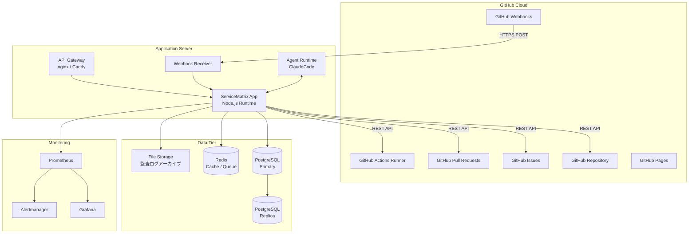
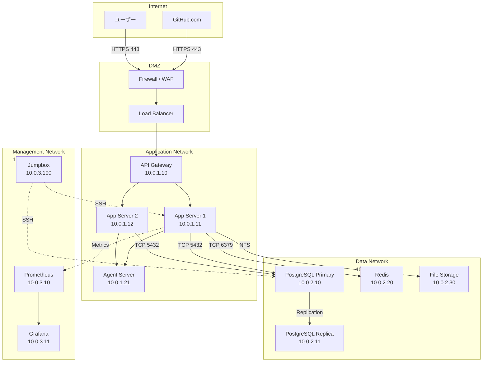
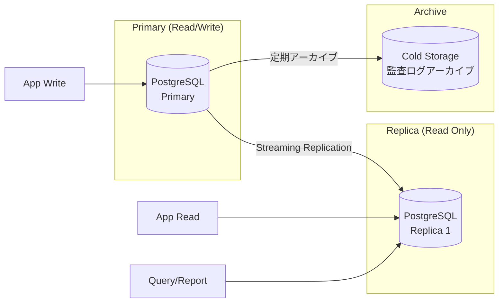
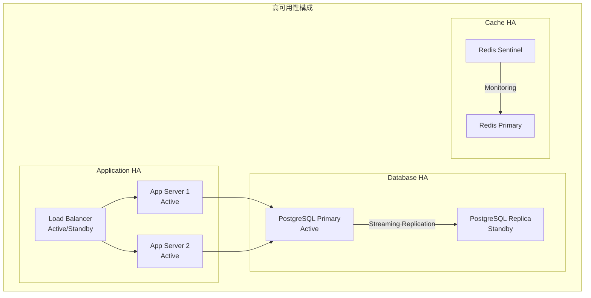

# 物理アーキテクチャ

ServiceMatrix Physical Architecture

Version: 1.0
Status: Active
Classification: Internal Architecture Document

---

## 1. はじめに

本ドキュメントは ServiceMatrix の物理アーキテクチャを定義する。
配備構成、ネットワーク構成、データストア配置、および可用性設計を明確にし、
インフラストラクチャの設計・運用指針を提供する。

---

## 2. 配備構成概要

ServiceMatrix は GitHub をプライマリプラットフォームとするため、
従来の3層 Web アプリケーションとは異なる配備モデルを採用する。

---

## 3. コンポーネント配備詳細

### 3.1 GitHub Cloud コンポーネント

| コンポーネント | 配備先 | 説明 |
|---|---|---|
| GitHub Repository | GitHub.com | ソースコード・ドキュメント・設定の管理 |
| GitHub Issues | GitHub.com | インシデント・変更・要求のトラッキング |
| GitHub Pull Requests | GitHub.com | コードレビュー・変更承認 |
| GitHub Actions Runner | GitHub-hosted / Self-hosted | CI/CD パイプライン実行 |
| GitHub Webhooks | GitHub.com | イベント通知の送信 |
| GitHub Pages | GitHub.com | ドキュメント公開（オプション） |

### 3.2 Application Server コンポーネント

| コンポーネント | 配備先 | スペック目安 | 説明 |
|---|---|---|---|
| API Gateway | Application Server | 1 vCPU / 1GB RAM | リバースプロキシ・ルーティング |
| ServiceMatrix App | Application Server | 2 vCPU / 4GB RAM | アプリケーションコア |
| Webhook Receiver | Application Server | 同居 | GitHub Webhook 受信処理 |
| Agent Runtime | Application Server | 2 vCPU / 4GB RAM | ClaudeCode Agent Teams 実行環境 |

### 3.3 Data Tier コンポーネント

| コンポーネント | 配備先 | スペック目安 | 説明 |
|---|---|---|---|
| PostgreSQL Primary | Database Server | 2 vCPU / 8GB RAM / 100GB SSD | メインデータベース |
| PostgreSQL Replica | Database Server (別) | 2 vCPU / 8GB RAM / 100GB SSD | 読み取りレプリカ |
| Redis | Cache Server | 1 vCPU / 2GB RAM | キャッシュ・メッセージキュー |
| File Storage | NAS / Object Storage | 500GB | 監査ログアーカイブ |

---

## 4. ネットワーク構成

### 4.1 ネットワークセグメント

| セグメント | CIDR | 用途 | アクセス制御 |
|---|---|---|---|
| DMZ | 外部IP | インターネット接点 | WAF / FW によるフィルタリング |
| Application Network | 10.0.1.0/24 | アプリケーション実行 | DMZ からのみ受信許可 |
| Data Network | 10.0.2.0/24 | データストア | App Network からのみアクセス許可 |
| Management Network | 10.0.3.0/24 | 監視・管理 | Jumpbox 経由のみアクセス |

### 4.2 ファイアウォールルール

| From | To | Port | Protocol | 用途 |
|---|---|---|---|---|
| Internet | DMZ (LB) | 443 | HTTPS | ユーザーアクセス・Webhook受信 |
| LB | API Gateway | 8080 | HTTP | 内部ルーティング |
| API Gateway | App Server | 3000 | HTTP | アプリケーション通信 |
| App Server | PostgreSQL | 5432 | TCP | データベースアクセス |
| App Server | Redis | 6379 | TCP | キャッシュアクセス |
| App Server | GitHub.com | 443 | HTTPS | GitHub API 通信 |
| App Server | Prometheus | 9090 | HTTP | メトリクス送信 |
| Jumpbox | 全サーバー | 22 | SSH | 管理アクセス |

---

## 5. データストア配置

### 5.1 PostgreSQL 設計

#### 5.1.1 データベース構成

| データベース | 用途 | 推定サイズ |
|---|---|---|
| servicematrix_core | コアドメインデータ（Incident, Change, Request等） | 10-50GB |
| servicematrix_cmdb | CMDB データ（CI, Relationship） | 5-20GB |
| servicematrix_audit | 監査ログ（全操作記録） | 50-200GB/年 |
| servicematrix_metrics | メトリクスデータ | 10-50GB/年 |

#### 5.1.2 バックアップ方針

| 項目 | 設定値 |
|---|---|
| フルバックアップ | 日次（毎日 02:00） |
| WAL アーカイブ | 連続（RPO: 数分以内） |
| バックアップ保持期間 | 30日 |
| 監査ログ保持期間 | 7年（コールドストレージ移行） |
| バックアップ検証 | 週次リストアテスト |

### 5.2 Redis 設計

| 用途 | キー形式 | TTL | 説明 |
|---|---|---|---|
| SLA タイマー | `sla:{incident_id}` | SLA期限まで | インシデントSLAカウントダウン |
| API キャッシュ | `cache:gh:{endpoint}` | 5分 | GitHub API レスポンスキャッシュ |
| セッション | `session:{user_id}` | 24時間 | ユーザーセッション |
| ジョブキュー | `queue:{job_type}` | なし | 非同期ジョブキュー |
| レート制限 | `ratelimit:{client_id}` | 1分 | API レート制限カウンター |

### 5.3 ファイルストレージ設計

| ディレクトリ | 用途 | 保持期間 |
|---|---|---|
| `/archive/audit/` | 監査ログアーカイブ | 7年 |
| `/archive/reports/` | 生成レポート | 3年 |
| `/archive/evidence/` | 監査証拠ファイル | 7年 |
| `/backup/` | データベースバックアップ | 30日 |

---

## 6. 可用性設計

### 6.1 可用性目標

| 項目 | 目標値 | 年間許容停止時間 |
|---|---|---|
| ServiceMatrix 全体 | 99.5% | 約43.8時間 |
| データベース | 99.9% | 約8.76時間 |
| 監査ログ | 99.99% | 約52.6分 |

### 6.2 冗長化方針

### 6.3 フェイルオーバー手順

| コンポーネント | 障害検知 | フェイルオーバー方法 | 目標RTO |
|---|---|---|---|
| App Server | ヘルスチェック失敗 | LB が自動的にトラフィック振替 | 30秒 |
| PostgreSQL Primary | Replica の監視 | Replica を Primary に昇格 | 5分 |
| Redis | Sentinel 監視 | Sentinel による自動フェイルオーバー | 30秒 |
| GitHub Actions | GitHub Status 確認 | Self-hosted Runner に切替 | 15分 |

### 6.4 災害復旧（DR）

| 項目 | 設定値 |
|---|---|
| RPO（目標復旧時点） | 1時間以内 |
| RTO（目標復旧時間） | 4時間以内 |
| DR 環境 | 別リージョンにスタンバイ環境を構築 |
| バックアップ転送 | 日次でDR環境にバックアップ転送 |
| DR テスト | 四半期ごとにDRリハーサル実施 |

---

## 7. GitHub Actions Runner 構成

### 7.1 GitHub-hosted Runner

| 用途 | ランナー種別 | スペック |
|---|---|---|
| Markdown Lint | ubuntu-latest | 2 vCPU / 7GB RAM |
| Docs Validation | ubuntu-latest | 2 vCPU / 7GB RAM |
| Security Scan | ubuntu-latest | 2 vCPU / 7GB RAM |
| Unit Test | ubuntu-latest | 2 vCPU / 7GB RAM |

### 7.2 Self-hosted Runner（必要時）

| 用途 | 配備先 | スペック | 説明 |
|---|---|---|---|
| E2E Test | App Server | 4 vCPU / 8GB RAM | ブラウザテスト実行 |
| Agent Test | Agent Server | 4 vCPU / 8GB RAM | AI エージェントテスト |
| Heavy Build | Build Server | 4 vCPU / 16GB RAM | 大規模ビルド |

---

## 8. スケーリング方針

### 8.1 垂直スケーリング

初期フェーズではリソース増強（CPU/RAM）による垂直スケーリングで対応する。

| コンポーネント | 初期 | 中期 | 長期 |
|---|---|---|---|
| App Server | 2 vCPU / 4GB | 4 vCPU / 8GB | 8 vCPU / 16GB |
| Database | 2 vCPU / 8GB | 4 vCPU / 16GB | 8 vCPU / 32GB |
| Cache | 1 vCPU / 2GB | 2 vCPU / 4GB | 4 vCPU / 8GB |

### 8.2 水平スケーリング

負荷増加時には App Server の水平スケーリングで対応する。

- App Server: ステートレス設計により水平スケール可能
- Read Replica: 追加による読み取り性能向上
- Redis Cluster: シャーディングによる分散

---

## 9. 監視構成

### 9.1 監視項目

| カテゴリ | 監視項目 | 閾値 | アラート先 |
|---|---|---|---|
| システム | CPU使用率 | 80%超過 | Slack / PagerDuty |
| システム | メモリ使用率 | 85%超過 | Slack / PagerDuty |
| システム | ディスク使用率 | 90%超過 | Slack / PagerDuty |
| アプリケーション | API応答時間 (P95) | 2秒超過 | Slack |
| アプリケーション | エラーレート | 1%超過 | Slack / PagerDuty |
| データベース | 接続数 | 最大の80%超過 | Slack |
| データベース | レプリケーション遅延 | 10秒超過 | PagerDuty |
| GitHub | API レート制限残数 | 100未満 | Slack |
| SLA | SLA違反リスク | 期限の80%経過 | Slack / Email |

---

## 10. 環境構成

| 環境 | 用途 | GitHub Branch | 構成 |
|---|---|---|---|
| Development | 開発・単体テスト | feature/* | 最小構成（単一サーバー） |
| Staging | 結合テスト・UAT | staging | 本番類似構成 |
| Production | 本番運用 | main | 冗長化構成 |
| DR | 災害復旧 | - | 本番同等構成（スタンバイ） |

---

## 11. 関連ドキュメント

| ドキュメント | 参照先 |
|---|---|
| システムアーキテクチャ概要 | [SYSTEM_ARCHITECTURE_OVERVIEW.md](./SYSTEM_ARCHITECTURE_OVERVIEW.md) |
| 論理アーキテクチャ | [LOGICAL_ARCHITECTURE.md](./LOGICAL_ARCHITECTURE.md) |
| スケーラビリティモデル | [SCALABILITY_MODEL.md](./SCALABILITY_MODEL.md) |
| CI/CDパイプラインアーキテクチャ | [../05_devops/CI_CD_PIPELINE_ARCHITECTURE.md](../05_devops/CI_CD_PIPELINE_ARCHITECTURE.md) |

---

*本ドキュメントは ServiceMatrix プロジェクトの統治原則に基づき管理される。*
*変更は Change Issue → PR → CI検証 → 承認 のフローに従うこと。*
