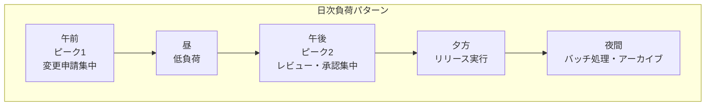
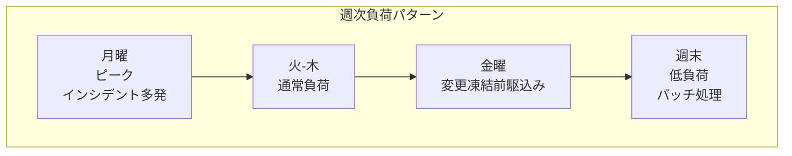
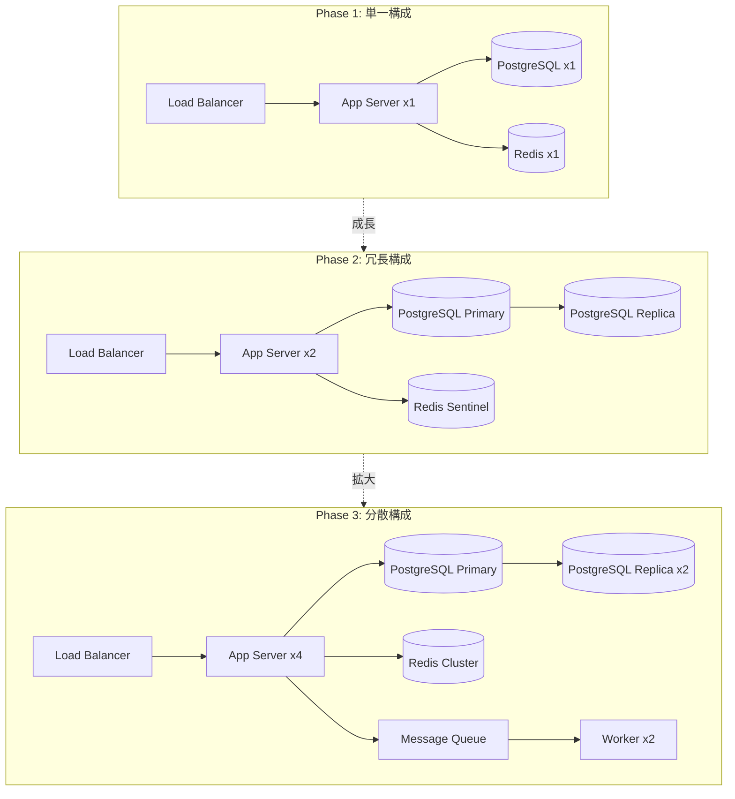
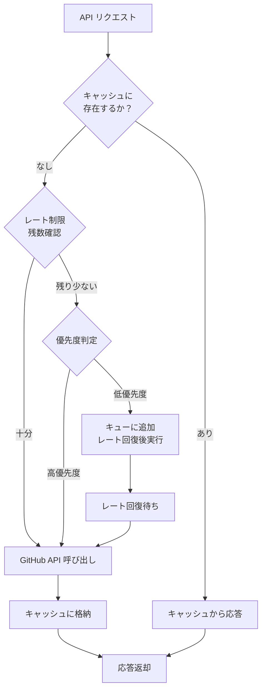
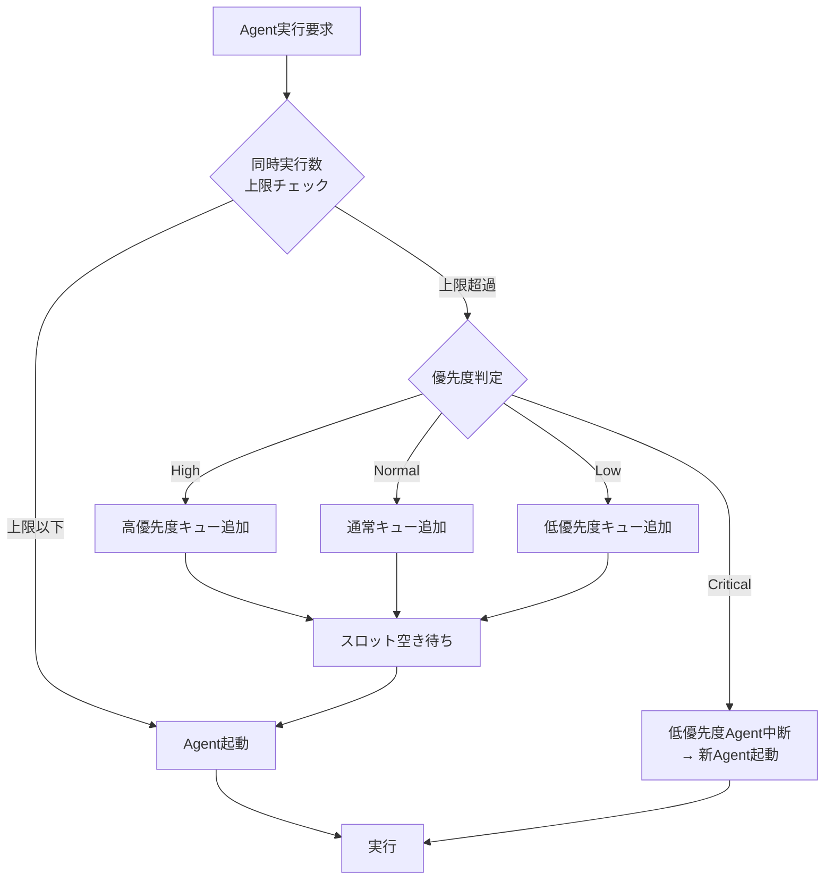
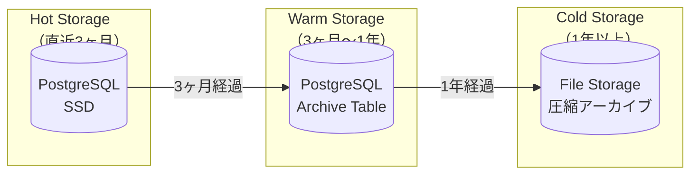
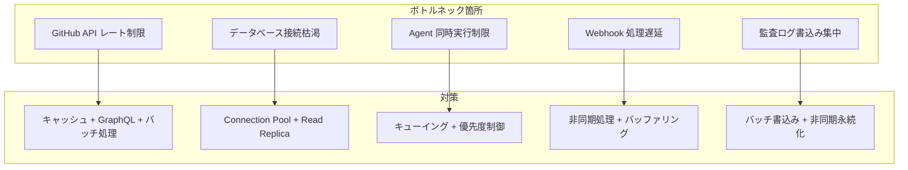

# スケーラビリティモデル

ServiceMatrix Scalability Model

Version: 1.0
Status: Active
Classification: Internal Architecture Document

---

## 1. はじめに

本ドキュメントは ServiceMatrix のスケーラビリティに関する設計方針と成長戦略を定義する。
システム負荷の増加に対してどのように拡張性を確保するかを明確にし、
段階的なスケールアップ・スケールアウト計画を提供する。

---

## 2. スケーラビリティの設計原則

### 2.1 基本原則

1. **GitHub プラットフォーム制約の理解**: GitHub API のレート制限を前提として設計する
2. **ステートレスアプリケーション**: アプリケーション層はステートレスに保ち、水平スケールを可能にする
3. **非同期処理の活用**: 同期処理を最小限にし、イベント駆動で処理を分散する
4. **キャッシュ戦略の適用**: GitHub API 呼び出しを最適化するキャッシュ層を設ける
5. **段階的拡張**: 過剰設計を避け、負荷に応じて段階的に拡張する

### 2.2 スケーラビリティ目標

| フェーズ | 期間 | 目標 |
|---|---|---|
| Phase 1（初期） | 0-6ヶ月 | 単一チーム対応（~10名） |
| Phase 2（成長） | 6-18ヶ月 | 複数チーム対応（~50名） |
| Phase 3（拡大） | 18-36ヶ月 | 組織全体対応（~200名） |
| Phase 4（成熟） | 36ヶ月以降 | マルチ組織対応（~1000名） |

---

## 3. 負荷モデル

### 3.1 想定ワークロード

| メトリクス | Phase 1 | Phase 2 | Phase 3 | Phase 4 |
|---|---|---|---|---|
| 同時ユーザー数 | ~10 | ~50 | ~200 | ~1000 |
| インシデント/月 | ~50 | ~200 | ~1000 | ~5000 |
| 変更申請/月 | ~30 | ~150 | ~500 | ~2000 |
| PR/月 | ~100 | ~500 | ~2000 | ~10000 |
| CI実行/日 | ~50 | ~200 | ~1000 | ~5000 |
| Agent分析/日 | ~20 | ~100 | ~500 | ~2000 |
| Webhook受信/時間 | ~100 | ~500 | ~2000 | ~10000 |
| 監査ログ/日 | ~500 | ~5000 | ~50000 | ~500000 |

### 3.2 負荷パターン





---

## 4. コンポーネント別スケーリング戦略

### 4.1 全体スケーリング図



### 4.2 Application Server スケーリング

| 項目 | Phase 1 | Phase 2 | Phase 3 | Phase 4 |
|---|---|---|---|---|
| インスタンス数 | 1 | 2 | 4 | 8+ |
| vCPU/インスタンス | 2 | 2 | 4 | 4 |
| RAM/インスタンス | 4GB | 4GB | 8GB | 8GB |
| スケーリング方式 | なし | 手動 | オートスケール | オートスケール |
| LB方式 | なし | Round Robin | Least Connections | Least Connections |

**スケールアウト条件**:

- CPU使用率が70%を超過した場合
- メモリ使用率が80%を超過した場合
- API応答時間（P95）が1.5秒を超過した場合

### 4.3 Database スケーリング

| 項目 | Phase 1 | Phase 2 | Phase 3 | Phase 4 |
|---|---|---|---|---|
| Primary | 1 | 1 | 1 | 1 |
| Read Replica | 0 | 1 | 2 | 4 |
| vCPU | 2 | 4 | 8 | 16 |
| RAM | 8GB | 16GB | 32GB | 64GB |
| Storage | 100GB | 500GB | 2TB | 10TB |
| Connection Pool | 20 | 50 | 100 | 200 |

**Read Replica 追加条件**:

- Primary の CPU使用率が60%を超過した場合
- 読み取りクエリの応答時間が500msを超過した場合

### 4.3.1 PgBouncer コネクションプーリング設定

ServiceMatrix では PostgreSQL 16 の前段に PgBouncer を配置し、接続数を制御する。

#### 推奨設定値

```ini
[pgbouncer]
# プールモード: transaction（推奨）
# transaction: 各クエリ/トランザクション後に接続を解放（最も効率的）
# session: セッション終了まで接続を保持（互換性優先時）
pool_mode = transaction

# クライアント側の最大接続数（アプリ → PgBouncer）
max_client_conn = 1000

# PostgreSQL への実接続数（プールサイズ）
default_pool_size = 25

# 予備プールサイズ（負荷スパイク時に使用）
reserve_pool_size = 5

# 予備プール投入タイムアウト（秒）
reserve_pool_timeout = 3

# サーバー側の接続アイドルタイムアウト（秒）
server_idle_timeout = 600

# クライアント側の接続アイドルタイムアウト（秒）
client_idle_timeout = 0

# 認証方式
auth_type = scram-sha-256

# 接続ログ
log_connections = 1
log_disconnections = 1
log_pooler_errors = 1

# 統計更新間隔（秒）
stats_period = 60
```

#### フェーズ別 PgBouncer 設定推奨値

| パラメータ | Phase 1 | Phase 2 | Phase 3 | Phase 4 |
|-----------|---------|---------|---------|---------|
| max_client_conn | 100 | 300 | 1,000 | 3,000 |
| default_pool_size | 10 | 20 | 25 | 50 |
| reserve_pool_size | 2 | 3 | 5 | 10 |
| PostgreSQL max_connections | 50 | 100 | 200 | 400 |

#### 接続数見積もり（Phase 3 例）

```
接続元               インスタンス数  プールサイズ/インスタンス  合計接続数
---------------------------------------------------------------------------
API サーバー         ×  4           ×  10                  =  40 接続
Worker プロセス      ×  8           ×   5                  =  40 接続
バッチ・スケジューラ  ×  2           ×   5                  =  10 接続
監視・メトリクス      ×  2           ×   5                  =  10 接続
---------------------------------------------------------------------------
合計アクティブ接続数                                          = 100 接続
PostgreSQL max_connections 設定値                             = 200 接続
安全マージン（50% 余裕）                                      = 100 接続
```

**設計原則**:
- PostgreSQL `max_connections` はアクティブ接続見積もりの **2倍** を設定する
- PgBouncer `default_pool_size` × ロール数 < `max_connections` を常に満たす
- `pool_mode = transaction` を使用することで、1,000 クライアント接続を 25 サーバー接続で処理可能

#### Read Replica への読み取り分散設定

Phase 2 以降で読み取りレプリカを活用する場合、PgBouncer を 2 インスタンス構成で運用する：

```
クライアント
    │
    ├──→ PgBouncer-Primary（:5432）  → PostgreSQL Primary（書き込み専用）
    │
    └──→ PgBouncer-Replica（:5433）  → PostgreSQL Replica × N（読み取り専用）
```

| 操作種別 | 接続先 | 実装方法 |
|---------|--------|---------|
| INSERT / UPDATE / DELETE | Primary Pool | アプリケーション設定で明示指定 |
| SELECT（リアルタイム要件あり） | Primary Pool | トランザクション直後の読み取りは Primary |
| SELECT（一般照会） | Replica Pool | ダッシュボード、レポート、一覧取得 |
| SELECT（監査ログ照会） | Replica Pool | 非リアルタイム参照 |

### 4.4 Cache スケーリング

| 項目 | Phase 1 | Phase 2 | Phase 3 | Phase 4 |
|---|---|---|---|---|
| 構成 | Standalone | Sentinel | Cluster (3) | Cluster (6) |
| RAM | 2GB | 4GB | 8GB | 16GB |
| ヒット率目標 | 80% | 85% | 90% | 95% |

### 4.5 Worker Process スケーリング

| 項目 | Phase 1 | Phase 2 | Phase 3 | Phase 4 |
|---|---|---|---|---|
| Worker数 | 0（同期処理） | 1 | 2 | 4+ |
| 処理方式 | 同期 | 非同期キュー | 非同期キュー | 分散キュー |
| 同時処理数 | 1 | 5 | 20 | 100 |

---

## 5. GitHub API レート制限対策

### 5.1 レート制限の理解

| API 種別 | 制限 | リセット間隔 |
|---|---|---|
| REST API (認証済み) | 5,000 リクエスト/時間 | 1時間 |
| GraphQL API | 5,000 ポイント/時間 | 1時間 |
| Search API | 30 リクエスト/分 | 1分 |
| Webhook 配信 | 制限なし（受信側） | - |

### 5.2 レート制限対策



### 5.3 キャッシュ戦略

| データ種別 | キャッシュ TTL | 無効化条件 |
|---|---|---|
| Issue 一覧 | 5分 | Webhook 受信時 |
| Issue 詳細 | 3分 | Webhook 受信時 |
| PR 一覧 | 5分 | Webhook 受信時 |
| CMDB データ | 30分 | 更新時 |
| ユーザー情報 | 1時間 | 権限変更時 |
| リポジトリ情報 | 1時間 | 設定変更時 |
| ラベル一覧 | 1時間 | ラベル変更時 |

### 5.4 GraphQL によるバッチ取得

REST API の複数呼び出しを GraphQL の単一クエリに統合し、API 消費を削減する。

| 操作 | REST API | GraphQL | 削減率 |
|---|---|---|---|
| Issue + ラベル + コメント取得 | 3リクエスト | 1リクエスト | 67% |
| PR + レビュー + ステータス取得 | 3リクエスト | 1リクエスト | 67% |
| リポジトリ + ブランチ + 設定取得 | 3リクエスト | 1リクエスト | 67% |

---

## 6. Agent Teams のスケーリング

### 6.1 Agent 同時実行制御

| Phase | 最大同時Agent数 | 最大同時Teams数 | WorkTree上限 |
|---|---|---|---|
| Phase 1 | 3 | 1 | 5 |
| Phase 2 | 10 | 3 | 15 |
| Phase 3 | 30 | 10 | 50 |
| Phase 4 | 100 | 30 | 150 |

### 6.2 Agent キューイング



---

## 7. データスケーリング戦略

### 7.1 データ増加予測

| データ種別 | Phase 1/年 | Phase 2/年 | Phase 3/年 | Phase 4/年 |
|---|---|---|---|---|
| インシデントレコード | ~600 | ~2,400 | ~12,000 | ~60,000 |
| 変更レコード | ~360 | ~1,800 | ~6,000 | ~24,000 |
| 監査ログ | ~180,000 | ~1,800,000 | ~18,000,000 | ~180,000,000 |
| メトリクスデータ | ~365,000 | ~3,650,000 | ~36,500,000 | ~365,000,000 |

### 7.2 データアーカイブ戦略



| Storage Tier | 保存期間 | アクセス速度 | 用途 |
|---|---|---|---|
| Hot | 直近3ヶ月 | ミリ秒 | 通常業務・リアルタイム照会 |
| Warm | 3ヶ月〜1年 | 秒 | レポート・分析 |
| Cold | 1年以上〜7年 | 分 | 監査対応・コンプライアンス |

### 7.3 パーティショニング戦略

Phase 3 以降でテーブルパーティショニングを適用する。

| テーブル | パーティション基準 | パーティション単位 |
|---|---|---|
| audit_logs | created_at | 月次 |
| metrics_data | collected_at | 月次 |
| incident_records | created_at | 四半期 |
| event_store | timestamp | 月次 |

---

## 8. パフォーマンス最適化

### 8.1 応答時間の目標

| 操作 | Phase 1 | Phase 2 | Phase 3 | Phase 4 |
|---|---|---|---|---|
| Issue 一覧取得 | < 500ms | < 300ms | < 200ms | < 100ms |
| Issue 詳細取得 | < 300ms | < 200ms | < 100ms | < 50ms |
| インシデント作成 | < 2s | < 1.5s | < 1s | < 500ms |
| 変更承認処理 | < 3s | < 2s | < 1.5s | < 1s |
| Agent分析（単純） | < 30s | < 20s | < 15s | < 10s |
| Agent分析（複合） | < 5min | < 3min | < 2min | < 1min |

### 8.2 インデックス戦略

| テーブル | インデックス | 用途 |
|---|---|---|
| incidents | (status, priority, created_at) | ダッシュボード表示 |
| incidents | (assignee_id, status) | 担当者別表示 |
| changes | (status, scheduled_date) | 変更カレンダー |
| audit_logs | (aggregate_id, aggregate_type) | エンティティ別監査ログ |
| audit_logs | (created_at) | 時系列検索 |
| cmdb_items | (type, status) | CI種別検索 |
| event_store | (aggregate_id, version) | イベントリプレイ |

---

## 9. ボトルネック分析と対策

### 9.1 想定ボトルネック



### 9.2 キャパシティプランニング

| メトリクス | 警告閾値 | 対応アクション |
|---|---|---|
| CPU使用率 | 70% | スケールアップ検討 |
| メモリ使用率 | 80% | メモリ追加検討 |
| ディスク使用率 | 75% | ストレージ拡張 / アーカイブ |
| DB接続数 | 最大の70% | Pool拡張 / Replica追加 |
| API レート残数 | 20%以下 | キャッシュ強化 / バッチ化 |
| イベント処理遅延 | 30秒超過 | Worker追加 |
| Agent キュー待ち | 5分超過 | Agent上限引上げ |

---

## 10. 可用性スケーリング

### 10.1 可用性目標の段階的向上

| Phase | 可用性目標 | 年間許容停止時間 | 冗長化レベル |
|---|---|---|---|
| Phase 1 | 99.0% | ~87.6時間 | なし（単一構成） |
| Phase 2 | 99.5% | ~43.8時間 | アプリ冗長化 |
| Phase 3 | 99.9% | ~8.76時間 | フル冗長化 |
| Phase 4 | 99.95% | ~4.38時間 | マルチリージョン |

---

## 11. コスト最適化

### 11.1 リソースコスト推定

| コンポーネント | Phase 1/月 | Phase 2/月 | Phase 3/月 | Phase 4/月 |
|---|---|---|---|---|
| App Server | $50 | $100 | $400 | $1,200 |
| Database | $100 | $200 | $500 | $1,500 |
| Cache | $20 | $40 | $100 | $300 |
| Storage | $10 | $30 | $100 | $500 |
| GitHub (Team/Enterprise) | $0-$44 | $168-$840 | $840-$4,200 | $4,200-$21,000 |
| 監視 | $0 | $50 | $200 | $500 |
| **合計** | **$180-$224** | **$588-$1,260** | **$2,140-$5,500** | **$8,200-$25,000** |

### 11.2 コスト最適化策

- Phase 1-2: GitHub-hosted Runner を活用し、Self-hosted Runner コストを抑制
- Phase 2-3: Reserved Instance / Savings Plan で長期コスト削減
- Phase 3-4: データアーカイブによるストレージコスト最適化
- 全Phase: キャッシュ最適化による API 呼び出し削減

---

## 12. 関連ドキュメント

| ドキュメント | 参照先 |
|---|---|
| 物理アーキテクチャ | [PHYSICAL_ARCHITECTURE.md](./PHYSICAL_ARCHITECTURE.md) |
| システムアーキテクチャ概要 | [SYSTEM_ARCHITECTURE_OVERVIEW.md](./SYSTEM_ARCHITECTURE_OVERVIEW.md) |
| CI/CDパイプラインアーキテクチャ | [../05_devops/CI_CD_PIPELINE_ARCHITECTURE.md](../05_devops/CI_CD_PIPELINE_ARCHITECTURE.md) |

---

*本ドキュメントは ServiceMatrix プロジェクトの統治原則に基づき管理される。*
*変更は Change Issue → PR → CI検証 → 承認 のフローに従うこと。*
