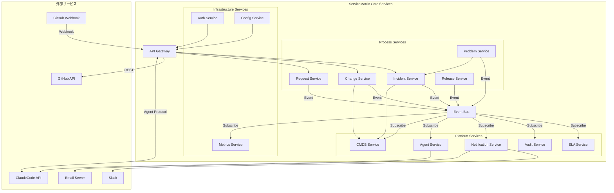
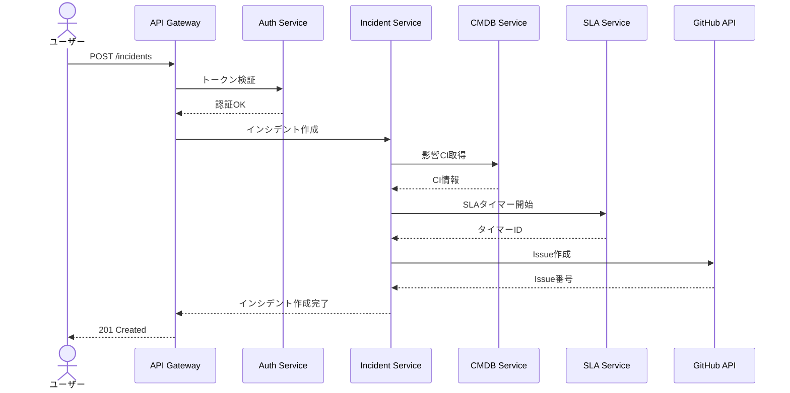
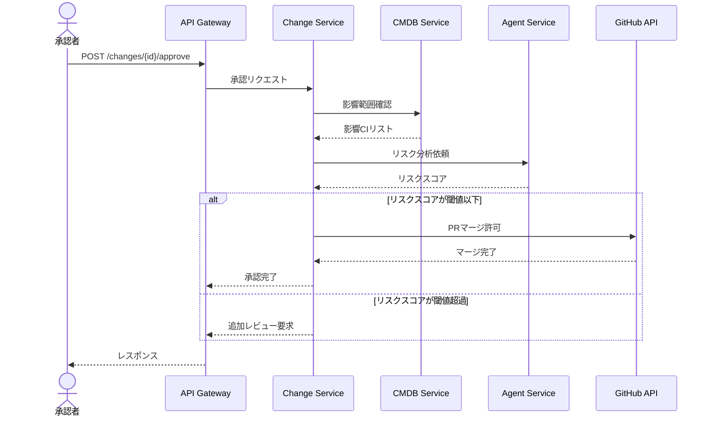
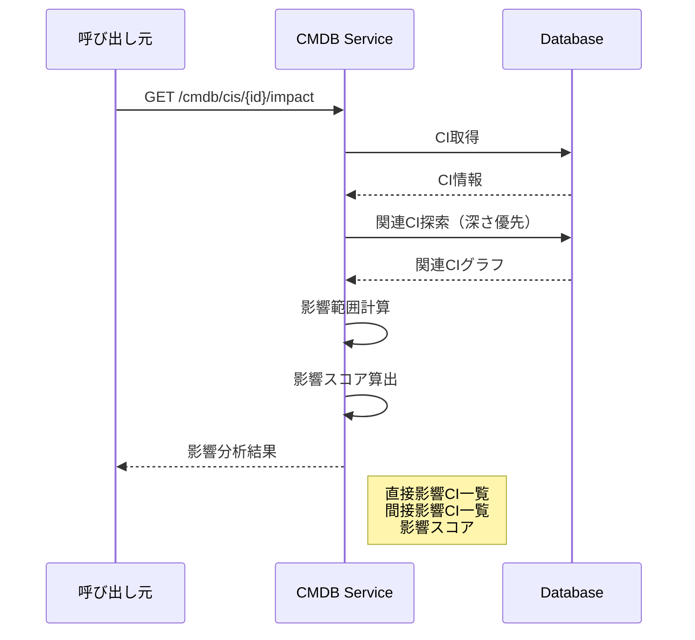
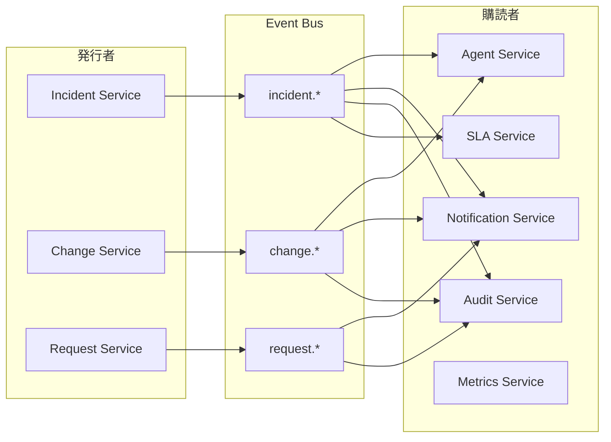
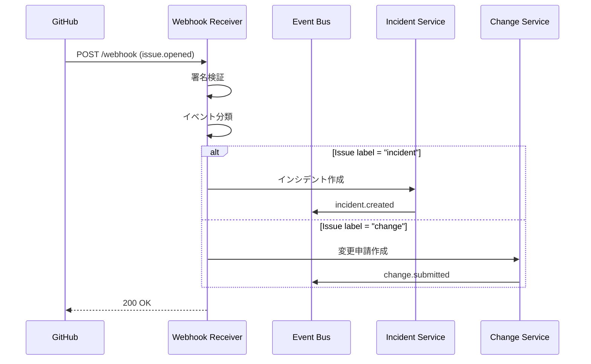
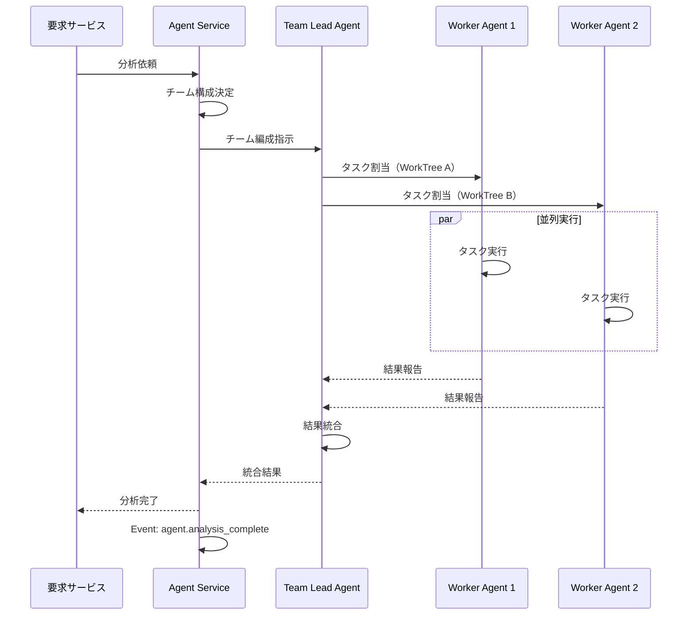
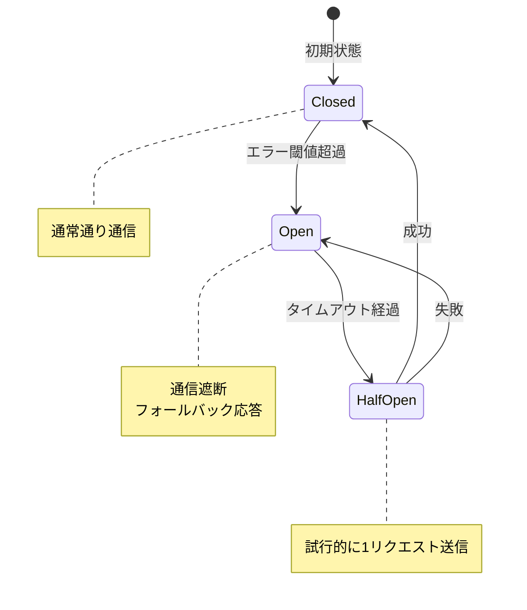
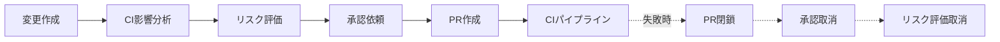

# サービス間連携図

ServiceMatrix Service Interaction Diagram

Version: 1.0
Status: Active
Classification: Internal Architecture Document

---

## 1. はじめに

本ドキュメントは ServiceMatrix を構成する各サービス間の連携関係を定義する。
サービス間のメッセージフロー、API 呼び出しパターン、イベント連携を明確にし、
システム全体の結合性と疎結合性のバランスを設計する。

---

## 2. サービス間連携の全体図



---

## 3. サービス一覧と責務

### 3.1 Process Services（プロセスサービス群）

| サービス | 責務 | 主要エンドポイント |
|---|---|---|
| Incident Service | インシデントのライフサイクル管理 | POST /incidents, PATCH /incidents/{id} |
| Change Service | 変更のライフサイクル管理・承認制御 | POST /changes, POST /changes/{id}/approve |
| Request Service | サービス要求の受付・履行管理 | POST /requests, PATCH /requests/{id} |
| Problem Service | 問題の根本原因分析・既知エラー管理 | POST /problems, POST /problems/{id}/known-errors |
| Release Service | リリース計画・実行・検証管理 | POST /releases, POST /releases/{id}/deploy |

### 3.2 Platform Services（プラットフォームサービス群）

| サービス | 責務 | 主要エンドポイント |
|---|---|---|
| CMDB Service | 構成アイテム管理・関連性維持 | GET /cmdb/cis, POST /cmdb/cis, GET /cmdb/cis/{id}/impact |
| SLA Service | SLA計測・違反検知・タイマー管理 | GET /sla/status, GET /sla/breaches |
| Audit Service | 監査証跡記録・検索・エクスポート | POST /audit/log, GET /audit/search |
| Notification Service | 通知の集約・配信・エスカレーション | POST /notify, GET /notify/rules |
| Agent Service | AI エージェント編成・タスク管理 | POST /agents/teams, GET /agents/status |

### 3.3 Infrastructure Services（インフラサービス群）

| サービス | 責務 | 主要エンドポイント |
|---|---|---|
| Auth Service | 認証・認可・トークン管理 | POST /auth/token, GET /auth/permissions |
| Config Service | 設定管理・環境変数管理 | GET /config/{key}, PUT /config/{key} |
| Metrics Service | メトリクス収集・集約・エクスポート | POST /metrics, GET /metrics/dashboard |

---

## 4. 同期連携パターン（REST API）

### 4.1 インシデント登録フロー



### 4.2 変更承認フロー



### 4.3 CMDB 影響分析フロー



---

## 5. 非同期連携パターン（Event Bus）

### 5.1 イベントカタログ

| イベント名 | 発行元 | 購読者 | 説明 |
|---|---|---|---|
| `incident.created` | Incident Service | SLA, Audit, Notify, Agent | インシデント作成時 |
| `incident.updated` | Incident Service | SLA, Audit, Notify | インシデント更新時 |
| `incident.resolved` | Incident Service | SLA, Audit, Notify, Metrics | インシデント解決時 |
| `incident.sla_breached` | SLA Service | Notify, Audit, Agent | SLA違反検知時 |
| `change.submitted` | Change Service | Audit, Notify, Agent | 変更申請時 |
| `change.approved` | Change Service | Audit, Notify, Release | 変更承認時 |
| `change.rejected` | Change Service | Audit, Notify | 変更却下時 |
| `change.implemented` | Change Service | CMDB, Audit, Metrics | 変更実施完了時 |
| `change.failed` | Change Service | Audit, Notify, Agent | 変更実施失敗時 |
| `request.submitted` | Request Service | Audit, Notify | サービス要求提出時 |
| `request.fulfilled` | Request Service | Audit, Notify, Metrics | サービス要求履行完了時 |
| `problem.identified` | Problem Service | Audit, Notify, Agent | 問題特定時 |
| `problem.resolved` | Problem Service | Incident, Audit, Notify | 問題解決時（関連インシデントに影響） |
| `cmdb.ci_updated` | CMDB Service | Audit | CI情報更新時 |
| `release.deployed` | Release Service | CMDB, Audit, Notify | リリースデプロイ時 |
| `agent.analysis_complete` | Agent Service | 各Service | AI分析完了時 |
| `audit.compliance_alert` | Audit Service | Notify | コンプライアンス違反検知時 |

### 5.2 イベントスキーマ

```json
{
  "eventId": "uuid-v4",
  "eventType": "incident.created",
  "timestamp": "2026-01-15T10:30:00Z",
  "source": "incident-service",
  "version": "1.0",
  "correlationId": "uuid-v4",
  "actor": {
    "type": "user|agent",
    "id": "user-123",
    "name": "operator@example.com"
  },
  "payload": {
    "incidentId": "INC-2026-0042",
    "title": "本番APIサーバー応答遅延",
    "priority": "High",
    "status": "Open",
    "affectedCIs": ["CI-APP-001", "CI-SRV-003"]
  },
  "metadata": {
    "traceId": "trace-uuid",
    "environment": "production"
  }
}
```

### 5.3 イベント配信フロー



---

## 6. GitHub 連携パターン

### 6.1 Webhook 受信パターン



### 6.2 GitHub API 呼び出しパターン

| 操作 | API エンドポイント | HTTP メソッド | 呼び出し元 |
|---|---|---|---|
| Issue 作成 | `/repos/{owner}/{repo}/issues` | POST | Incident / Change / Request Service |
| Issue 更新 | `/repos/{owner}/{repo}/issues/{number}` | PATCH | 各 Process Service |
| ラベル付与 | `/repos/{owner}/{repo}/issues/{number}/labels` | POST | 各 Process Service |
| コメント追加 | `/repos/{owner}/{repo}/issues/{number}/comments` | POST | Agent / Audit Service |
| PR 作成 | `/repos/{owner}/{repo}/pulls` | POST | Change / Release Service |
| PR マージ | `/repos/{owner}/{repo}/pulls/{number}/merge` | PUT | Change Service（承認後） |
| Actions 起動 | `/repos/{owner}/{repo}/actions/workflows/{id}/dispatches` | POST | Release / Agent Service |
| Check Run 作成 | `/repos/{owner}/{repo}/check-runs` | POST | CI/CD Service |

---

## 7. Agent Service 連携パターン

### 7.1 Agent Teams 編成フロー



### 7.2 Agent 種別と連携先

| Agent 種別 | 連携先サービス | 用途 |
|---|---|---|
| Analysis Agent | Incident Service | インシデント影響分析・優先度提案 |
| Risk Agent | Change Service | 変更リスク分析・スコアリング |
| Review Agent | Change Service | PR レビュー（セキュリティ・品質・設計） |
| Repair Agent | CI/CD Service | CI 失敗の原因分析・修復提案 |
| Audit Agent | Audit Service | コンプライアンスチェック・監査レポート生成 |

---

## 8. 連携のエラーハンドリング

### 8.1 同期連携のエラーハンドリング

| エラー種別 | 対応方針 | リトライ |
|---|---|---|
| 認証エラー (401) | トークンリフレッシュ後にリトライ | 1回 |
| 認可エラー (403) | エラーログ記録、ユーザーに通知 | なし |
| リソース未検出 (404) | エラーログ記録、呼び出し元に伝播 | なし |
| レート制限 (429) | Retry-After ヘッダに従い待機 | 自動 |
| サーバーエラー (5xx) | 指数バックオフでリトライ | 最大3回 |
| タイムアウト | 指数バックオフでリトライ | 最大3回 |

### 8.2 非同期連携のエラーハンドリング

| エラー種別 | 対応方針 |
|---|---|
| イベント処理失敗 | リトライキューに移動、最大5回リトライ |
| リトライ上限超過 | デッドレターキューに移動、アラート発火 |
| イベントスキーマ不正 | デッドレターキューに移動、エラーログ記録 |
| 購読者タイムアウト | リトライキューに移動 |

### 8.3 サーキットブレーカーパターン



各サービス間通信にはサーキットブレーカーを適用する。

| 設定項目 | 値 |
|---|---|
| エラー閾値 | 5回/1分 |
| Open 状態タイムアウト | 30秒 |
| Half-Open 試行数 | 1回 |

---

## 9. データ整合性の担保

### 9.1 結果整合性（Eventual Consistency）

非同期イベント連携では結果整合性を採用する。

- イベント発行は最低1回配信（at-least-once）を保証する
- 購読者はべき等性（idempotency）を実装する
- 重複排除は eventId で行う

### 9.2 Saga パターン

複数サービスにまたがるトランザクションには Saga パターンを適用する。



---

## 10. 通信プロトコルとフォーマット

| 連携種別 | プロトコル | フォーマット | 認証方式 |
|---|---|---|---|
| サービス間 REST | HTTPS | JSON | JWT Bearer Token |
| GitHub API | HTTPS | JSON | PAT / GitHub App Token |
| Webhook 受信 | HTTPS | JSON | HMAC-SHA256 署名検証 |
| イベントバス | 内部プロトコル | JSON | 内部認証 |
| Agent 通信 | Agent Protocol | JSON | API Key |
| 通知（Slack） | HTTPS | JSON | Webhook URL |

---

## 10.5 ASCII 全体構成図

以下は ServiceMatrix の全体的な通信構造を ASCII で示す。

```
                            ┌────────────────────────────────────────────┐
                            │             外部クライアント                   │
                            │  [ブラウザ/API クライアント/GitHub]           │
                            └──────────────┬─────────────────────────────┘
                                           │ HTTPS (TLS 1.3)
                            ┌──────────────▼─────────────────────────────┐
                            │         セキュリティ境界 (Layer 1)            │
                            │  ┌──────────────────────────────────────┐  │
                            │  │      WAF / DDoS Protection           │  │
                            │  │      Rate Limiter                    │  │
                            │  └──────────────┬───────────────────────┘  │
                            └─────────────────┼────────────────────────── ┘
                                              │
                            ┌─────────────────▼────────────────────────── ┐
                            │         API Gateway + 認証レイヤー (Layer 2)  │
                            │  ┌──────────────────────────────────────┐  │
                            │  │  JWT 検証 / OAuth2 / API Key 検証    │  │
                            │  │  RBAC 権限チェック                    │  │
                            │  │  TLS 終端                           │  │
                            │  └──────────────┬───────────────────────┘  │
                            └─────────────────┼────────────────────────── ┘
                                              │ 内部 HTTP (認証済)
       ┌──────────────────────────────────────┼─────────────────────────────────┐
       │                         コアサービス層 (Layer 3)                         │
       │                                      │                                  │
  ┌────▼──────┐  ┌──────────┐  ┌──────────┐  │  ┌──────────┐  ┌─────────────┐ │
  │ Incident  │  │  Change  │  │ Request  │  │  │  Problem │  │   Release   │ │
  │ Service   │  │ Service  │  │ Service  │  │  │  Service │  │   Service   │ │
  └────┬──────┘  └────┬─────┘  └────┬─────┘  │  └────┬─────┘  └──────┬──────┘ │
       │              │              │          │       │                │        │
       └──────────────┴──────────────┴──────────┴───────┴────────────────┘        │
                                      │                                            │
                            ┌─────────▼─────────────────────────────────────────┐ │
                            │              Event Bus (非同期レイヤー)              │ │
                            └──────────────────────────────────────────────────── ┘ │
                                      │                                            │
       ┌──────────────────────────────┼────────────────────────────────────────────┘
       │               プラットフォームサービス層 (Layer 4)
  ┌────▼──────┐  ┌──────────┐  ┌──────────┐  ┌──────────┐  ┌─────────────┐
  │   CMDB    │  │   SLA    │  │  Audit   │  │  Notify  │  │    Agent    │
  │  Service  │  │ Service  │  │ Service  │  │ Service  │  │   Service   │
  └────┬──────┘  └──────────┘  └──────────┘  └────┬─────┘  └──────┬──────┘
       │                                           │                │
       │              ┌────────────────────────────┘                │
       │              │       ┌─────────────────────────────────────┘
       │              │       │
       │         ┌────▼───────▼────────┐          ┌──────────────────────────┐
       │         │   外部通知システム    │          │    AI Engine (Claude)    │
       │         │  GitHub / Slack /   │          │    Agent Teams           │
       │         │  Email              │          │    WorkTree 管理          │
       │         └─────────────────────┘          └──────────────────────────┘
       │
  ┌────▼──────────────────────────────────────────────────────────────────────┐
  │                       データ永続化層 (Layer 5)                              │
  │   ┌─────────────────────┐    ┌──────────────┐    ┌─────────────────────┐ │
  │   │  PostgreSQL 16      │    │    Redis     │    │  Object Storage     │ │
  │   │  Primary + Replica  │    │   Cache /    │    │  (添付 / バックアップ) │ │
  │   │  (業務データ)        │    │  Event Queue │    │                     │ │
  │   └─────────────────────┘    └──────────────┘    └─────────────────────┘ │
  └───────────────────────────────────────────────────────────────────────────┘
```

---

## 11. セキュリティレイヤーの位置づけ

### 11.1 セキュリティレイヤー構造

ServiceMatrix のセキュリティは多層防御（Defense in Depth）の原則に基づき、以下の層に実装される。

```
┌──────────────────────────────────────────────────────────────────┐
│  Layer 0: ネットワーク境界セキュリティ                              │
│    - TLS 1.3 強制（全通信経路）                                   │
│    - WAF（Web Application Firewall）                             │
│    - DDoS 保護                                                   │
│    - IP 許可リスト（Webhook 受信ポイント）                         │
├──────────────────────────────────────────────────────────────────┤
│  Layer 1: 認証（Authentication）                                  │
│    - JWT Bearer Token（API クライアント）                         │
│    - OAuth 2.0 + PKCE（Web UI）                                  │
│    - GitHub App Token（GitHub API 呼び出し）                     │
│    - HMAC-SHA256 署名検証（Webhook 受信）                        │
│    - API Key（Agent 通信）                                       │
├──────────────────────────────────────────────────────────────────┤
│  Layer 2: 認可（Authorization）                                   │
│    - RBAC（Role-Based Access Control）                           │
│    - スコープベース権限（read / write / admin）                   │
│    - リソースレベル認可（担当チケットのみ編集可）                  │
│    - 操作ログ（すべての権限チェック結果を記録）                    │
├──────────────────────────────────────────────────────────────────┤
│  Layer 3: データ保護                                              │
│    - 保存データ暗号化（PostgreSQL TDE）                          │
│    - 機密フィールドのアプリケーション層暗号化                     │
│    - 秘密情報は環境変数 / Secret Manager で管理                 │
│    - ログにおける個人情報・機密情報のマスキング                   │
├──────────────────────────────────────────────────────────────────┤
│  Layer 4: 監査・証跡                                             │
│    - 全 API リクエストのアクセスログ記録                         │
│    - 全権限昇格・変更操作の監査ログ記録                          │
│    - イミュータブルな監査証跡（Event Store）                     │
│    - J-SOX 準拠の7年間保持                                      │
└──────────────────────────────────────────────────────────────────┘
```

### 11.2 通信セキュリティ一覧

| 通信経路 | プロトコル | 認証方式 | 暗号化 |
|---------|---------|---------|--------|
| クライアント → API Gateway | HTTPS | JWT / OAuth2 | TLS 1.3 |
| GitHub → Webhook Receiver | HTTPS | HMAC-SHA256 署名 | TLS 1.3 |
| API → GitHub API | HTTPS | GitHub App Token | TLS 1.3 |
| サービス間 REST | HTTP（内部ネットワーク） | JWT（転送） | mTLS（将来対応） |
| API → Event Bus | 内部 | 内部認証トークン | 内部ネットワーク |
| Agent → AI API | HTTPS | API Key | TLS 1.3 |
| 通知（Slack） | HTTPS | Webhook URL | TLS 1.3 |

### 11.3 RBAC ロール定義

| ロール | 説明 | 主な権限 |
|-------|------|---------|
| `viewer` | 読み取り専用 | 参照のみ |
| `operator` | 運用担当者 | インシデント・リクエストの作成・更新 |
| `change_manager` | 変更管理者 | 変更の承認・却下 |
| `service_manager` | サービスマネージャー | SLA 設定、エスカレーション承認 |
| `release_manager` | リリース管理者 | リリース承認・デプロイ指示 |
| `admin` | 管理者 | 全操作 + ユーザー管理 |
| `ai_agent` | AI Agent | 読み取り + コメント追加 + 分析結果書き込み |

---

## 12. 関連ドキュメント

| ドキュメント | 参照先 |
|---|---|
| システムアーキテクチャ概要 | [SYSTEM_ARCHITECTURE_OVERVIEW.md](./SYSTEM_ARCHITECTURE_OVERVIEW.md) |
| イベントフローアーキテクチャ | [EVENT_FLOW_ARCHITECTURE.md](./EVENT_FLOW_ARCHITECTURE.md) |
| 論理アーキテクチャ | [LOGICAL_ARCHITECTURE.md](./LOGICAL_ARCHITECTURE.md) |
| スケーラビリティモデル | [SCALABILITY_MODEL.md](./SCALABILITY_MODEL.md) |
| CI/CDパイプラインアーキテクチャ | [../05_devops/CI_CD_PIPELINE_ARCHITECTURE.md](../05_devops/CI_CD_PIPELINE_ARCHITECTURE.md) |

---

*本ドキュメントは ServiceMatrix プロジェクトの統治原則に基づき管理される。*
*変更は Change Issue → PR → CI検証 → 承認 のフローに従うこと。*
