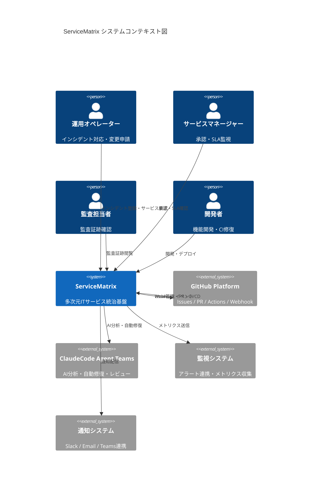
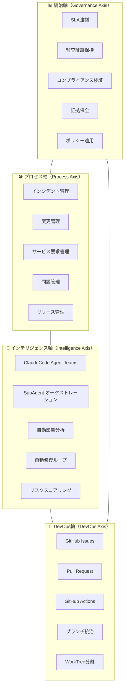
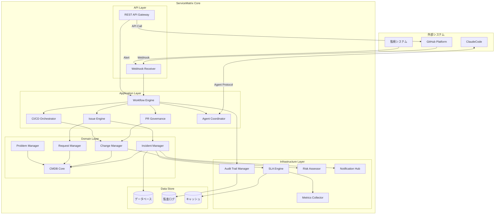
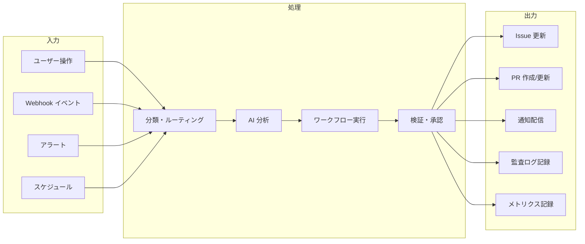

# システムアーキテクチャ概要

ServiceMatrix System Architecture Overview

Version: 1.0
Status: Active
Classification: Internal Architecture Document

---

## 1. はじめに

ServiceMatrix は GitHub ネイティブ × AI 統治型の多次元 IT サービス統治基盤である。
本ドキュメントは、ServiceMatrix のシステム全体アーキテクチャを俯瞰し、
主要コンポーネント、外部連携、技術スタックの全体像を定義する。

### 1.1 対象読者

- システムアーキテクト
- 開発チームメンバー
- 運用チーム
- 監査担当者
- プロジェクトマネージャー

### 1.2 前提条件

- GitHub をプライマリプラットフォームとして使用する
- ITIL 4 / ISO 20000 / J-SOX 準拠が必須要件である
- AI エージェント（ClaudeCode Agent Teams）による自動化を前提とする
- すべての状態遷移は追跡可能でなければならない

---

## 2. 全体アーキテクチャ図（C4 モデル - システムコンテキスト）

---

## 3. 4軸構造（Matrix Model）配置図

ServiceMatrix は以下の4つの統治軸の交差により構成される。

### 3.1 軸間の交差ポイント

| 交差ポイント | プロセス軸 | インテリジェンス軸 | DevOps軸 | 統治軸 |
|---|---|---|---|---|
| インシデント発生 | インシデント登録 | 影響分析・優先度判定 | Issue自動作成 | SLAタイマー起動 |
| 変更申請 | 変更レコード作成 | リスクスコアリング | PR作成・レビュー | 承認ゲート適用 |
| リリース実行 | リリース計画策定 | 自動テスト実行 | CI/CDパイプライン | 証跡記録・監査ログ |
| 障害復旧 | 問題管理開始 | 根本原因分析 | 修復PR自動作成 | SLA違反判定 |

---

## 4. コンポーネント一覧と責務

### 4.1 コアコンポーネント

| コンポーネント | 責務 | 技術要素 | 軸 |
|---|---|---|---|
| Issue Engine | Issue の作成・分類・ライフサイクル管理 | GitHub Issues API | DevOps / Process |
| PR Governance | Pull Request の作成・レビュー・承認統治 | GitHub PR API | DevOps / Governance |
| CI/CD Orchestrator | パイプライン実行・結果管理 | GitHub Actions | DevOps |
| Agent Coordinator | AI エージェントチームの編成・指揮 | ClaudeCode SDK | Intelligence |
| SLA Engine | SLA計測・違反検知・アラート発火 | カスタムロジック | Governance |
| Audit Trail Manager | 全操作の証跡記録・保全 | 構造化ログ | Governance |
| CMDB Core | 構成アイテムの管理・関連性維持 | データストア | Process / Governance |
| Workflow Engine | プロセスフロー制御・状態遷移管理 | ステートマシン | Process |
| Notification Hub | 通知の集約・配信・エスカレーション | Webhook / API | Cross-cutting |
| Risk Assessor | リスクスコア計算・影響範囲分析 | AI分析エンジン | Intelligence / Governance |

### 4.2 補助コンポーネント

| コンポーネント | 責務 |
|---|---|
| Config Manager | 設定管理・環境差分吸収 |
| Secret Vault | シークレット管理・暗号化制御 |
| Metrics Collector | メトリクス収集・集約・保存 |
| Report Generator | レポート生成・ダッシュボードデータ提供 |
| Template Engine | Issue/PR テンプレート管理 |

---

## 5. コンポーネント関係図（C4 - コンテナレベル）

---

## 6. 外部連携インターフェース一覧

### 6.1 GitHub API 連携

| インターフェース | 方向 | プロトコル | 用途 |
|---|---|---|---|
| GitHub Issues API | 双方向 | REST (HTTPS) | Issue のCRUD操作 |
| GitHub Pull Requests API | 双方向 | REST (HTTPS) | PR の作成・レビュー・マージ |
| GitHub Actions API | 双方向 | REST (HTTPS) | ワークフロー実行・状態確認 |
| GitHub Webhook | 受信 | HTTPS POST | イベント受信（push, issue, PR等） |
| GitHub GraphQL API | 送信 | GraphQL (HTTPS) | 複雑なクエリ・一括取得 |
| GitHub Checks API | 双方向 | REST (HTTPS) | CI結果の登録・取得 |

### 6.2 AI エージェント連携

| インターフェース | 方向 | プロトコル | 用途 |
|---|---|---|---|
| ClaudeCode Agent Protocol | 双方向 | SDK / API | エージェント編成・指揮 |
| MCP (Model Context Protocol) | 双方向 | JSON-RPC | ツール連携・コンテキスト共有 |
| Agent Teams Messaging | 内部 | メッセージング | エージェント間通信 |

### 6.3 外部サービス連携

| インターフェース | 方向 | プロトコル | 用途 |
|---|---|---|---|
| Slack Webhook | 送信 | HTTPS POST | 通知配信 |
| Email SMTP | 送信 | SMTP/TLS | メール通知 |
| 監視システム API | 受信 | REST / Webhook | アラート受信 |
| LDAP/AD | 送信 | LDAPS | ユーザー認証・認可 |

---

## 7. 技術スタック選定理由

### 7.1 技術スタック一覧

| カテゴリ | 技術 | 選定理由 |
|---|---|---|
| プラットフォーム | GitHub | Issue/PR/Actions の統合エコシステム、DevOps ネイティブ対応 |
| CI/CD | GitHub Actions | GitHub ネイティブ連携、YAML ベースの宣言的パイプライン定義 |
| AI エンジン | ClaudeCode Agent Teams | 高度な推論能力、Agent Teams によるタスク分散、MCP 対応 |
| バージョン管理 | Git + WorkTree | 並列開発支援、1Agent=1WorkTree の分離原則に最適 |
| ドキュメント | Markdown + Mermaid | GitHub レンダリング対応、コードと同居可能、差分管理可能 |
| データストア | SQLite / PostgreSQL | 軽量起動からスケールアウトまで対応可能 |
| 設定管理 | YAML / JSON | 可読性、バージョン管理容易性 |
| テスト | Jest / Playwright | ユニットテストから E2E テストまでカバー |
| セキュリティ | GitHub Secret / Vault | シークレット管理の標準化・暗号化 |

### 7.2 技術選定の判断基準

1. **GitHub ネイティブ性**: GitHub エコシステムとの統合深度を最優先とする
2. **追跡可能性**: すべての変更が Git 履歴として残ること
3. **AI 親和性**: ClaudeCode Agent Teams との連携が容易であること
4. **コンプライアンス対応**: 監査証跡の自動生成が可能であること
5. **拡張性**: 将来的なスケールアウトに対応可能であること
6. **運用容易性**: 特殊なインフラを必要としないこと

---

## 8. データフロー概要

---

## 9. セキュリティアーキテクチャ概要

### 9.1 認証・認可モデル

- GitHub OAuth / PAT による認証
- リポジトリ権限によるアクセス制御
- Branch Protection Rules による変更統治
- CODEOWNERS による承認者制御

### 9.2 データ保護

- シークレットは GitHub Secrets / Vault で管理
- 通信は全て TLS 1.3 以上で暗号化
- 監査ログは改竄防止措置を適用
- 個人情報は最小限の保持に留める

### 9.3 AI エージェントのセキュリティ制約

- エージェントは権限昇格ロジックを生成しない
- 認可回避コードの提案は禁止
- ハードコードされた秘密情報の出力は禁止
- すべてのエージェント判断はログに記録される

---

## 10. 非機能要件概要

| 項目 | 要件 | 目標値 |
|---|---|---|
| 可用性 | GitHub 依存部分を除くシステム可用性 | 99.5% 以上 |
| 応答時間 | API 応答時間（95パーセンタイル） | 2秒以内 |
| スループット | 同時処理可能なイベント数 | 100イベント/分 |
| データ保持 | 監査ログ保持期間 | 7年以上 |
| リカバリ | RPO（目標復旧時点） | 1時間以内 |
| リカバリ | RTO（目標復旧時間） | 4時間以内 |
| セキュリティ | 通信暗号化 | TLS 1.3 以上 |

---

## 11. 関連ドキュメント

| ドキュメント | 参照先 |
|---|---|
| 論理アーキテクチャ | [LOGICAL_ARCHITECTURE.md](./LOGICAL_ARCHITECTURE.md) |
| 物理アーキテクチャ | [PHYSICAL_ARCHITECTURE.md](./PHYSICAL_ARCHITECTURE.md) |
| サービス間連携図 | [SERVICE_INTERACTION_DIAGRAM.md](./SERVICE_INTERACTION_DIAGRAM.md) |
| イベントフローアーキテクチャ | [EVENT_FLOW_ARCHITECTURE.md](./EVENT_FLOW_ARCHITECTURE.md) |
| スケーラビリティモデル | [SCALABILITY_MODEL.md](./SCALABILITY_MODEL.md) |
| ServiceMatrix 憲章 | [SERVICEMATRIX_CHARTER.md](../../SERVICEMATRIX_CHARTER.md) |

---

*本ドキュメントは ServiceMatrix プロジェクトの統治原則に基づき管理される。*
*変更は Change Issue → PR → CI検証 → 承認 のフローに従うこと。*
