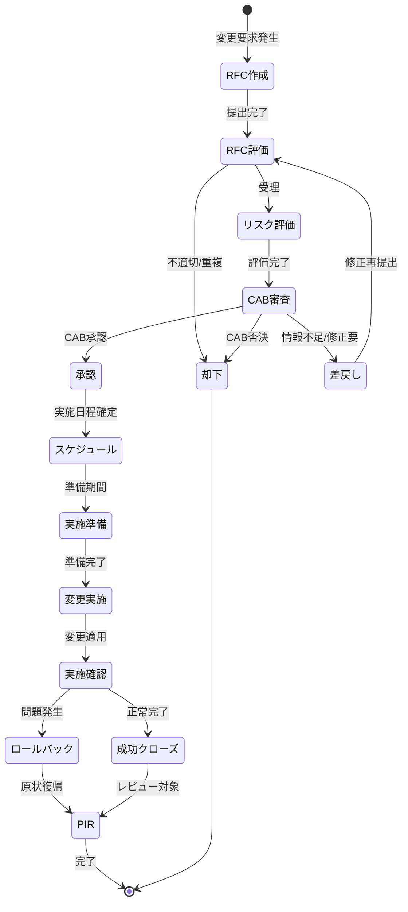
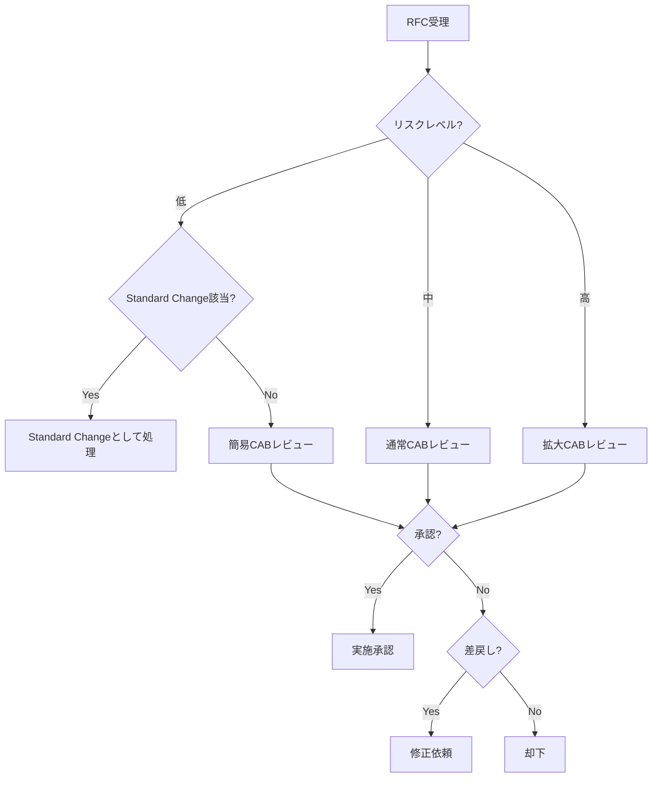
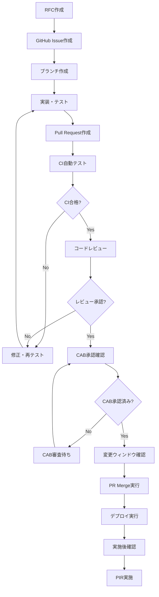
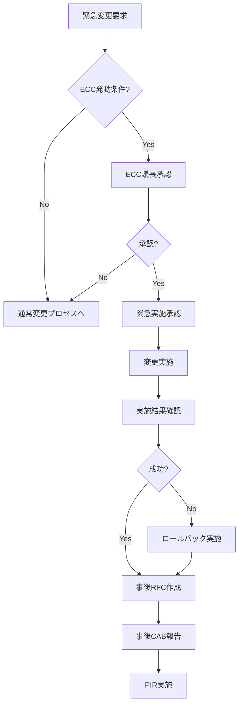

# 変更管理モデル
ServiceMatrix Change Management Model

Version: 1.0
Status: Active
Owner: Change Management Authority
Classification: ITIL 4 Aligned

---

## 1. 目的と適用範囲

### 1.1 目的

本ドキュメントは、ServiceMatrix における変更管理プロセスを定義する。
IT サービスへの変更を計画的かつ安全に実施するためのフレームワークを提供し、
変更に伴うリスクを最小化しながらビジネス価値を最大化することを目的とする。

### 1.2 適用範囲

- インフラストラクチャの変更（サーバー、ネットワーク、ストレージ）
- アプリケーションの変更（コード変更、設定変更、データ変更）
- プロセスの変更（運用手順、ワークフロー）
- セキュリティ関連の変更（ポリシー、アクセス権限）
- ドキュメントの変更（設計書、手順書の重大変更）

### 1.3 ITIL 4 整合

本プロセスは ITIL 4 の「Change Enablement」プラクティスに準拠し、
変更を「リスク管理」と「価値実現」の両面から管理する。

---

## 2. 変更タイプ定義

### 2.1 変更タイプ一覧

| タイプ | 説明 | 承認レベル | リードタイム |
|--------|------|-----------|-------------|
| Standard Change | 事前承認済みの低リスク変更 | 事前承認済み（承認不要） | 即時〜1営業日 |
| Normal Change | 通常の変更プロセスを経る変更 | CAB承認必須 | 5〜10営業日 |
| Emergency Change | 緊急対応が必要な変更 | ECC承認（事後CAB報告） | 即時 |

### 2.2 Standard Change（標準変更）

以下の条件をすべて満たす場合に適用：

- 過去に複数回実施済みで手順が確立されている
- リスク評価が「低」と事前認定されている
- 影響範囲が限定的で明確に定義されている
- ロールバック手順が確立されている

**Standard Change カタログの例:**

| ID | 変更名 | 対象 | 実施条件 |
|----|--------|------|---------|
| SC-001 | パッケージバージョンアップ（パッチ） | 依存ライブラリ | CI全テスト合格 |
| SC-002 | 設定パラメータ調整 | アプリケーション設定 | 閾値範囲内 |
| SC-003 | 監視閾値変更 | 監視システム | 運用チーム承認済み |
| SC-004 | ドキュメント更新 | 運用ドキュメント | レビュー済み |

### 2.3 Normal Change（通常変更）

Standard Change に該当しないすべての変更。CAB による審査・承認プロセスを経る。

### 2.4 Emergency Change（緊急変更）

P1/P2 インシデントへの対応、またはセキュリティ脆弱性の緊急修正など、
通常プロセスでは対応が間に合わない場合に適用する。

---

## 3. RFC（Request for Change）ライフサイクル

### 3.1 RFC 状態遷移図

### 3.2 RFC 記載必須項目

| セクション | 内容 | 必須/任意 |
|-----------|------|----------|
| 変更概要 | 何を、なぜ変更するか | 必須 |
| ビジネス正当性 | 変更によるビジネス価値 | 必須 |
| 技術詳細 | 変更の技術的内容 | 必須 |
| 影響範囲 | 影響を受けるサービス・システム | 必須 |
| リスク評価 | 特定されたリスクと対策 | 必須 |
| テスト計画 | 変更の検証方法 | 必須 |
| ロールバック計画 | 問題発生時の復旧手順 | 必須 |
| 実施スケジュール | 実施日時・所要時間 | 必須 |
| 実施手順 | 変更の実施手順（詳細） | 必須 |
| 通知計画 | ステークホルダーへの通知内容 | 必須 |
| 関連 CI | 影響を受ける構成アイテム | 任意 |
| コスト見積 | 変更にかかるコスト | 任意 |

---

## 4. CAB（Change Advisory Board）

### 4.1 CAB 構成と権限

| 役割 | 責務 | 権限 |
|------|------|------|
| CAB議長 | 会議運営、最終判断 | 承認/否決/差戻し |
| サービスマネージャー | サービス影響評価 | 助言・意見具申 |
| アーキテクト | 技術的実現性評価 | 助言・技術的承認 |
| セキュリティ担当 | セキュリティリスク評価 | セキュリティ承認/否決 |
| 運用担当 | 運用影響・実施可能性評価 | 助言・運用的承認 |
| ビジネス代表 | ビジネス影響評価 | ビジネス承認/否決 |

### 4.2 CAB 会議運営

- **定例 CAB**: 毎週水曜日 10:00〜11:00
- **臨時 CAB**: 必要に応じて24時間以内に招集
- **議事録**: GitHub Discussion に記録・保管
- **最小定足数**: 議長 + 2名以上の出席

### 4.3 CAB 判定基準

---

## 5. リスク評価手順

### 5.1 変更リスク評価マトリクス

| 評価項目 | 低（1点） | 中（2点） | 高（3点） |
|---------|----------|----------|----------|
| 影響範囲 | 単一コンポーネント | 複数コンポーネント | システム全体 |
| 複雑性 | 手順が単純 | 複数手順の連携 | 複雑な依存関係 |
| テスト充足度 | 自動テスト完備 | 部分的テスト | テスト不十分 |
| ロールバック | 即時復旧可能 | 手動復旧（30分以内） | 復旧困難 |
| 実施経験 | 過去に実績あり | 類似実績あり | 初回実施 |
| サービス影響時間 | ダウンタイムなし | 計画停止（30分以内） | 長時間停止 |

### 5.2 リスクスコア判定

- **合計 6〜8点**: 低リスク（Standard Change 候補）
- **合計 9〜12点**: 中リスク（通常 CAB レビュー）
- **合計 13〜18点**: 高リスク（拡大 CAB レビュー）

### 5.3 AI Agent によるリスク自動評価

AI Agent は RFC の内容を分析し、以下を自動算出する：

1. 過去の類似変更の成功率/失敗率
2. 影響を受ける CI（構成アイテム）の依存関係分析
3. 変更実施時間帯のサービス利用状況
4. テストカバレッジとの整合性
5. リスクスコアの自動算出と推奨対策

---

## 6. GitHub PR と変更承認の統合フロー

### 6.1 統合フロー図

### 6.2 PR と RFC の紐付け

- PR タイトルに RFC 番号を含める: `[RFC-XXX] 変更概要`
- PR 本文に RFC Issue へのリンクを記載
- ラベル: `change:standard` / `change:normal` / `change:emergency`
- CAB 承認は GitHub Issue 上のコメント承認で記録

### 6.3 自動検証ゲート

| ゲート | 検証内容 | 合格条件 |
|--------|---------|---------|
| CI テスト | ユニットテスト、統合テスト | 全テスト合格 |
| コードレビュー | コード品質、設計整合性 | 2名以上の Approve |
| セキュリティスキャン | 脆弱性スキャン | Critical/High なし |
| RFC 承認 | CAB 承認状態確認 | 承認済みステータス |
| 変更ウィンドウ | 実施可能時間帯確認 | ウィンドウ内 |

---

## 7. 緊急変更手順（ECC: Emergency Change Control）

### 7.1 緊急変更の発動条件

- P1/P2 インシデントへの対応で、通常プロセスでは間に合わない場合
- セキュリティ脆弱性の緊急修正が必要な場合
- データ損失のリスクが差し迫っている場合

### 7.2 ECC フロー

### 7.3 ECC 承認権限

| 時間帯 | 承認者 | 代理承認者 |
|--------|--------|-----------|
| 営業時間内 | CAB議長 | サービスマネージャー |
| 営業時間外 | オンコールマネージャー | IT部門長 |
| 休日 | オンコールマネージャー | IT部門長 |

### 7.4 事後必須作業

1. 48時間以内に事後 RFC を作成
2. 次回定例 CAB で報告
3. PIR（実施後レビュー）を実施
4. ナレッジベース更新

---

## 8. 変更カレンダー管理

### 8.1 変更ウィンドウ

| ウィンドウ | 時間帯 | 対象 |
|-----------|--------|------|
| 定期メンテナンス | 毎月第2土曜 02:00〜06:00 | 大規模変更 |
| 週次デプロイ | 毎週火曜 22:00〜24:00 | 通常リリース |
| 緊急変更 | 随時（承認後） | Emergency Change のみ |

### 8.2 変更凍結期間（Change Freeze）

以下の期間は Standard Change を除く全変更を凍結する：

- 年末年始（12月28日〜1月3日）
- 四半期末最終週（決算処理期間）
- 大規模イベント期間（事前指定）

変更凍結期間中の緊急変更は、IT部門長の承認が必要。

### 8.3 変更カレンダーの運用

- GitHub Projects で変更スケジュールを可視化
- 変更間の依存関係・衝突を事前検出
- 変更集中日のリスクを AI Agent が警告

---

## 9. PIR（Post Implementation Review）

### 9.1 PIR 実施基準

| 変更タイプ | PIR必須 | 実施期限 |
|-----------|---------|---------|
| Emergency Change | 必須 | 変更後5営業日以内 |
| Normal Change（高リスク） | 必須 | 変更後5営業日以内 |
| Normal Change（中リスク） | 推奨 | 変更後10営業日以内 |
| Normal Change（低リスク） | 任意 | - |
| Standard Change | 不要（抽出レビュー対象） | - |
| 失敗した変更 | 必須 | 変更後3営業日以内 |

### 9.2 PIR チェック項目

1. 変更は計画通りに実施されたか
2. 期待した結果が得られたか
3. 予期しない影響は発生したか
4. ロールバックは必要になったか
5. タイムラインは予定通りだったか
6. コミュニケーションは適切だったか
7. 改善すべき点はあるか
8. Standard Change カタログへの追加候補か

### 9.3 PIR レポート

PIR の結果は GitHub Issue にコメントとして記録し、以下のラベルを付与する：

- `pir:success` - 変更成功
- `pir:partial` - 部分的成功
- `pir:failed` - 変更失敗
- `pir:improvement-needed` - プロセス改善要

---

## 10. メトリクスと KPI

| KPI | 目標値 | 計測頻度 |
|-----|--------|---------|
| 変更成功率 | 95% 以上 | 月次 |
| 緊急変更比率 | 10% 以下 | 月次 |
| 変更起因インシデント率 | 5% 以下 | 月次 |
| CAB審査リードタイム | 5営業日以内 | 月次 |
| PIR 完了率 | 100%（必須対象） | 月次 |
| Standard Change 比率 | 40% 以上 | 四半期 |

---

## 改訂履歴

| バージョン | 日付 | 変更内容 | 承認者 |
|-----------|------|---------|--------|
| 1.0 | 2026-03-02 | 初版作成 | Change Management Authority |
