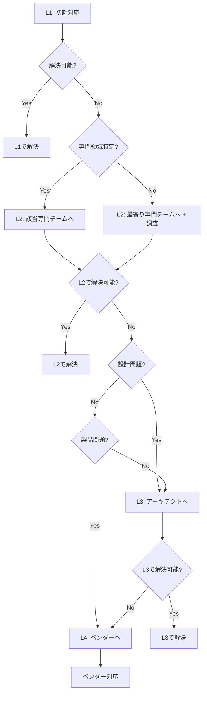
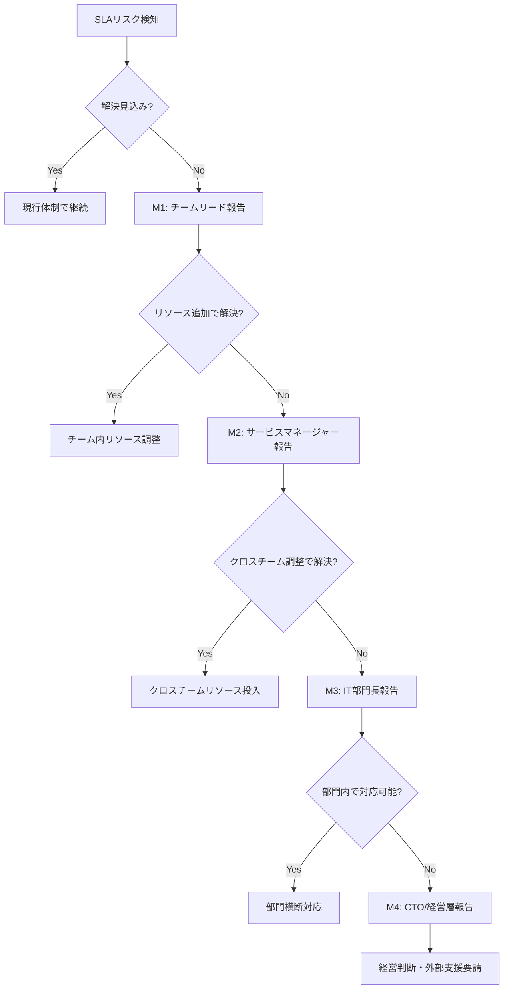
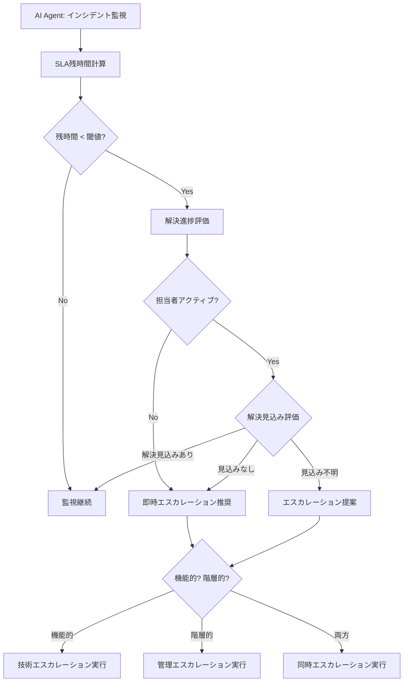

# エスカレーションモデル
ServiceMatrix Escalation Model

Version: 1.0
Status: Active
Owner: Service Operations Authority
Classification: ITIL 4 Aligned

---

## 1. 目的と適用範囲

### 1.1 目的

本ドキュメントは、ServiceMatrix におけるエスカレーションの基準、手順、
タイムラインを定義する。インシデントやサービス要求への対応が予定通り進行しない場合に、
適切な上位支援を迅速に投入し、SLA を遵守しつつ問題を解決することを目的とする。

### 1.2 適用範囲

- インシデント対応におけるエスカレーション
- サービス要求処理におけるエスカレーション
- 問題管理における調査エスカレーション
- 変更管理における承認エスカレーション
- SLA 違反リスクにおけるエスカレーション

### 1.3 エスカレーションの2種類

| 種類 | 目的 | 方向性 |
|------|------|--------|
| 機能的エスカレーション | 技術的な専門知識・スキルの投入 | 水平方向（専門チームへ） |
| 階層的エスカレーション | 管理権限・意思決定権限の行使 | 垂直方向（上位管理者へ） |

---

## 2. 機能的エスカレーション（技術的）

### 2.1 サポートレベル定義

| レベル | 役割 | スキル | 対応範囲 |
|--------|------|--------|---------|
| L1: サービスデスク | 初期対応、既知解決策の適用 | 基本的なトラブルシューティング | 既知エラー、FAQ、標準手順 |
| L2: 専門チーム | 詳細調査、非定型対応 | 専門技術領域の深い知識 | アプリケーション、インフラ専門分析 |
| L3: アーキテクト/エキスパート | 設計レベルの問題解決 | アーキテクチャ、高度な技術 | 根本的な設計問題、複合障害 |
| L4: ベンダー/外部 | 製品固有の問題解決 | 製品内部知識 | 製品バグ、ベンダー固有の問題 |

### 2.2 機能的エスカレーションフロー



### 2.3 機能的エスカレーション基準

| From → To | トリガー条件 | 最大許容時間 |
|-----------|------------|-------------|
| L1 → L2 | 既知解決策に該当しない、初期診断で原因不明 | P1: 15分, P2: 30分, P3: 2時間, P4: 8時間 |
| L2 → L3 | 専門分析でも原因特定不可、設計上の問題の疑い | P1: 30分, P2: 1時間, P3: 4時間, P4: 24時間 |
| L2/L3 → L4 | 製品の内部バグ、ベンダー固有の設定が必要 | 問題特定後即時 |

---

## 3. 階層的エスカレーション（管理的）

### 3.1 管理階層定義

| レベル | 役割 | 権限 |
|--------|------|------|
| M1: チームリード | チーム内リソース調整 | チーム内の優先度変更、担当者変更 |
| M2: サービスマネージャー | サービス全体の管理 | クロスチームリソース調整、SLA交渉 |
| M3: IT部門長 | IT部門全体の統括 | 予算承認、組織横断調整 |
| M4: CTO/経営層 | 経営判断 | 戦略的判断、外部対応承認 |

### 3.2 階層的エスカレーションフロー



### 3.3 階層的エスカレーション基準

| 優先度 | M1通知 | M2通知 | M3通知 | M4通知 |
|--------|--------|--------|--------|--------|
| P1 | 即時 | 15分未解決時 | 30分未解決時 | 1時間未解決時 |
| P2 | 30分未解決時 | 2時間未解決時 | SLA50%経過時 | SLA違反時 |
| P3 | 4時間未解決時 | SLA50%経過時 | SLA違反時 | 重大影響判明時 |
| P4 | SLA50%経過時 | SLA違反時 | 繰返し違反時 | - |

---

## 4. エスカレーションタイムライン

### 4.1 P1（致命的）タイムライン

```mermaid
gantt
    title P1 エスカレーションタイムライン（目標解決: 1時間）
    dateFormat HH:mm
    axisFormat %H:%M

    section 技術対応
    L1初期対応           :a1, 00:00, 15m
    L2専門チーム投入     :a2, after a1, 15m
    L3アーキテクト投入   :a3, after a2, 30m

    section 管理対応
    M1チームリード通知   :b1, 00:00, 5m
    M2サービスマネージャー :b2, 00:15, 5m
    M3 IT部門長          :b3, 00:30, 5m
    M4 CTO              :b4, 01:00, 5m
```



| 経過時間 | 技術アクション | 管理アクション |
|---------|--------------|--------------|
| 0分 | L1: 初期対応開始、AI Agent トリアージ | M1: チームリードへ即時通知 |
| 5分 | L1: 影響範囲確認、既知エラー照合 | 関係者への初報送信 |
| 15分 | L2: 専門チームへエスカレーション | M2: サービスマネージャーへ通知 |
| 30分 | L3: アーキテクトへエスカレーション | M3: IT部門長へ通知 |
| 45分 | 回避策の優先適用検討 | リソース追加投入判断 |
| 60分 | 解決または暫定復旧 | M4: CTO通知（未解決の場合） |

### 4.2 P2（重大）タイムライン

| 経過時間 | 技術アクション | 管理アクション |
|---------|--------------|--------------|
| 0分 | L1: 初期対応開始 | - |
| 30分 | L2: 専門チームへ（未解決時） | M1: チームリード通知 |
| 1時間 | L3: エスカレーション検討 | - |
| 2時間 | L3: アーキテクトへ（未解決時） | M2: サービスマネージャー通知 |
| 3時間 | ベンダーエスカレーション検討 | SLA違反リスク評価 |
| 4時間 | 目標解決時間 | M3: 未解決時 IT部門長通知 |

### 4.3 P3（中程度）タイムライン

| 経過時間 | 技術アクション | 管理アクション |
|---------|--------------|--------------|
| 0分 | L1: 初期対応開始 | - |
| 2時間 | L2: 専門チームへ（未解決時） | - |
| 4時間 | L3: エスカレーション検討 | M1: チームリード通知 |
| 12時間 | 解決計画策定（未解決時） | M2: サービスマネージャー通知 |
| 24時間 | 目標解決時間 | M3: 未解決時 IT部門長通知 |

### 4.4 P4（低）タイムライン

| 経過時間 | 技術アクション | 管理アクション |
|---------|--------------|--------------|
| 0分 | L1: 要求受付、対応計画策定 | - |
| 8時間 | L2: 必要に応じてエスカレーション | - |
| 36時間 | 解決進捗確認 | M1: チームリード通知（必要時） |
| 72時間 | 目標解決時間 | M2: 未解決時サービスマネージャー通知 |

---

## 5. AI Agent エスカレーション判定ロジック

### 5.1 判定フロー



### 5.2 AI Agent 判定パラメータ

| パラメータ | 説明 | 判定基準 |
|-----------|------|---------|
| SLA残時間比率 | 残時間 / 総SLA時間 | 50%以下で警告、25%以下で緊急 |
| 担当者応答間隔 | 最終更新からの経過時間 | P1: 15分, P2: 30分, P3: 2時間, P4: 8時間 |
| 類似インシデント解決時間 | 過去データからの推定解決時間 | 推定時間 > SLA残時間 でエスカレーション |
| 対応チームの負荷 | 現在のチーム対応件数 | キャパシティ超過時にリソースエスカレーション |
| インシデント複雑度 | AI分析による複雑度スコア | 高複雑度は早期エスカレーション |

### 5.3 自動エスカレーションアクション

AI Agent は以下のアクションを自動実行する（Level 2 以上の自律レベル設定時）：

| アクション | 条件 | 通知方法 |
|-----------|------|---------|
| SLA警告通知 | SLA残時間50%到達 | GitHub Issue コメント + メンション |
| エスカレーション提案 | SLA残時間25%到達 | GitHub Issue コメント + 推奨先明示 |
| 自動エスカレーション | SLA残時間10%到達 + 担当者無応答 | 自動アサイン変更 + 上位通知 |
| SLA違反アラート | SLA違反 | 全関係者通知 + インシデントレポート起票 |

---

## 6. エスカレーション連絡先マトリクス

### 6.1 技術エスカレーション連絡先

| 対象領域 | L2チーム | L3エキスパート | L4ベンダー |
|---------|---------|--------------|-----------|
| アプリケーション | アプリ開発チーム | シニアアーキテクト | アプリベンダー |
| インフラストラクチャ | インフラチーム | インフラアーキテクト | クラウドベンダー |
| データベース | DBAチーム | データアーキテクト | DBベンダー |
| ネットワーク | ネットワークチーム | ネットワークアーキテクト | NWベンダー |
| セキュリティ | セキュリティチーム | セキュリティアーキテクト | セキュリティベンダー |
| AI/自動化 | AI Opsチーム | AI アーキテクト | AIプラットフォームベンダー |

### 6.2 管理エスカレーション連絡先

| レベル | 役職 | 連絡方法 | 応答期待時間 |
|--------|------|---------|-------------|
| M1 | 各チームリード | GitHub メンション / チャット | 営業時間: 15分, 時間外: 30分 |
| M2 | サービスマネージャー | GitHub メンション / メール / 電話 | 営業時間: 15分, 時間外: 30分 |
| M3 | IT部門長 | メール / 電話 | 営業時間: 30分, 時間外: 1時間 |
| M4 | CTO | 電話 / 緊急連絡網 | 1時間以内 |

### 6.3 時間外エスカレーション

| 区分 | 対応体制 | エスカレーション方法 |
|------|---------|------------------|
| 平日夜間（18:00〜09:00） | オンコール担当 | オンコール連絡システム |
| 休日 | オンコール担当 | オンコール連絡システム |
| P1 発生時 | 全担当者呼出し | 緊急連絡網 + 自動電話通知 |

---

## 6.4 通知チャネル詳細仕様

ServiceMatrix におけるエスカレーション通知は、優先度・受信者・状況に応じて以下の 3 チャネルを使い分ける。

### 6.4.1 GitHub Issue コメント通知

GitHub Issue のコメントとして通知を投稿する。ServiceMatrix の主要通知チャネルであり、すべてのエスカレーションに適用される。

**用途**:
- 担当者・レビュアーへのメンション通知
- エスカレーション記録の公式証跡（監査証跡）
- SLA 残時間警告
- AI Agent による自動エスカレーション提案

**通知フォーマット**:

```markdown
## エスカレーション通知

- **種類**: 機能的エスカレーション / 階層的エスカレーション
- **優先度**: P1 / P2 / P3 / P4
- **エスカレーション元**: L1 サービスデスク（@username）
- **エスカレーション先**: L2 アプリ開発チーム（@team-app）
- **理由**: 既知エラーに該当せず、初期診断で原因特定不可
- **SLA残時間**: 45分（総SLA時間 60分の 75% 経過）
- **期待アクション**: 専門分析・原因特定・解決策提案

@team-app エスカレーションをお願いします。対応状況をコメントにてご報告ください。
```

**GitHub メンション規則**:

| 対象 | メンション形式 | 使用条件 |
|------|--------------|---------|
| 個人担当者 | `@username` | 特定担当者へのエスカレーション時 |
| チーム | `@org/team-name` | チームへのエスカレーション時 |
| サービスマネージャー | `@sm-username` | M2 以上の階層的エスカレーション時 |
| 全担当者 | 個別メンション列挙 | P1 発生時（チームメンション + 個人メンション併用） |

**自動投稿条件**:

| トリガー | 投稿内容 | 優先度 |
|---------|---------|--------|
| SLA 50% 経過 | SLA 警告コメント + 担当者メンション | P1-P4 全対象 |
| SLA 25% 経過 | エスカレーション提案コメント + 推奨先明示 | P1-P3 対象 |
| SLA 10% 経過 + 無応答 | 自動エスカレーション実行コメント | P1-P2 対象 |
| SLA 違反 | 違反通知コメント + PIR 起票リクエスト | P1-P4 全対象 |

---

### 6.4.2 メール通知

M2（サービスマネージャー）以上の管理階層エスカレーション、および時間外緊急時に使用する。

**用途**:
- 管理層への正式報告
- 時間外のオンコール呼び出し補助
- 外部ベンダー（L4）へのエスカレーション連絡
- 定時エスカレーションレポート配信（日次/週次）

**メールテンプレート（P1 エスカレーション）**:

```
件名: 【P1 エスカレーション】#{Issue番号} {インシデントタイトル} - SLA残時間 {残時間}

本文:
ServiceMatrix より P1 インシデントのエスカレーションを通知します。

■ インシデント概要
  - Issue: #{Issue番号}（{GitHub URL}）
  - タイトル: {インシデントタイトル}
  - 優先度: P1 - Critical
  - 発生日時: {ISO 8601 日時}
  - SLA 残時間: {残時間}

■ 現状
  - 対応状況: {現在の対応状況}
  - 担当者: {担当者名}
  - 試みた解決策: {試行済みの対応}

■ エスカレーション情報
  - エスカレーション元: {From}
  - エスカレーション先: {To}
  - 理由: {エスカレーション理由}

■ 要請事項
  {期待するアクション}

対応状況は GitHub Issue にて随時更新します。
```

**送信先ルール**:

| エスカレーションレベル | 送信先 | 送信タイミング |
|---------------------|--------|--------------|
| M2 通知 | サービスマネージャー | エスカレーショントリガー時 |
| M3 通知 | IT部門長 + サービスマネージャー（CC） | エスカレーショントリガー時 |
| M4 通知 | CTO + IT部門長（CC） + サービスマネージャー（CC） | エスカレーショントリガー時 |
| L4 通知 | ベンダー担当窓口 | ベンダーエスカレーション時 |
| 時間外 P1 | オンコール担当 + M1 | P1 発生時間外時 |

**J-SOX 準拠対応**:
- 送信したメールの記録は `audit_logs` テーブルの `notification_sent` イベントとして永続化する
- 送信先・送信日時・件名・エスカレーション番号を必ず記録する

---

### 6.4.3 Slack 通知（将来拡張）

Phase 2 以降で Slack インテグレーションを導入する場合の仕様を定義する。

> **現状**: Phase 1 では未実装。GitHub Issue コメント + メールを主チャネルとする。
> **導入判断**: Phase 2 移行時に Slack Workspace 導入状況を確認し、本仕様に従い実装する。

**チャンネル設計**:

| チャンネル | 用途 | 参加者 |
|-----------|------|--------|
| `#sm-incidents-p1` | P1 インシデント専用アラート | 全運用担当者 + 管理層 |
| `#sm-incidents-all` | P2-P4 インシデント通知 | 運用チーム |
| `#sm-escalations` | エスカレーション通知ログ | チームリード + サービスマネージャー |
| `#sm-releases` | リリース関連通知 | 開発チーム + 運用チーム |
| `#sm-sla-alerts` | SLA 警告通知 | 運用チーム + チームリード |

**Slack メッセージフォーマット（Block Kit）**:

```json
{
  "blocks": [
    {
      "type": "header",
      "text": {
        "type": "plain_text",
        "text": "⚠️ P1 エスカレーション通知"
      }
    },
    {
      "type": "section",
      "fields": [
        {"type": "mrkdwn", "text": "*Issue:*\n<{url}|#{number}>"},
        {"type": "mrkdwn", "text": "*優先度:*\nP1 - Critical"},
        {"type": "mrkdwn", "text": "*SLA残時間:*\n{remaining_time}"},
        {"type": "mrkdwn", "text": "*エスカレーション先:*\n{escalation_to}"}
      ]
    },
    {
      "type": "actions",
      "elements": [
        {
          "type": "button",
          "text": {"type": "plain_text", "text": "Issue を確認"},
          "url": "{github_issue_url}",
          "style": "danger"
        }
      ]
    }
  ]
}
```

**GitHub → Slack 連携方式**:

```
GitHub Webhook
    │
    ↓
ServiceMatrix Event Bus
    │
    ↓
Slack Notification Worker
    │  （Slack Web API / Incoming Webhooks）
    ↓
Slack チャンネル
```

**通知抑制ルール（アンチノイズ設計）**:
- 同一 Issue の同種アラートは最短 30 分の間隔を設ける
- 解決済み Issue には通知を送信しない
- バッチ通知: P3/P4 の通知は 15 分ごとにバンドルして 1 件にまとめる

---

## 7. エスカレーション記録と追跡

### 7.1 記録必須項目

すべてのエスカレーションは GitHub Issue のコメントとして記録する：

| 項目 | 内容 |
|------|------|
| エスカレーション日時 | ISO 8601 形式 |
| エスカレーション種類 | 機能的 / 階層的 |
| エスカレーション元 | 元の対応レベル / 担当者 |
| エスカレーション先 | 新しい対応レベル / 担当者 |
| エスカレーション理由 | 具体的な理由 |
| 期待するアクション | エスカレーション先に求める対応 |
| SLA残時間 | エスカレーション時点のSLA残時間 |

### 7.2 エスカレーション効果測定

| 指標 | 目標値 | 計測頻度 |
|------|--------|---------|
| エスカレーション後の解決率 | 95% 以上 | 月次 |
| エスカレーション応答時間 | 基準の80%以内 | 月次 |
| 不要エスカレーション率 | 10% 以下 | 四半期 |
| エスカレーション起因のSLA遵守回復率 | 80% 以上 | 月次 |

---

## 8. 継続的改善

### 8.1 エスカレーション分析

- **月次**: エスカレーション件数・パターン分析
- **四半期**: エスカレーション基準の妥当性レビュー
- **半期**: 連絡先マトリクスの更新

### 8.2 改善のトリガー

- 不要エスカレーション率が閾値を超えた場合 → 判定基準の見直し
- エスカレーション応答時間が悪化した場合 → 体制・連絡方法の見直し
- SLA違反がエスカレーション遅延に起因する場合 → タイムラインの見直し

---

## 改訂履歴

| バージョン | 日付 | 変更内容 | 承認者 |
|-----------|------|---------|--------|
| 1.0 | 2026-03-02 | 初版作成 | Service Operations Authority |
