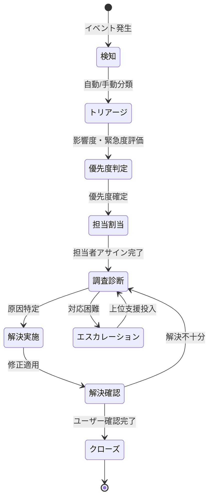
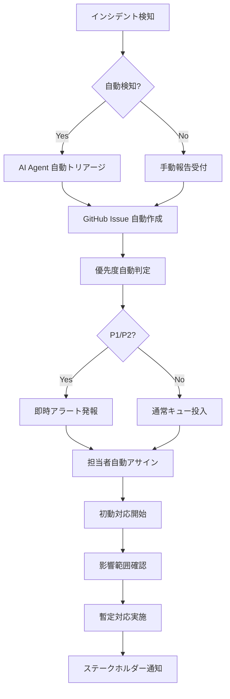
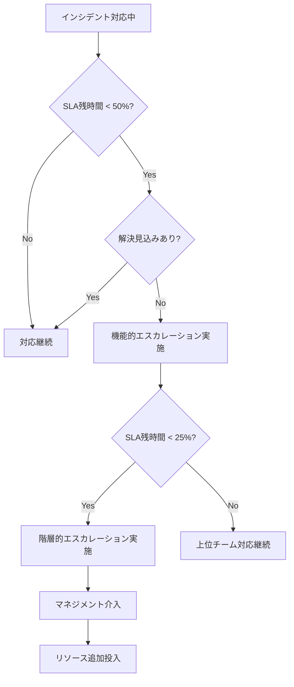
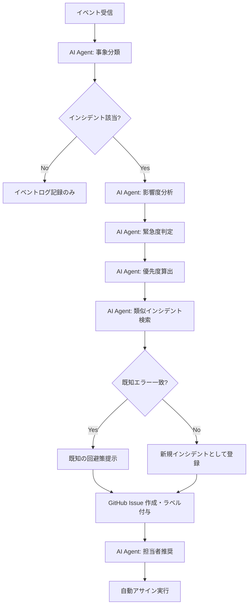
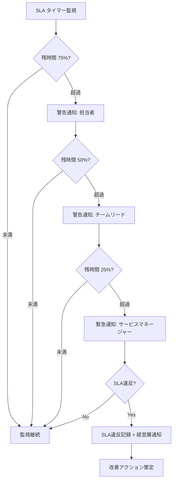

# インシデント管理モデル
ServiceMatrix Incident Management Model

Version: 1.0
Status: Active
Owner: Service Operations Authority
Classification: ITIL 4 Aligned

---

## 1. 目的と適用範囲

### 1.1 目的

本ドキュメントは、ServiceMatrix におけるインシデント管理プロセスの全体像を定義する。
インシデントの検知から解決・クローズまでのライフサイクル、優先度判定、エスカレーション基準、
AI Agent による自動トリアージ、および GitHub Issues との統合フローを規定する。

### 1.2 適用範囲

- ServiceMatrix が管理するすべての IT サービス
- 内部システム障害、外部サービス影響、セキュリティインシデント
- AI Agent が検知した異常事象
- ユーザーからの障害報告

### 1.3 ITIL 4 整合

本プロセスは ITIL 4 の「Incident Management」プラクティスに準拠し、
以下の原則を反映する：

- 価値の共創（Co-create Value）
- 現状からの開始（Start Where You Are）
- フィードバックによる反復的進歩（Progress Iteratively with Feedback）
- 可視性の確保（Keep It Simple and Practical）

---

## 2. インシデントライフサイクル

### 2.1 状態遷移図



### 2.2 各状態の定義

| 状態 | 説明 | 最大滞留時間（P1） |
|------|------|---------------------|
| 検知 | インシデントがシステムまたはユーザーにより報告された状態 | 5分 |
| トリアージ | AI Agent または運用担当が初期分類を実施中 | 10分 |
| 優先度判定 | 影響度×緊急度マトリクスに基づく優先度決定中 | 5分 |
| 担当割当 | 適切な対応チーム・担当者へのアサイン中 | 10分 |
| 調査診断 | 根本原因の調査と診断を実施中 | 30分 |
| エスカレーション | 上位レベルへのエスカレーション実施中 | 即時 |
| 解決実施 | 修正・回避策の適用中 | P1: 1時間以内 |
| 解決確認 | ユーザーまたはシステムによる解決確認中 | 30分 |
| クローズ | インシデント記録の最終化と完了 | 24時間以内 |

---

## 3. 優先度定義

### 3.1 影響度×緊急度マトリクス

|  | 緊急度: 高 | 緊急度: 中 | 緊急度: 低 |
|--|-----------|-----------|-----------|
| **影響度: 高** | P1 - 致命的 | P2 - 重大 | P3 - 中程度 |
| **影響度: 中** | P2 - 重大 | P3 - 中程度 | P4 - 低 |
| **影響度: 低** | P3 - 中程度 | P4 - 低 | P4 - 低 |

### 3.2 優先度別 SLA 定義

| 優先度 | 初動応答 | 状況更新間隔 | 目標解決時間 | 対応体制 |
|--------|---------|-------------|-------------|---------|
| P1 - 致命的 | 15分以内 | 30分毎 | 1時間以内 | 全チーム即時対応 |
| P2 - 重大 | 30分以内 | 1時間毎 | 4時間以内 | 専任チーム対応 |
| P3 - 中程度 | 2時間以内 | 4時間毎 | 24時間以内 | 通常対応 |
| P4 - 低 | 8時間以内 | 日次 | 72時間以内 | 計画対応 |

### 3.3 影響度判定基準

| レベル | 基準 | 具体例 |
|--------|------|--------|
| 高 | サービス全体停止、全ユーザー影響 | 本番DB障害、認証基盤停止、ネットワーク全断 |
| 中 | 一部機能停止、特定ユーザー群影響 | 特定API障害、一部画面表示不可、性能著しい劣化 |
| 低 | 軽微な機能制限、回避策あり | 表示崩れ、非重要バッチ遅延、ログ出力異常 |

### 3.4 緊急度判定基準

| レベル | 基準 | 具体例 |
|--------|------|--------|
| 高 | ビジネス継続に即時影響 | 営業時間中の基幹システム停止、セキュリティ侵害 |
| 中 | 業務効率に影響するが代替手段あり | 一部自動処理の手動対応、レポート遅延 |
| 低 | 即座のビジネス影響なし | 開発環境の問題、次回リリースで対応可能 |

---

## 4. 初動対応手順（30分以内）

### 4.1 初動対応フロー



### 4.2 初動チェックリスト

1. **0〜5分**: インシデント検知・受付
   - GitHub Issue 作成確認
   - 適切なラベル付与確認
   - 優先度の仮判定

2. **5〜15分**: 初期評価
   - 影響範囲の特定
   - 影響を受けるサービス・ユーザーの確認
   - 既知エラー（KEDB）との照合
   - 優先度の確定

3. **15〜30分**: 初動対応
   - 担当チームへのアサイン完了
   - 暫定回避策の検討・適用
   - ステークホルダーへの初回通知
   - 対応計画の策定

---

## 5. エスカレーション基準と手順

### 5.1 機能的エスカレーション（技術的）

| トリガー | アクション |
|---------|----------|
| L1 が15分以内に解決方針を立てられない | L2 専門チームへエスカレーション |
| L2 が30分以内に根本原因を特定できない | L3 アーキテクト/ベンダーへエスカレーション |
| インフラ起因と判明 | インフラチームへ即時エスカレーション |
| セキュリティ関連と判明 | セキュリティチームへ即時エスカレーション |

### 5.2 階層的エスカレーション（管理的）

| 条件 | エスカレーション先 |
|------|------------------|
| P1 発生時 | サービスマネージャー即時通知 |
| P1 が30分未解決 | IT部門長通知 |
| P1 が1時間未解決 | CTO/経営層通知 |
| P2 が SLA 50% 経過時 | サービスマネージャー通知 |
| SLA 違反の恐れ | サービスマネージャー + 関連部門長通知 |

### 5.3 エスカレーション判定フロー



---

## 6. AI Agent による自動トリアージフロー

### 6.1 自動トリアージアーキテクチャ



### 6.2 AI Agent トリアージ判定ロジック

AI Agent は以下の要素を分析してトリアージを実施する：

1. **事象分類**: エラーログ、メトリクス異常、ユーザー報告の内容をNLP解析
2. **影響度判定**: 影響を受けるサービス数、ユーザー数、ビジネスプロセスへの影響を定量評価
3. **緊急度判定**: 時間的制約、代替手段の有無、拡大リスクを評価
4. **類似検索**: 過去のインシデントデータベースから類似事例を検索（コサイン類似度 >= 0.85）
5. **担当者推奨**: スキルマッチ、負荷状況、過去の解決実績から最適な担当者を推奨

### 6.3 AI Agent 自律レベル

| レベル | 権限 | 適用条件 |
|--------|------|---------|
| Level 1: 通知のみ | 分類結果を通知、人間が判断 | デフォルト設定 |
| Level 2: 提案付き | 分類＋対応案を提示、人間が承認 | 運用安定期 |
| Level 3: 自動実行 | P3/P4 の既知エラーに対し自動回避策適用 | 管理者明示承認済み |

---

## 7. GitHub Issues との連携

### 7.1 Issue テンプレート構造

インシデント用 Issue は以下の構造で自動作成される：

```
タイトル: [INC-{連番}] {インシデント概要}

ラベル:
  - incident
  - priority:{P1|P2|P3|P4}
  - impact:{high|medium|low}
  - status:{open|investigating|resolved|closed}
  - team:{対応チーム名}

本文:
  ## インシデント概要
  {AI Agent または報告者による概要}

  ## 影響範囲
  - 影響サービス: {サービス名}
  - 影響ユーザー数: {推定数}
  - ビジネス影響: {影響内容}

  ## 検知情報
  - 検知日時: {ISO 8601}
  - 検知方法: {監視アラート|ユーザー報告|AI検知}
  - 検知元: {システム名/報告者}

  ## 優先度判定
  - 影響度: {高|中|低}
  - 緊急度: {高|中|低}
  - 優先度: {P1|P2|P3|P4}
  - SLA期限: {解決期限日時}
```

### 7.2 ラベル体系

| カテゴリ | ラベル | 説明 |
|---------|--------|------|
| タイプ | `incident` | インシデントであることを示す |
| 優先度 | `priority:P1` 〜 `priority:P4` | 優先度レベル |
| 影響度 | `impact:high` / `impact:medium` / `impact:low` | 影響度レベル |
| 状態 | `status:open` / `status:investigating` / `status:resolved` / `status:closed` | 対応状態 |
| チーム | `team:{チーム名}` | 担当チーム |
| 環境 | `env:production` / `env:staging` | 影響環境 |

### 7.3 担当者自動割当ルール

1. **スキルマッチング**: Issue のラベル・内容から必要スキルを判定
2. **負荷分散**: 現在のアサイン数が最少の適格者を優先
3. **過去実績**: 類似インシデントの解決実績がある担当者を優先
4. **オンコール**: P1/P2 はオンコール担当者に即時アサイン
5. **フォールバック**: 自動アサイン不可の場合、サービスマネージャーに通知

---

## 8. SLA タイマー管理

### 8.1 SLA タイマーの構成

各インシデントには以下の SLA タイマーが設定される：

| タイマー | 計測開始 | 計測対象 |
|---------|---------|---------|
| 応答タイマー | Issue 作成時 | 初回応答（担当者コメント）まで |
| 更新タイマー | 前回更新時 | 次回状況更新まで |
| 解決タイマー | Issue 作成時 | 解決確認まで |

### 8.2 SLA 一時停止条件

以下の場合、SLA タイマーは一時停止される：

- ユーザー側の情報提供待ち（ラベル: `waiting:customer`）
- 外部ベンダー対応待ち（ラベル: `waiting:vendor`）
- 承認済みメンテナンスウィンドウ中

### 8.3 SLA 違反時のアクション



---

## 9. 解決・クローズ基準

### 9.1 解決基準

インシデントを「解決済み」とするには、以下のすべてを満たす必要がある：

1. 報告された事象が再現しないことが確認されている
2. 影響を受けたサービスが正常稼働に復帰している
3. 暫定対応の場合、恒久対策の Problem チケットが作成されている
4. 影響を受けたユーザーに解決を通知済みである
5. 解決手順が Issue コメントに記録されている

### 9.2 クローズ基準

インシデントをクローズするには、以下のすべてを満たす必要がある：

1. 解決から24時間以上経過し、再発がない
2. ユーザーが解決を承認している（P1/P2 は明示的承認必須）
3. 根本原因が特定されている、または Problem チケットに引き継がれている
4. インシデントレポートが完成している（P1/P2 は必須）
5. ナレッジベースが更新されている

### 9.3 インシデントレポート（P1/P2 必須）

P1/P2 インシデントのクローズには以下のレポート作成が必須：

| セクション | 内容 |
|-----------|------|
| インシデント概要 | 発生日時、影響範囲、優先度 |
| タイムライン | 検知〜解決までの時系列記録 |
| 根本原因 | 判明した根本原因（暫定含む） |
| 対応内容 | 実施した対応の詳細 |
| 影響分析 | ビジネスへの実影響 |
| 再発防止策 | 恒久対策と実施予定 |
| 教訓 | 今回の対応から得た知見 |
| SLA 実績 | 各 SLA タイマーの実績値 |

---

## 10. メトリクスと KPI

### 10.1 主要 KPI

| KPI | 目標値 | 計測頻度 |
|-----|--------|---------|
| SLA 遵守率 | 95% 以上 | 月次 |
| 平均応答時間（MTTA） | P1: 10分以内 | 月次 |
| 平均解決時間（MTTR） | P1: 45分以内 | 月次 |
| 初回解決率（FCR） | 70% 以上 | 月次 |
| 再発率 | 5% 以下 | 月次 |
| ユーザー満足度 | 4.0/5.0 以上 | 四半期 |

### 10.2 レポーティング

- **日次**: P1/P2 インシデント発生状況サマリ
- **週次**: インシデント傾向分析、SLA 遵守状況
- **月次**: KPI レポート、改善提案
- **四半期**: トレンド分析、プロセス改善レビュー

---

## 11. 継続的改善

### 11.1 改善サイクル

1. インシデントデータの収集・分析
2. 傾向パターンの特定
3. Problem Management への連携
4. 改善施策の立案
5. 施策実行と効果測定
6. プロセスへの反映

### 11.2 レビュー頻度

| レビュー | 頻度 | 参加者 |
|---------|------|--------|
| インシデントレビュー | 週次 | 運用チーム |
| SLA レビュー | 月次 | サービスマネージャー、運用チーム |
| プロセスレビュー | 四半期 | 全関係者 |
| 重大インシデントレビュー | 発生都度 | 全関係者 + 経営層 |

---

## 改訂履歴

| バージョン | 日付 | 変更内容 | 承認者 |
|-----------|------|---------|--------|
| 1.0 | 2026-03-02 | 初版作成 | Service Governance Authority |
