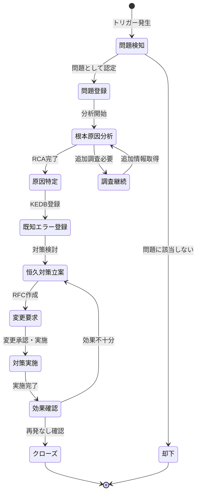
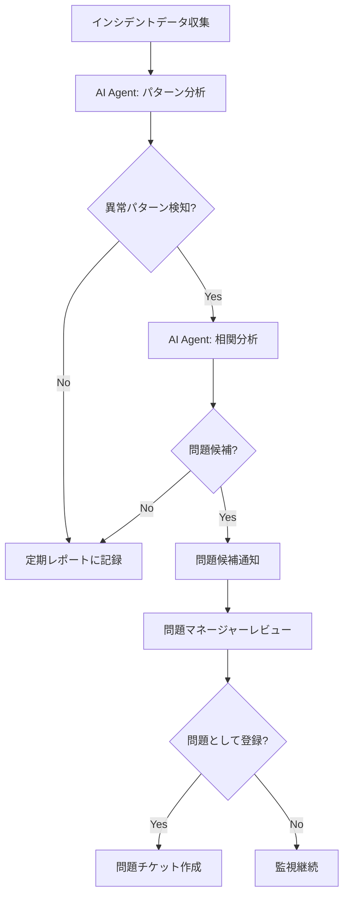
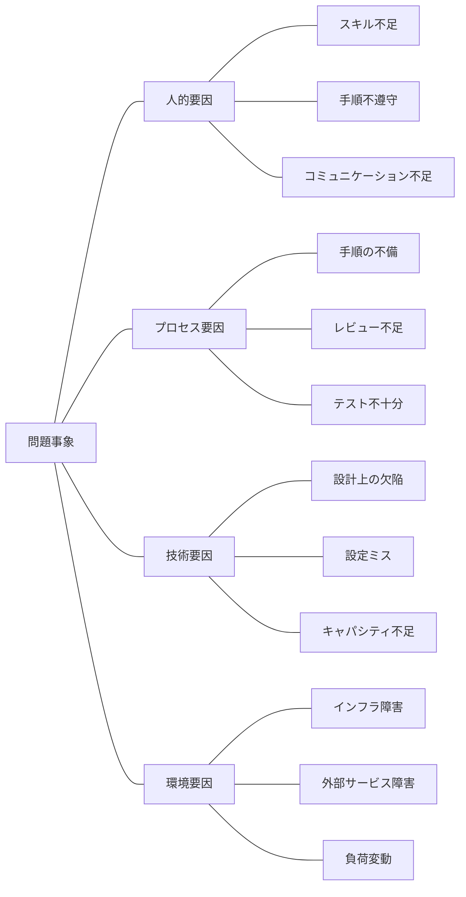
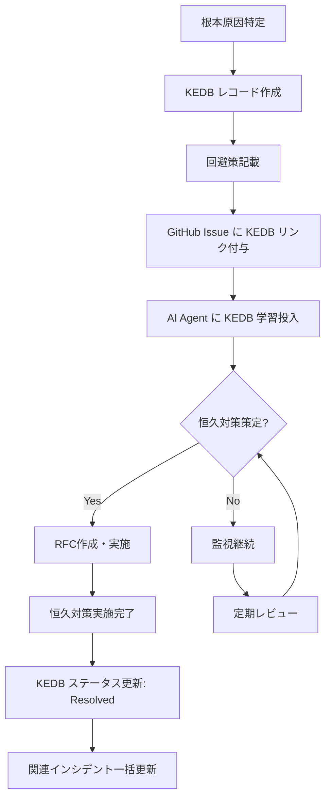
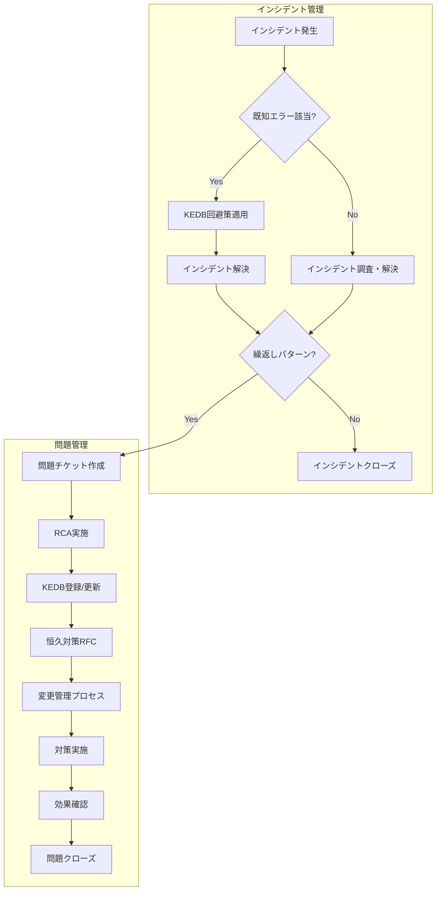

# 問題管理モデル
ServiceMatrix Problem Management Model

Version: 1.0
Status: Active
Owner: Problem Management Authority
Classification: ITIL 4 Aligned

---

## 1. 目的と適用範囲

### 1.1 目的

本ドキュメントは、ServiceMatrix における問題管理プロセスを定義する。
インシデントの根本原因を特定・除去し、再発を防止することで、
IT サービスの安定性と品質を継続的に向上させることを目的とする。

### 1.2 適用範囲

- 重大インシデント（P1/P2）の根本原因分析
- 繰り返し発生するインシデントのパターン分析
- 既知エラーの管理と回避策の維持
- 予防的問題管理（トレンド分析）

### 1.3 ITIL 4 整合

本プロセスは ITIL 4 の「Problem Management」プラクティスに準拠し、
リアクティブ（事後対応型）とプロアクティブ（予防型）の両アプローチを採用する。

---

## 2. 問題管理ライフサイクル

### 2.1 状態遷移図

### 2.2 各状態の定義

| 状態 | 説明 | 責任者 |
|------|------|--------|
| 問題検知 | インシデントパターンまたは重大事象から問題候補を検知 | AI Agent / 運用チーム |
| 問題登録 | 問題として正式に登録し、管理番号を付与 | 問題マネージャー |
| 根本原因分析 | RCA手法を用いた原因調査を実施中 | 問題分析チーム |
| 原因特定 | 根本原因が特定され、文書化された状態 | 問題分析チーム |
| 既知エラー登録 | KEDBに登録し、回避策を公開した状態 | 問題マネージャー |
| 恒久対策立案 | 恒久的な解決策を策定中 | 問題分析チーム |
| 変更要求 | RFC を作成し、変更管理プロセスに投入した状態 | 変更管理チーム |
| 対策実施 | 恒久対策の変更を実施中 | 実施チーム |
| 効果確認 | 対策の効果を監視・確認中 | 問題マネージャー |
| クローズ | 問題が解決され、記録が最終化された状態 | 問題マネージャー |

---

## 3. 問題検知トリガー

### 3.1 リアクティブトリガー（事後対応）

| トリガー | 条件 | 自動/手動 |
|---------|------|----------|
| 重大インシデント発生 | P1/P2 インシデントのクローズ時 | 自動 |
| 繰り返しインシデント | 同一カテゴリのインシデントが30日以内に3回以上 | AI Agent 自動検知 |
| インシデント解決困難 | L3 エスカレーションに至ったインシデント | 手動 |
| SLA 違反 | SLA 違反が発生したインシデント | 自動 |

### 3.2 プロアクティブトリガー（予防型）

| トリガー | 条件 | 自動/手動 |
|---------|------|----------|
| トレンド分析 | インシデント発生率の増加傾向を検知 | AI Agent 自動分析 |
| キャパシティ警告 | リソース使用率が閾値に接近 | 監視システム自動 |
| 脆弱性検知 | セキュリティスキャンで脆弱性検出 | 自動 |
| 変更失敗分析 | 変更失敗パターンの検出 | AI Agent 自動分析 |
| ベンダー通知 | ベンダーからの既知不具合通知 | 手動 |

### 3.3 AI Agent による自動検知フロー

---

## 4. 根本原因分析（RCA）手法

### 4.1 5 Whys（なぜなぜ分析）

繰り返し「なぜ?」を問うことで、表層的な原因から根本原因に到達する手法。

**実施手順:**

1. 問題事象を明確に記述する
2. 「なぜその事象が発生したか?」を問う
3. 回答に対してさらに「なぜ?」を問う
4. 根本原因に到達するまで繰り返す（通常3〜5回）
5. 各段階の因果関係を検証する

**記録テンプレート:**

| レベル | 質問 | 回答 | 根拠 |
|--------|------|------|------|
| Why 1 | なぜ {事象} が発生したか? | {直接原因} | {ログ/証跡} |
| Why 2 | なぜ {直接原因} が発生したか? | {中間原因1} | {ログ/証跡} |
| Why 3 | なぜ {中間原因1} が発生したか? | {中間原因2} | {ログ/証跡} |
| Why 4 | なぜ {中間原因2} が発生したか? | {中間原因3} | {ログ/証跡} |
| Why 5 | なぜ {中間原因3} が発生したか? | **{根本原因}** | {ログ/証跡} |

### 4.2 Fishbone Diagram（特性要因図）

問題の原因を体系的に分類し、視覚化する手法。

**分析カテゴリ:**

| カテゴリ | 検討項目 |
|---------|---------|
| 人的要因（People） | スキル、トレーニング、コミュニケーション、手順遵守 |
| プロセス要因（Process） | 手順書、レビュー、テスト、承認フロー |
| 技術要因（Technology） | 設計、実装、設定、アーキテクチャ |
| 環境要因（Environment） | インフラ、外部サービス、負荷、セキュリティ |

### 4.3 タイムライン分析

インシデント発生前後のイベントを時系列で整理し、因果関係を特定する手法。

1. インシデント発生の24〜72時間前からのイベントを収集
2. 変更履歴、デプロイ履歴、アラート履歴を突合
3. 相関のあるイベントを特定
4. 因果関係を検証

### 4.4 RCA 手法選択ガイド

| 問題の性質 | 推奨手法 | 理由 |
|-----------|---------|------|
| 単一原因が疑われる | 5 Whys | 深掘りに適している |
| 複合的な原因が疑われる | Fishbone | 多角的分析に適している |
| 変更後に発生 | タイムライン分析 | 時系列相関が明確 |
| 複雑・重大な問題 | 全手法の組合せ | 包括的分析が必要 |

---

## 5. 既知エラーデータベース（KEDB）管理

### 5.1 KEDB の目的

- 既知の問題とその回避策を一元管理
- インシデント対応時の迅速な回避策提供
- 恒久対策の進捗管理
- AI Agent のトリアージ精度向上

### 5.2 既知エラーレコード構造

| フィールド | 説明 | 必須 |
|-----------|------|------|
| KEDB-ID | 一意識別子（KEDB-{連番}） | 必須 |
| タイトル | 既知エラーの概要 | 必須 |
| 症状 | ユーザーが経験する症状の記述 | 必須 |
| 根本原因 | 特定された根本原因 | 必須 |
| 回避策 | 暫定的な回避手順 | 必須 |
| 恒久対策 | 恒久的な解決策（策定済みの場合） | 任意 |
| 影響範囲 | 影響を受けるサービス・コンポーネント | 必須 |
| 関連インシデント | 関連するインシデント番号のリスト | 必須 |
| 関連問題 | 関連する問題チケット番号 | 必須 |
| ステータス | Open / Workaround Available / Resolution Planned / Resolved | 必須 |
| 作成日 | KEDB レコード作成日 | 必須 |
| 更新日 | 最終更新日 | 必須 |

### 5.3 KEDB 運用フロー

### 5.4 KEDB レビューサイクル

- **月次**: 未解決の既知エラーのレビュー
- **四半期**: KEDB 全体の棚卸し（陳腐化チェック）
- **インシデント発生時**: 関連 KEDB の自動検索・提示

---

## 6. 問題解決判定基準

### 6.1 解決の定義

問題が「解決済み」と判定されるには、以下のすべてを満たす必要がある：

1. 根本原因が特定・文書化されている
2. 恒久対策が実施されている
3. 対策実施後、関連インシデントの再発がない（最低30日間の観察期間）
4. KEDB が更新されている
5. 関連するインシデントチケットが更新されている
6. ナレッジベースが更新されている

### 6.2 クローズ基準

| 条件 | P1/P2 起因 | P3/P4 起因 |
|------|-----------|-----------|
| RCA 完了 | 必須 | 必須 |
| 恒久対策実施 | 必須 | 推奨 |
| 観察期間 | 30日 | 14日 |
| PIR 実施 | 必須 | 任意 |
| ナレッジ更新 | 必須 | 推奨 |

### 6.3 問題解決困難時の対応

根本原因の特定が困難な場合：

1. 調査内容と現時点の仮説を文書化
2. 追加の監視・ログ収集体制を構築
3. ステータスを「調査継続」とし、月次でレビュー
4. 回避策が有効であれば KEDB に登録して運用

---

## 7. インシデントとの連携フロー

### 7.1 連携フロー図

### 7.2 インシデントから問題への昇格基準

| 条件 | 自動/手動 |
|------|----------|
| P1 インシデントのクローズ時 | 自動（問題チケット自動作成） |
| 同一カテゴリ3回以上（30日以内） | AI Agent 自動検知・提案 |
| L3 エスカレーションに至った場合 | 手動（担当者判断） |
| SLA 違反が発生した場合 | 自動（問題チケット自動作成） |
| 運用チームの判断 | 手動 |

### 7.3 問題からインシデントへのフィードバック

- 回避策が更新された場合、関連するオープンインシデントに自動通知
- 恒久対策が実施された場合、関連インシデントのステータスを自動更新
- KEDB が更新された場合、AI Agent のトリアージ精度が向上

---

## 8. メトリクスと KPI

| KPI | 目標値 | 計測頻度 |
|-----|--------|---------|
| 問題解決率 | 80% 以上（四半期内） | 四半期 |
| 平均 RCA 完了時間 | P1起因: 5営業日以内 | 月次 |
| KEDB カバレッジ | 繰返しインシデントの90%以上 | 四半期 |
| 再発防止成功率 | 90% 以上 | 四半期 |
| プロアクティブ検知率 | 問題全体の30%以上 | 四半期 |

---

## 9. 継続的改善

### 9.1 問題管理レビュー

- **週次**: 進行中の問題チケットのステータスレビュー
- **月次**: KEDB の有効性レビュー、メトリクス確認
- **四半期**: プロセス全体のレビュー、改善計画策定

### 9.2 ナレッジ共有

- RCA 結果は GitHub Wiki またはナレッジベースに公開
- 重大問題の教訓はチーム全体に共有
- AI Agent の分析精度向上のためのフィードバックループを維持

---

## 改訂履歴

| バージョン | 日付 | 変更内容 | 承認者 |
|-----------|------|---------|--------|
| 1.0 | 2026-03-02 | 初版作成 | Problem Management Authority |
