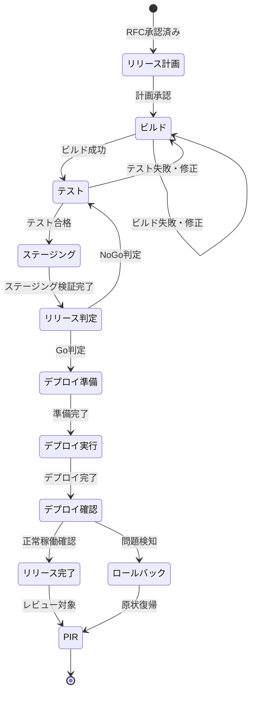
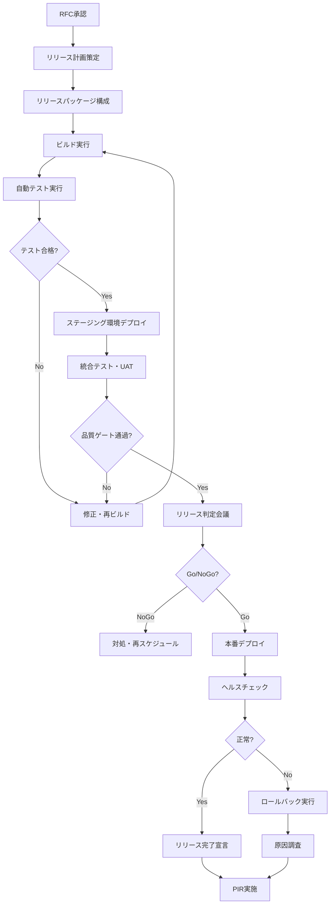
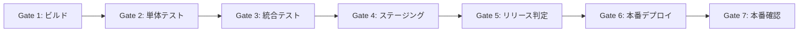
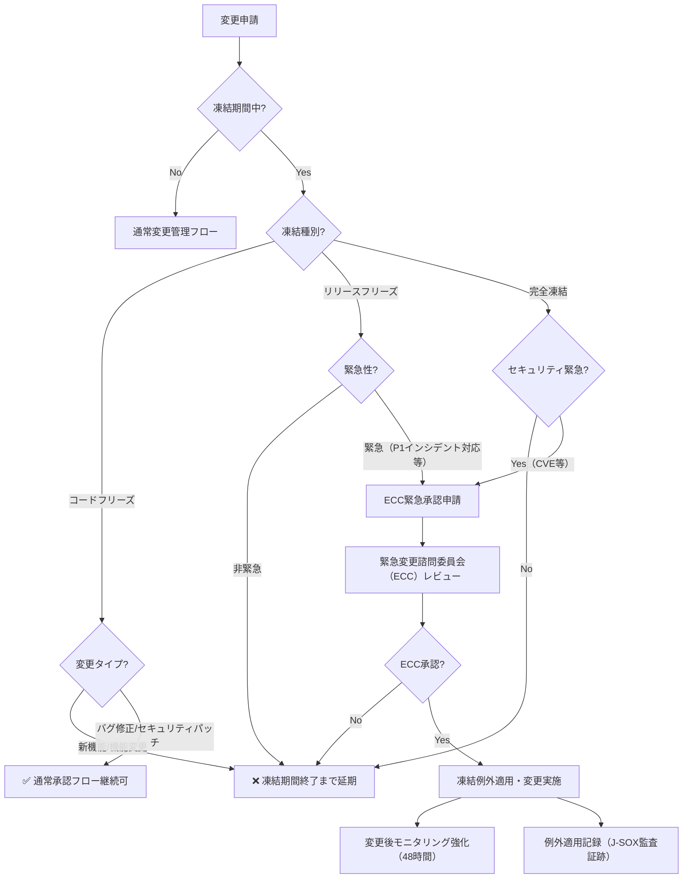
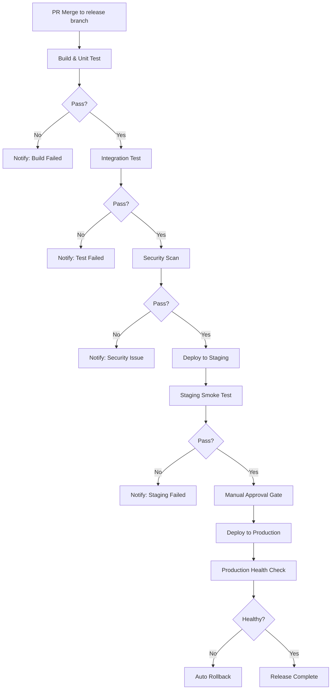

# リリース管理モデル
ServiceMatrix Release Management Model

Version: 1.0
Status: Active
Owner: Release Management Authority
Classification: ITIL 4 Aligned

---

## 1. 目的と適用範囲

### 1.1 目的

本ドキュメントは、ServiceMatrix におけるリリース管理プロセスを定義する。
計画、構築、テスト、デプロイの各フェーズを体系的に管理し、
変更されたサービスコンポーネントを本番環境へ安全かつ確実に展開することを目的とする。

### 1.2 適用範囲

- アプリケーションリリース（新機能、修正、改善）
- インフラストラクチャ変更のデプロイ
- 設定変更の適用
- データベーススキーマ変更
- セキュリティパッチの適用

### 1.3 変更管理との関係

リリース管理は変更管理プロセスの下流に位置し、承認された変更（RFC）を
本番環境に展開する責任を担う。すべてのリリースは承認済みの変更に紐づく。

---

## 2. リリースライフサイクル

### 2.1 状態遷移図



### 2.2 リリースフロー図



---

## 3. リリースタイプ

### 3.1 タイプ定義

| タイプ | バージョン影響 | テスト要件 | 承認レベル | リードタイム |
|--------|-------------|-----------|-----------|-------------|
| Major | MAJOR 番号更新 | フルリグレッション | CAB + 経営層 | 4週間以上 |
| Minor | MINOR 番号更新 | 機能テスト + リグレッション | CAB | 2週間以上 |
| Patch | PATCH 番号更新 | 影響範囲テスト | サービスマネージャー | 1週間以上 |
| Hotfix | PATCH 番号更新 | 最小限のテスト | ECC | 即時〜24時間 |

### 3.2 リリースバンドル

複数の変更を一つのリリースにバンドルする場合のルール：

- バンドル内のすべての変更が個別に承認済みであること
- 変更間の依存関係が整理されていること
- いずれかの変更のロールバックが他の変更に影響しないこと
- バンドル全体のリスク評価が実施されていること

---

## 4. 品質ゲート

### 4.1 ゲート定義



| ゲート | 合格基準 | 判定者 |
|--------|---------|--------|
| Gate 1: ビルド | コンパイル成功、依存関係解決 | CI自動 |
| Gate 2: 単体テスト | 全テスト合格、カバレッジ80%以上 | CI自動 |
| Gate 3: 統合テスト | API統合テスト合格、E2Eテスト合格 | CI自動 |
| Gate 4: ステージング | ステージング環境で正常動作確認 | QAチーム |
| Gate 5: リリース判定 | 全品質基準充足、リスク許容範囲 | リリースマネージャー |
| Gate 6: 本番デプロイ | デプロイスクリプト正常完了 | CI自動 + 運用チーム |
| Gate 7: 本番確認 | ヘルスチェック合格、主要機能動作確認 | 運用チーム |

### 4.2 品質基準

| 指標 | Major | Minor | Patch | Hotfix |
|------|-------|-------|-------|--------|
| コードカバレッジ | 80%以上 | 80%以上 | 変更部分100% | 変更部分100% |
| Critical バグ | 0件 | 0件 | 0件 | 0件 |
| High バグ | 0件 | 0件 | 0件 | N/A |
| Medium バグ | 5件以下 | 3件以下 | 0件 | N/A |
| 性能テスト | 必須 | 推奨 | 変更関連のみ | N/A |
| セキュリティスキャン | 必須 | 必須 | 必須 | 必須 |

---

## 5. デプロイ手順

### 5.1 標準デプロイ手順

1. **事前準備**（デプロイ30分前）
   - デプロイチェックリスト確認
   - ロールバック手順確認
   - 関係者への事前通知
   - バックアップ取得確認

2. **デプロイ実行**
   - GitHub Actions ワークフロー起動
   - デプロイ進行状況のリアルタイム監視
   - 各ステップの成功/失敗確認

3. **デプロイ後確認**（デプロイ後30分以内）
   - ヘルスチェック実行
   - 主要機能のスモークテスト
   - ログ・メトリクス確認
   - 異常なし確認後、完了宣言

4. **安定化監視**（デプロイ後24時間）
   - エラー率の監視
   - パフォーマンスメトリクスの監視
   - ユーザー報告の監視

### 5.2 ロールバック判定基準

以下のいずれかに該当する場合、即時ロールバックを実行する：

- ヘルスチェックが失敗した場合
- エラー率がデプロイ前の2倍を超えた場合
- レスポンスタイムがSLA閾値を超えた場合
- データ不整合が検出された場合
- P1インシデントが発生した場合

---

## 6. リリースカレンダー

### 6.1 定期リリーススケジュール

| リリースタイプ | スケジュール | 変更凍結期間中 |
|-------------|------------|--------------|
| Major | 四半期ごと（3月, 6月, 9月, 12月） | 延期 |
| Minor | 月次（毎月第3火曜） | 延期 |
| Patch | 隔週（隔週火曜） | 延期 |
| Hotfix | 随時 | ECC承認で実施可 |

### 6.2 リリースタイムライン（Minor リリース例）

| 日程 | マイルストーン |
|------|-------------|
| T-14日 | リリース計画確定、コードフリーズ予告 |
| T-10日 | 機能コードフリーズ |
| T-7日 | リリースブランチ作成、統合テスト開始 |
| T-5日 | ステージングデプロイ、UAT開始 |
| T-2日 | リリース判定会議（Go/NoGo） |
| T-1日 | デプロイ準備、最終確認 |
| T日 | 本番デプロイ実行 |
| T+1日 | 安定化確認 |
| T+5日 | PIR実施 |

---

## 6.3 変更凍結期間ポリシー

### 6.3.1 凍結期間の定義

変更凍結期間（Change Freeze / Code Freeze）とは、システムの安定性を確保するために、
通常の変更（Major / Minor / Patch リリース）の本番適用を一時的に禁止する期間である。

**凍結期間の分類**:

| 種別 | 略称 | 内容 |
|------|------|------|
| コードフリーズ | CF | 新機能の追加・機能変更の禁止。バグ修正・セキュリティパッチのみ許可 |
| リリースフリーズ | RF | すべての本番デプロイ禁止（Hotfix / セキュリティ緊急パッチを除く） |
| 完全凍結 | FF | Hotfix を含むすべての変更を原則禁止（ECC による特別承認が必要） |

---

### 6.3.2 定期凍結スケジュール

#### 年次凍結カレンダー

| 凍結期間 | 期間 | 種別 | 理由 |
|---------|------|------|------|
| 年末年始凍結 | 12月25日〜1月5日 | 完全凍結 | 年末年始の運用体制縮小 |
| 四半期決算凍結 | 3月25日〜4月5日 | リリースフリーズ | J-SOX 第1四半期決算対応 |
| 四半期決算凍結 | 6月25日〜7月5日 | リリースフリーズ | J-SOX 第2四半期決算対応 |
| 四半期決算凍結 | 9月25日〜10月5日 | リリースフリーズ | J-SOX 第3四半期決算対応 |
| 上半期決算凍結 | 9月20日〜10月10日 | 完全凍結（上半期決算は優先） | 上半期監査対応 |
| GW凍結 | 4月28日〜5月7日 | リリースフリーズ | 連休期間の運用体制縮小 |
| お盆凍結 | 8月10日〜8月18日 | リリースフリーズ | 夏季休暇による運用体制縮小 |

#### リリース前コードフリーズスケジュール

| リリースタイプ | コードフリーズ開始 | 目的 |
|-------------|----------------|------|
| Major | T-14日 | リグレッションテスト期間確保 |
| Minor | T-10日 | 機能テスト + 統合テスト期間確保 |
| Patch | T-5日 | 影響範囲テスト期間確保 |
| Hotfix | T-0日（即時対応） | コードフリーズ免除（ECC承認必須） |

---

### 6.3.3 凍結期間中の変更許可フロー



---

### 6.3.4 凍結例外申請（ECC）手順

凍結期間中に変更が必要な場合は、以下の手順で緊急変更諮問委員会（Emergency Change Advisory Board: ECC）に申請する。

**申請手順**:

1. GitHub Issue に `[ECC申請]` プレフィックスを付けて起票する
2. 以下の必須情報を Issue 本文に記載する

```markdown
## ECC 緊急変更申請

### 変更概要
- 変更タイトル:
- 変更タイプ: Hotfix / セキュリティパッチ / 緊急設定変更

### 緊急性の根拠
- 影響: （影響を受けるシステム・ユーザー範囲）
- リスク: （変更しない場合のリスク）
- 根拠: （CVE番号 / P1インシデント番号 / ビジネス要件）

### 変更内容
- 変更スコープ:
- 変更ファイル:
- ロールバック手順:

### テスト計画
- テスト方法:
- テスト環境:
- テスト担当者:

### 承認要請
@service-manager @it-director
```

3. ECC メンバー（サービスマネージャー + IT部門長）全員の承認を取得する
4. P1 セキュリティインシデントの場合は CTO への報告も必須

**ECC 承認基準**:

| 変更種別 | 承認要件 | 承認期限 |
|---------|---------|---------|
| セキュリティ緊急パッチ（CVE Critical） | サービスマネージャー承認で可 | 1時間以内 |
| P1インシデント対応 Hotfix | サービスマネージャー + IT部門長 | 2時間以内 |
| P2インシデント対応 Hotfix | サービスマネージャー + IT部門長 | 4時間以内 |
| 業務継続必須変更 | サービスマネージャー + IT部門長 + CTO | 承認まで待機 |
| その他 | 凍結期間終了まで延期 | - |

---

### 6.3.5 凍結期間の開始・終了アクション

**凍結開始時のアクション**:

1. リリースマネージャーが GitHub で凍結通知 Issue を作成する
2. `change-freeze` ラベルをリポジトリに適用する
3. GitHub Actions の本番デプロイワークフローに凍結チェックを有効化する
4. 全開発者・運用担当者にメール通知を送信する
5. 凍結期間・理由・解除予定日を明示する

**凍結終了時のアクション**:

1. リリースマネージャーが凍結終了宣言 Issue に `resolved` ラベルを付与する
2. `change-freeze` ラベルをリポジトリから解除する
3. GitHub Actions の凍結チェックを無効化する
4. 凍結中に積み上がった変更申請の優先順位付けを実施する
5. 全担当者への凍結解除通知を送信する

---

### 6.3.6 凍結中の監視強化

凍結期間中は以下のモニタリングを強化する：

| 監視項目 | 通常時 | 凍結中 |
|---------|--------|--------|
| ヘルスチェック間隔 | 5分 | 1分 |
| アラート閾値 | 標準 | 20% 厳格化 |
| オンコール体制 | 通常ローテーション | 全員待機 |
| ログ保存期間 | Hot: 3ヶ月 | Hot: 6ヶ月（凍結期間+3ヶ月） |
| インシデント対応時間 | 標準 SLA | SLA × 0.8（20% 短縮） |

---

## 7. GitHub Actions パイプライン連携

### 7.1 パイプライン構成



### 7.2 自動化されるステップ

| ステップ | 自動化レベル | ツール |
|---------|------------|--------|
| ビルド | 完全自動 | GitHub Actions |
| 単体テスト | 完全自動 | GitHub Actions |
| 統合テスト | 完全自動 | GitHub Actions |
| セキュリティスキャン | 完全自動 | GitHub Actions |
| ステージングデプロイ | 完全自動 | GitHub Actions |
| ステージングテスト | 完全自動 | GitHub Actions |
| 本番デプロイ | 手動承認後自動 | GitHub Actions (manual approval) |
| ヘルスチェック | 完全自動 | GitHub Actions |
| ロールバック | 条件自動 | GitHub Actions |

---

## 8. メトリクスと KPI

| KPI | 目標値 | 計測頻度 |
|-----|--------|---------|
| リリース成功率 | 95% 以上 | 月次 |
| デプロイ頻度 | 月2回以上 | 月次 |
| リードタイム（コミット〜本番） | 2週間以内 | 月次 |
| MTTR（失敗リリースの復旧時間） | 30分以内 | 月次 |
| ロールバック率 | 5% 以下 | 四半期 |
| 品質ゲート通過率 | 90% 以上（初回） | 月次 |

---

## 改訂履歴

| バージョン | 日付 | 変更内容 | 承認者 |
|-----------|------|---------|--------|
| 1.0 | 2026-03-02 | 初版作成 | Release Management Authority |
