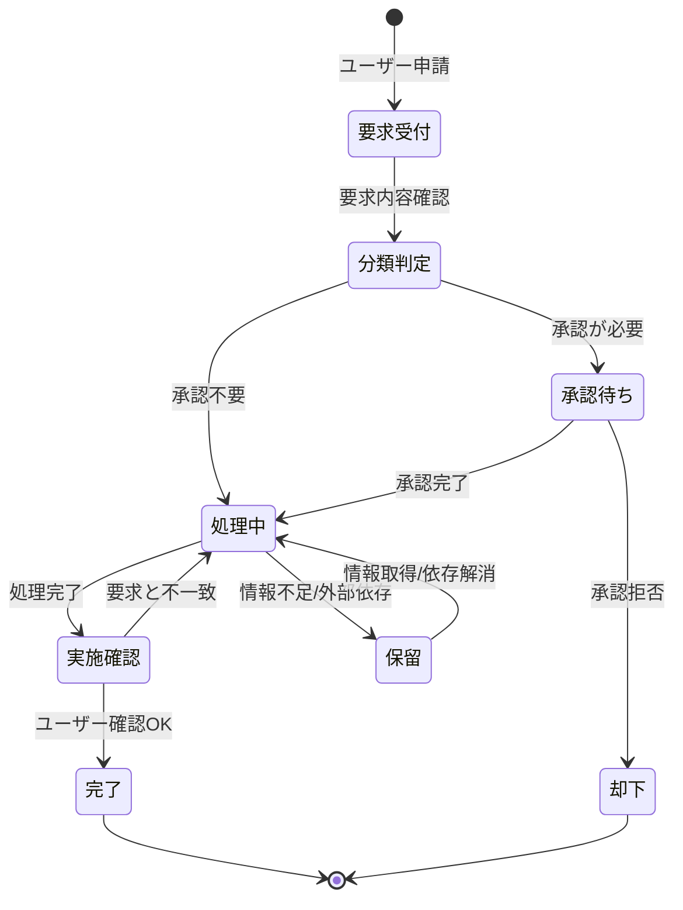
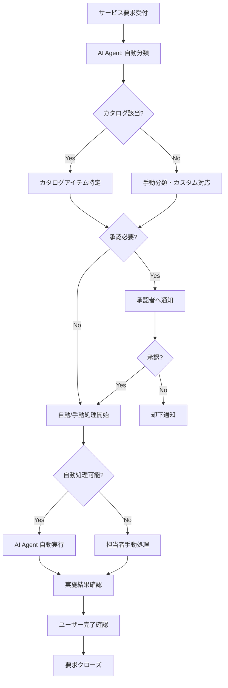
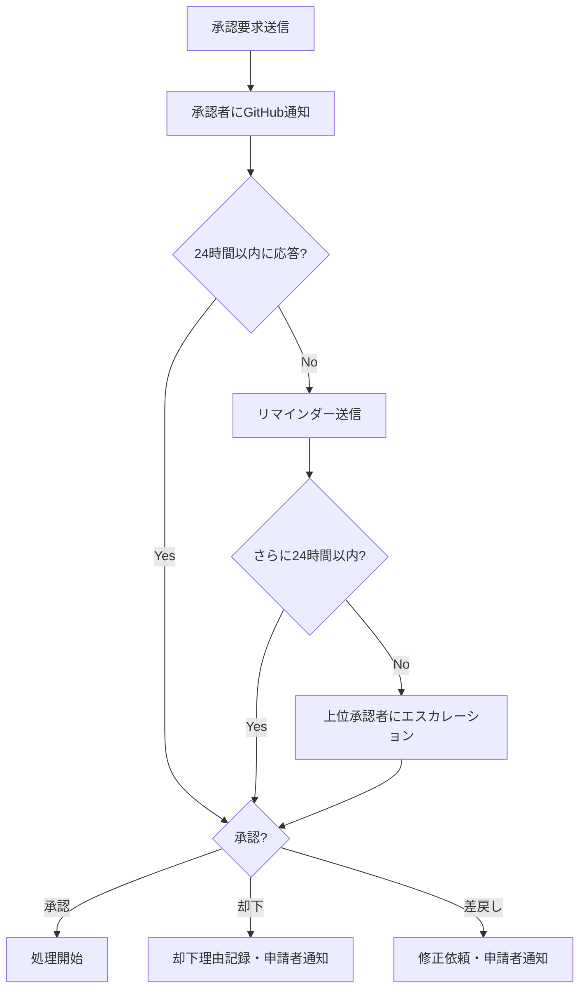

# サービス要求管理モデル
ServiceMatrix Request Management Model

Version: 1.0
Status: Active
Owner: Service Request Authority
Classification: ITIL 4 Aligned

---

## 1. 目的と適用範囲

### 1.1 目的

本ドキュメントは、ServiceMatrix におけるサービス要求管理プロセスを定義する。
ユーザーからの標準的なサービス要求を効率的かつ一貫性をもって処理し、
ユーザー満足度の向上とサービス提供の効率化を実現することを目的とする。

### 1.2 適用範囲

- 情報提供要求（FAQ照会、ドキュメント提供）
- アクセス権限要求（アカウント作成、権限変更）
- サービス提供要求（環境構築、ツール導入）
- 標準変更要求（事前承認済み変更の実行依頼）
- サポート要求（操作方法、トラブルシューティング支援）

### 1.3 インシデントとの区別

| 区分 | サービス要求 | インシデント |
|------|------------|------------|
| 性質 | 計画的・予測可能 | 予期しない中断・品質低下 |
| 対応 | カタログベースの処理 | 調査・診断が必要 |
| 緊急性 | 通常低い | 状況により高い |
| SLA | 要求タイプ別に定義 | 優先度別に定義 |

---

## 2. サービス要求ライフサイクル

### 2.1 状態遷移図



### 2.2 処理フロー図



---

## 3. サービスカタログ

### 3.1 カタログ構成

| カテゴリ | ID | 要求名 | SLA | 承認 | 自動化 |
|---------|-----|--------|-----|------|--------|
| アクセス管理 | REQ-ACC-001 | ユーザーアカウント作成 | 1営業日 | マネージャー | 半自動 |
| アクセス管理 | REQ-ACC-002 | アクセス権限変更 | 1営業日 | マネージャー | 半自動 |
| アクセス管理 | REQ-ACC-003 | アカウント無効化 | 4時間 | マネージャー | 自動 |
| アクセス管理 | REQ-ACC-004 | パスワードリセット | 30分 | 不要 | 自動 |
| 環境管理 | REQ-ENV-001 | 開発環境構築 | 3営業日 | チームリード | 半自動 |
| 環境管理 | REQ-ENV-002 | テスト環境構築 | 2営業日 | チームリード | 半自動 |
| 環境管理 | REQ-ENV-003 | 環境設定変更 | 1営業日 | 不要 | 手動 |
| ツール | REQ-TOOL-001 | ソフトウェアインストール | 1営業日 | マネージャー | 半自動 |
| ツール | REQ-TOOL-002 | ライセンス割当 | 2営業日 | マネージャー | 手動 |
| 情報提供 | REQ-INFO-001 | レポート作成依頼 | 3営業日 | 不要 | 手動 |
| 情報提供 | REQ-INFO-002 | ドキュメント提供 | 1営業日 | 不要 | 自動 |
| サポート | REQ-SUP-001 | 操作方法問合せ | 4時間 | 不要 | AI対応 |
| サポート | REQ-SUP-002 | トラブルシューティング支援 | 8時間 | 不要 | 手動 |

### 3.2 カタログ管理方針

- サービスカタログは四半期ごとにレビュー・更新する
- 新規カタログアイテムの追加は変更管理プロセスを経る
- 利用頻度の低いアイテム（年間5件未満）は統合または廃止を検討
- 自動化率の向上を継続的に推進する

---

## 4. 承認フロー

### 4.1 承認レベル定義

| 承認レベル | 承認者 | 適用条件 |
|-----------|--------|---------|
| 不要 | - | 低リスク・低コストの標準要求 |
| L1: チームリード | 直属のチームリード | チームリソースを使用する要求 |
| L2: マネージャー | 部門マネージャー | コスト発生・権限変更を伴う要求 |
| L3: IT部門長 | IT部門長 | 高コスト・セキュリティ関連の要求 |

### 4.2 承認ワークフロー



### 4.3 承認の自動化

- AI Agent は承認履歴を学習し、パターンマッチングで承認推奨を提示
- 過去に同一条件で3回以上承認されたパターンは、自動承認候補として提案
- 自動承認の最終判断は管理者が行う

---

## 5. SLA 定義

### 5.1 要求タイプ別 SLA

| 分類 | 受付確認 | 処理完了 | 更新通知間隔 |
|------|---------|---------|-------------|
| 緊急（パスワードリセット等） | 15分 | 30分 | - |
| 標準（アカウント作成等） | 2時間 | 1営業日 | 日次 |
| 計画（環境構築等） | 4時間 | 3営業日 | 日次 |
| 情報提供 | 4時間 | 3営業日 | 進捗時 |

### 5.2 SLA 計測ルール

- 計測開始: GitHub Issue 作成時刻
- 計測終了: 完了ステータスへの遷移時刻
- 一時停止: ユーザー情報待ち期間は SLA 時間から除外
- 営業時間: 平日 09:00〜18:00（緊急要求は24時間365日）

---

## 6. GitHub Issues との連携

### 6.1 Issue テンプレート

```
タイトル: [REQ-{カテゴリ}-{連番}] {要求概要}

ラベル:
  - service-request
  - category:{カテゴリ}
  - priority:{urgent|standard|planned}
  - status:{submitted|approved|in-progress|completed|rejected}
  - approval:{required|not-required|approved|rejected}

本文:
  ## サービス要求
  - カタログID: {REQ-XXX-NNN}
  - 要求タイプ: {カテゴリ名}

  ## 要求詳細
  {要求の詳細内容}

  ## 申請者情報
  - 申請者: {GitHub ユーザー名}
  - 部門: {部門名}
  - 申請日: {ISO 8601}

  ## SLA
  - 受付確認期限: {日時}
  - 処理完了期限: {日時}
```

### 6.2 自動化連携

- Issue 作成時に AI Agent がカタログマッチングを実行
- 承認が必要な場合、承認者に自動メンション
- 自動処理可能な要求は GitHub Actions ワークフローを起動
- 処理完了時にユーザーへ自動通知

---

## 7. 自動処理（フルフィルメント自動化）

### 7.1 自動処理対象

| 要求 | 自動処理内容 | 前提条件 |
|------|------------|---------|
| パスワードリセット | セルフサービスポータル経由で自動リセット | 本人確認済み |
| アカウント無効化 | 退職処理連携で自動無効化 | マネージャー承認済み |
| ドキュメント提供 | ナレッジベースから自動検索・提供 | 公開ドキュメント |
| 操作方法問合せ | AI Agent による自動回答 | FAQデータベース対応範囲 |

### 7.2 AI Agent の役割

1. **要求分類**: 自然言語解析による要求カテゴリの自動判定
2. **カタログマッチング**: 適切なカタログアイテムの推奨
3. **FAQ応答**: 既知の質問に対する即座の回答提供
4. **進捗追跡**: SLA 監視と遅延アラートの発報
5. **満足度調査**: 完了後の自動満足度アンケート送信

---

## 8. メトリクスと KPI

| KPI | 目標値 | 計測頻度 |
|-----|--------|---------|
| SLA 遵守率 | 95% 以上 | 月次 |
| 平均処理時間 | カタログ SLA の 80% 以内 | 月次 |
| 自動処理率 | 40% 以上 | 四半期 |
| 初回完了率 | 90% 以上 | 月次 |
| ユーザー満足度 | 4.2/5.0 以上 | 四半期 |
| 要求キャンセル率 | 5% 以下 | 月次 |

---

## 9. 継続的改善

### 9.1 カタログ最適化

- 利用頻度分析に基づくカタログの拡充・整理
- 自動化率向上のための投資判断
- ユーザーフィードバックに基づくプロセス改善

### 9.2 レビューサイクル

| レビュー | 頻度 | 内容 |
|---------|------|------|
| 運用レビュー | 月次 | SLA実績、処理量、課題 |
| カタログレビュー | 四半期 | カタログ項目の妥当性、追加/削除 |
| プロセスレビュー | 半期 | プロセス全体の有効性、改善計画 |

---

## 改訂履歴

| バージョン | 日付 | 変更内容 | 承認者 |
|-----------|------|---------|--------|
| 1.0 | 2026-03-02 | 初版作成 | Service Request Authority |
