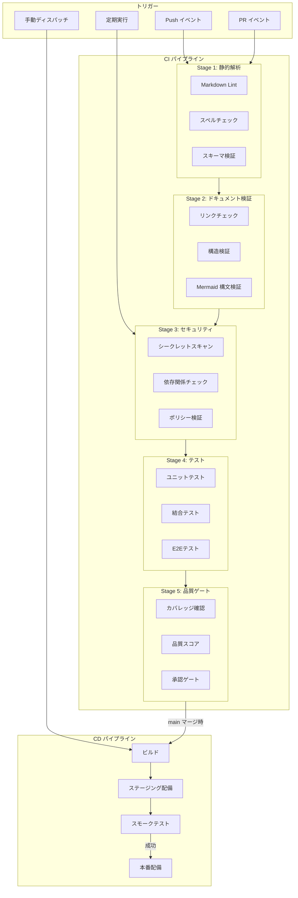
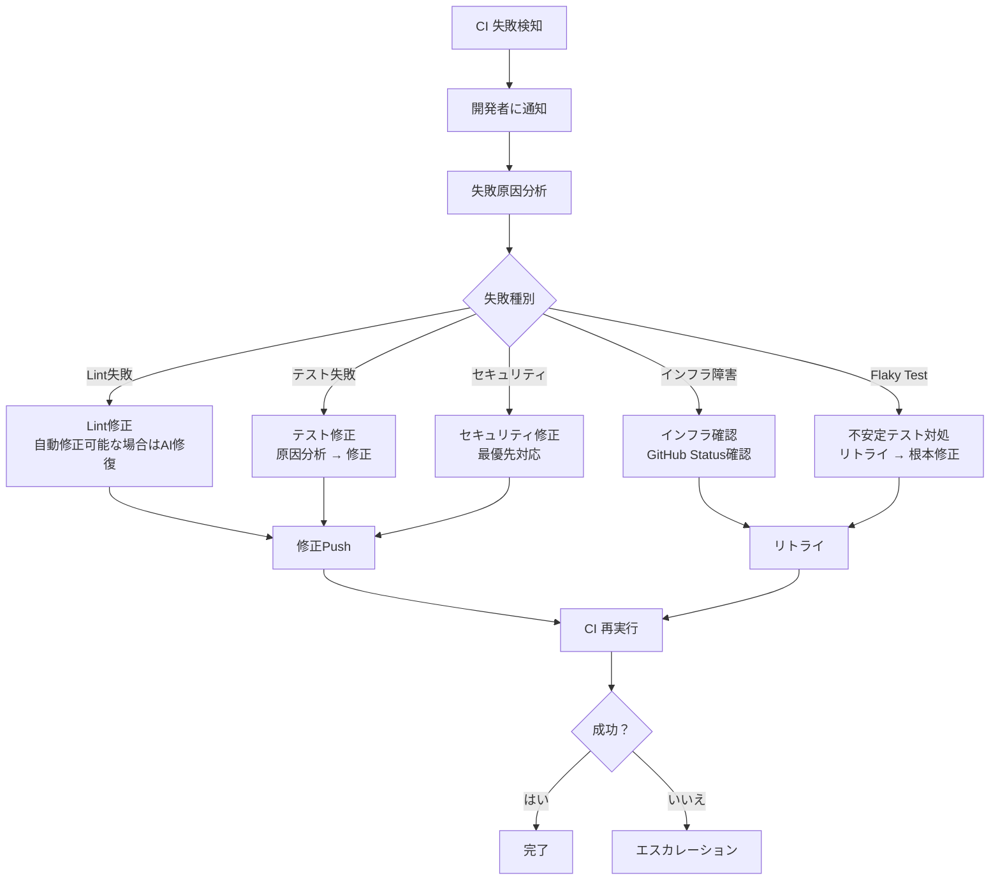

# CI/CD パイプラインアーキテクチャ

ServiceMatrix CI/CD Pipeline Architecture

Version: 1.0
Status: Active
Classification: Internal DevOps Document

---

## 1. はじめに

本ドキュメントは ServiceMatrix における CI/CD パイプラインの設計と運用ポリシーを定義する。
CI は ServiceMatrix 統治において最上位に位置し、すべての変更は CI を通過しなければならない。

---

## 2. CI/CD の原則

1. **CI は準憲法より上位である**: CI 違反設計は提案しない
2. **ローカルは CI と同一コマンドを使用する**: 環境差による偽陽性/偽陰性を防ぐ
3. **すべての PR は CI をパスしなければマージできない**
4. **CI の失敗は即座に通知される**
5. **CI の修復は最優先で対応する**

---

## 3. パイプライン全体図



---

## 4. 各ジョブの詳細

### 4.1 Stage 1: 静的解析

#### 4.1.1 Markdown Lint

```yaml
name: Markdown Lint
runs-on: ubuntu-latest
steps:
  - uses: actions/checkout@v4
  - name: markdownlint-cli2
    uses: DavidAnson/markdownlint-cli2-action@v19
    with:
      globs: "**/*.md"
      config: ".markdownlint.jsonc"
```

| 項目 | 設定値 |
|---|---|
| ツール | markdownlint-cli2 |
| 対象 | `**/*.md` |
| 設定ファイル | `.markdownlint.jsonc` |
| 主要ルール | 見出し階層、行長、リスト形式、空行 |
| 失敗時 | PR マージブロック |

#### 4.1.2 スペルチェック

| 項目 | 設定値 |
|---|---|
| ツール | cspell |
| 対象 | `**/*.md`, `**/*.ts`, `**/*.js` |
| 辞書 | カスタム辞書（技術用語・プロジェクト固有語） |
| 設定ファイル | `.cspell.json` |

#### 4.1.3 スキーマ検証

| 項目 | 設定値 |
|---|---|
| 対象 | YAML設定ファイル、Issueテンプレート |
| ツール | ajv-cli / yamllint |
| 検証内容 | 構文正確性、スキーマ準拠 |

### 4.2 Stage 2: ドキュメント検証

#### 4.2.1 リンクチェック

| 項目 | 設定値 |
|---|---|
| ツール | markdown-link-check |
| 対象 | `docs/**/*.md` |
| 検証内容 | 内部リンク、外部リンク（オプション） |
| 除外 | 外部URL（CI環境での不安定性回避） |

#### 4.2.2 構造検証

| 項目 | 設定値 |
|---|---|
| 検証内容 | 必須セクション存在確認、見出し構造、メタデータ |
| 対象 | `docs/**/*.md` |
| ルール | 各ドキュメントカテゴリ別の構造ルール |

#### 4.2.3 Mermaid 構文検証

| 項目 | 設定値 |
|---|---|
| ツール | mermaid-cli (mmdc) |
| 対象 | Markdown 内の Mermaid コードブロック |
| 検証内容 | 構文エラー検出 |

### 4.3 Stage 3: セキュリティ

#### 4.3.1 シークレットスキャン

| 項目 | 設定値 |
|---|---|
| ツール | gitleaks / trufflehog |
| 対象 | リポジトリ全体 |
| 検出対象 | API キー、パスワード、トークン、秘密鍵 |
| 失敗時 | PR マージブロック（即座にアラート） |

#### 4.3.2 依存関係チェック

| 項目 | 設定値 |
|---|---|
| ツール | Dependabot / npm audit |
| 対象 | package.json, package-lock.json |
| 検出対象 | 既知の脆弱性を持つ依存パッケージ |
| 重大度閾値 | High 以上でブロック |

#### 4.3.3 ポリシー検証

| 項目 | 設定値 |
|---|---|
| 検証内容 | CLAUDE.md 準拠、統治ポリシー準拠 |
| 対象 | 設定ファイル、ワークフローファイル |
| ルール | main直push禁止、force push禁止 等 |

### 4.4 Stage 4: テスト

#### 4.4.1 ユニットテスト

| 項目 | 設定値 |
|---|---|
| フレームワーク | Jest |
| 対象 | `src/**/*.test.ts`, `src/**/*.spec.ts` |
| カバレッジ閾値 | 80% 以上 |
| 実行環境 | Node.js LTS |

#### 4.4.2 結合テスト

| 項目 | 設定値 |
|---|---|
| フレームワーク | Jest + Supertest |
| 対象 | `tests/integration/**` |
| 実行条件 | ユニットテスト成功後 |
| テスト DB | SQLite（インメモリ） |

#### 4.4.3 E2E テスト

| 項目 | 設定値 |
|---|---|
| フレームワーク | Playwright |
| 対象 | `tests/e2e/**` |
| 実行条件 | 結合テスト成功後 |
| ブラウザ | Chromium, Firefox |
| 実行頻度 | main マージ時 / 定期実行 |

### 4.5 Stage 5: 品質ゲート

| チェック項目 | 閾値 | 失敗時 |
|---|---|---|
| テストカバレッジ | 80% 以上 | マージブロック |
| 新規カバレッジ | 90% 以上 | 警告 |
| 重複コード | 5% 以下 | 警告 |
| コード複雑度 | サイクロマティック複雑度 15 以下 | 警告 |
| 技術的負債 | 増加なし | 警告 |

---

## 5. パイプライン実行マトリクス

| トリガー | Stage 1 | Stage 2 | Stage 3 | Stage 4 | Stage 5 |
|---|---|---|---|---|---|
| PR 作成/更新 | 実行 | 実行 | 実行 | 実行 | 実行 |
| main への Push | 実行 | 実行 | 実行 | 実行 | 実行 |
| 定期実行（日次） | - | - | 実行 | - | - |
| 手動ディスパッチ | 選択 | 選択 | 選択 | 選択 | 選択 |

---

## 6. 環境変数・シークレット管理方針

### 6.1 環境変数

| 変数名 | 用途 | 設定場所 |
|---|---|---|
| `NODE_ENV` | 実行環境識別 | ワークフロー内定義 |
| `CI` | CI環境フラグ | GitHub Actions 自動設定 |
| `GITHUB_TOKEN` | GitHub API 認証 | GitHub Actions 自動設定 |

### 6.2 シークレット管理

| シークレット | 用途 | 管理方法 |
|---|---|---|
| `GITHUB_TOKEN` | GitHub API アクセス | GitHub Actions 自動提供 |
| `SLACK_WEBHOOK_URL` | Slack 通知 | Repository Secrets |
| `CODECOV_TOKEN` | カバレッジレポート | Repository Secrets |
| `SONAR_TOKEN` | コード品質分析 | Repository Secrets |

### 6.3 シークレット管理ルール

1. **ハードコード禁止**: シークレットはコードに含めない
2. **最小権限原則**: 必要最小限の権限を持つトークンを使用
3. **定期ローテーション**: 90日ごとにトークンをローテーション
4. **監査ログ**: シークレットのアクセスは監査ログに記録
5. **環境分離**: 本番とステージングで異なるシークレットを使用

---

## 7. CI 失敗時の対応手順

### 7.1 障害対応フロー



### 7.2 失敗種別ごとの対応

| 失敗種別 | 優先度 | 対応者 | 目標復旧時間 |
|---|---|---|---|
| セキュリティスキャン失敗 | Critical | セキュリティ担当 | 1時間 |
| テスト失敗（回帰） | High | PR 作成者 | 4時間 |
| Lint 失敗 | Medium | PR 作成者 | 2時間 |
| ドキュメント検証失敗 | Medium | PR 作成者 | 2時間 |
| Flaky Test | Low | テスト担当 | 24時間（根本対策） |
| インフラ障害 | - | DevOps 担当 | 外部依存 |

### 7.3 CI 自己修復連携

CI 失敗時、AI Agent による自動修復が可能な場合は CI Self-Healing Loop が起動する。
詳細は [CI_SELF_HEALING_LOOP.md](./CI_SELF_HEALING_LOOP.md) を参照。

---

## 8. パイプライン最適化

### 8.1 実行時間の目標

| Stage | 目標時間 | 最大許容時間 |
|---|---|---|
| Stage 1: 静的解析 | 1分 | 3分 |
| Stage 2: ドキュメント検証 | 2分 | 5分 |
| Stage 3: セキュリティ | 3分 | 10分 |
| Stage 4: テスト | 5分 | 15分 |
| Stage 5: 品質ゲート | 1分 | 3分 |
| **全体** | **12分** | **30分** |

### 8.2 最適化戦略

| 戦略 | 効果 | 実装方法 |
|---|---|---|
| 並列実行 | 実行時間短縮 | 独立ジョブの並列化 |
| キャッシュ | 依存解決時間短縮 | actions/cache による node_modules キャッシュ |
| 差分実行 | 不要ジョブのスキップ | paths フィルタによる対象限定 |
| 早期失敗 | 無駄な実行の防止 | `fail-fast: true` |

### 8.3 差分実行の設定

```yaml
on:
  pull_request:
    paths:
      - "docs/**"       # ドキュメント変更時のみドキュメント検証
      - "src/**"         # ソース変更時のみテスト実行
      - ".github/**"     # ワークフロー変更時は全実行
```

---

## 9. CI 運用メトリクス

| メトリクス | 説明 | 目標値 |
|---|---|---|
| CI 成功率 | 全実行中の成功割合 | > 95% |
| 平均実行時間 | パイプライン全体の平均実行時間 | < 15分 |
| MTTR (CI) | CI 失敗から復旧までの平均時間 | < 4時間 |
| Flaky Test Rate | 不安定テストの割合 | < 2% |
| Queue Wait Time | CI 実行キュー待ち時間 | < 5分 |

---

## 10. ワークフローファイル構成

```
.github/
├── workflows/
│   ├── ci-main.yml           # main ブランチ CI
│   ├── ci-pr.yml             # PR CI
│   ├── ci-security.yml       # セキュリティスキャン（定期）
│   ├── cd-staging.yml        # ステージング CD
│   ├── cd-production.yml     # 本番 CD
│   ├── docs-validation.yml   # ドキュメント検証
│   └── self-healing.yml      # CI 自己修復
├── actions/
│   ├── setup-node/           # Node.js セットアップ
│   ├── lint-check/           # Lint チェック
│   └── notify/               # 通知アクション
└── CODEOWNERS
```

---

## 11. 関連ドキュメント

| ドキュメント | 参照先 |
|---|---|
| CI自己修復ループ | [CI_SELF_HEALING_LOOP.md](./CI_SELF_HEALING_LOOP.md) |
| ブランチ戦略 | [BRANCH_STRATEGY.md](./BRANCH_STRATEGY.md) |
| Pull Request ポリシー | [PULL_REQUEST_POLICY.md](./PULL_REQUEST_POLICY.md) |
| リポジトリ構成ガイドライン | [REPOSITORY_STRUCTURE_GUIDELINES.md](./REPOSITORY_STRUCTURE_GUIDELINES.md) |

---

*本ドキュメントは ServiceMatrix プロジェクトの統治原則に基づき管理される。*
*変更は Change Issue → PR → CI検証 → 承認 のフローに従うこと。*
