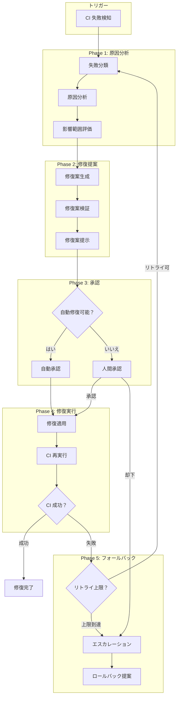
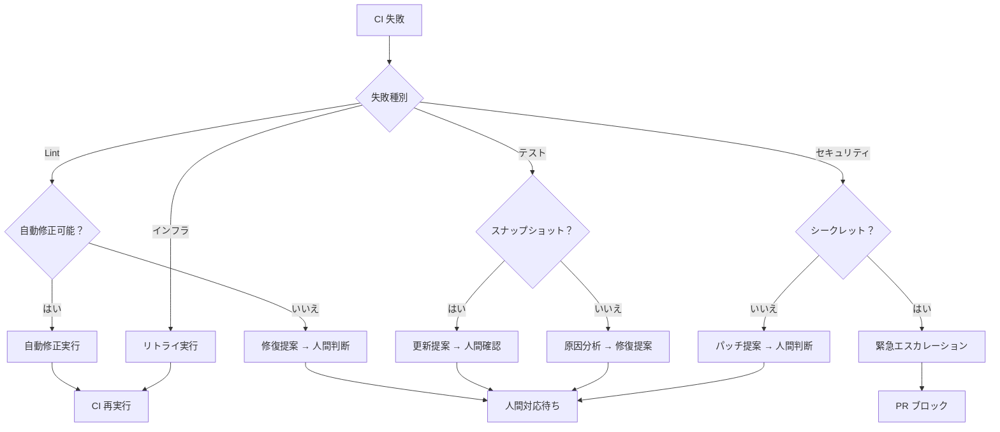
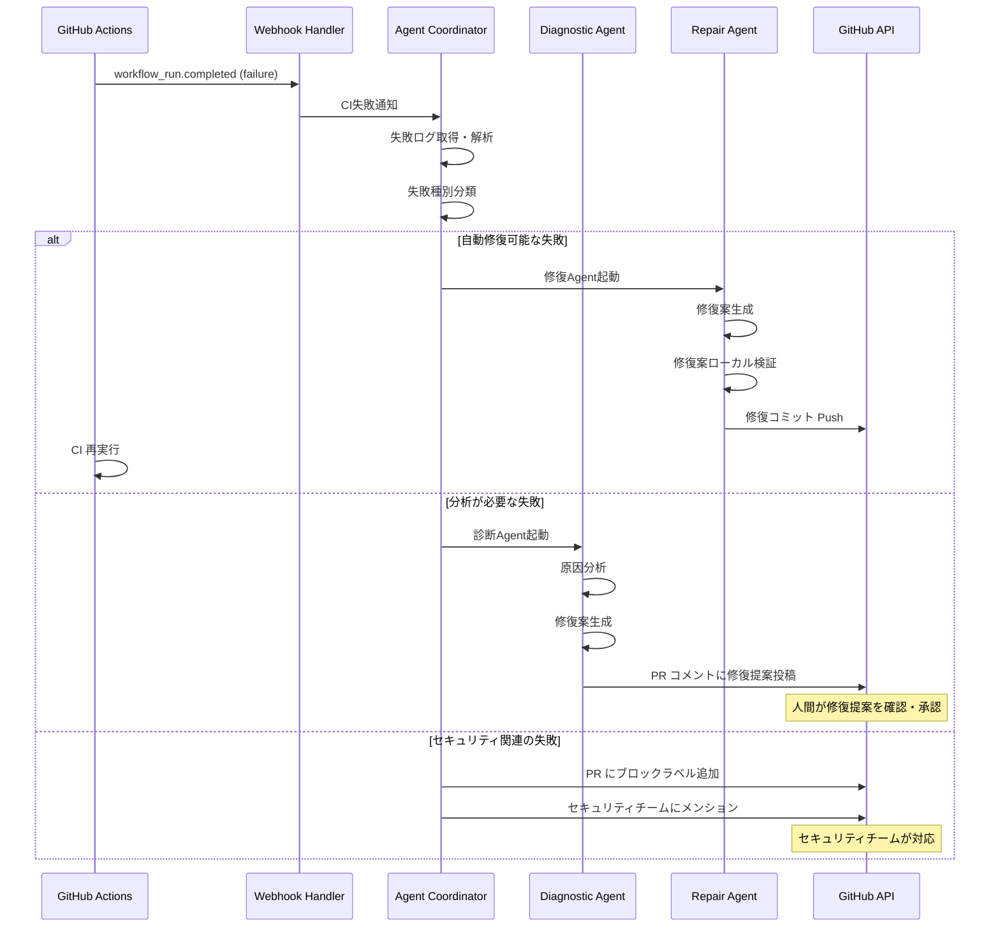
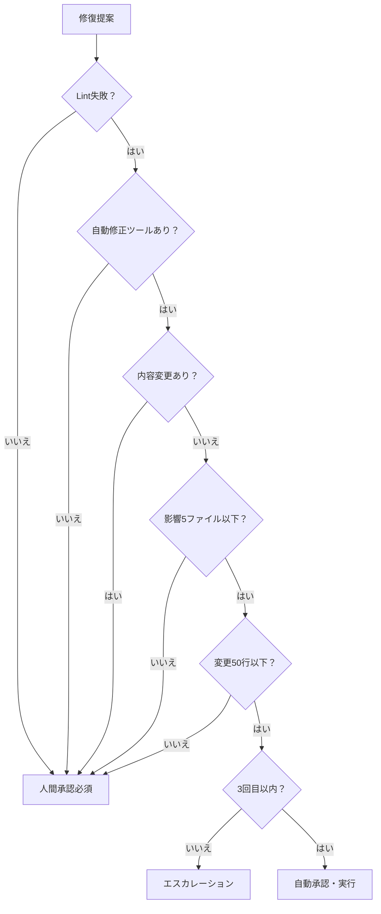
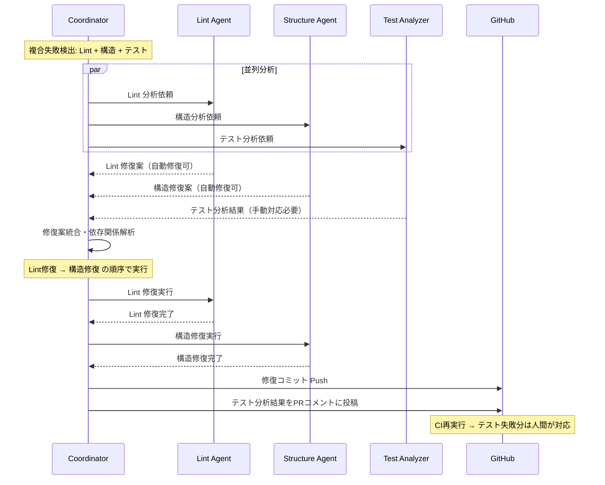
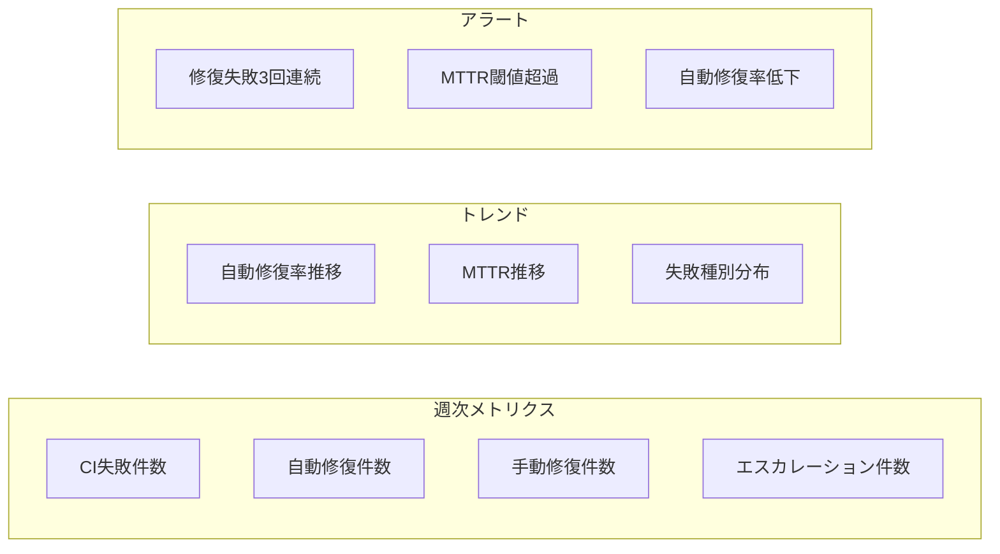
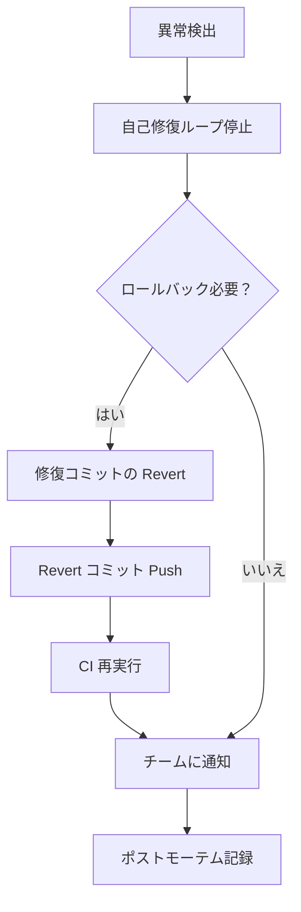

# CI 自己修復ループ

ServiceMatrix CI Self-Healing Loop

Version: 1.0
Status: Active
Classification: Internal DevOps Document

---

## 1. はじめに

本ドキュメントは ServiceMatrix における CI 自己修復ループ（CI Self-Healing Loop）の設計と運用を定義する。
CI 失敗時に AI Agent が自動的に原因分析と修復提案を行い、承認プロセスを経て修復を実行する仕組みである。

---

## 2. 自己修復の原則

1. **AI Agent は修復を提案するが、最終判断は人間が行う**
2. **修復は元の変更意図を損なわない範囲で行う**
3. **自動修復は低リスク変更に限定する**
4. **すべての修復は監査ログに記録する**
5. **修復の連続失敗時は人間にエスカレーションする**

---

## 3. 自己修復ループ全体図



---

## 4. 失敗分類と修復可能性

### 4.1 失敗分類マトリクス

| 失敗カテゴリ | 失敗種別 | 自動修復 | 修復方法 |
|---|---|---|---|
| Lint | Markdown 書式違反 | 可能 | markdownlint --fix |
| Lint | スペルミス | 可能 | 辞書追加 / 修正提案 |
| Lint | YAML 構文エラー | 条件付き | 構文自動修正 |
| テスト | ユニットテスト失敗 | 分析のみ | 原因分析 → 修復提案 |
| テスト | スナップショット不一致 | 条件付き | スナップショット更新提案 |
| テスト | E2E テスト失敗 | 分析のみ | 原因分析 → 修復提案 |
| セキュリティ | シークレット検出 | 不可 | 即座にエスカレーション |
| セキュリティ | 脆弱性検出 | 条件付き | パッチ提案 |
| 構造 | リンク切れ | 可能 | リンク修正提案 |
| 構造 | 見出し構造違反 | 可能 | 構造修正 |
| インフラ | GitHub Actions 障害 | 不可 | リトライのみ |
| インフラ | ネットワークタイムアウト | 不可 | リトライのみ |

### 4.2 自動修復の条件



---

## 5. Agent 起動シーケンス

### 5.1 自己修復 Agent の起動フロー



### 5.2 Agent 構成

| Agent | 役割 | 起動条件 |
|---|---|---|
| Coordinator Agent | 失敗分類・Agent 起動判断 | CI 失敗検知時 |
| Diagnostic Agent | 原因分析・影響評価 | 分析が必要な失敗 |
| Repair Agent | 修復案生成・実行 | 自動修復可能な失敗 |
| Lint Repair Agent | Lint 修正専門 | Lint 失敗時 |
| Security Alert Agent | セキュリティ通知 | セキュリティ失敗時 |

---

## 6. 修復提案フォーマット

### 6.1 PR コメント形式

修復提案は以下のフォーマットで PR コメントとして投稿される。

```markdown
## CI Self-Healing: 修復提案

### 失敗サマリ
- **失敗ジョブ**: markdown-lint
- **失敗ステップ**: Run markdownlint-cli2
- **失敗種別**: Lint 違反
- **影響ファイル**: docs/02_architecture/SYSTEM_ARCHITECTURE_OVERVIEW.md

### 原因分析
- MD012: 連続空行が検出された（行 45-46）
- MD032: リスト前後に空行がない（行 78）

### 修復案
| # | 修復内容 | リスク | 自動修復 |
|---|---------|--------|---------|
| 1 | 連続空行を単一空行に修正 | 低 | 可能 |
| 2 | リスト前後に空行を追加 | 低 | 可能 |

### 推奨アクション
- [x] 自動修復可能 — `/approve-fix` コマンドで修復を承認してください
- [ ] 手動対応が必要

### リスク評価
- **変更影響**: 書式のみ（内容変更なし）
- **リスクレベル**: 低
- **ロールバック**: 容易
```

### 6.2 承認コマンド

| コマンド | 動作 | 実行者 |
|---|---|---|
| `/approve-fix` | 修復案をすべて承認・実行 | PR 作成者 / レビュアー |
| `/approve-fix 1` | 指定番号の修復案のみ承認 | PR 作成者 / レビュアー |
| `/reject-fix` | 修復案を却下 | PR 作成者 / レビュアー |
| `/manual-fix` | 手動対応を宣言（Agent 待機解除） | PR 作成者 |

---

## 7. 承認モデル

### 7.1 自動承認の条件

以下のすべてを満たす場合、人間の承認なしに自動修復が実行される。

| 条件 | 説明 |
|---|---|
| 失敗種別が Lint | Lint 違反のみが対象 |
| 自動修正ツールが存在する | markdownlint --fix 等 |
| 内容変更がない | 書式変更のみ |
| 影響ファイル数が5以下 | 大規模変更は除外 |
| 変更行数が50行以下 | 大規模変更は除外 |
| 同一 PR で3回目以内 | 無限ループ防止 |

### 7.2 承認フローの判定



---

## 8. リトライ制御

### 8.1 リトライポリシー

| パラメータ | 値 | 説明 |
|---|---|---|
| 最大リトライ回数 | 3回 | 同一失敗に対する上限 |
| リトライ間隔（初回） | 30秒 | 指数バックオフの起点 |
| リトライ間隔（最大） | 5分 | バックオフ上限 |
| バックオフ係数 | 2.0 | 指数バックオフの係数 |
| 同一 PR 修復上限 | 5回 | PR 全体での修復試行上限 |

### 8.2 リトライ間隔の計算

```
delay = min(initial_delay * (backoff_factor ^ retry_count), max_delay)
```

| リトライ | 待機時間 |
|---|---|
| 1回目 | 30秒 |
| 2回目 | 60秒 |
| 3回目 | 120秒（2分） |
| 上限到達 | エスカレーション |

### 8.3 リトライ除外条件

以下の場合はリトライを行わない。

- セキュリティスキャン失敗（即座にエスカレーション）
- 同一エラーが3回連続発生
- テスト失敗（分析のみ実行）
- インフラ障害（GitHub Status 確認後にリトライ判断）

---

## 9. Agent Teams 複合修復

### 9.1 複合修復の起動条件

単一 Agent では解決できない複合的な失敗の場合、Agent Teams による複合修復が起動する。

| 条件 | Agent Teams 構成 |
|---|---|
| Lint + テスト失敗 | Lint Agent + Test Analyzer |
| セキュリティ + 依存関係 | Security Agent + Dependency Agent |
| 複数ステージ失敗 | Stage 別 Agent の並列起動 |
| 構造 + Lint 失敗 | Structure Agent + Lint Agent |

### 9.2 複合修復シーケンス



### 9.3 修復順序の優先度

| 優先度 | 修復種別 | 理由 |
|---|---|---|
| 1 | Lint 修復 | 他の修復に影響しない |
| 2 | 構造修復 | テストに影響する可能性 |
| 3 | 依存関係修復 | ビルドに影響 |
| 4 | テスト修復 | 分析結果に基づく提案 |
| 5 | セキュリティ修復 | 人間判断が必須 |

---

## 10. 監査ログ

### 10.1 記録対象イベント

| イベント | 記録内容 |
|---|---|
| CI 失敗検知 | 失敗ジョブ、ステップ、エラーメッセージ、タイムスタンプ |
| Agent 起動 | Agent 種別、起動理由、入力パラメータ |
| 原因分析完了 | 分析結果、分類結果、影響範囲 |
| 修復案生成 | 修復内容、リスク評価、自動修復可否判定 |
| 承認判定 | 自動承認 / 人間承認、判定理由 |
| 修復実行 | 実行内容、変更ファイル、変更行数 |
| CI 再実行結果 | 成功 / 失敗、実行時間 |
| エスカレーション | エスカレーション理由、通知先 |

### 10.2 監査ログフォーマット

```json
{
  "event_type": "self_healing",
  "timestamp": "2025-01-15T10:30:00Z",
  "session_id": "sh-20250115-001",
  "pr_number": 42,
  "phase": "repair_execution",
  "details": {
    "failure_type": "lint",
    "failure_job": "markdown-lint",
    "agent": "lint-repair-agent",
    "action": "auto_fix",
    "files_modified": [
      "docs/02_architecture/SYSTEM_ARCHITECTURE_OVERVIEW.md"
    ],
    "changes_summary": "MD012: 連続空行を修正（2箇所）",
    "risk_level": "low",
    "approval_type": "auto",
    "retry_count": 0,
    "result": "success"
  }
}
```

---

## 11. メトリクス

### 11.1 自己修復メトリクス

| メトリクス | 説明 | 目標値 |
|---|---|---|
| 自動修復成功率 | 自動修復が成功した割合 | > 90% |
| 平均修復時間（MTTR） | 失敗検知から修復完了までの平均時間 | < 5分（自動）/ < 2時間（手動） |
| 誤修復率 | 修復が新たな問題を引き起こした割合 | < 1% |
| エスカレーション率 | 人間にエスカレーションされた割合 | < 20% |
| リトライ成功率 | リトライで解決した割合 | > 80% |
| 修復提案採用率 | 人間が修復提案を承認した割合 | > 85% |

### 11.2 ダッシュボード指標



---

## 12. 安全機構

### 12.1 緊急停止条件

以下の条件に該当する場合、自己修復ループを即座に停止する。

| 条件 | アクション |
|---|---|
| シークレット漏洩検出 | 即座に PR ブロック、セキュリティチーム通知 |
| 修復がビルドを破壊 | ループ停止、ロールバック提案 |
| 同一 PR で5回修復失敗 | ループ停止、エスカレーション |
| 修復による変更が100行超 | ループ停止、人間確認必須 |
| Agent 異常動作検出 | ループ停止、Agent 停止 |

### 12.2 ロールバック手順



### 12.3 ロールバックコマンド

| コマンド | 動作 | 実行者 |
|---|---|---|
| `/rollback-fix` | 直前の自動修復をリバート | PR 作成者 / 管理者 |
| `/rollback-fix all` | すべての自動修復をリバート | 管理者のみ |
| `/stop-healing` | 自己修復ループを停止 | PR 作成者 / 管理者 |
| `/resume-healing` | 自己修復ループを再開 | 管理者のみ |

---

## 13. GitHub Actions ワークフロー定義

### 13.1 自己修復ワークフロー構成

```yaml
name: CI Self-Healing
on:
  workflow_run:
    workflows: ["CI PR", "CI Main"]
    types:
      - completed

jobs:
  analyze-failure:
    if: ${{ github.event.workflow_run.conclusion == 'failure' }}
    runs-on: ubuntu-latest
    steps:
      - uses: actions/checkout@v4
      - name: Fetch failure logs
        run: |
          gh run view ${{ github.event.workflow_run.id }} --log-failed > failure.log
        env:
          GH_TOKEN: ${{ secrets.GITHUB_TOKEN }}
      - name: Classify failure
        id: classify
        run: |
          # 失敗種別の分類ロジック
          python scripts/classify_failure.py failure.log
      - name: Trigger repair
        if: steps.classify.outputs.auto_fixable == 'true'
        run: |
          # 修復Agent起動
          python scripts/trigger_repair.py \
            --failure-type ${{ steps.classify.outputs.failure_type }} \
            --pr-number ${{ github.event.workflow_run.pull_requests[0].number }}
```

---

## 14. 関連ドキュメント

| ドキュメント | 参照先 |
|---|---|
| CI/CDパイプラインアーキテクチャ | [CI_CD_PIPELINE_ARCHITECTURE.md](./CI_CD_PIPELINE_ARCHITECTURE.md) |
| ブランチ戦略 | [BRANCH_STRATEGY.md](./BRANCH_STRATEGY.md) |
| Pull Request ポリシー | [PULL_REQUEST_POLICY.md](./PULL_REQUEST_POLICY.md) |
| Issue ワークフロー | [ISSUE_WORKFLOW_DEFINITION.md](./ISSUE_WORKFLOW_DEFINITION.md) |

---

*本ドキュメントは ServiceMatrix プロジェクトの統治原則に基づき管理される。*
*変更は Change Issue → PR → CI検証 → 承認 のフローに従うこと。*
