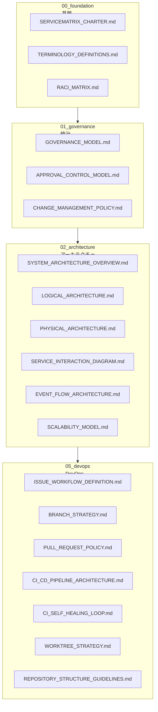
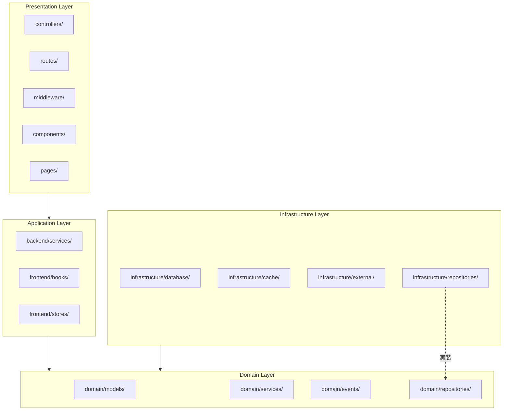
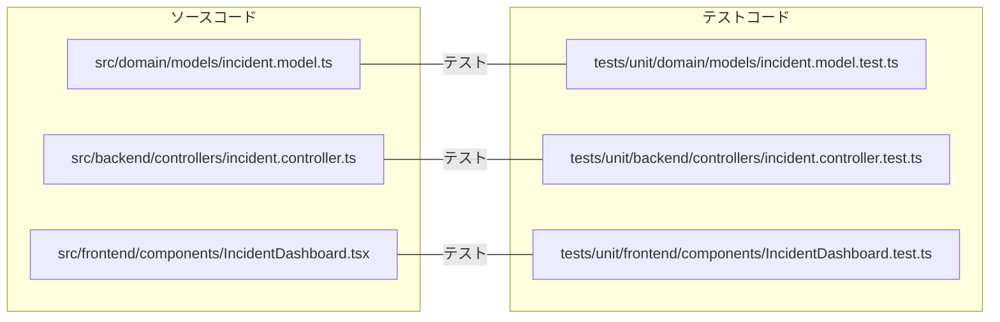
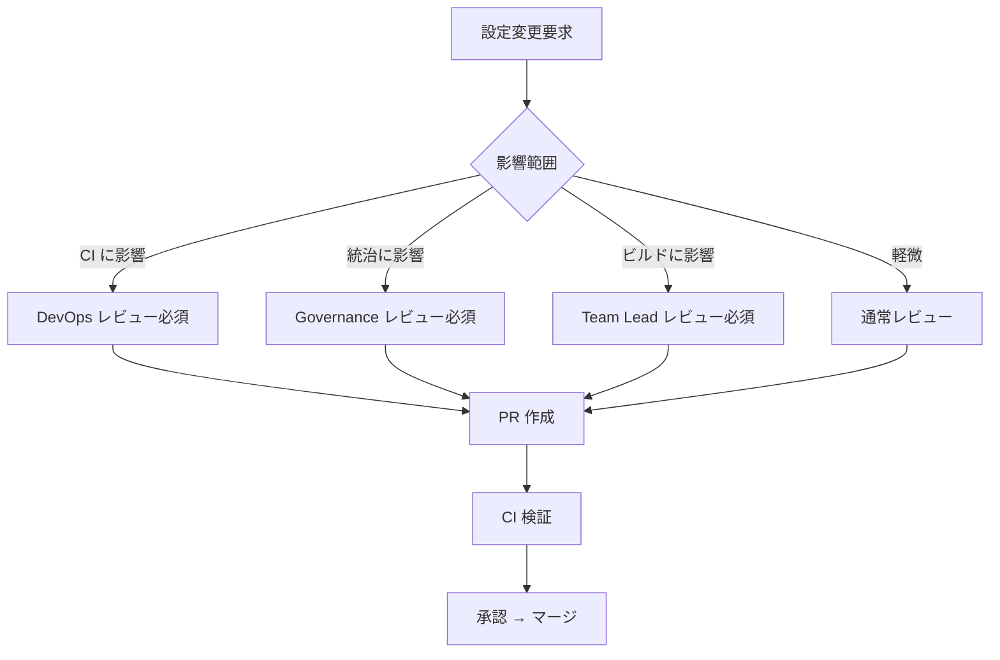
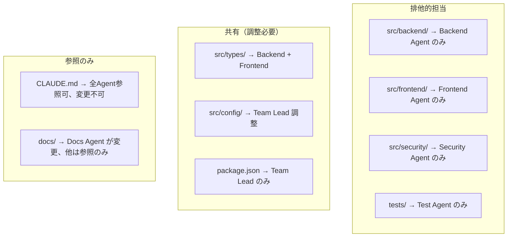
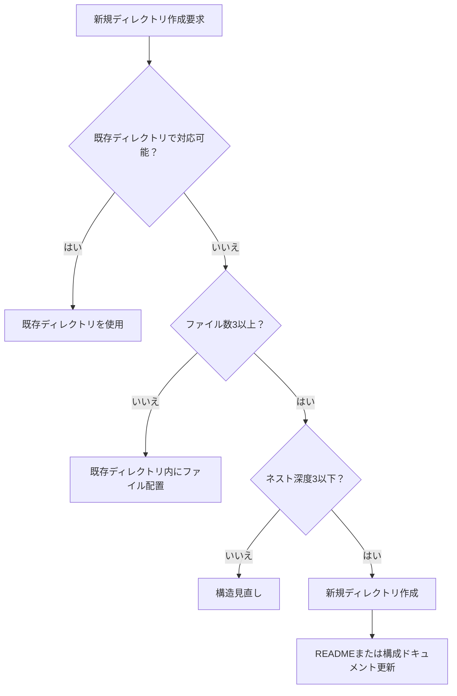

# リポジトリ構成ガイドライン

ServiceMatrix Repository Structure Guidelines

Version: 1.0
Status: Active
Classification: Internal DevOps Document

---

## 1. はじめに

本ドキュメントは ServiceMatrix リポジトリのディレクトリ構成、ファイル命名規則、
および構成管理ポリシーを定義する。一貫した構成を維持することで、
開発効率の向上とAgent Teamsによる並列開発の安全性を確保する。

---

## 2. 構成の原則

1. **予測可能性**: ファイルの配置場所が推測できる構成とする
2. **関心の分離**: レイヤー・機能・ドキュメントカテゴリを明確に分離する
3. **フラット化**: 不必要な深いネストを避ける
4. **自己説明的**: ディレクトリ名・ファイル名から内容が推測できる
5. **CI 整合性**: CI が参照するパスと構成が一致する

---

## 3. トップレベル構成

### 3.1 ディレクトリツリー

```
ServiceMatrix/
├── .claude/                        # Claude Code 設定
│   ├── worktrees/                  # WorkTree 配置（.gitignore対象）
│   └── settings.json               # Claude Code プロジェクト設定
├── .github/                        # GitHub 設定
│   ├── workflows/                  # GitHub Actions ワークフロー
│   ├── actions/                    # カスタムアクション
│   ├── ISSUE_TEMPLATE/             # Issue テンプレート
│   ├── PULL_REQUEST_TEMPLATE.md    # PR テンプレート
│   └── CODEOWNERS                  # コードオーナー定義
├── docs/                           # ドキュメント
│   ├── 00_foundation/              # 基盤ドキュメント
│   ├── 01_governance/              # 統治ドキュメント
│   ├── 02_architecture/            # アーキテクチャ設計
│   ├── 03_process/                 # ITSM プロセス
│   ├── 04_agents_ai/              # AI/Agent 統治
│   ├── 05_devops/                  # DevOps 運用
│   ├── 06_security_compliance/     # セキュリティ・コンプライアンス
│   ├── 07_sla_cmdb_data/          # SLA・CMDB・データモデル
│   ├── 08_operations/              # 運用管理
│   ├── 09_release/                 # リリース管理
│   ├── 10_ui_risk_testing/         # UI・リスク・テスト
│   └── 99_appendix/               # 付録・用語集
├── src/                            # ソースコード
│   ├── backend/                    # バックエンド
│   ├── frontend/                   # フロントエンド
│   ├── domain/                     # ドメインモデル
│   ├── infrastructure/             # インフラストラクチャ層
│   ├── security/                   # セキュリティモジュール
│   ├── config/                     # 設定ファイル
│   └── types/                      # 共有型定義
├── tests/                          # テスト
│   ├── unit/                       # ユニットテスト
│   ├── integration/                # 結合テスト
│   └── e2e/                        # E2E テスト
├── scripts/                        # ビルド・運用スクリプト
├── CLAUDE.md                       # プロジェクト統治定義
├── SERVICEMATRIX_CHARTER.md        # プロジェクト憲章
├── package.json                    # Node.js パッケージ定義
├── tsconfig.json                   # TypeScript 設定
├── .markdownlint.json              # Markdown Lint 設定
├── .cspell.json                    # スペルチェック設定
├── .gitignore                      # Git 除外設定
├── .env.example                    # 環境変数テンプレート
├── LICENSE                         # ライセンス
└── README.md                       # プロジェクト概要
```

### 3.2 トップレベルディレクトリの責務

| ディレクトリ | 責務 | 管理者 |
|---|---|---|
| `.claude/` | Claude Code 設定・WorkTree | DevOps |
| `.github/` | GitHub 設定・CI/CD | DevOps |
| `docs/` | プロジェクトドキュメント | 全チーム |
| `src/` | アプリケーションソースコード | 開発チーム |
| `tests/` | テストコード | 開発チーム・QA |
| `scripts/` | ビルド・運用スクリプト | DevOps |

---

## 4. ドキュメント構成

### 4.1 ドキュメントカテゴリ体系



### 4.2 ドキュメントカテゴリ詳細

| カテゴリ | ディレクトリ | 内容 |
|---|---|---|
| 基盤 | `00_foundation/` | プロジェクト憲章、用語定義、RACI |
| 統治 | `01_governance/` | ガバナンスモデル、承認統制、変更管理 |
| アーキテクチャ | `02_architecture/` | システム設計、論理・物理構成、イベントフロー |
| プロセス | `03_process/` | ITSM プロセス（インシデント、変更、問題、要求） |
| AI/Agent | `04_agents_ai/` | AI ガバナンス、Agent Teams 設計、判断ログ |
| DevOps | `05_devops/` | CI/CD、ブランチ戦略、PR ポリシー、WorkTree |
| セキュリティ | `06_security_compliance/` | セキュリティポリシー、コンプライアンス、監査 |
| SLA/CMDB | `07_sla_cmdb_data/` | SLA 定義、CMDB 設計、データモデル |
| 運用 | `08_operations/` | 運用手順、監視、アラート |
| リリース | `09_release/` | リリース管理、バージョニング、変更履歴 |
| UI/リスク/テスト | `10_ui_risk_testing/` | UI 設計、リスク評価、テスト戦略 |
| 付録 | `99_appendix/` | 用語集、FAQ、参考資料 |

### 4.3 ドキュメントファイル命名規則

| ルール | 説明 | 例 |
|---|---|---|
| 大文字スネークケース | ドキュメント名は大文字とアンダースコア | `BRANCH_STRATEGY.md` |
| 拡張子は `.md` | すべて Markdown 形式 | `GOVERNANCE_MODEL.md` |
| 意味のある名前 | 内容を正確に表す名前 | `CI_SELF_HEALING_LOOP.md` |
| カテゴリプレフィックス不要 | ディレクトリで分類済み | `PULL_REQUEST_POLICY.md` |

---

## 5. ソースコード構成

### 5.1 ソースコードディレクトリ

```
src/
├── backend/                        # バックエンドアプリケーション
│   ├── controllers/                # HTTP コントローラー
│   ├── services/                   # アプリケーションサービス
│   ├── routes/                     # ルーティング定義
│   ├── middleware/                  # ミドルウェア
│   └── validators/                 # 入力バリデーション
├── frontend/                       # フロントエンドアプリケーション
│   ├── components/                 # UI コンポーネント
│   ├── pages/                      # ページコンポーネント
│   ├── hooks/                      # カスタムフック
│   ├── stores/                     # 状態管理
│   └── utils/                      # フロントエンドユーティリティ
├── domain/                         # ドメイン層
│   ├── models/                     # ドメインモデル
│   │   ├── incident/               # インシデント管理
│   │   ├── change/                 # 変更管理
│   │   ├── problem/                # 問題管理
│   │   ├── request/                # サービス要求
│   │   └── cmdb/                   # CMDB
│   ├── events/                     # ドメインイベント
│   ├── repositories/               # リポジトリインターフェース
│   └── services/                   # ドメインサービス
├── infrastructure/                 # インフラストラクチャ層
│   ├── database/                   # データベースアクセス
│   │   ├── migrations/             # マイグレーション
│   │   └── seeds/                  # シードデータ
│   ├── cache/                      # キャッシュ
│   ├── queue/                      # メッセージキュー
│   ├── external/                   # 外部サービス連携
│   │   ├── github/                 # GitHub API
│   │   └── notification/           # 通知サービス
│   └── repositories/               # リポジトリ実装
├── security/                       # セキュリティモジュール
│   ├── auth/                       # 認証
│   ├── authz/                      # 認可
│   ├── audit/                      # 監査ログ
│   └── encryption/                 # 暗号化
├── config/                         # 設定
│   ├── app.config.ts               # アプリケーション設定
│   ├── database.config.ts          # データベース設定
│   └── security.config.ts          # セキュリティ設定
└── types/                          # 共有型定義
    ├── index.ts                    # 型のエクスポート
    ├── incident.types.ts           # インシデント型
    ├── change.types.ts             # 変更型
    ├── api.types.ts                # API 型
    └── event.types.ts              # イベント型
```

### 5.2 レイヤー構造と依存方向



### 5.3 ソースファイル命名規則

| 種別 | 命名規則 | 例 |
|---|---|---|
| モデル | `{name}.model.ts` | `incident.model.ts` |
| サービス | `{name}.service.ts` | `incident.service.ts` |
| コントローラー | `{name}.controller.ts` | `incident.controller.ts` |
| リポジトリ | `{name}.repository.ts` | `incident.repository.ts` |
| イベント | `{name}.event.ts` | `incident-created.event.ts` |
| ミドルウェア | `{name}.middleware.ts` | `auth.middleware.ts` |
| バリデーター | `{name}.validator.ts` | `incident.validator.ts` |
| 型定義 | `{name}.types.ts` | `incident.types.ts` |
| 設定 | `{name}.config.ts` | `database.config.ts` |
| コンポーネント | `{Name}.tsx` | `IncidentDashboard.tsx` |
| フック | `use{Name}.ts` | `useIncidentList.ts` |

---

## 6. テスト構成

### 6.1 テストディレクトリ構成

```
tests/
├── unit/                           # ユニットテスト
│   ├── domain/                     # ドメイン層テスト
│   │   ├── models/                 # モデルテスト
│   │   └── services/               # サービステスト
│   ├── backend/                    # バックエンドテスト
│   │   ├── controllers/            # コントローラーテスト
│   │   └── services/               # サービステスト
│   └── frontend/                   # フロントエンドテスト
│       ├── components/             # コンポーネントテスト
│       └── hooks/                  # フックテスト
├── integration/                    # 結合テスト
│   ├── api/                        # API 結合テスト
│   ├── database/                   # データベース結合テスト
│   └── external/                   # 外部サービス結合テスト
├── e2e/                            # E2E テスト
│   ├── scenarios/                  # テストシナリオ
│   ├── fixtures/                   # テストフィクスチャ
│   └── support/                    # サポートファイル
├── __mocks__/                      # 共有モック
├── __fixtures__/                   # 共有フィクスチャ
└── jest.config.ts                  # Jest 設定
```

### 6.2 テストファイル命名規則

| 種別 | 命名規則 | 配置場所 |
|---|---|---|
| ユニットテスト | `{name}.test.ts` | `tests/unit/{layer}/` |
| 結合テスト | `{name}.integration.test.ts` | `tests/integration/` |
| E2E テスト | `{name}.e2e.test.ts` | `tests/e2e/scenarios/` |
| モック | `{name}.mock.ts` | `tests/__mocks__/` |
| フィクスチャ | `{name}.fixture.ts` | `tests/__fixtures__/` |

### 6.3 テストとソースの対応関係



---

## 7. GitHub 設定構成

### 7.1 ワークフロー構成

```
.github/
├── workflows/
│   ├── ci-main.yml                 # main ブランチ CI
│   ├── ci-pr.yml                   # PR CI
│   ├── ci-security.yml             # セキュリティスキャン（定期）
│   ├── cd-staging.yml              # ステージング CD
│   ├── cd-production.yml           # 本番 CD
│   ├── docs-validation.yml         # ドキュメント検証
│   ├── self-healing.yml            # CI 自己修復
│   └── pr-governance.yml           # PR ガバナンスチェック
├── actions/
│   ├── setup-node/                 # Node.js セットアップ
│   │   └── action.yml
│   ├── lint-check/                 # Lint チェック
│   │   └── action.yml
│   └── notify/                     # 通知アクション
│       └── action.yml
├── ISSUE_TEMPLATE/
│   ├── incident_report.yml         # インシデント報告
│   ├── change_request.yml          # 変更要求
│   ├── service_request.yml         # サービス要求
│   ├── bug_report.yml              # バグ報告
│   └── feature_request.yml         # 機能要求
├── PULL_REQUEST_TEMPLATE.md        # PR テンプレート
└── CODEOWNERS                      # コードオーナー定義
```

### 7.2 Issue テンプレートの構成

| テンプレート | 用途 | ITSM プロセス |
|---|---|---|
| `incident_report.yml` | インシデント報告 | インシデント管理 |
| `change_request.yml` | 変更要求 | 変更管理 |
| `service_request.yml` | サービス要求 | サービス要求管理 |
| `bug_report.yml` | バグ報告 | 問題管理 |
| `feature_request.yml` | 機能要求 | 変更管理（新機能） |

---

## 8. 設定ファイル管理

### 8.1 ルートレベル設定ファイル

| ファイル | 用途 | 管理者 |
|---|---|---|
| `CLAUDE.md` | Claude Code 統治定義 | Governance チーム |
| `SERVICEMATRIX_CHARTER.md` | プロジェクト憲章 | Governance チーム |
| `package.json` | Node.js パッケージ定義 | DevOps / Team Lead |
| `tsconfig.json` | TypeScript コンパイラ設定 | DevOps / Team Lead |
| `.markdownlint.json` | Markdown Lint ルール | DevOps |
| `.cspell.json` | スペルチェック辞書・設定 | DevOps |
| `.gitignore` | Git 除外パターン | DevOps |
| `.env.example` | 環境変数テンプレート | DevOps |
| `.editorconfig` | エディタ共通設定 | DevOps |

### 8.2 設定ファイルの変更管理



---

## 9. Agent Teams とディレクトリ担当

### 9.1 Agent 別ディレクトリ担当

| Agent | 主担当ディレクトリ | 副担当ディレクトリ |
|---|---|---|
| Backend Agent | `src/backend/`, `src/domain/` | `src/infrastructure/` |
| Frontend Agent | `src/frontend/` | `src/types/` |
| Test Agent | `tests/` | - |
| Security Agent | `src/security/` | `src/middleware/` |
| Docs Agent | `docs/` | - |
| DevOps Agent | `.github/`, `scripts/` | 設定ファイル |
| Team Lead | ルート設定ファイル | すべて（調整用） |

### 9.2 排他制御マトリクス



---

## 10. .gitignore ポリシー

### 10.1 除外対象カテゴリ

| カテゴリ | パターン | 理由 |
|---|---|---|
| 依存関係 | `node_modules/` | npm パッケージ（大量ファイル） |
| ビルド成果物 | `dist/`, `build/` | ビルド生成物 |
| 環境変数 | `.env`, `.env.local` | シークレット含有 |
| WorkTree | `.claude/worktrees/` | ローカル作業空間 |
| IDE 設定 | `.vscode/`, `.idea/` | 個人設定 |
| OS ファイル | `.DS_Store`, `Thumbs.db` | OS 生成ファイル |
| ログ | `*.log`, `logs/` | 実行時ログ |
| カバレッジ | `coverage/` | テストカバレッジレポート |
| 一時ファイル | `*.tmp`, `*.bak` | 一時生成ファイル |

### 10.2 追跡必須ファイル

| ファイル | 理由 |
|---|---|
| `.env.example` | 環境変数テンプレート（シークレットを含まない） |
| `package-lock.json` | 依存関係の再現性保証 |
| `.markdownlint.json` | CI と同一 Lint ルール |
| `.cspell.json` | CI と同一スペルチェック設定 |
| `.editorconfig` | チーム共通エディタ設定 |

---

## 11. ディレクトリ作成ガイドライン

### 11.1 新規ディレクトリ作成の判断基準



### 11.2 ルール

- ディレクトリのネスト深度は最大3階層とする
- 1ディレクトリ内のファイル数が20を超える場合はサブディレクトリに分割する
- 空ディレクトリは原則作成しない（`.gitkeep` による例外あり）
- ドキュメントディレクトリは番号プレフィックスで順序を明示する

---

## 12. 構成変更管理

### 12.1 構成変更時のチェックリスト

- [ ] 既存ディレクトリで対応できないことを確認した
- [ ] 命名規則に準拠している
- [ ] CI のパス参照に影響がないか確認した
- [ ] CODEOWNERS の更新が必要か確認した
- [ ] 本ドキュメント（REPOSITORY_STRUCTURE_GUIDELINES.md）の更新が必要か確認した
- [ ] Agent Teams の担当マトリクスに影響がないか確認した
- [ ] `.gitignore` の更新が必要か確認した

### 12.2 構成変更の影響範囲

| 変更内容 | 影響範囲 | 必要な更新 |
|---|---|---|
| `src/` 配下の変更 | テスト、CI、Agent 担当 | テストパス、CI パス、担当マトリクス |
| `docs/` 配下の変更 | CI（ドキュメント検証） | CI パスフィルタ |
| `.github/` の変更 | CI/CD パイプライン | ワークフロー設定 |
| ルート設定ファイル | ビルド、CI | 環境設定 |

---

## 13. 関連ドキュメント

| ドキュメント | 参照先 |
|---|---|
| ブランチ戦略 | [BRANCH_STRATEGY.md](./BRANCH_STRATEGY.md) |
| WorkTree 戦略 | [WORKTREE_STRATEGY.md](./WORKTREE_STRATEGY.md) |
| CI/CDパイプラインアーキテクチャ | [CI_CD_PIPELINE_ARCHITECTURE.md](./CI_CD_PIPELINE_ARCHITECTURE.md) |
| Pull Request ポリシー | [PULL_REQUEST_POLICY.md](./PULL_REQUEST_POLICY.md) |

---

*本ドキュメントは ServiceMatrix プロジェクトの統治原則に基づき管理される。*
*変更は Change Issue → PR → CI検証 → 承認 のフローに従うこと。*
