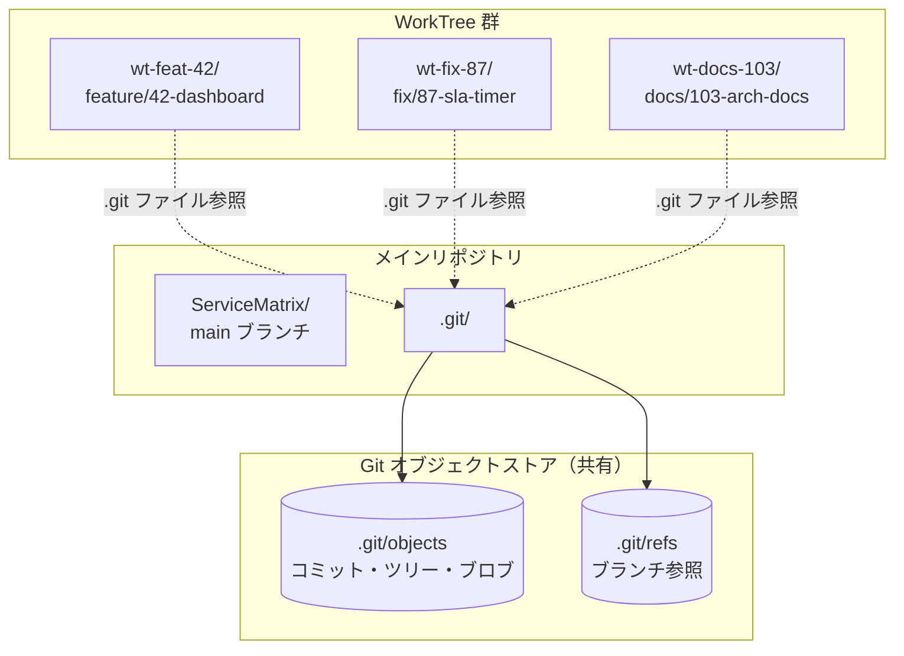
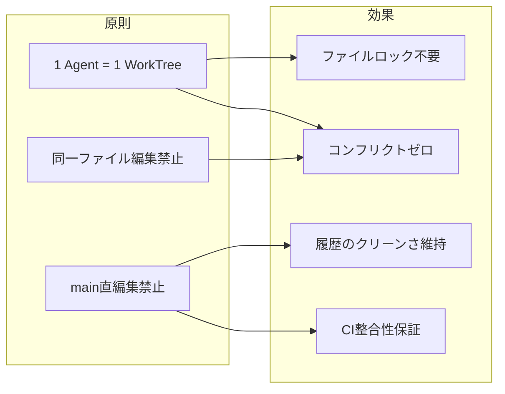
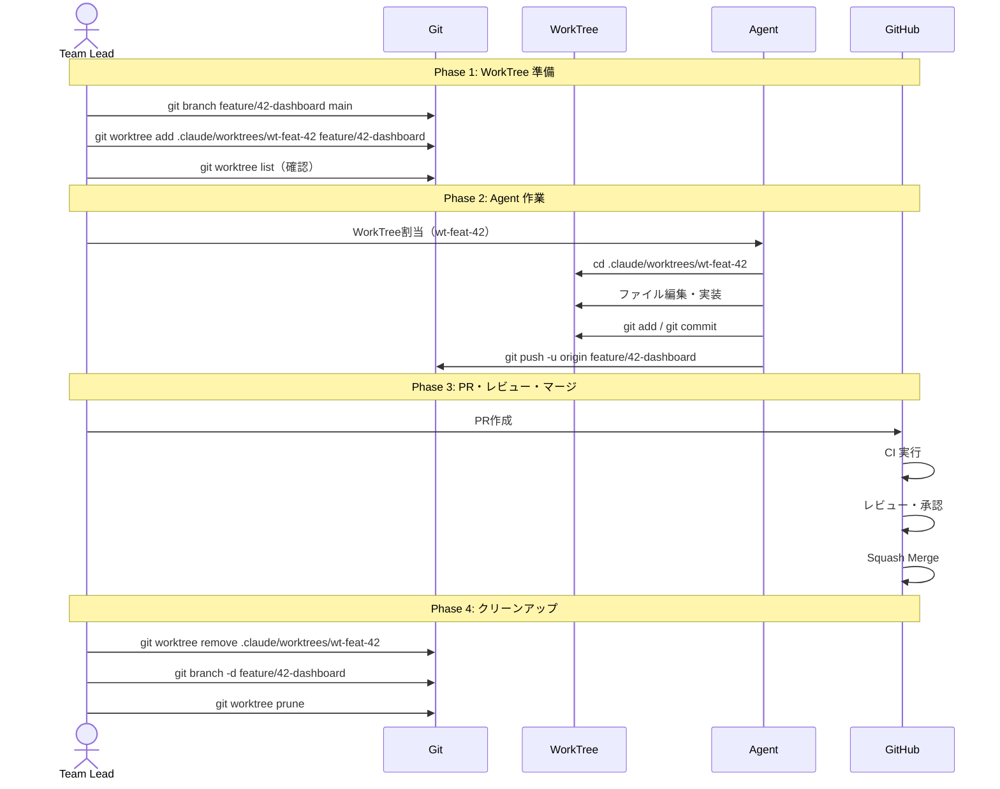
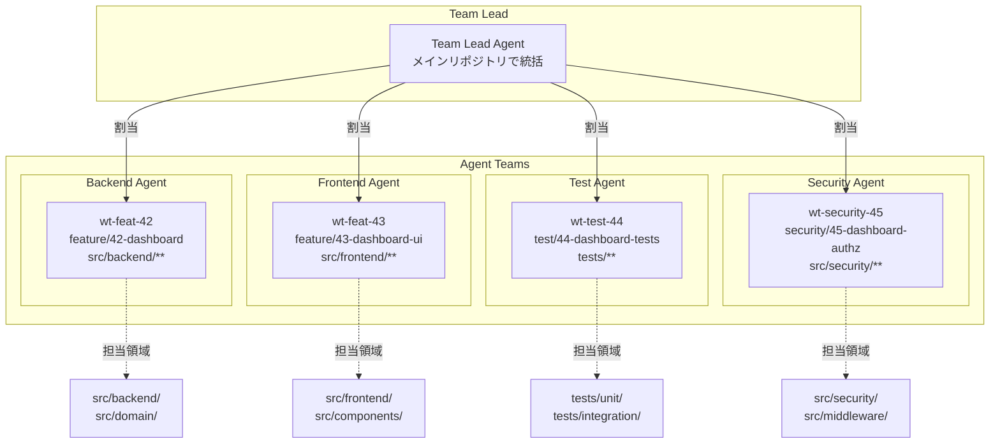
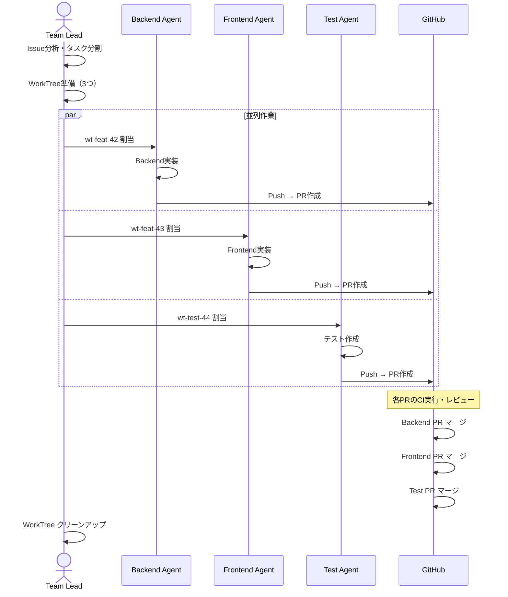
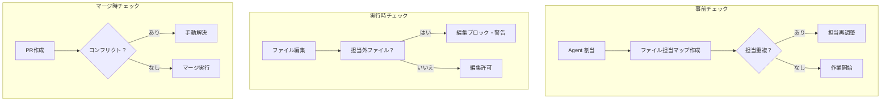
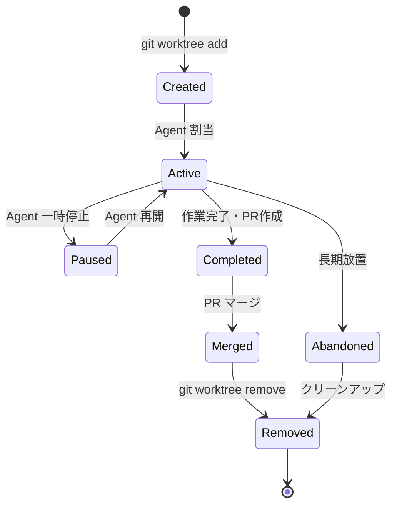
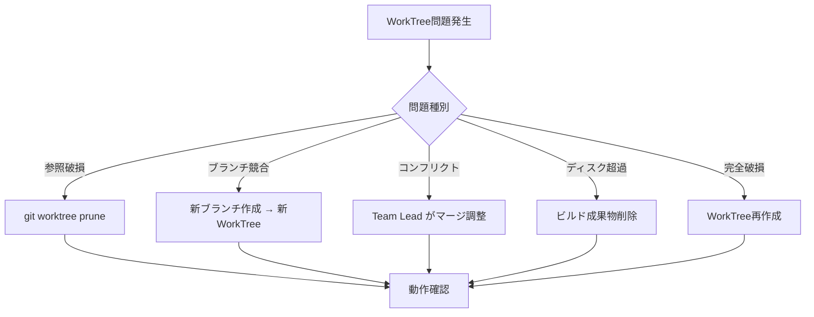

# WorkTree 戦略

ServiceMatrix Git WorkTree Strategy

Version: 1.0
Status: Active
Classification: Internal DevOps Document

---

## 1. はじめに

本ドキュメントは ServiceMatrix における Git WorkTree の運用戦略を定義する。
WorkTree は Agent Teams による並列開発の基盤であり、ファイル衝突ゼロと独立した作業空間の確保を実現する。

---

## 2. Git WorkTree の概念

### 2.1 WorkTree とは

Git WorkTree は、単一リポジトリに対して複数の作業ディレクトリを作成する Git の機能である。
通常の `git clone` とは異なり、`.git` オブジェクトストアを共有するため、ディスク使用量が少なく、
ブランチ間の切り替えコストがゼロになる。

### 2.2 WorkTree と Clone の比較

| 項目 | WorkTree | Clone |
|---|---|---|
| `.git` ストア | 共有（単一） | 独立（複製） |
| ディスク使用量 | 少ない | 多い（リポジトリサイズ×N） |
| ブランチ切替 | 不要（各 WorkTree が固定ブランチ） | `git checkout` が必要 |
| コミット履歴 | リアルタイム共有 | `git fetch` が必要 |
| 同時編集 | 異なるブランチを同時に作業可能 | 同様に可能だが管理が煩雑 |
| リポジトリ操作 | メインリポジトリに即時反映 | Push/Pull が必要 |

### 2.3 WorkTree のアーキテクチャ



---

## 3. WorkTree の原則

### 3.1 基本原則

1. **1 Agent = 1 WorkTree**: 各 Agent は専用の WorkTree で作業する
2. **1 機能 = 1 WorkTree**: 機能開発は独立した WorkTree で実施する
3. **同一ファイル同時編集禁止**: 異なる WorkTree で同一ファイルを編集しない
4. **main 直編集禁止**: WorkTree は必ず機能ブランチに紐付ける
5. **WorkTree はブランチと1対1対応**: 1つの WorkTree は1つのブランチにのみ紐付く
6. **作業完了後は速やかに削除**: 不要な WorkTree は残さない

### 3.2 原則の根拠



---

## 4. WorkTree 命名規則

### 4.1 命名フォーマット

```
wt-{prefix}-{issue-number}
```

### 4.2 プレフィックスとブランチの対応

| WorkTree プレフィックス | ブランチプレフィックス | 用途 | 例 |
|---|---|---|---|
| `wt-feat` | `feature/` | 新機能開発 | `wt-feat-42` |
| `wt-fix` | `fix/` | バグ修正 | `wt-fix-87` |
| `wt-docs` | `docs/` | ドキュメント更新 | `wt-docs-103` |
| `wt-refactor` | `refactor/` | リファクタリング | `wt-refactor-115` |
| `wt-ci` | `ci/` | CI/CD設定変更 | `wt-ci-120` |
| `wt-security` | `security/` | セキュリティ修正 | `wt-security-155` |
| `wt-hotfix` | `hotfix/` | 緊急修正 | `wt-hotfix-200` |
| `wt-test` | `test/` | テスト追加・修正 | `wt-test-130` |

### 4.3 命名ルール

- 英小文字とハイフンのみ使用する（`a-z`, `0-9`, `-`）
- Issue 番号は必須とする（WorkTree とブランチの追跡性確保）
- 説明部分は原則不要（ブランチ名に含まれるため）

---

## 5. WorkTree 配置場所

### 5.1 ディレクトリ構造

```
ServiceMatrix/                          # メインリポジトリ（main ブランチ）
├── .git/                               # Git オブジェクトストア
├── .claude/
│   └── worktrees/                      # WorkTree 配置ディレクトリ
│       ├── wt-feat-42/                 # feature/42-dashboard
│       │   ├── .git                    # メインリポジトリへの参照ファイル
│       │   ├── src/
│       │   └── docs/
│       ├── wt-fix-87/                  # fix/87-sla-timer
│       │   ├── .git
│       │   ├── src/
│       │   └── docs/
│       └── wt-docs-103/               # docs/103-arch-docs
│           ├── .git
│           └── docs/
├── src/
├── docs/
└── CLAUDE.md
```

### 5.2 配置ルール

| 項目 | 設定 |
|---|---|
| 配置ディレクトリ | `.claude/worktrees/` |
| `.gitignore` 登録 | `.claude/worktrees/` は追跡対象外 |
| 最大同時 WorkTree 数 | 5（リソース上限に基づく） |
| ディスク使用量上限 | WorkTree あたり 500MB |

---

## 6. WorkTree 操作手順

### 6.1 作成手順

```bash
# 1. ブランチを作成する
git branch feature/42-incident-dashboard main

# 2. WorkTree を作成する
git worktree add .claude/worktrees/wt-feat-42 feature/42-incident-dashboard

# 3. WorkTree の存在を確認する
git worktree list
```

### 6.2 作業フロー

```bash
# 1. WorkTree ディレクトリに移動する
cd .claude/worktrees/wt-feat-42

# 2. 現在のブランチを確認する
git branch --show-current
# => feature/42-incident-dashboard

# 3. 作業を行う
# （ファイル編集）

# 4. 変更をコミットする
git add -A
git commit -m "feat(#42): インシデントダッシュボードのレイアウトを追加"

# 5. リモートに Push する
git push -u origin feature/42-incident-dashboard
```

### 6.3 削除手順

```bash
# 1. WorkTree を削除する
git worktree remove .claude/worktrees/wt-feat-42

# 2. （マージ済みの場合）ブランチを削除する
git branch -d feature/42-incident-dashboard

# 3. 残留参照を削除する
git worktree prune
```

### 6.4 操作フロー図



---

## 7. Agent Teams との連携

### 7.1 Agent Teams × WorkTree の対応関係



### 7.2 Agent 割当プロセス

| ステップ | 実行者 | 操作 |
|---|---|---|
| 1. Issue 分析 | Team Lead | Issue の内容と影響範囲を分析 |
| 2. タスク分割 | Team Lead | 機能を Agent 単位のタスクに分割 |
| 3. ブランチ作成 | Team Lead | 各タスク用のブランチを作成 |
| 4. WorkTree 作成 | Team Lead | 各ブランチに対応する WorkTree を作成 |
| 5. 担当領域定義 | Team Lead | 各 Agent の編集可能ファイル範囲を定義 |
| 6. Agent 起動 | Team Lead | Agent Teams を起動し WorkTree を割当 |
| 7. 進捗監視 | Team Lead | 各 Agent の進捗とコンフリクトを監視 |

### 7.3 Agent Teams 並列開発フロー



---

## 8. コンフリクト防止策

### 8.1 ファイル担当マトリクス

並列開発時は事前にファイル担当を定義し、同一ファイルの同時編集を防止する。

| ディレクトリ | 担当 Agent | 排他 |
|---|---|---|
| `src/backend/` | Backend Agent | 排他 |
| `src/frontend/` | Frontend Agent | 排他 |
| `src/domain/` | Backend Agent | 排他 |
| `src/security/` | Security Agent | 排他 |
| `tests/unit/` | Test Agent | 排他 |
| `tests/integration/` | Test Agent | 排他 |
| `docs/` | Docs Agent | 排他 |
| `package.json` | Team Lead のみ | 厳密排他 |
| `CLAUDE.md` | Team Lead のみ | 厳密排他 |

### 8.2 コンフリクト検出メカニズム



### 8.3 共有ファイルの編集ルール

一部のファイルは複数の Agent が参照する共有ファイルである。

| ファイル | 編集者 | ルール |
|---|---|---|
| `package.json` | Team Lead のみ | 依存関係変更は Team Lead が統括 |
| `tsconfig.json` | Team Lead のみ | TypeScript 設定は一元管理 |
| `.env.example` | Team Lead のみ | 環境変数定義は一元管理 |
| `src/types/index.ts` | Team Lead 調整 | 型定義追加は事前調整 |
| `src/config/` | Team Lead 調整 | 設定ファイルは事前調整 |

---

## 9. WorkTree のライフサイクル管理

### 9.1 ライフサイクル状態



### 9.2 ライフサイクル管理ルール

| 状態 | 最大期間 | アクション |
|---|---|---|
| Created（未割当） | 1時間 | 割当されない場合は削除 |
| Active（作業中） | 2週間 | 超過時は進捗確認 |
| Paused（一時停止） | 3日 | 超過時は再開 or 削除 |
| Completed（作業完了） | 24時間 | PR マージ後に速やかに削除 |
| Abandoned（放置） | 7日 | 自動通知 → 手動削除 |

### 9.3 定期クリーンアップ

```bash
# WorkTree の一覧と状態確認
git worktree list --porcelain

# 不要な WorkTree の検出
git worktree list | while read path branch; do
  last_commit=$(git -C "$path" log -1 --format=%cr 2>/dev/null)
  echo "$path ($branch) - 最終コミット: $last_commit"
done

# 残留参照の削除
git worktree prune

# マージ済みブランチに紐付く WorkTree の特定
git branch --merged main | grep -v "main" | while read branch; do
  echo "マージ済み: $branch — WorkTree削除候補"
done
```

---

## 10. トラブルシューティング

### 10.1 よくある問題と対処法

| 問題 | 原因 | 対処法 |
|---|---|---|
| `fatal: is already checked out` | 同一ブランチが別の WorkTree で使用中 | 別ブランチを使用するか、既存 WorkTree を削除 |
| WorkTree 内で `git checkout` 失敗 | WorkTree はブランチに固定される | 新しい WorkTree を作成する |
| `.git` ファイルが壊れた | WorkTree の不正削除 | `git worktree prune` で修復 |
| コンフリクトが発生した | 同一ファイルの同時編集 | Team Lead が調整、手動マージ |
| WorkTree のディスク使用量超過 | ビルド成果物の蓄積 | `node_modules` 等を削除 |
| `git push` が拒否された | リモートブランチが存在しない | `-u` オプションで初回 Push |

### 10.2 復旧手順



---

## 11. WorkTree 運用メトリクス

| メトリクス | 説明 | 目標値 |
|---|---|---|
| 同時 WorkTree 数 | アクティブな WorkTree 数 | 3-5 |
| WorkTree 平均寿命 | 作成から削除までの平均期間 | 1-3日 |
| コンフリクト発生率 | WorkTree 間コンフリクトの発生率 | 0% |
| クリーンアップ遵守率 | マージ後24時間以内に削除された割合 | > 95% |
| 放置 WorkTree 数 | 7日以上更新のない WorkTree | 0 |

---

## 12. 関連ドキュメント

| ドキュメント | 参照先 |
|---|---|
| ブランチ戦略 | [BRANCH_STRATEGY.md](./BRANCH_STRATEGY.md) |
| Pull Request ポリシー | [PULL_REQUEST_POLICY.md](./PULL_REQUEST_POLICY.md) |
| CI/CDパイプラインアーキテクチャ | [CI_CD_PIPELINE_ARCHITECTURE.md](./CI_CD_PIPELINE_ARCHITECTURE.md) |
| リポジトリ構成ガイドライン | [REPOSITORY_STRUCTURE_GUIDELINES.md](./REPOSITORY_STRUCTURE_GUIDELINES.md) |

---

*本ドキュメントは ServiceMatrix プロジェクトの統治原則に基づき管理される。*
*変更は Change Issue → PR → CI検証 → 承認 のフローに従うこと。*
