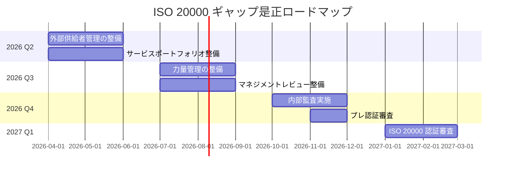

# ISO/IEC 20000整合性マッピング（ISO 20000 Alignment Mapping）

ServiceMatrix ISO/IEC 20000整合性仕様
Version: 1.0
Status: Active
Classification: Internal Governance Document
Applicable Standard: ISO/IEC 20000-1:2018
Last Updated: 2026-03-02
Owner: ProcessOwner / サービスマネジメント統治担当

---

## 1. 目的

本ドキュメントは、ServiceMatrixのサービスマネジメント機能と
ISO/IEC 20000-1:2018（サービスマネジメントシステム規格）の
各条項との対応関係を明示する。

ISO/IEC 20000認証取得に向けたギャップ分析の基盤文書として使用する。

---

## 2. ISO 20000-1:2018 主要条項とServiceMatrix機能の対応表

### 2.1 条項 4：組織の状況（Context of the Organization）

| ISO 20000 条項 | 要求事項概要 | ServiceMatrix対応機能 | 対応状況 |
|---------------|------------|-------------------|---------|
| 4.1 | 組織とその状況の理解 | SERVICEMATRIX_CHARTER.md / GOVERNANCE_MODEL.md | 対応済 |
| 4.2 | 利害関係者のニーズと期待 | SLA_DEFINITION.md / STAKEHOLDER登録（CMDB） | 対応済 |
| 4.3 | SMSの適用範囲 | AI_GOVERNANCE_POLICY.md / 本ドキュメント | 対応済 |
| 4.4 | サービスマネジメントシステム | ServiceMatrix全体アーキテクチャ | 対応済 |
| 4.5.1 | サービスの計画と提供 | OLA_DEFINITION.md / SLA_DEFINITION.md | 対応済 |
| 4.5.2 | 他者が提供するサービスの制御 | 外部連携ポリシー / 第三者管理 | 部分対応 |

### 2.2 条項 5：リーダーシップ（Leadership）

| ISO 20000 条項 | 要求事項概要 | ServiceMatrix対応機能 | 対応状況 |
|---------------|------------|-------------------|---------|
| 5.1 | リーダーシップとコミットメント | GOVERNANCE_MODEL.md / 承認プロセス | 対応済 |
| 5.2 | ポリシー | PULL_REQUEST_POLICY.md / AI_GOVERNANCE_POLICY.md 他 | 対応済 |
| 5.3 | 役割・責任・権限 | RBAC_DEFINITION.md / 各プロセスオーナー定義 | 対応済 |

### 2.3 条項 6：計画（Planning）

| ISO 20000 条項 | 要求事項概要 | ServiceMatrix対応機能 | 対応状況 |
|---------------|------------|-------------------|---------|
| 6.1.1 | リスクと機会への取組み | RISK_REGISTER.md / 12_risk_management | 対応済 |
| 6.1.2 | サービスマネジメント目標 | KPI_DEFINITION.md / SLA_DEFINITION.md | 対応済 |
| 6.2 | 変更の計画 | CHANGE_MANAGEMENT_PROCESS.md | 対応済 |

### 2.4 条項 7：支援（Support）

| ISO 20000 条項 | 要求事項概要 | ServiceMatrix対応機能 | 対応状況 |
|---------------|------------|-------------------|---------|
| 7.1.1 | リソース | CAPACITY_MANAGEMENT.md / OLA定義 | 対応済 |
| 7.1.2 | 人員 | RBAC_DEFINITION.md / ロール定義 | 対応済 |
| 7.2 | 力量 | ロール定義・訓練記録 | 部分対応 |
| 7.3 | 認識 | ポリシードキュメント整備 | 対応済 |
| 7.4 | コミュニケーション | GitHub通知 / Slack通知 / レポート設計 | 対応済 |
| 7.5.1 | 文書化された情報 - 一般 | docs/ 全体の文書管理体制 | 対応済 |
| 7.5.2 | 文書化された情報の作成と更新 | Git管理 / PR審査 / バージョン管理 | 対応済 |
| 7.5.3 | 文書化された情報の管理 | ACCESS_CONTROL_MODEL.md / RBAC | 対応済 |

### 2.5 条項 8：運用（Operation）

#### 8.2 サービス計画（Service Planning）

| ISO 20000 条項 | 要求事項概要 | ServiceMatrix対応機能 | 対応状況 |
|---------------|------------|-------------------|---------|
| 8.2.1 | サービスポートフォリオ管理 | CMDB / サービスカタログ | 部分対応 |
| 8.2.2 | サービスカタログ管理 | 10_cmdb / サービスカタログ定義 | 部分対応 |

#### 8.3 関係とアグリーメントの管理（Relationship and Agreement Management）

| ISO 20000 条項 | 要求事項概要 | ServiceMatrix対応機能 | 対応状況 |
|---------------|------------|-------------------|---------|
| 8.3.1 | ビジネス関係の管理 | 利害関係者管理 / GOVERNANCE_MODEL | 対応済 |
| 8.3.2 | サービスレベル管理 | SLA_DEFINITION.md / KPI_DEFINITION.md | 対応済 |
| 8.3.3 | 供給者管理 | 外部連携ポリシー / 16_external_integration | 部分対応 |

#### 8.4 供給と需要（Supply and Demand）

| ISO 20000 条項 | 要求事項概要 | ServiceMatrix対応機能 | 対応状況 |
|---------------|------------|-------------------|---------|
| 8.4.1 | 予算管理と会計 | - | 対応なし（スコープ外） |
| 8.4.2 | 需要管理 | CAPACITY_MANAGEMENT.md | 対応済 |

#### 8.5 設計・構築・移行（Design, Build and Transition）

| ISO 20000 条項 | 要求事項概要 | ServiceMatrix対応機能 | 対応状況 |
|---------------|------------|-------------------|---------|
| 8.5.1 | 変更管理 | CHANGE_MANAGEMENT_PROCESS.md / GitHub PR | 対応済 |
| 8.5.2 | サービスの設計・移行 | PULL_REQUEST_POLICY.md / CI/CD Pipeline | 対応済 |
| 8.5.3 | リリース管理 | 14_release_management / RELEASE_POLICY | 対応済 |

#### 8.6 解決と実現（Resolution and Fulfillment）

| ISO 20000 条項 | 要求事項概要 | ServiceMatrix対応機能 | 対応状況 |
|---------------|------------|-------------------|---------|
| 8.6.1 | インシデント管理 | INCIDENT_MANAGEMENT_PROCESS.md | 対応済 |
| 8.6.2 | サービスリクエスト管理 | リクエスト管理プロセス | 対応済 |
| 8.6.3 | 問題管理 | PROBLEM_MANAGEMENT_PROCESS.md | 対応済 |

#### 8.7 サービス保証（Service Assurance）

| ISO 20000 条項 | 要求事項概要 | ServiceMatrix対応機能 | 対応状況 |
|---------------|------------|-------------------|---------|
| 8.7.1 | 可用性管理 | SLA_DEFINITION.md / 監視設計 | 対応済 |
| 8.7.2 | キャパシティ管理 | CAPACITY_MANAGEMENT.md | 対応済 |
| 8.7.3 | サービス継続性管理 | DISASTER_RECOVERY_PLAN.md / RTO_RPO_DEFINITION.md | 対応済 |
| 8.7.4 | 情報セキュリティ管理 | docs/06_security_compliance 全体 | 対応済 |
| 8.7.5 | 構成管理 | 10_cmdb / CMDB_SCHEMA.md | 対応済 |

### 2.6 条項 9：パフォーマンス評価（Performance Evaluation）

| ISO 20000 条項 | 要求事項概要 | ServiceMatrix対応機能 | 対応状況 |
|---------------|------------|-------------------|---------|
| 9.1 | 監視・測定・分析・評価 | METRICS_COLLECTION_MODEL.md / KPI_DEFINITION.md | 対応済 |
| 9.2 | 内部監査 | INTERNAL_CONTROL_JSOX_MAPPING.md / 監査機能 | 対応済 |
| 9.3 | マネジメントレビュー | 月次・年次レビュープロセス | 部分対応 |

### 2.7 条項 10：改善（Improvement）

| ISO 20000 条項 | 要求事項概要 | ServiceMatrix対応機能 | 対応状況 |
|---------------|------------|-------------------|---------|
| 10.1 | 不適合と是正処置 | 問題管理プロセス / GitHub Issue | 対応済 |
| 10.2 | 継続的改善 | KPI改善サイクル / PDCA設計 | 対応済 |

---

## 3. ギャップ分析と対応計画

### 3.1 ギャップサマリー

| 分類 | 対応済 | 部分対応 | 対応なし | 対応率 |
|------|------|---------|---------|-------|
| 組織の状況（4章） | 5 | 1 | 0 | 83% |
| リーダーシップ（5章） | 3 | 0 | 0 | 100% |
| 計画（6章） | 3 | 0 | 0 | 100% |
| 支援（7章） | 7 | 1 | 0 | 88% |
| 運用（8章） | 14 | 4 | 1 | 74% |
| パフォーマンス評価（9章） | 2 | 1 | 0 | 83% |
| 改善（10章） | 2 | 0 | 0 | 100% |
| **合計** | **36** | **7** | **1** | **82%** |

### 3.2 部分対応・未対応のギャップ詳細

#### ギャップ1: 外部供給者管理（8.3.3）

**現状：** 外部サービス（GitHub / クラウド等）への依存管理が文書化されていない

**対応計画：**
- 外部依存サービス一覧の整備
- 各外部サービスのSLA確認と記録
- 外部サービス障害時の対応手順書作成

**期限：** 2026年Q2

---

#### ギャップ2: 力量管理（7.2）

**現状：** ロール定義はあるが、各ロールに必要な力量要件・訓練記録が未整備

**対応計画：**
- ロール別力量要件の定義
- 訓練計画の策定
- 訓練記録の管理方法の確立

**期限：** 2026年Q3

---

#### ギャップ3: サービスポートフォリオ管理（8.2.1）

**現状：** CMDB上にサービス情報は存在するが、正式なサービスポートフォリオとして管理されていない

**対応計画：**
- サービスポートフォリオ文書の作成
- ライフサイクル管理プロセスの定義

**期限：** 2026年Q2

---

#### ギャップ4: マネジメントレビュー（9.3）

**現状：** 月次・四半期レビューは実施しているが、ISO 20000が要求するマネジメントレビューの形式が未確立

**対応計画：**
- マネジメントレビュー議題・インプット・アウトプットの定義
- 年次マネジメントレビュー実施手順の策定

**期限：** 2026年Q3

---

#### ギャップ5: 予算管理と会計（8.4.1）

**現状：** スコープ外と判断（ServiceMatrixは財務会計システムではない）

**対応計画：** 認証申請時のスコープ定義でこの項目の適用除外を明示する

---

### 3.3 ギャップ是正ロードマップ

---

## 4. 認証取得ロードマップ

### 4.1 フェーズ別計画

| フェーズ | 期間 | 主要活動 | 担当 |
|---------|------|---------|------|
| フェーズ1：ギャップ補完 | 2026年Q2〜Q3 | 部分対応ギャップの是正・文書整備 | ProcessOwner |
| フェーズ2：内部監査 | 2026年Q4 | SMS全体の内部監査実施・是正 | Auditor |
| フェーズ3：認証審査準備 | 2026年Q4〜2027年Q1 | 審査機関選定・プレ審査・文書最終整備 | ProcessOwner |
| フェーズ4：認証審査 | 2027年Q1 | ステージ1審査（文書審査）+ ステージ2審査（現地審査） | 全チーム |
| フェーズ5：認証維持 | 2027年以降 | サーベイランス審査（年次）・更新審査（3年ごと） | ProcessOwner |

### 4.2 認証審査機関の選定基準

- ISO/IEC 17021-1認定機関であること
- ITサービスマネジメント分野の審査実績
- 日本語対応可能であること
- コスト・スケジュールの適合性

### 4.3 認証維持のための定期活動

| 活動 | 頻度 | 担当 |
|------|------|------|
| 内部監査 | 年次（全条項カバー） | Auditor |
| マネジメントレビュー | 年次 | ProcessOwner |
| KPI・SLAレビュー | 月次 | ProcessOwner |
| 文書レビュー・更新 | 年次 | ProcessOwner |
| サーベイランス審査対応 | 年次（認証後） | ProcessOwner |

---

## 5. ServiceMatrix機能とISO 20000要求の統合設計

### 5.1 GitHubネイティブ統合によるISO 20000実現

ServiceMatrixはGitHubをITSMの記録基盤として活用することで、
ISO 20000の文書化・記録要件を効率的に実現する：

| ISO 20000要件 | ServiceMatrixの実現方法 |
|--------------|----------------------|
| 文書化された情報の管理 | GitリポジトリによるバージョンManaged文書管理 |
| 変更の記録と追跡 | GitHub PR + コミット履歴 |
| 是正措置の記録 | GitHub Issues + ラベル管理 |
| 内部監査の証跡 | 監査ログ + GitHub Issue |
| パフォーマンス計測 | KPI_DEFINITION.md + METRICS_COLLECTION_MODEL.md |

### 5.2 AI統治とISO 20000の整合性

ServiceMatrixのAI統治機能はISO 20000の以下の領域に貢献する：

| ISO 20000 領域 | AI統治の貢献 |
|--------------|------------|
| インシデント管理 | 自動優先度判定・エスカレーション支援 |
| 問題管理 | パターン分析・根本原因候補の提示 |
| 変更管理 | 変更影響分析の支援 |
| キャパシティ管理 | 需要予測・アラート自動検知 |
| 継続的改善 | KPIトレンド分析・改善提案生成 |

ただし、AI統治の実施においても：
- すべての重要判断には人間の確認・承認を必須とする
- AI提案はあくまで「支援」であり「決定」ではない
- AI操作の完全な記録と監査可能性を確保する

---

## 6. 関連ドキュメント

| ドキュメント | 参照先 |
|-------------|--------|
| プロジェクト憲章 | docs/00_foundation/SERVICEMATRIX_CHARTER.md |
| ガバナンスモデル | docs/01_governance/GOVERNANCE_MODEL.md |
| SLA定義 | docs/07_sla_metrics/SLA_DEFINITION.md |
| KPI定義 | docs/07_sla_metrics/KPI_DEFINITION.md |
| J-SOX内部統制マッピング | docs/06_security_compliance/INTERNAL_CONTROL_JSOX_MAPPING.md |
| 変更管理プロセス | docs/03_process/CHANGE_MANAGEMENT_PROCESS.md |
| キャパシティ管理 | docs/08_operations/CAPACITY_MANAGEMENT.md |
| 災害復旧計画 | docs/08_operations/DISASTER_RECOVERY_PLAN.md |

---

*本ドキュメントはServiceMatrix統治体制の一部を構成する。変更は変更管理プロセスに従うこと。*
