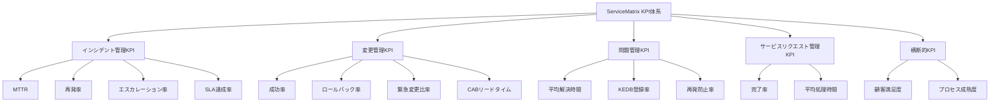

# KPI定義書（Key Performance Indicator Definition）

ServiceMatrix KPI統治仕様
Version: 1.0
Status: Active
Classification: Internal Governance Document
Applicable Standard: ITIL 4 / ISO 20000

---

## 1. 目的

本ドキュメントは、ServiceMatrixが管理するITサービス管理プロセスの
重要業績評価指標（KPI）を定義する。

KPIはプロセスの有効性・効率性を定量的に評価するための指標であり、
SLAの達成を支える基盤的な測定フレームワークである。

---

## 2. KPI体系の概要



---

## 3. インシデント管理KPI

### 3.1 MTTR（Mean Time To Repair / 平均修復時間）

| 項目 | 内容 |
|------|------|
| KPI ID | INC-KPI-001 |
| 定義 | インシデント検出から復旧完了までの平均時間 |
| 計算式 | Σ(修復時間) / インシデント件数 |
| 測定頻度 | 月次 |
| 報告先 | サービスマネージャー、運用チームリーダー |
| データソース | GitHub Issues（ラベル: `incident`） |
| 目標値（P1） | 240分以下 |
| 目標値（P2） | 1,440分以下 |
| 目標値（P3） | 4,320分以下 |
| 目標値（P4） | 10,080分以下 |
| 閾値（警告） | 目標値の80%超過 |
| 閾値（危険） | 目標値超過 |
| 改善トリガー | 3ヶ月連続で目標未達の場合、改善計画策定 |

### 3.2 再発率（Recurrence Rate）

| 項目 | 内容 |
|------|------|
| KPI ID | INC-KPI-002 |
| 定義 | 同一根本原因によるインシデントの再発割合 |
| 計算式 | 再発インシデント件数 / 総インシデント件数 x 100 |
| 測定頻度 | 月次 |
| 報告先 | 問題管理チーム、サービスマネージャー |
| データソース | GitHub Issues（ラベル: `incident/recurring`） |
| 目標値 | 5%以下 |
| 閾値（警告） | 8%超過 |
| 閾値（危険） | 10%超過 |
| 改善トリガー | 2ヶ月連続で目標未達の場合、問題管理レビュー |

### 3.3 エスカレーション率（Escalation Rate）

| 項目 | 内容 |
|------|------|
| KPI ID | INC-KPI-003 |
| 定義 | 一次対応チームで解決できず上位にエスカレーションされた割合 |
| 計算式 | エスカレーション件数 / 総インシデント件数 x 100 |
| 測定頻度 | 月次 |
| 報告先 | 運用チームリーダー、サービスデスクマネージャー |
| データソース | GitHub Issues（ラベル: `escalated`） |
| 目標値 | 20%以下 |
| 閾値（警告） | 25%超過 |
| 閾値（危険） | 30%超過 |
| 改善トリガー | 閾値超過時にナレッジベース拡充レビュー |

### 3.4 SLA達成率（SLA Compliance Rate）

| 項目 | 内容 |
|------|------|
| KPI ID | INC-KPI-004 |
| 定義 | SLA目標時間内に解決されたインシデントの割合 |
| 計算式 | SLA達成インシデント件数 / 総インシデント件数 x 100 |
| 測定頻度 | 月次 |
| 報告先 | サービスマネージャー、経営層 |
| データソース | SLA算出ロジックによる自動計算 |
| 目標値（P1） | 99% |
| 目標値（P2） | 97% |
| 目標値（P3） | 95% |
| 目標値（P4） | 90% |
| 閾値（警告） | 目標値 - 3%ポイント |
| 閾値（危険） | 目標値 - 5%ポイント |
| 改善トリガー | 1ヶ月でも目標未達の場合、是正措置策定 |

### 3.5 インシデント初回解決率（First Contact Resolution Rate）

| 項目 | 内容 |
|------|------|
| KPI ID | INC-KPI-005 |
| 定義 | 初回対応で解決されたインシデントの割合 |
| 計算式 | 初回解決インシデント件数 / 総インシデント件数 x 100 |
| 測定頻度 | 月次 |
| 報告先 | サービスデスクマネージャー |
| データソース | GitHub Issues（エスカレーションラベルなしでクローズ） |
| 目標値 | 70%以上 |
| 閾値（警告） | 60%未満 |
| 閾値（危険） | 50%未満 |

---

## 4. 変更管理KPI

### 4.1 変更成功率（Change Success Rate）

| 項目 | 内容 |
|------|------|
| KPI ID | CHG-KPI-001 |
| 定義 | 計画通りに成功裏に完了した変更の割合 |
| 計算式 | 成功変更件数 / 総変更件数 x 100 |
| 測定頻度 | 月次 |
| 報告先 | 変更マネージャー、CAB |
| データソース | GitHub Issues（ラベル: `change`） |
| 目標値 | 95%以上 |
| 閾値（警告） | 90%未満 |
| 閾値（危険） | 85%未満 |
| 改善トリガー | 2ヶ月連続未達で変更プロセスレビュー |

### 4.2 ロールバック率（Rollback Rate）

| 項目 | 内容 |
|------|------|
| KPI ID | CHG-KPI-002 |
| 定義 | ロールバックが必要となった変更の割合 |
| 計算式 | ロールバック変更件数 / 総変更件数 x 100 |
| 測定頻度 | 月次 |
| 報告先 | 変更マネージャー、サービスマネージャー |
| データソース | GitHub Issues（ラベル: `change/rollback`） |
| 目標値 | 3%以下 |
| 閾値（警告） | 5%超過 |
| 閾値（危険） | 8%超過 |
| 改善トリガー | ロールバック発生時は必ず原因分析実施 |

### 4.3 緊急変更比率（Emergency Change Ratio）

| 項目 | 内容 |
|------|------|
| KPI ID | CHG-KPI-003 |
| 定義 | 全変更に占める緊急変更の割合 |
| 計算式 | 緊急変更件数 / 総変更件数 x 100 |
| 測定頻度 | 月次 |
| 報告先 | 変更マネージャー、問題管理チーム |
| データソース | GitHub Issues（ラベル: `change/emergency`） |
| 目標値 | 10%以下 |
| 閾値（警告） | 15%超過 |
| 閾値（危険） | 20%超過 |
| 改善トリガー | 比率高騰時は根本原因分析を問題管理に依頼 |

### 4.4 CABリードタイム（CAB Lead Time）

| 項目 | 内容 |
|------|------|
| KPI ID | CHG-KPI-004 |
| 定義 | 変更要求提出からCAB承認までの平均所要時間 |
| 計算式 | Σ(CAB承認日時 - 変更要求提出日時) / 変更件数 |
| 測定頻度 | 月次 |
| 報告先 | 変更マネージャー、CAB |
| データソース | GitHub Issues タイムライン |
| 目標値 | 5営業日以内 |
| 閾値（警告） | 7営業日超過 |
| 閾値（危険） | 10営業日超過 |
| 改善トリガー | CABプロセスの効率化レビュー |

### 4.5 変更起因インシデント率（Change-Related Incident Rate）

| 項目 | 内容 |
|------|------|
| KPI ID | CHG-KPI-005 |
| 定義 | 変更実施に起因して発生したインシデントの割合 |
| 計算式 | 変更起因インシデント件数 / 総変更件数 x 100 |
| 測定頻度 | 月次 |
| 報告先 | 変更マネージャー、サービスマネージャー |
| データソース | GitHub Issues（インシデントIssueからの変更Issueリンク） |
| 目標値 | 5%以下 |
| 閾値（警告） | 8%超過 |
| 閾値（危険） | 10%超過 |

---

## 5. 問題管理KPI

### 5.1 平均解決時間（Mean Time To Resolve Problem）

| 項目 | 内容 |
|------|------|
| KPI ID | PRB-KPI-001 |
| 定義 | 問題登録から根本原因特定・解決策実施までの平均時間 |
| 計算式 | Σ(問題解決時間) / 問題件数 |
| 測定頻度 | 月次 |
| 報告先 | 問題マネージャー |
| データソース | GitHub Issues（ラベル: `problem`） |
| 目標値 | 30日以内 |
| 閾値（警告） | 45日超過 |
| 閾値（危険） | 60日超過 |
| 改善トリガー | 長期未解決問題の棚卸し（四半期） |

### 5.2 KEDB登録率（Known Error Database Registration Rate）

| 項目 | 内容 |
|------|------|
| KPI ID | PRB-KPI-002 |
| 定義 | 解決済み問題のうち、既知エラーデータベースに登録された割合 |
| 計算式 | KEDB登録件数 / 解決済み問題件数 x 100 |
| 測定頻度 | 月次 |
| 報告先 | 問題マネージャー、サービスデスクマネージャー |
| データソース | GitHub Issues（ラベル: `problem/known-error`） |
| 目標値 | 90%以上 |
| 閾値（警告） | 80%未満 |
| 閾値（危険） | 70%未満 |
| 改善トリガー | KEDB登録プロセスの見直し |

### 5.3 再発防止率（Permanent Fix Rate）

| 項目 | 内容 |
|------|------|
| KPI ID | PRB-KPI-003 |
| 定義 | 恒久対策実施後に同一根本原因の再発がなかった割合 |
| 計算式 | (恒久対策実施件数 - 再発件数) / 恒久対策実施件数 x 100 |
| 測定頻度 | 四半期 |
| 報告先 | 問題マネージャー、サービスマネージャー |
| データソース | GitHub Issues 関連付け分析 |
| 目標値 | 95%以上 |
| 閾値（警告） | 90%未満 |
| 閾値（危険） | 85%未満 |
| 改善トリガー | 再発事例の根本原因再分析 |

### 5.4 プロアクティブ問題検出率（Proactive Problem Detection Rate）

| 項目 | 内容 |
|------|------|
| KPI ID | PRB-KPI-004 |
| 定義 | インシデント発生前にプロアクティブに検出された問題の割合 |
| 計算式 | プロアクティブ検出問題件数 / 総問題件数 x 100 |
| 測定頻度 | 月次 |
| 報告先 | 問題マネージャー |
| データソース | GitHub Issues（ラベル: `problem/proactive`） |
| 目標値 | 30%以上 |
| 閾値（警告） | 20%未満 |
| 閾値（危険） | 10%未満 |

---

## 6. サービスリクエスト管理KPI

### 6.1 リクエスト完了率（Request Fulfillment Rate）

| 項目 | 内容 |
|------|------|
| KPI ID | REQ-KPI-001 |
| 定義 | 期限内に完了したサービスリクエストの割合 |
| 計算式 | 期限内完了件数 / 総リクエスト件数 x 100 |
| 測定頻度 | 月次 |
| 報告先 | サービスデスクマネージャー |
| データソース | GitHub Issues（ラベル: `request`） |
| 目標値 | 95%以上 |
| 閾値（警告） | 90%未満 |
| 閾値（危険） | 85%未満 |

### 6.2 平均処理時間（Average Fulfillment Time）

| 項目 | 内容 |
|------|------|
| KPI ID | REQ-KPI-002 |
| 定義 | リクエスト受付から完了までの平均時間 |
| 計算式 | Σ(処理時間) / リクエスト件数 |
| 測定頻度 | 月次 |
| 報告先 | サービスデスクマネージャー |
| データソース | GitHub Issues タイムライン |
| 目標値 | 2営業日以内 |
| 閾値（警告） | 3営業日超過 |
| 閾値（危険） | 5営業日超過 |

### 6.3 自動化率（Automation Rate）

| 項目 | 内容 |
|------|------|
| KPI ID | REQ-KPI-003 |
| 定義 | 自動化によって処理されたリクエストの割合 |
| 計算式 | 自動処理リクエスト件数 / 総リクエスト件数 x 100 |
| 測定頻度 | 月次 |
| 報告先 | サービスマネージャー |
| データソース | GitHub Actions 実行ログ |
| 目標値 | 40%以上（段階的向上） |
| 閾値（警告） | 前月比5%以上低下 |

---

## 7. 横断的KPI

### 7.1 顧客満足度（Customer Satisfaction Score）

| 項目 | 内容 |
|------|------|
| KPI ID | GEN-KPI-001 |
| 定義 | サービス利用者の満足度スコア |
| 計算式 | 満足度アンケートの平均スコア（5段階） |
| 測定頻度 | 四半期 |
| 報告先 | サービスマネージャー、経営層 |
| 目標値 | 4.0以上（5段階中） |

### 7.2 プロセス成熟度（Process Maturity Level）

| 項目 | 内容 |
|------|------|
| KPI ID | GEN-KPI-002 |
| 定義 | ITILプロセス成熟度（5段階評価） |
| 計算式 | 成熟度評価フレームワークによるアセスメント |
| 測定頻度 | 年次 |
| 報告先 | 経営層 |
| 目標値 | レベル3（Defined）以上 |

---

## 8. KPIダッシュボード構成

### 8.1 ダッシュボードビュー

| ビュー | 内容 | 更新頻度 |
|--------|------|----------|
| エグゼクティブサマリ | 全KPIの総合スコア + P1/P2の主要指標 | 日次 |
| インシデント管理 | INC-KPI-001〜005 のトレンド | リアルタイム |
| 変更管理 | CHG-KPI-001〜005 のトレンド | 日次 |
| 問題管理 | PRB-KPI-001〜004 のトレンド | 週次 |
| サービスリクエスト | REQ-KPI-001〜003 のトレンド | 日次 |

### 8.2 アラートルール

| 条件 | アクション |
|------|-----------|
| KPIが警告閾値超過 | ダッシュボード上で黄色表示 + チームリーダー通知 |
| KPIが危険閾値超過 | ダッシュボード上で赤色表示 + マネージャー通知 + 改善Issue自動作成 |
| KPIが3ヶ月連続目標未達 | 改善計画策定Issue自動作成 + QBRアジェンダ追加 |

---

## 9. KPI報告テンプレート

### 9.1 月次KPIレポート構成

```
# KPI月次レポート - YYYY年MM月

## 1. エグゼクティブサマリ
- 全体KPI達成率: XX.X%
- 主要アラート: N件
- 改善進捗: N件中N件完了

## 2. プロセス別KPI一覧
### インシデント管理
| KPI ID | 指標名 | 目標値 | 実績値 | 達成状況 | トレンド |
|--------|--------|--------|--------|---------|---------|

### 変更管理
| KPI ID | 指標名 | 目標値 | 実績値 | 達成状況 | トレンド |
|--------|--------|--------|--------|---------|---------|

### 問題管理
| KPI ID | 指標名 | 目標値 | 実績値 | 達成状況 | トレンド |
|--------|--------|--------|--------|---------|---------|

### サービスリクエスト管理
| KPI ID | 指標名 | 目標値 | 実績値 | 達成状況 | トレンド |
|--------|--------|--------|--------|---------|---------|

## 3. 閾値超過アラート詳細
（対象KPI、原因分析、対策状況）

## 4. 改善アクション一覧
（アクション、担当、期限、進捗）

## 5. 次月の重点項目
```

---

## 10. 関連ドキュメント

| ドキュメント | 参照先 |
|-------------|--------|
| SLA定義書 | `docs/07_sla_metrics/SLA_DEFINITION.md` |
| SLA算出ロジック | `docs/07_sla_metrics/SLA_CALCULATION_LOGIC.md` |
| OLA定義 | `docs/07_sla_metrics/OLA_DEFINITION.md` |
| メトリクス収集モデル | `docs/07_sla_metrics/METRICS_COLLECTION_MODEL.md` |
| SLA違反対応モデル | `docs/07_sla_metrics/SLA_BREACH_HANDLING_MODEL.md` |

---

## 11. 改定履歴

| 版数 | 日付 | 変更内容 | 承認者 |
|------|------|----------|--------|
| 1.0 | 2026-03-02 | 初版作成 | Service Governance Authority |

---

本ドキュメントはServiceMatrix統治フレームワークの一部であり、
SERVICEMATRIX_CHARTER.md に定められた統治原則に従う。
