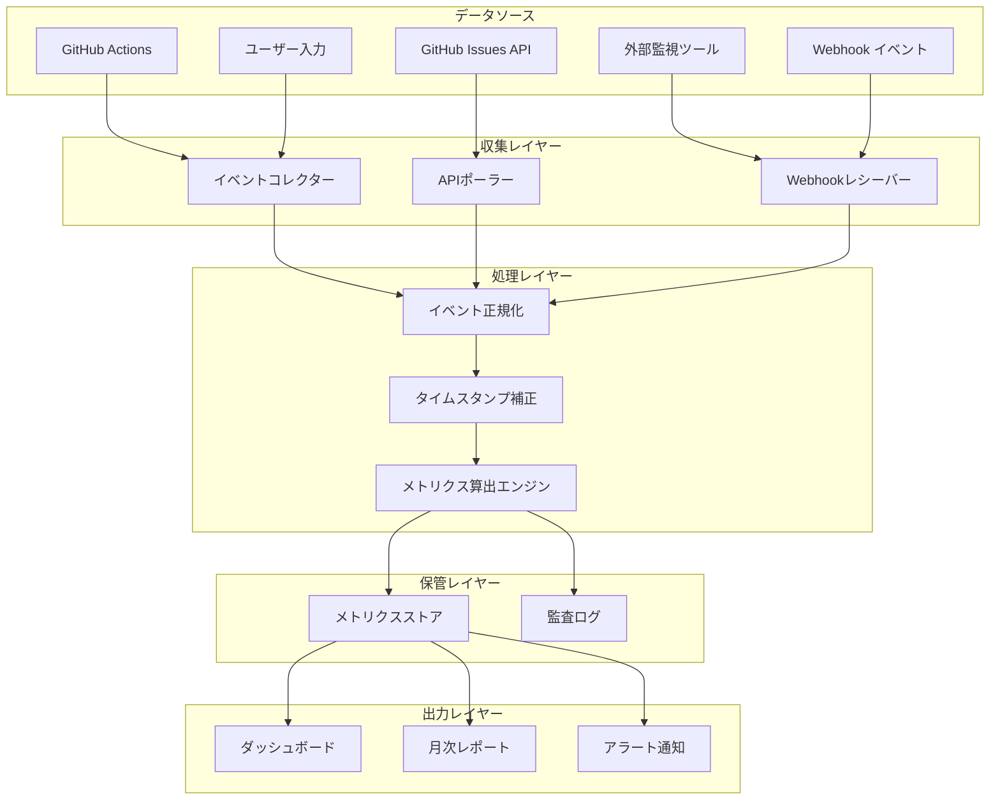
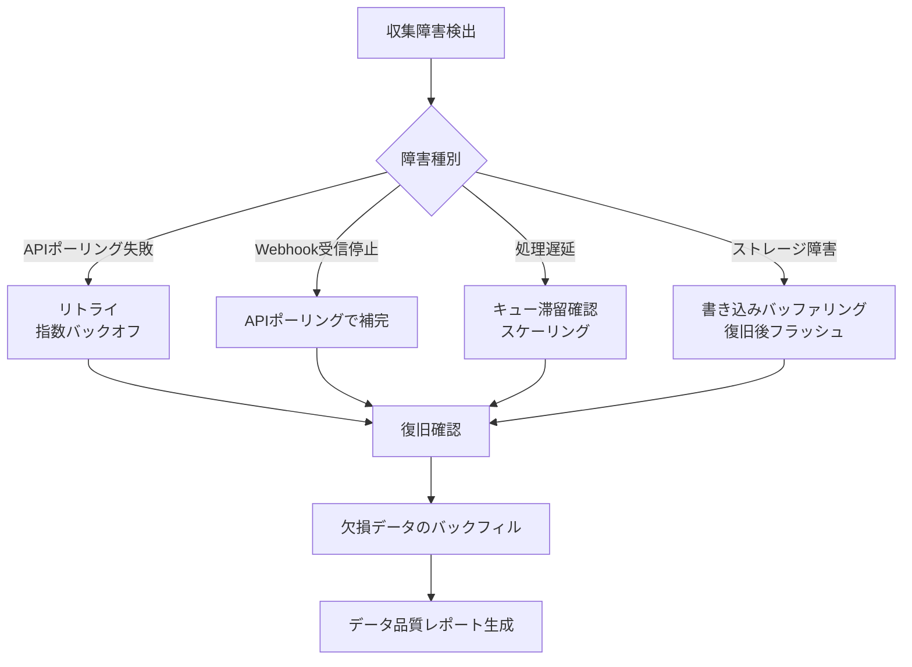

# メトリクス収集モデル（Metrics Collection Model）

ServiceMatrix メトリクス収集仕様
Version: 1.0
Status: Active
Classification: Internal Technical Document
Applicable Standard: ITIL 4 / ISO 20000

---

## 1. 目的

本ドキュメントは、ServiceMatrixにおけるメトリクスデータの
収集方法、収集ポイント、データフロー、保管方式を定義する。

正確なSLA測定とKPI算出の基盤となるメトリクス収集の一貫性と
信頼性を保証することを目的とする。

---

## 2. メトリクス収集アーキテクチャ

### 2.1 全体データフロー



---

## 3. メトリクス分類

### 3.1 メトリクス種別

| 種別 | 説明 | 例 |
|------|------|-----|
| カウンターメトリクス | 累積カウント値（単調増加） | インシデント発生件数、変更完了件数 |
| ゲージメトリクス | 現在値（増減あり） | オープンインシデント数、進行中変更数 |
| ヒストグラムメトリクス | 分布情報 | 解決時間の分布、応答時間の分布 |
| タイマーメトリクス | 時間計測値 | MTTR、MTTA、MTBF |
| 比率メトリクス | 割合 | SLA達成率、変更成功率 |

### 3.2 メトリクス一覧

| メトリクスID | 名称 | 種別 | 収集頻度 | データソース |
|-------------|------|------|----------|-------------|
| MET-INC-001 | インシデント発生件数 | カウンター | リアルタイム | GitHub Issues |
| MET-INC-002 | オープンインシデント数 | ゲージ | 15分ごと | GitHub Issues |
| MET-INC-003 | インシデント解決時間 | タイマー | イベント駆動 | GitHub Issues タイムライン |
| MET-INC-004 | インシデント応答時間 | タイマー | イベント駆動 | GitHub Issues タイムライン |
| MET-INC-005 | SLA達成率 | 比率 | 日次 | SLA算出エンジン |
| MET-INC-006 | 優先度別インシデント分布 | ヒストグラム | 日次 | GitHub Issues |
| MET-CHG-001 | 変更実施件数 | カウンター | リアルタイム | GitHub Issues |
| MET-CHG-002 | 変更成功率 | 比率 | 月次 | GitHub Issues |
| MET-CHG-003 | 変更リードタイム | タイマー | イベント駆動 | GitHub Issues タイムライン |
| MET-CHG-004 | 緊急変更件数 | カウンター | リアルタイム | GitHub Issues |
| MET-PRB-001 | 問題登録件数 | カウンター | リアルタイム | GitHub Issues |
| MET-PRB-002 | 問題解決時間 | タイマー | イベント駆動 | GitHub Issues タイムライン |
| MET-PRB-003 | KEDB登録件数 | カウンター | イベント駆動 | GitHub Issues |
| MET-REQ-001 | リクエスト受付件数 | カウンター | リアルタイム | GitHub Issues |
| MET-REQ-002 | リクエスト処理時間 | タイマー | イベント駆動 | GitHub Issues タイムライン |
| MET-SLA-001 | サービス可用性 | 比率 | 15分ごと | 監視ツール + GitHub Issues |
| MET-SLA-002 | MTTR | タイマー | 日次 | SLA算出エンジン |
| MET-SLA-003 | MTBF | タイマー | 月次 | SLA算出エンジン |

---

## 4. 収集メカニズム

### 4.1 GitHub Issues APIポーリング

| 項目 | 設定値 |
|------|--------|
| ポーリング間隔 | 15分（通常）/ 5分（P1インシデント発生時） |
| APIエンドポイント | `GET /repos/{owner}/{repo}/issues` |
| フィルタ | `state=all&labels=incident,change,problem,request` |
| ページネーション | 100件/ページ、全件取得 |
| レート制限対応 | X-RateLimit-Remaining 監視、残り100未満で間隔延長 |

### 4.2 GitHub Webhook受信

| イベント | 用途 |
|----------|------|
| `issues.opened` | 新規Issue作成の検出 |
| `issues.closed` | Issue解決の検出 |
| `issues.labeled` | ラベル変更の検出（優先度変更、SLA違反等） |
| `issues.assigned` | アサイン変更の検出（初動応答の判定） |
| `issue_comment.created` | コメント追加の検出（応答タイミングの判定） |
| `pull_request.merged` | PR Merge の検出（変更完了の判定） |

### 4.3 Webhook ペイロード処理

```json
{
  "webhook_config": {
    "content_type": "json",
    "secret": "${WEBHOOK_SECRET}",
    "events": [
      "issues",
      "issue_comment",
      "pull_request"
    ],
    "active": true
  }
}
```

### 4.4 GitHub Actionsスケジュール収集

| ワークフロー | スケジュール | 収集内容 |
|-------------|------------|---------|
| metrics-collect-realtime | `*/15 * * * *` | オープンIssue数、SLAタイマーチェック |
| metrics-collect-daily | `0 0 * * *` | 日次サマリ、SLA達成率算出 |
| metrics-collect-weekly | `0 0 * * 1` | 週次トレンド分析 |
| metrics-collect-monthly | `0 0 1 * *` | 月次SLAスコアカード、KPIレポート生成 |

---

## 5. データ正規化

### 5.1 タイムスタンプ正規化

| 入力形式 | 正規化後 | ルール |
|----------|---------|--------|
| ISO 8601（UTC） | ISO 8601（JST） | UTC+9に変換 |
| Unix Epoch | ISO 8601（JST） | 秒→日時変換後JST化 |
| 相対時間（GitHub "2 hours ago"） | ISO 8601（JST） | API created_at/updated_at を使用 |

### 5.2 ステータスマッピング

GitHub Issue のラベルからServiceMatrixの内部ステータスへの変換ルール。

| GitHub ラベル | ServiceMatrix ステータス | 備考 |
|--------------|------------------------|------|
| `status/new` | NEW | 新規起票 |
| `status/acknowledged` | ACKNOWLEDGED | 受付済み |
| `status/in-progress` | IN_PROGRESS | 対応中 |
| `status/pending` | PENDING | 待機中（外部依存） |
| `status/workaround` | WORKAROUND_APPLIED | 暫定対処済み |
| `status/resolved` | RESOLVED | 解決済み |
| Issue closed | CLOSED | クローズ |

### 5.3 優先度マッピング

| GitHub ラベル | ServiceMatrix 優先度 |
|--------------|---------------------|
| `priority/p1-critical` | P1 |
| `priority/p2-high` | P2 |
| `priority/p3-medium` | P3 |
| `priority/p4-low` | P4 |
| ラベルなし | P4（デフォルト） |

---

## 6. メトリクスデータモデル

### 6.1 メトリクスレコード JSON Schema

```json
{
  "$schema": "http://json-schema.org/draft-07/schema#",
  "title": "Metrics Record",
  "type": "object",
  "required": ["metric_id", "metric_type", "value", "timestamp", "source"],
  "properties": {
    "metric_id": {
      "type": "string",
      "pattern": "^MET-[A-Z]+-[0-9]{3}$",
      "description": "メトリクスID"
    },
    "metric_type": {
      "type": "string",
      "enum": ["counter", "gauge", "histogram", "timer", "ratio"],
      "description": "メトリクス種別"
    },
    "value": {
      "type": "number",
      "description": "メトリクス値"
    },
    "unit": {
      "type": "string",
      "enum": ["count", "minutes", "hours", "percent", "score"],
      "description": "単位"
    },
    "timestamp": {
      "type": "string",
      "format": "date-time",
      "description": "測定日時（ISO 8601 JST）"
    },
    "source": {
      "type": "string",
      "description": "データソース"
    },
    "dimensions": {
      "type": "object",
      "properties": {
        "service_id": { "type": "string" },
        "priority": { "type": "string", "enum": ["P1", "P2", "P3", "P4"] },
        "team_id": { "type": "string" },
        "process_type": { "type": "string", "enum": ["incident", "change", "problem", "request"] }
      },
      "description": "メトリクスのディメンション（分析軸）"
    },
    "tags": {
      "type": "array",
      "items": { "type": "string" },
      "description": "メタデータタグ"
    }
  }
}
```

### 6.2 集約メトリクス JSON Schema

```json
{
  "$schema": "http://json-schema.org/draft-07/schema#",
  "title": "Aggregated Metrics",
  "type": "object",
  "required": ["metric_id", "period_start", "period_end", "aggregation_type", "value"],
  "properties": {
    "metric_id": {
      "type": "string",
      "description": "メトリクスID"
    },
    "period_start": {
      "type": "string",
      "format": "date-time",
      "description": "集約期間開始"
    },
    "period_end": {
      "type": "string",
      "format": "date-time",
      "description": "集約期間終了"
    },
    "aggregation_type": {
      "type": "string",
      "enum": ["sum", "avg", "min", "max", "count", "percentile_50", "percentile_90", "percentile_95", "percentile_99"],
      "description": "集約方法"
    },
    "value": {
      "type": "number",
      "description": "集約値"
    },
    "sample_count": {
      "type": "integer",
      "description": "サンプル数"
    },
    "dimensions": {
      "type": "object",
      "description": "ディメンション"
    }
  }
}
```

---

## 7. データ品質管理

### 7.1 品質チェックルール

| チェック項目 | ルール | 対処 |
|-------------|--------|------|
| タイムスタンプ整合性 | 未来の日時でないこと | 破棄 + アラート |
| 値の範囲チェック | 可用性: 0-100%、件数: 0以上 | 破棄 + アラート |
| 重複チェック | 同一metric_id + timestampの重複 | 後着を破棄 |
| 欠損チェック | 必須フィールドの存在 | 破棄 + アラート |
| ギャップ検出 | 収集間隔の2倍以上の空白 | ギャップアラート発行 |

### 7.2 データ補完ルール

| 状況 | 補完方法 |
|------|---------|
| 短時間のデータ欠損（15分以内） | 前後の値で線形補間 |
| 長時間のデータ欠損（15分超過） | 欠損として記録、集約計算時に除外 |
| ステータス変更の欠落 | GitHub API再取得でバックフィル |

---

## 8. 保管ポリシー

### 8.1 データ保持期間

| データ種別 | 粒度 | 保持期間 |
|-----------|------|---------|
| 生メトリクス | 個別イベント | 90日 |
| 15分集約 | 15分間隔の集約値 | 1年 |
| 日次集約 | 日次の集約値 | 3年 |
| 月次集約 | 月次の集約値 | 7年（監査要件） |
| SLAスコアカード | 月次 | 7年（監査要件） |

### 8.2 アーカイブ方式

| フェーズ | 保管場所 | 形式 |
|---------|---------|------|
| アクティブ | メトリクスストア | JSON |
| アーカイブ（1年後） | GitHub Releases / オブジェクトストレージ | 圧縮JSON |
| 長期保管（3年後） | オブジェクトストレージ（コールド） | 圧縮JSON |

---

## 9. 収集の監視

### 9.1 ヘルスチェック

| チェック項目 | 頻度 | 閾値 |
|-------------|------|------|
| APIポーリング成功率 | 15分ごと | 95%未満でアラート |
| Webhook受信率 | 1時間ごと | 想定イベント数の80%未満でアラート |
| データ処理遅延 | 15分ごと | 5分超過でアラート |
| ストレージ使用率 | 日次 | 80%超過でアラート |

### 9.2 収集システム障害時の対応



---

## 10. 関連ドキュメント

| ドキュメント | 参照先 |
|-------------|--------|
| SLA定義書 | `docs/07_sla_metrics/SLA_DEFINITION.md` |
| SLA算出ロジック | `docs/07_sla_metrics/SLA_CALCULATION_LOGIC.md` |
| KPI定義 | `docs/07_sla_metrics/KPI_DEFINITION.md` |
| イベントスキーマ | `docs/11_data_model/EVENT_SCHEMA.md` |
| データ保持ポリシー | `docs/11_data_model/DATA_RETENTION_POLICY.md` |

---

## 11. 改定履歴

| 版数 | 日付 | 変更内容 | 承認者 |
|------|------|----------|--------|
| 1.0 | 2026-03-02 | 初版作成 | Service Governance Authority |

---

本ドキュメントはServiceMatrix統治フレームワークの一部であり、
SERVICEMATRIX_CHARTER.md に定められた統治原則に従う。
