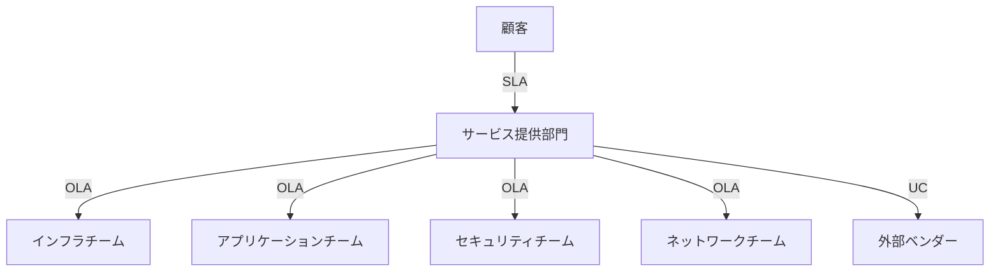
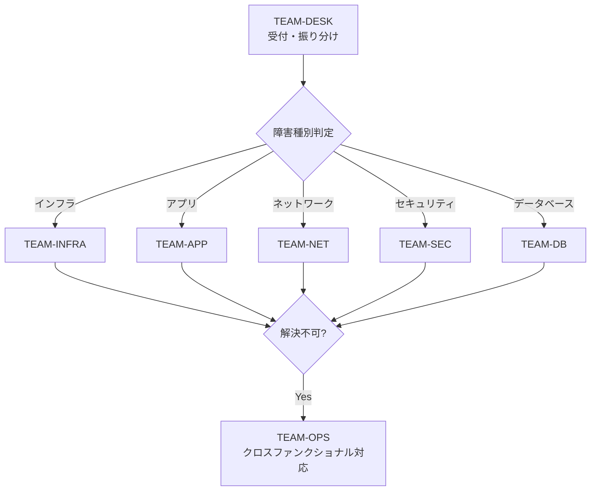
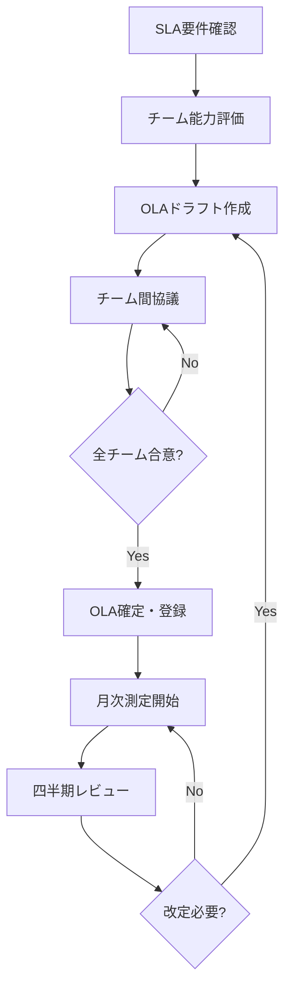

# OLA定義書（Operational Level Agreement Definition）

ServiceMatrix OLA統治仕様
Version: 1.0
Status: Active
Classification: Internal Governance Document
Applicable Standard: ITIL 4 / ISO 20000

---

## 1. 目的

本ドキュメントは、ServiceMatrixが管理するITサービスに対する
運用レベルアグリーメント（OLA）を定義する。

OLAは組織内部のサポートチーム間で締結される合意であり、
SLAを達成するために各チームが果たすべき責任と応答基準を規定する。

---

## 2. SLAとOLAの関係



| 合意種別 | 当事者 | 目的 |
|----------|--------|------|
| SLA | サービス提供者 - 顧客 | サービスレベルの保証 |
| OLA | 社内チーム間 | SLA達成のための内部コミットメント |
| UC（Underpinning Contract） | サービス提供者 - 外部ベンダー | 外部サービスのレベル保証 |

---

## 3. OLA対象チーム

### 3.1 チーム一覧

| チームID | チーム名 | 責任範囲 | GitHub Team |
|----------|---------|----------|-------------|
| TEAM-INFRA | インフラストラクチャチーム | サーバー、VM、ストレージ、OS | `@org/infra-team` |
| TEAM-APP | アプリケーションチーム | アプリケーション、API、ミドルウェア | `@org/app-team` |
| TEAM-NET | ネットワークチーム | ネットワーク機器、DNS、ロードバランサ | `@org/net-team` |
| TEAM-SEC | セキュリティチーム | 認証基盤、脆弱性対応、アクセス制御 | `@org/sec-team` |
| TEAM-DB | データベースチーム | RDBMS、NoSQL、バックアップ | `@org/db-team` |
| TEAM-OPS | 運用監視チーム | 監視、アラート、一次対応 | `@org/ops-team` |
| TEAM-DESK | サービスデスク | 受付、振り分け、エスカレーション | `@org/service-desk` |

---

## 4. OLA定義テーブル

### 4.1 P1: Critical インシデント対応OLA

| OLA項目 | TEAM-OPS | TEAM-INFRA | TEAM-APP | TEAM-NET | TEAM-SEC | TEAM-DB |
|---------|----------|-----------|----------|----------|----------|---------|
| 初動応答 | 10分 | 15分 | 15分 | 15分 | 15分 | 15分 |
| エスカレーション判断 | 15分 | 30分 | 30分 | 30分 | 30分 | 30分 |
| 診断開始 | 即時 | 20分 | 20分 | 20分 | 20分 | 20分 |
| 暫定対処完了 | 30分 | 60分 | 60分 | 60分 | 45分 | 60分 |
| 恒久対処完了 | - | 180分 | 180分 | 180分 | 120分 | 180分 |
| 対応報告 | 30分ごと | 30分ごと | 30分ごと | 30分ごと | 30分ごと | 30分ごと |

### 4.2 P2: High インシデント対応OLA

| OLA項目 | TEAM-OPS | TEAM-INFRA | TEAM-APP | TEAM-NET | TEAM-SEC | TEAM-DB |
|---------|----------|-----------|----------|----------|----------|---------|
| 初動応答 | 30分 | 60分 | 60分 | 60分 | 60分 | 60分 |
| エスカレーション判断 | 60分 | 120分 | 120分 | 120分 | 120分 | 120分 |
| 診断開始 | 30分 | 90分 | 90分 | 90分 | 90分 | 90分 |
| 暫定対処完了 | 120分 | 480分 | 480分 | 480分 | 360分 | 480分 |
| 恒久対処完了 | - | 1,440分 | 1,440分 | 1,440分 | 1,080分 | 1,440分 |
| 対応報告 | 2時間ごと | 2時間ごと | 2時間ごと | 2時間ごと | 2時間ごと | 2時間ごと |

### 4.3 P3: Medium インシデント対応OLA

| OLA項目 | TEAM-OPS | TEAM-INFRA | TEAM-APP | TEAM-NET | TEAM-SEC | TEAM-DB |
|---------|----------|-----------|----------|----------|----------|---------|
| 初動応答 | 2時間 | 4時間 | 4時間 | 4時間 | 4時間 | 4時間 |
| エスカレーション判断 | 4時間 | 8時間 | 8時間 | 8時間 | 8時間 | 8時間 |
| 診断開始 | 4時間 | 8時間 | 8時間 | 8時間 | 8時間 | 8時間 |
| 暫定対処完了 | 24時間 | 48時間 | 48時間 | 48時間 | 36時間 | 48時間 |
| 恒久対処完了 | - | 72時間 | 72時間 | 72時間 | 72時間 | 72時間 |
| 対応報告 | 日次 | 日次 | 日次 | 日次 | 日次 | 日次 |

### 4.4 P4: Low インシデント対応OLA

| OLA項目 | TEAM-OPS | TEAM-INFRA | TEAM-APP | TEAM-NET | TEAM-SEC | TEAM-DB |
|---------|----------|-----------|----------|----------|----------|---------|
| 初動応答 | 8時間 | 24時間 | 24時間 | 24時間 | 24時間 | 24時間 |
| エスカレーション判断 | 24時間 | 48時間 | 48時間 | 48時間 | 48時間 | 48時間 |
| 診断開始 | 24時間 | 48時間 | 48時間 | 48時間 | 48時間 | 48時間 |
| 暫定対処完了 | 72時間 | 120時間 | 120時間 | 120時間 | 96時間 | 120時間 |
| 恒久対処完了 | - | 168時間 | 168時間 | 168時間 | 168時間 | 168時間 |
| 対応報告 | 週次 | 週次 | 週次 | 週次 | 週次 | 週次 |

---

## 5. エスカレーション定義

### 5.1 機能エスカレーション

別の専門チームへの技術的なエスカレーション。



### 5.2 階層エスカレーション

管理層への報告エスカレーション。

| レベル | トリガー条件 | エスカレーション先 | 対応期限 |
|--------|------------|-------------------|----------|
| Level 1 | OLA初動応答超過 | チームリーダー | 即時 |
| Level 2 | OLA暫定対処超過 | 部門マネージャー | 30分以内 |
| Level 3 | SLA違反リスク（残り25%） | サービスマネージャー | 15分以内 |
| Level 4 | SLA違反確定 | CTO / サービスオーナー | 即時 |

---

## 6. OLA測定と報告

### 6.1 OLA測定ポイント

| 測定項目 | 測定方法 | データソース |
|----------|---------|-------------|
| 初動応答時間 | Issue アサイン〜初回コメントの差分 | GitHub Issue タイムライン |
| エスカレーション時間 | ラベル変更タイムスタンプ | GitHub Issue イベント |
| 暫定対処時間 | `status/workaround` ラベル付与時刻 | GitHub Issue ラベル |
| 恒久対処時間 | Issue クローズ時刻 | GitHub Issue |
| 報告遵守率 | 規定間隔でのコメント有無 | GitHub Issue コメント |

### 6.2 OLAスコアカード（月次）

各チームについて以下を算出する。

```
チームOLAスコア = OLA達成件数 / OLA対象件数 x 100
```

| 評価 | スコア範囲 | アクション |
|------|-----------|-----------|
| Excellent | 95%以上 | 継続 |
| Good | 90-94% | 軽微改善 |
| Needs Improvement | 80-89% | 改善計画策定 |
| Critical | 80%未満 | 緊急改善 + 経営報告 |

### 6.3 OLA報告形式

```
# OLA月次レポート - YYYY年MM月 - [チーム名]

## 1. サマリ
- OLA対象インシデント数: N
- OLA達成数: N
- OLA違反数: N
- OLAスコア: XX.X%

## 2. 優先度別OLA達成状況
| 優先度 | 対象数 | 達成数 | 違反数 |
|--------|--------|--------|--------|

## 3. OLA違反詳細
（違反事例、原因、改善策）

## 4. 改善アクション
（次月に向けた改善計画）
```

---

## 7. OLAと変更管理

### 7.1 変更作業のOLA

| 変更種別 | 初回レビュー | 影響分析完了 | 実施完了 | 事後レビュー |
|----------|------------|------------|---------|------------|
| 標準変更 | 2営業日 | 不要 | 5営業日 | 3営業日 |
| 通常変更 | 3営業日 | 5営業日 | CAB承認後10営業日 | 5営業日 |
| 緊急変更 | 2時間 | 4時間 | 承認後即時 | 翌営業日 |

### 7.2 変更作業のチーム間OLA

| フェーズ | 担当チーム | OLA |
|----------|-----------|-----|
| 技術レビュー | 該当技術チーム | 変更提出から3営業日以内にレビュー完了 |
| テスト環境準備 | TEAM-INFRA | レビュー承認から2営業日以内 |
| テスト実施 | 変更申請チーム | 環境準備完了から5営業日以内 |
| 本番展開 | TEAM-OPS + 該当チーム | CAB承認から2営業日以内（緊急: 即時） |

---

## 8. サービスリクエストのOLA

### 8.1 リクエスト種別別OLA

| リクエスト種別 | 処理チーム | 受付確認 | 処理完了 |
|---------------|-----------|---------|---------|
| アカウント作成 | TEAM-SEC | 1時間 | 4時間（営業時間内） |
| アクセス権変更 | TEAM-SEC | 1時間 | 8時間（営業時間内） |
| VM作成 | TEAM-INFRA | 2時間 | 2営業日 |
| ソフトウェアインストール | TEAM-APP | 2時間 | 1営業日 |
| ネットワーク変更 | TEAM-NET | 2時間 | 3営業日 |
| DB作成 | TEAM-DB | 2時間 | 2営業日 |
| 情報照会 | TEAM-DESK | 30分 | 4時間（営業時間内） |

---

## 9. OLAライフサイクル

### 9.1 OLA策定・改定フロー



### 9.2 OLA変更管理

OLAの変更は以下の手順で行う。

1. 変更理由を記載したIssueを作成（ラベル: `ola/change-request`）
2. 影響を受けるチームとの協議
3. 関連するSLAへの影響分析
4. ステークホルダー承認
5. PR作成でOLA定義ファイルを更新
6. Merge後、チームへ周知

---

## 10. GitHub Issues連携

### 10.1 OLA関連ラベル

| ラベル | 用途 |
|--------|------|
| `ola/team-infra` | インフラチームOLA適用 |
| `ola/team-app` | アプリケーションチームOLA適用 |
| `ola/team-net` | ネットワークチームOLA適用 |
| `ola/team-sec` | セキュリティチームOLA適用 |
| `ola/team-db` | データベースチームOLA適用 |
| `ola/team-ops` | 運用監視チームOLA適用 |
| `ola/breached` | OLA違反検出 |
| `ola/at-risk` | OLA違反リスク |
| `ola/change-request` | OLA変更要求 |

---

## 11. 関連ドキュメント

| ドキュメント | 参照先 |
|-------------|--------|
| SLA定義書 | `docs/07_sla_metrics/SLA_DEFINITION.md` |
| SLA算出ロジック | `docs/07_sla_metrics/SLA_CALCULATION_LOGIC.md` |
| KPI定義 | `docs/07_sla_metrics/KPI_DEFINITION.md` |
| SLA違反対応モデル | `docs/07_sla_metrics/SLA_BREACH_HANDLING_MODEL.md` |

---

## 12. 改定履歴

| 版数 | 日付 | 変更内容 | 承認者 |
|------|------|----------|--------|
| 1.0 | 2026-03-02 | 初版作成 | Service Governance Authority |

---

本ドキュメントはServiceMatrix統治フレームワークの一部であり、
SERVICEMATRIX_CHARTER.md に定められた統治原則に従う。
