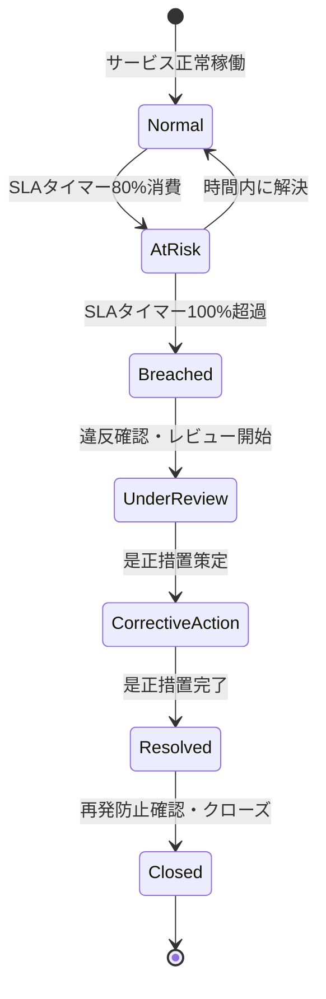
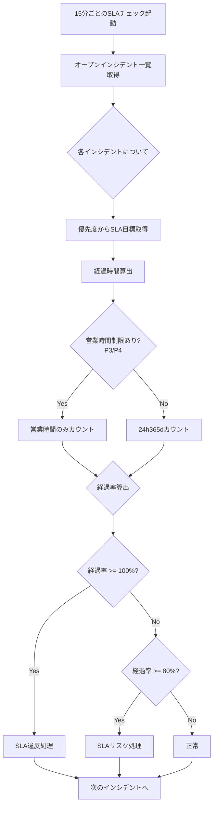
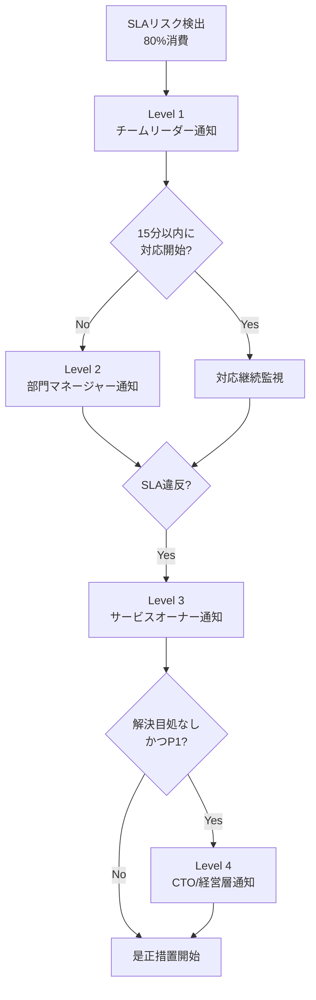
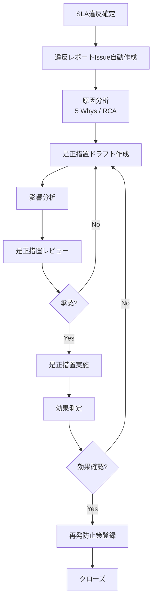

# SLA違反対応モデル（SLA Breach Handling Model）

ServiceMatrix SLA違反対応仕様
Version: 1.0
Status: Active
Classification: Internal Governance Document
Applicable Standard: ITIL 4 / ISO 20000

---

## 1. 目的

本ドキュメントは、ServiceMatrixにおけるSLA違反の検出、通知、
エスカレーション、是正措置、再発防止までの対応プロセスを定義する。

SLA違反は統治軸の重大イベントであり、
すべての違反は記録・追跡・改善のサイクルに組み込まれる。

---

## 2. SLA違反の定義

### 2.1 違反の種類

| 違反種別 | 定義 | 重大度 |
|----------|------|--------|
| 可用性違反 | 月間可用性がSLA目標値を下回った | 重大 |
| 初動応答違反 | 初動応答時間がSLA目標を超過した | 高 |
| 解決時間違反 | 解決時間がSLA目標を超過した | 高 |
| 報告義務違反 | 規定の報告が実施されなかった | 中 |
| OLA違反 | 内部OLAの目標を超過した（SLAにはまだ影響なし） | 低〜中 |

### 2.2 違反状態の遷移



---

## 3. SLA違反検出メカニズム

### 3.1 リアルタイム検出

| 検出ポイント | トリガー | チェック間隔 |
|-------------|---------|-------------|
| SLAタイマー50%消費 | 注意レベル（ログ記録のみ） | 15分ごと |
| SLAタイマー80%消費 | `sla/at-risk` ラベル付与 + 通知 | 15分ごと |
| SLAタイマー100%超過 | `sla/breached` ラベル付与 + エスカレーション | 15分ごと |

### 3.2 検出ロジック



### 3.3 月次可用性違反の検出

| チェックタイミング | 方法 |
|------------------|------|
| 月末（最終日23:59:59 JST） | 月間ダウンタイム合計を集計し、可用性を算出 |
| 翌月1日バッチ処理 | SLA算出ロジックで確定値を算出 |

---

## 4. 違反通知フロー

### 4.1 通知マトリクス

| 違反種別 | 優先度 | 即時通知先 | 追加通知先（1時間以内） |
|----------|--------|-----------|---------------------|
| 可用性違反 | P1 | サービスオーナー + CTO | 経営層 |
| 可用性違反 | P2 | サービスオーナー | サービスマネージャー |
| 可用性違反 | P3/P4 | サービスマネージャー | - |
| 初動応答違反 | P1 | チームリーダー + サービスオーナー | サービスマネージャー |
| 初動応答違反 | P2 | チームリーダー | サービスマネージャー |
| 初動応答違反 | P3/P4 | チームリーダー | - |
| 解決時間違反 | P1 | サービスオーナー + CTO | 経営層 |
| 解決時間違反 | P2 | サービスオーナー | サービスマネージャー |
| 解決時間違反 | P3/P4 | サービスマネージャー | - |

### 4.2 通知方法

| 方法 | 用途 | 備考 |
|------|------|------|
| GitHub Issue コメント | すべての違反 | 自動生成コメント |
| GitHub Issue ラベル | すべての違反 | `sla/breached` ラベル付与 |
| GitHub Mention | P1/P2違反 | 通知先をメンション |
| Webhook通知 | P1違反 | 外部通知サービス連携 |

### 4.3 違反通知テンプレート

```markdown
## SLA違反通知

| 項目 | 内容 |
|------|------|
| 違反種別 | [初動応答違反 / 解決時間違反 / 可用性違反] |
| インシデント | #[Issue番号] |
| サービス | [サービス名] |
| 優先度 | [P1/P2/P3/P4] |
| SLA目標 | [目標値] |
| 実績値 | [実績値] |
| 超過時間 | [超過分] |
| 検出日時 | [日時] |

### 必要なアクション
1. 原因の確認
2. 是正措置の検討
3. 是正措置Issue の作成（期限: [3営業日以内]）

cc: @[通知先]
```

---

## 5. エスカレーションプロセス

### 5.1 エスカレーション段階



### 5.2 エスカレーション閾値詳細

| レベル | トリガー | 対応者 | 期待アクション | タイムリミット |
|--------|---------|--------|--------------|-------------|
| Level 1 | SLAタイマー80%消費 | チームリーダー | リソース追加・優先度調整 | 15分 |
| Level 2 | Level 1対応なし or SLAタイマー90%消費 | 部門マネージャー | クロスチーム調整 | 15分 |
| Level 3 | SLA違反確定 | サービスオーナー | 是正措置承認 | 30分 |
| Level 4 | P1で解決目処なし | CTO / 経営層 | 組織的対応判断 | 即時 |

---

## 6. 是正措置プロセス

### 6.1 是正措置フロー



### 6.2 是正措置Issue テンプレート

```markdown
# SLA違反 是正措置 - [サービス名] - [YYYY/MM]

## 1. 違反サマリ
| 項目 | 内容 |
|------|------|
| 対象サービス | |
| 違反種別 | |
| SLA目標 | |
| 実績 | |
| 影響期間 | |
| 影響ユーザー数 | |

## 2. 原因分析（Root Cause Analysis）
### 直接原因

### 根本原因（5 Whys）
1. Why:
2. Why:
3. Why:
4. Why:
5. Why:

## 3. 是正措置
| # | 措置内容 | 担当 | 期限 | ステータス |
|---|---------|------|------|-----------|
| 1 | | | | |
| 2 | | | | |

## 4. 再発防止策
| # | 防止策 | 担当 | 期限 | ステータス |
|---|--------|------|------|-----------|
| 1 | | | | |

## 5. 効果測定
| 指標 | 是正前 | 目標 | 是正後 |
|------|--------|------|--------|
| | | | |

Labels: `sla/breached`, `corrective-action`
```

### 6.3 是正措置の期限

| 違反の重大度 | 原因分析完了 | 是正措置策定 | 是正措置実施 | 効果測定 |
|-------------|------------|------------|------------|---------|
| 重大（P1可用性違反） | 3営業日 | 5営業日 | 10営業日 | 30日後 |
| 高（P2違反） | 5営業日 | 7営業日 | 15営業日 | 30日後 |
| 中（P3違反） | 7営業日 | 10営業日 | 20営業日 | 60日後 |
| 低（P4違反） | 10営業日 | 15営業日 | 30営業日 | 90日後 |

---

## 7. 再発防止フレームワーク

### 7.1 再発防止カテゴリ

| カテゴリ | 具体例 |
|----------|--------|
| プロセス改善 | エスカレーションルールの見直し、チェックリスト追加 |
| 技術的改善 | 冗長構成の追加、監視強化、自動復旧の追加 |
| 人材・体制改善 | トレーニング実施、体制見直し、スキルマトリクス更新 |
| ツール改善 | 監視ツールの改善、自動化の追加 |
| ドキュメント改善 | 手順書の更新、ナレッジベースの拡充 |

### 7.2 再発防止策の登録

すべての再発防止策は以下の形式で記録する。

```json
{
  "prevention_id": "PREV-2026-001",
  "breach_ref": "SLA-BREACH-2026-03-001",
  "category": "技術的改善",
  "description": "DBレプリカの追加による可用性向上",
  "status": "implemented",
  "implemented_date": "2026-03-15",
  "effectiveness_review_date": "2026-04-15",
  "effectiveness_confirmed": true
}
```

---

## 8. SLA違反の傾向分析

### 8.1 分析指標

| 指標 | 計算方法 | 用途 |
|------|---------|------|
| 月間違反件数トレンド | 月次の違反件数を時系列比較 | 改善傾向の確認 |
| 違反種別割合 | 種別ごとの違反件数比率 | 重点改善領域の特定 |
| 繰り返し違反率 | 同一サービスの複数回違反の割合 | 慢性的問題の検出 |
| 是正措置有効率 | 是正措置後に再発しなかった割合 | 是正措置の品質評価 |
| 違反→検出リードタイム | 違反発生〜検出までの平均時間 | 検出能力の評価 |

### 8.2 四半期レビュー（QBR）

四半期ごとに以下を実施する。

1. SLA違反の傾向分析レポート作成
2. 是正措置の有効性レビュー
3. 再発防止策の棚卸し
4. SLA目標値の妥当性検証
5. 改善ロードマップの更新

---

## 9. AI Agentによる自動対応

### 9.1 AI Agentの役割

| フェーズ | AI Agentの役割 | 自律レベル |
|---------|---------------|-----------|
| 違反検出 | SLAタイマーの自動チェック | 完全自動 |
| 通知 | 違反通知の自動発行 | 完全自動 |
| 原因分析 | 過去の違反パターンとの照合、推定原因の提示 | 提案のみ |
| 是正措置提案 | 過去の是正措置実績から類似ケースの提案 | 提案のみ |
| 効果測定 | 是正措置後の指標トレンド自動分析 | 完全自動 |

### 9.2 AI Agent の判断記録

AI Agentが行うすべての判断は監査ログに記録する。

```json
{
  "log_id": "AI-SLA-2026-03-001",
  "timestamp": "2026-03-15T10:30:00+09:00",
  "agent_id": "sla-monitor-agent",
  "action": "sla_breach_detected",
  "resource": "INC-2026-0042",
  "decision_basis": "SLAタイマー超過（P1: 初動応答 60分目標に対し 75分経過）",
  "actions_taken": [
    "sla/breached ラベル付与",
    "エスカレーション通知発行",
    "違反レポートIssue作成"
  ]
}
```

---

## 10. GitHub Issues 連携

### 10.1 自動アクション

| トリガー | 自動アクション |
|----------|--------------|
| SLAリスク検出 | `sla/at-risk` ラベル付与 + コメント追加 |
| SLA違反確定 | `sla/breached` ラベル付与 + 違反通知コメント + エスカレーション |
| 違反レポート作成 | 是正措置Issueの自動作成（テンプレート使用） |
| 是正措置完了 | `corrective-action/completed` ラベル付与 |
| 効果測定完了 | 違反Issueのクローズ |

### 10.2 違反追跡ラベル

| ラベル | 用途 |
|--------|------|
| `sla/breached` | SLA違反検出済み |
| `sla/breach-review` | 違反レビュー中 |
| `corrective-action` | 是正措置進行中 |
| `corrective-action/completed` | 是正措置完了 |
| `prevention/registered` | 再発防止策登録済み |
| `prevention/verified` | 再発防止策の有効性確認済み |

---

## 11. 関連ドキュメント

| ドキュメント | 参照先 |
|-------------|--------|
| SLA定義書 | `docs/07_sla_metrics/SLA_DEFINITION.md` |
| SLA算出ロジック | `docs/07_sla_metrics/SLA_CALCULATION_LOGIC.md` |
| KPI定義 | `docs/07_sla_metrics/KPI_DEFINITION.md` |
| 監査ログスキーマ | `docs/11_data_model/AUDIT_LOG_SCHEMA.md` |
| 影響分析ロジック | `docs/10_cmdb/IMPACT_ANALYSIS_LOGIC.md` |

---

## 12. 改定履歴

| 版数 | 日付 | 変更内容 | 承認者 |
|------|------|----------|--------|
| 1.0 | 2026-03-02 | 初版作成 | Service Governance Authority |

---

本ドキュメントはServiceMatrix統治フレームワークの一部であり、
SERVICEMATRIX_CHARTER.md に定められた統治原則に従う。
