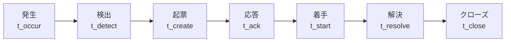
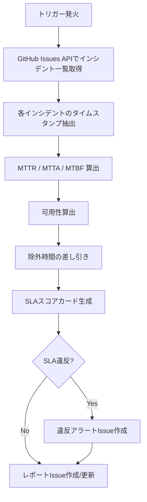

# SLA算出ロジック（SLA Calculation Logic）

ServiceMatrix SLA算出仕様
Version: 1.0
Status: Active
Classification: Internal Technical Document
Applicable Standard: ITIL 4 / ISO 20000

---

## 1. 目的

本ドキュメントは、ServiceMatrixにおけるSLA測定値の算出ロジック、
計算式、自動計算の仕組みを定義する。

すべてのSLA算出は本ドキュメントに定める計算式に基づき、
再現可能かつ監査可能な形で実行されなければならない。

---

## 2. 基本計算式

### 2.1 可用性（Availability）

```
Availability (%) = (Total Time - Downtime - Excluded Time) / (Total Time - Excluded Time) x 100
```

| 変数 | 定義 | 単位 |
|------|------|------|
| Total Time | 当該月の総時間 | 分 |
| Downtime | 計画外停止時間の合計 | 分 |
| Excluded Time | 除外時間（計画メンテナンス + 不可抗力） | 分 |

#### 計算例

```
月の総時間: 43,200分（30日）
計画メンテナンス: 120分（2時間）
不可抗力: 0分
計画外ダウンタイム: 30分

有効時間 = 43,200 - 120 = 43,080分
可用性 = (43,080 - 30) / 43,080 x 100
       = 43,050 / 43,080 x 100
       = 99.930%
```

### 2.2 MTTR（Mean Time To Repair / 平均修復時間）

```
MTTR = Σ(Repair Time for each incident) / Number of Incidents
```

| 変数 | 定義 | 単位 |
|------|------|------|
| Repair Time | 個々のインシデントの修復時間（検出〜復旧完了） | 分 |
| Number of Incidents | 当該期間のインシデント総数 | 件 |

#### 計算例

```
インシデント1: 修復時間 = 45分
インシデント2: 修復時間 = 120分
インシデント3: 修復時間 = 30分

MTTR = (45 + 120 + 30) / 3
     = 195 / 3
     = 65分
```

### 2.3 MTBF（Mean Time Between Failures / 平均故障間隔）

```
MTBF = (Total Time - Total Downtime) / Number of Failures
```

| 変数 | 定義 | 単位 |
|------|------|------|
| Total Time | 当該期間の総稼働時間 | 分 |
| Total Downtime | 総ダウンタイム | 分 |
| Number of Failures | 障害発生回数 | 回 |

#### 計算例

```
月の総時間: 43,200分
総ダウンタイム: 195分
障害回数: 3回

MTBF = (43,200 - 195) / 3
     = 43,005 / 3
     = 14,335分（約9.95日）
```

### 2.4 MTTA（Mean Time To Acknowledge / 平均応答時間）

```
MTTA = Σ(Acknowledge Time for each incident) / Number of Incidents
```

| 変数 | 定義 | 単位 |
|------|------|------|
| Acknowledge Time | インシデント起票〜初回応答までの時間 | 分 |
| Number of Incidents | 当該期間のインシデント総数 | 件 |

### 2.5 MTTD（Mean Time To Detect / 平均検出時間）

```
MTTD = Σ(Detection Time for each incident) / Number of Incidents
```

| 変数 | 定義 | 単位 |
|------|------|------|
| Detection Time | 障害発生〜検出までの時間 | 分 |
| Number of Incidents | 当該期間のインシデント総数 | 件 |

---

## 3. SLAスコアカード（月次）

### 3.1 スコアカード構成

月次SLAスコアカードは以下の指標で構成される。

| 指標 | 算出式 | 目標（P1） | 目標（P2） | 目標（P3） | 目標（P4） |
|------|--------|-----------|-----------|-----------|-----------|
| 可用性 | 上記 2.1 | 99.9% | 99.5% | 99.0% | 98.0% |
| MTTR | 上記 2.2 | 240分以下 | 1,440分以下 | 4,320分以下 | 10,080分以下 |
| MTBF | 上記 2.3 | 43,157分以上 | 42,561分以上 | 42,120分以上 | 41,040分以上 |
| MTTA | 上記 2.4 | 60分以下 | 240分以下 | 1,440分以下 | 4,320分以下 |
| SLA達成率 | 達成件数/総件数 x 100 | 99% | 97% | 95% | 90% |

### 3.2 加重スコア算出

```
加重スコア = Σ(指標スコア x 指標重み) / Σ(指標重み)
```

| 指標 | 重み |
|------|------|
| 可用性 | 5 |
| MTTR | 4 |
| MTBF | 3 |
| MTTA | 3 |
| SLA達成率 | 5 |

#### 個別指標スコア算出

```
指標スコア =
  目標達成の場合: 100
  目標の90%以上達成の場合: 80
  目標の80%以上達成の場合: 60
  目標の70%以上達成の場合: 40
  目標の70%未満の場合: 0
```

---

## 4. 時間計算の詳細ルール

### 4.1 タイムスタンプ基準

| 項目 | ルール |
|------|--------|
| タイムゾーン | JST（UTC+9）を基準とする |
| 精度 | 秒単位（ミリ秒は切り捨て） |
| 取得元 | GitHub Issue / API のタイムスタンプ |

### 4.2 インシデントライフサイクルタイムスタンプ



| 区間 | 計算式 | 用途 |
|------|--------|------|
| 検出時間 | t_detect - t_occur | MTTD算出 |
| 応答時間 | t_ack - t_create | MTTA算出（SLA初動） |
| 修復時間 | t_resolve - t_detect | MTTR算出 |
| 総処理時間 | t_close - t_create | レポート用 |

### 4.3 営業時間と24時間の区別

| 優先度 | 時間基準 | 備考 |
|--------|---------|------|
| P1 | 24時間365日 | 全時間帯がSLA対象 |
| P2 | 24時間365日 | 全時間帯がSLA対象 |
| P3 | 営業時間（09:00-18:00 JST、平日） | 営業時間外は停止 |
| P4 | 営業時間（09:00-18:00 JST、平日） | 営業時間外は停止 |

### 4.4 営業時間のSLAタイマー計算

```
P3/P4の場合:
  営業時間帯: 09:00-18:00（9時間 = 540分/日）
  非営業日: 土曜、日曜、祝日

  SLAタイマー = 営業時間内の経過時間のみカウント
```

#### 計算例（P3インシデント）

```
起票時刻: 金曜 17:30（営業時間残り30分）
応答時刻: 月曜 10:00

SLAタイマー:
  金曜 17:30-18:00 = 30分
  土曜 = 0分（非営業日）
  日曜 = 0分（非営業日）
  月曜 09:00-10:00 = 60分
  合計 = 90分（1時間30分）
```

---

## 5. ダウンタイム計算ルール

### 5.1 ダウンタイムの定義

以下の状態をダウンタイムとして計上する。

| 状態 | ダウンタイム判定 | 備考 |
|------|----------------|------|
| サービス完全停止 | 全時間をカウント | 応答不可状態 |
| 性能劣化（SLA閾値未満） | 劣化時間をカウント | 応答時間がSLA基準超過 |
| 部分障害（50%以上のユーザー影響） | 全時間をカウント | 影響範囲で判定 |
| 部分障害（50%未満のユーザー影響） | 影響率 x 時間をカウント | 按分計算 |
| 計画メンテナンス | カウントしない | 事前承認済みの場合 |

### 5.2 部分障害の按分計算

```
部分障害ダウンタイム = 障害時間 x 影響ユーザー率

例:
  障害時間: 60分
  影響ユーザー: 全体の30%
  按分ダウンタイム = 60 x 0.30 = 18分
```

---

## 6. GitHub Actionsによる自動計算

### 6.1 自動計算トリガー

| トリガー | 説明 | スケジュール |
|----------|------|-------------|
| 月次SLA算出 | 月末に自動実行し、月次SLAスコアカードを生成 | `cron: '0 0 1 * *'`（毎月1日 00:00 UTC） |
| 週次サマリ | 週間メトリクスサマリを生成 | `cron: '0 0 * * 1'`（毎週月曜 00:00 UTC） |
| SLA違反検出 | インシデントIssue更新時にSLAタイマーチェック | `on: issues` イベント |
| リアルタイム監視 | SLAリスク閾値チェック | `cron: '*/15 * * * *'`（15分ごと） |

### 6.2 自動計算ワークフロー概要



### 6.3 自動計算で使用するデータソース

| データ | 取得元 | APIエンドポイント |
|--------|--------|-----------------|
| インシデント一覧 | GitHub Issues | `GET /repos/{owner}/{repo}/issues?labels=incident` |
| タイムスタンプ | Issue タイムライン | `GET /repos/{owner}/{repo}/issues/{number}/timeline` |
| ラベル変更履歴 | Issue イベント | `GET /repos/{owner}/{repo}/issues/{number}/events` |
| メンテナンス記録 | GitHub Issues | `GET /repos/{owner}/{repo}/issues?labels=maintenance/planned` |
| 除外時間 | メンテナンスIssueの本文 | パース処理で抽出 |

---

## 7. SLAデータモデル

### 7.1 SLA計測レコード JSON Schema

```json
{
  "$schema": "http://json-schema.org/draft-07/schema#",
  "title": "SLA Measurement Record",
  "type": "object",
  "required": [
    "record_id", "service_id", "period_start", "period_end",
    "total_time_minutes", "downtime_minutes", "excluded_time_minutes",
    "availability_percent"
  ],
  "properties": {
    "record_id": {
      "type": "string",
      "pattern": "^SLA-[0-9]{4}-[0-9]{2}-[A-Z0-9]+$",
      "description": "SLA計測レコードID（例: SLA-2026-03-SVC001）"
    },
    "service_id": {
      "type": "string",
      "description": "対象サービスID"
    },
    "period_start": {
      "type": "string",
      "format": "date-time",
      "description": "測定期間開始（ISO 8601）"
    },
    "period_end": {
      "type": "string",
      "format": "date-time",
      "description": "測定期間終了（ISO 8601）"
    },
    "total_time_minutes": {
      "type": "number",
      "minimum": 0,
      "description": "総時間（分）"
    },
    "downtime_minutes": {
      "type": "number",
      "minimum": 0,
      "description": "計画外ダウンタイム（分）"
    },
    "excluded_time_minutes": {
      "type": "number",
      "minimum": 0,
      "description": "除外時間（分）"
    },
    "availability_percent": {
      "type": "number",
      "minimum": 0,
      "maximum": 100,
      "description": "可用性（%）"
    },
    "mttr_minutes": {
      "type": "number",
      "minimum": 0,
      "description": "平均修復時間（分）"
    },
    "mtbf_minutes": {
      "type": "number",
      "minimum": 0,
      "description": "平均故障間隔（分）"
    },
    "mtta_minutes": {
      "type": "number",
      "minimum": 0,
      "description": "平均応答時間（分）"
    },
    "incident_count": {
      "type": "integer",
      "minimum": 0,
      "description": "インシデント件数"
    },
    "sla_target_met": {
      "type": "boolean",
      "description": "SLA目標達成フラグ"
    },
    "priority": {
      "type": "string",
      "enum": ["P1", "P2", "P3", "P4"],
      "description": "サービス優先度"
    },
    "calculated_at": {
      "type": "string",
      "format": "date-time",
      "description": "算出日時"
    },
    "calculated_by": {
      "type": "string",
      "description": "算出者（agent/user）"
    }
  }
}
```

---

## 8. エッジケースの処理

### 8.1 インシデントゼロの月

```
インシデント件数 = 0 の場合:
  可用性 = 100%
  MTTR = N/A（算出不可）
  MTBF = N/A（算出不可）
  MTTA = N/A（算出不可）
  SLA達成 = true
```

### 8.2 月跨ぎインシデント

```
インシデントが月を跨ぐ場合:
  各月に按分する

例:
  インシデント開始: 3月30日 20:00
  インシデント解決: 4月1日 02:00

  3月分ダウンタイム: 3月30日 20:00 〜 3月31日 23:59:59 = 1,680分
  4月分ダウンタイム: 4月1日 00:00:00 〜 4月1日 02:00 = 120分
```

### 8.3 重複インシデント

```
同一サービスに対して複数インシデントが同時発生している場合:
  ダウンタイムは重複部分を二重計上しない（ユニオン計算）

例:
  インシデントA: 10:00 - 11:30
  インシデントB: 11:00 - 12:00

  実ダウンタイム = 10:00 - 12:00 = 120分（150分ではない）
```

---

## 9. 検証とテスト

### 9.1 SLA算出の検証方法

| 検証項目 | 方法 |
|----------|------|
| 計算式の正確性 | 既知値による手動検算との突合 |
| 除外時間の正確性 | メンテナンスIssueとの突合 |
| タイムスタンプの整合性 | Issue タイムラインとの突合 |
| 端数処理の一貫性 | 小数点第3位で四捨五入 |
| 月跨ぎ処理の正確性 | テストケースによる検証 |

### 9.2 端数処理ルール

| 指標 | 精度 | 丸め方 |
|------|------|--------|
| 可用性（%） | 小数第3位 | 四捨五入 |
| MTTR（分） | 整数 | 四捨五入 |
| MTBF（分） | 整数 | 四捨五入 |
| MTTA（分） | 整数 | 四捨五入 |
| スコア（%） | 小数第1位 | 四捨五入 |

---

## 10. 関連ドキュメント

| ドキュメント | 参照先 |
|-------------|--------|
| SLA定義書 | `docs/07_sla_metrics/SLA_DEFINITION.md` |
| KPI定義 | `docs/07_sla_metrics/KPI_DEFINITION.md` |
| メトリクス収集モデル | `docs/07_sla_metrics/METRICS_COLLECTION_MODEL.md` |
| SLA違反対応モデル | `docs/07_sla_metrics/SLA_BREACH_HANDLING_MODEL.md` |
| データスキーマ定義 | `docs/11_data_model/DATA_SCHEMA_DEFINITION.md` |

---

## 11. 改定履歴

| 版数 | 日付 | 変更内容 | 承認者 |
|------|------|----------|--------|
| 1.0 | 2026-03-02 | 初版作成 | Service Governance Authority |

---

本ドキュメントはServiceMatrix統治フレームワークの一部であり、
SERVICEMATRIX_CHARTER.md に定められた統治原則に従う。
