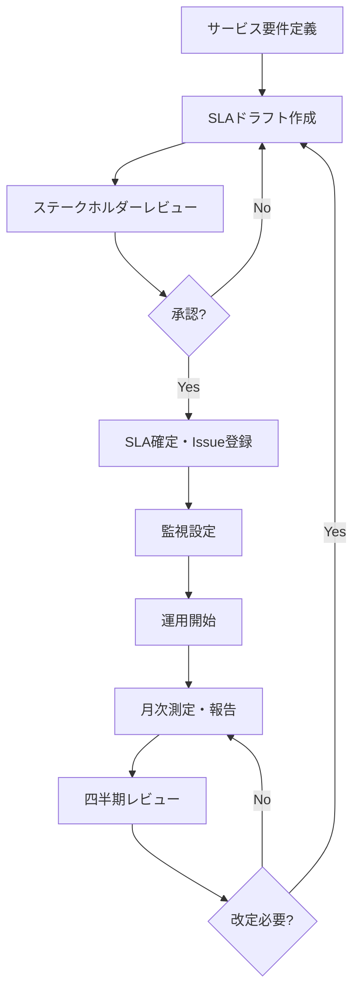

# SLA定義書（Service Level Agreement Definition）

ServiceMatrix SLA統治仕様
Version: 1.0
Status: Active
Classification: Internal Governance Document
Applicable Standard: ITIL 4 / ISO 20000

---

## 1. 目的

本ドキュメントは、ServiceMatrix が管理するすべてのITサービスに対する
サービスレベルアグリーメント（SLA）の定義・測定基準・報告形式を規定する。

SLAはServiceMatrixの統治軸（Governance Axis）の中核であり、
すべてのサービス状態遷移はSLA制約の下で管理される。

---

## 2. 適用範囲

本SLA定義は以下のサービスカテゴリに適用される。

| カテゴリ | 説明 | 例 |
|----------|------|-----|
| Infrastructure | 基盤サービス（サーバー、ネットワーク、ストレージ） | VM稼働、DNS応答、NW疎通 |
| Application | アプリケーションサービス | Web API応答、バッチ処理完了 |
| Security | セキュリティサービス | 認証基盤、脆弱性スキャン |
| Support | サポートサービス | ヘルプデスク、エスカレーション |
| Platform | プラットフォームサービス | CI/CD基盤、監視基盤 |

---

## 3. サービス優先度分類

ServiceMatrixでは、すべてのサービスおよびインシデントに対して
4段階の優先度（Priority）を割り当てる。

### 3.1 優先度定義

| 優先度 | 名称 | 説明 | ビジネス影響 |
|--------|------|------|-------------|
| P1 | Critical | サービス全面停止、事業継続に直接影響 | 全ユーザー影響、収益損失発生 |
| P2 | High | 主要機能の障害、代替手段が限定的 | 多数ユーザー影響、業務遅延 |
| P3 | Medium | 一部機能の障害、代替手段あり | 限定ユーザー影響、業務継続可能 |
| P4 | Low | 軽微な問題、利便性への影響 | 個別ユーザー影響、業務影響なし |

---

## 4. サービスカテゴリ別SLA定義表

### 4.1 P1: Critical

| SLA項目 | 目標値 | 測定方法 |
|---------|--------|----------|
| 可用性 | 99.9%（月間ダウンタイム上限: 43分12秒） | 稼働時間 / 総時間 x 100 |
| 初動応答時間 | 1時間以内 | インシデント起票〜初回応答のタイムスタンプ差分 |
| 解決時間 | 4時間以内 | インシデント起票〜解決完了のタイムスタンプ差分 |
| エスカレーション閾値 | 初動30分超過で自動エスカレーション | GitHub Issue ラベル自動付与 |
| 通知先 | サービスオーナー + 経営層 | Webhook + GitHub Mention |
| 報告頻度 | リアルタイム + 日次サマリ | ダッシュボード + 自動Issue更新 |

### 4.2 P2: High

| SLA項目 | 目標値 | 測定方法 |
|---------|--------|----------|
| 可用性 | 99.5%（月間ダウンタイム上限: 3時間39分） | 稼働時間 / 総時間 x 100 |
| 初動応答時間 | 4時間以内 | インシデント起票〜初回応答のタイムスタンプ差分 |
| 解決時間 | 24時間以内 | インシデント起票〜解決完了のタイムスタンプ差分 |
| エスカレーション閾値 | 初動2時間超過で自動エスカレーション | GitHub Issue ラベル自動付与 |
| 通知先 | サービスオーナー + チームリード | Webhook + GitHub Mention |
| 報告頻度 | 4時間ごと + 日次サマリ | ダッシュボード + 自動Issue更新 |

### 4.3 P3: Medium

| SLA項目 | 目標値 | 測定方法 |
|---------|--------|----------|
| 可用性 | 99.0%（月間ダウンタイム上限: 7時間18分） | 稼働時間 / 総時間 x 100 |
| 初動応答時間 | 24時間以内 | インシデント起票〜初回応答のタイムスタンプ差分 |
| 解決時間 | 72時間以内 | インシデント起票〜解決完了のタイムスタンプ差分 |
| エスカレーション閾値 | 初動12時間超過で自動エスカレーション | GitHub Issue ラベル自動付与 |
| 通知先 | 担当チーム | GitHub Mention |
| 報告頻度 | 日次サマリ | ダッシュボード |

### 4.4 P4: Low

| SLA項目 | 目標値 | 測定方法 |
|---------|--------|----------|
| 可用性 | 98.0%（月間ダウンタイム上限: 14時間36分） | 稼働時間 / 総時間 x 100 |
| 初動応答時間 | 72時間以内 | インシデント起票〜初回応答のタイムスタンプ差分 |
| 解決時間 | 168時間以内（1週間） | インシデント起票〜解決完了のタイムスタンプ差分 |
| エスカレーション閾値 | 初動48時間超過で自動エスカレーション | GitHub Issue ラベル自動付与 |
| 通知先 | 担当者 | GitHub Issue アサイン通知 |
| 報告頻度 | 週次サマリ | ダッシュボード |

---

## 5. 測定期間

### 5.1 基本測定期間

| 項目 | 値 |
|------|-----|
| SLA算定期間 | 月次（暦月：毎月1日00:00 JST 〜 末日23:59:59 JST） |
| 報告サイクル | 月次（翌月5営業日以内に確定） |
| レビューサイクル | 四半期（QBR: Quarterly Business Review） |
| SLA改定サイクル | 年次（ただし重大変更時は随時） |

### 5.2 総時間の算出

```
総時間（分） = 当該月の暦日数 x 24 x 60
```

例：
- 30日の月: 30 x 24 x 60 = 43,200分
- 31日の月: 31 x 24 x 60 = 44,640分
- 2月（28日）: 28 x 24 x 60 = 40,320分

---

## 6. 除外時間（Exclusion Window）

以下の時間帯はSLA測定の対象外（除外）とする。

### 6.1 計画メンテナンス

| 条件 | 内容 |
|------|------|
| 事前通知 | 5営業日前までに通知済みであること |
| 承認 | Change Management プロセスで承認済みであること |
| 通知方法 | GitHub Issue（ラベル: `maintenance/planned`）で公示 |
| 最大時間 | 月間累計8時間以内 |
| 記録 | メンテナンス開始・終了タイムスタンプを記録 |

### 6.2 不可抗力

| 条件 | 内容 |
|------|------|
| 自然災害 | 地震、洪水、台風等 |
| 外部サービス障害 | GitHub自体の障害、クラウドプロバイダの広域障害 |
| 法令・規制対応 | 即時対応が法的に求められる場合 |
| 記録 | 不可抗力認定記録をIssueに残す |

### 6.3 除外時間の適用手順

1. メンテナンス／不可抗力の発生を記録（GitHub Issue作成）
2. 開始・終了タイムスタンプを記録
3. SLA算出時に除外時間として差し引く
4. 月次報告で除外時間の内訳を明示

---

## 7. SLA報告形式

### 7.1 月次SLAレポート構成

```
# SLA月次レポート - YYYY年MM月

## 1. サマリ
- 対象期間: YYYY/MM/DD - YYYY/MM/DD
- 総サービス数: N
- SLA達成サービス数: N
- SLA違反サービス数: N
- 全体SLA達成率: XX.X%

## 2. 優先度別SLA達成状況
| 優先度 | 対象数 | 達成数 | 違反数 | 達成率 |
|--------|--------|--------|--------|--------|
| P1     |        |        |        |        |
| P2     |        |        |        |        |
| P3     |        |        |        |        |
| P4     |        |        |        |        |

## 3. サービス別詳細
（各サービスの可用性、MTTR、MTBF、インシデント数）

## 4. SLA違反詳細
（違反したサービス、原因、影響、是正措置）

## 5. 除外時間内訳
（計画メンテナンス、不可抗力の時間内訳）

## 6. 改善アクション
（次月に向けた改善計画）
```

### 7.2 報告先マトリクス

| 報告先 | 頻度 | 内容 | 形式 |
|--------|------|------|------|
| サービスオーナー | 月次 | 担当サービスのSLA詳細 | GitHub Issue + ダッシュボード |
| 経営層 | 月次 | 全体サマリ + P1/P2違反詳細 | レポートIssue |
| 運用チーム | 週次 | 運用メトリクスサマリ | ダッシュボード |
| 監査部門 | 四半期 | コンプライアンス証跡 | 証跡Issue + ログ |

---

## 8. SLAライフサイクル管理

### 8.1 SLA策定フロー



### 8.2 SLA変更管理

SLAの変更は以下の手順で実施する。

1. Change Request Issue を作成（ラベル: `sla/change-request`）
2. 影響分析を実施（影響を受けるサービス・チームを特定）
3. ステークホルダー承認を取得
4. PRでSLA定義ファイルを更新
5. CI検証（SLA整合性チェック）
6. 承認後Merge
7. 監視設定の更新

---

## 9. GitHub Issues連携

### 9.1 SLA関連ラベル体系

| ラベル | 用途 |
|--------|------|
| `sla/p1-critical` | P1優先度のSLA適用 |
| `sla/p2-high` | P2優先度のSLA適用 |
| `sla/p3-medium` | P3優先度のSLA適用 |
| `sla/p4-low` | P4優先度のSLA適用 |
| `sla/breached` | SLA違反検出 |
| `sla/at-risk` | SLA違反リスク（閾値80%超過） |
| `sla/met` | SLA達成確認済み |
| `sla/change-request` | SLA変更要求 |
| `sla/review` | SLAレビュー対象 |
| `maintenance/planned` | 計画メンテナンス |

### 9.2 自動化ルール

| トリガー | アクション |
|----------|-----------|
| インシデントIssue作成 | 優先度に応じたSLAラベル自動付与 |
| 初動応答時間超過 | `sla/at-risk` ラベル付与 + エスカレーション通知 |
| 解決時間超過 | `sla/breached` ラベル付与 + 違反報告Issue作成 |
| SLA達成で解決 | `sla/met` ラベル付与 |
| 月末 | 月次SLAレポートIssue自動作成 |

---

## 10. SLAスコアカード

### 10.1 総合スコア算出

```
SLA総合スコア = Σ(カテゴリ別達成率 x カテゴリ重み) / Σ(カテゴリ重み)
```

| カテゴリ | 重み |
|----------|------|
| P1: Critical | 4 |
| P2: High | 3 |
| P3: Medium | 2 |
| P4: Low | 1 |

### 10.2 評価基準

| スコア | 評価 | アクション |
|--------|------|-----------|
| 95%以上 | Excellent | 現状維持 |
| 90-94% | Good | 軽微な改善検討 |
| 80-89% | Needs Improvement | 改善計画策定必須 |
| 80%未満 | Critical | 緊急改善会議招集 |

---

## 11. 関連ドキュメント

| ドキュメント | 参照先 |
|-------------|--------|
| SLA算出ロジック | `docs/07_sla_metrics/SLA_CALCULATION_LOGIC.md` |
| OLA定義 | `docs/07_sla_metrics/OLA_DEFINITION.md` |
| KPI定義 | `docs/07_sla_metrics/KPI_DEFINITION.md` |
| メトリクス収集モデル | `docs/07_sla_metrics/METRICS_COLLECTION_MODEL.md` |
| SLA違反対応モデル | `docs/07_sla_metrics/SLA_BREACH_HANDLING_MODEL.md` |
| ServiceMatrix憲章 | `SERVICEMATRIX_CHARTER.md` |

---

## 12. 改定履歴

| 版数 | 日付 | 変更内容 | 承認者 |
|------|------|----------|--------|
| 1.0 | 2026-03-02 | 初版作成 | Service Governance Authority |

---

本ドキュメントはServiceMatrix統治フレームワークの一部であり、
SERVICEMATRIX_CHARTER.md に定められた統治原則に従う。
