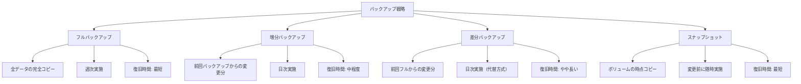
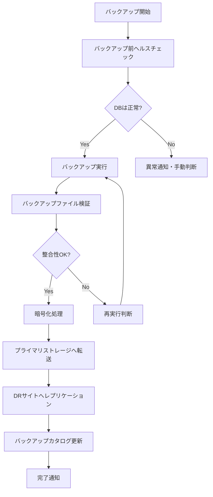
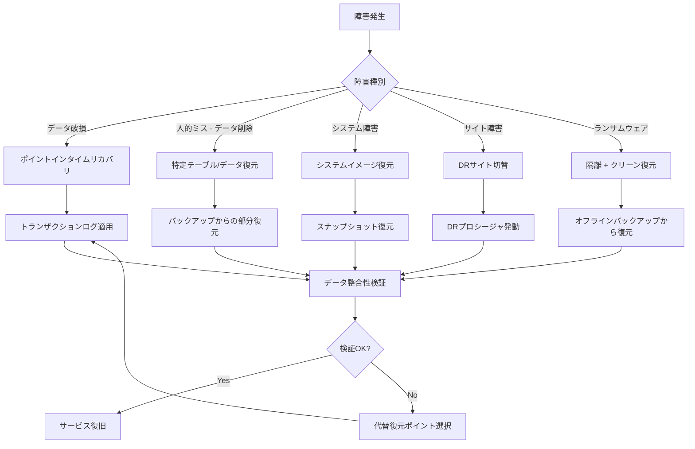

# バックアップ・リカバリモデル
ServiceMatrix Backup and Recovery Model

Version: 1.0
Status: Active
Owner: Operations Lead
Classification: ITIL 4 Aligned

---

## 1. 目的と適用範囲

### 1.1 目的

本ドキュメントは、ServiceMatrix におけるデータバックアップおよびリカバリの
方針・手順・要件を定義する。データの可用性・完全性・機密性を保護し、
障害・災害・人的ミスからの迅速な復旧を実現する。

### 1.2 適用範囲

- アプリケーションデータのバックアップ
- データベースバックアップ
- 構成情報・設定ファイルのバックアップ
- ソースコード・ドキュメントのバックアップ
- ログ・監査証跡のバックアップ
- 復旧手順および復旧訓練

---

## 2. バックアップ戦略

### 2.1 バックアップ方式の概要



### 2.2 バックアップスケジュール

| 対象 | 方式 | 頻度 | 実施時刻 | 保持期間 | 保存先 |
|------|------|------|---------|---------|--------|
| アプリケーションDB | フル | 週次（日曜） | 01:00 | 4世代 | プライマリ + DR |
| アプリケーションDB | 増分 | 日次 | 04:00 | 7日分 | プライマリ |
| アプリケーションDB | トランザクションログ | 15分毎 | 継続的 | 7日分 | プライマリ |
| 設定ファイル | フル | 日次 | 03:00 | 30日分 | プライマリ + DR |
| ソースコード | Git ミラー | リアルタイム | 継続的 | 全履歴 | DR |
| ドキュメント | フル | 週次 | 02:00 | 4世代 | プライマリ + DR |
| 監査ログ | フル | 日次 | 03:30 | 7年 | コールドストレージ |
| システムイメージ | スナップショット | 変更前 | 随時 | 3世代 | プライマリ |

### 2.3 3-2-1 バックアップルール

ServiceMatrix は 3-2-1 ルールに厳密に準拠する：

- **3コピー**: 本番データ + プライマリバックアップ + DRサイトバックアップ
- **2種類の媒体**: オンラインストレージ + オフライン/コールドストレージ
- **1つのオフサイト**: 地理的に分離されたDRサイトに保管

---

## 3. バックアップ実施手順

### 3.1 データベースバックアップ



### 3.2 バックアップ検証

| 検証項目 | 頻度 | 手順 |
|---------|------|------|
| バックアップファイル整合性 | 毎回 | チェックサム検証 |
| 復元テスト（テスト環境） | 月次 | テスト環境への復元・動作確認 |
| 復元テスト（本番同等） | 四半期 | DR環境での完全復元テスト |
| バックアップ世代数確認 | 週次 | 保持ポリシーに基づく世代管理 |
| DR サイトレプリケーション確認 | 日次 | レプリケーション遅延・整合性確認 |

---

## 4. リカバリ手順

### 4.1 リカバリ判断フロー



### 4.2 リカバリ手順書

#### 4.2.1 ポイントインタイムリカバリ（PITR）

```
【復旧手順】
1. 障害発生時刻の特定
2. 最新フルバックアップの特定
3. フルバックアップの復元
4. トランザクションログの順次適用
   - 障害発生直前の時点まで適用
5. データ整合性検証
6. アプリケーション接続テスト
7. サービス復旧宣言
```

#### 4.2.2 部分データ復元

```
【復旧手順】
1. 復元対象データの特定
2. 適切なバックアップ世代の選択
3. テスト環境での復元実施
4. 復元データの正確性確認
5. 本番環境へのデータ移行
6. 関連データとの整合性確認
7. ユーザーへの完了通知
```

#### 4.2.3 DRサイト切替

```
【復旧手順】
1. DR宣言の発動（IT部門長承認）
2. DNSフェイルオーバーの実行
3. DRサイトのサービス起動
4. データ整合性確認（RPO範囲内の確認）
5. 外部連携先への通知
6. ユーザーアクセスの確認
7. 本番復旧後のフェイルバック計画策定
```

### 4.3 リカバリ目標

| サービス階層 | RTO | RPO | 復旧優先度 |
|-------------|-----|-----|-----------|
| Tier 1（基幹） | 1時間 | 15分 | 最優先 |
| Tier 2（重要） | 4時間 | 1時間 | 高 |
| Tier 3（標準） | 8時間 | 4時間 | 中 |
| Tier 4（低優先） | 24時間 | 24時間 | 低 |

---

## 5. バックアップセキュリティ

### 5.1 暗号化要件

| 対象 | 暗号化方式 | 鍵管理 |
|------|-----------|--------|
| バックアップファイル（保管時） | AES-256 | 鍵管理サービス |
| バックアップ転送時 | TLS 1.3 | 証明書管理 |
| オフサイト保管 | AES-256 + エンベロープ暗号 | 分離された鍵管理 |

### 5.2 アクセス制御

- バックアップデータへのアクセスは最小権限原則に基づく
- 復元操作は L2 以上の承認が必要
- 全バックアップ操作の監査ログを記録
- バックアップ暗号化鍵は本番データとは別系統で管理

---

## 6. AI Agent の役割

### 6.1 自動化範囲

| 機能 | 説明 |
|------|------|
| バックアップ監視 | バックアップジョブの成功/失敗を自動監視 |
| 整合性チェック | バックアップファイルの自動整合性検証 |
| 容量予測 | バックアップストレージの使用量予測 |
| 異常検知 | バックアップサイズの異常変動を検知 |
| 復旧推奨 | 障害種別に基づく最適な復旧方法の推奨 |

### 6.2 自動通知

- バックアップ失敗時に GitHub Issue 自動作成
- 復元テスト結果の自動レポート生成
- バックアップ容量の閾値超過時にアラート発報
- DR レプリケーション遅延のリアルタイム監視

---

## 7. メトリクスと KPI

| KPI | 目標値 | 計測頻度 |
|-----|--------|---------|
| バックアップ成功率 | 99.9% 以上 | 日次 |
| バックアップウィンドウ遵守率 | 98% 以上 | 週次 |
| 復元テスト成功率 | 100% | 月次 |
| RPO 遵守率 | 99.9% 以上 | 月次 |
| RTO 遵守率 | 99% 以上 | 四半期 |
| DR レプリケーション遅延 | 15分以内 | 日次 |

---

## 8. テストと訓練

### 8.1 テストスケジュール

| テスト種別 | 頻度 | 内容 |
|-----------|------|------|
| バックアップ復元テスト | 月次 | テスト環境での復元確認 |
| DR 切替テスト | 四半期 | DR環境への完全切替 |
| テーブルレベル復元テスト | 月次 | 個別データの復元確認 |
| PITR テスト | 四半期 | 時点指定復元の確認 |
| 全体復旧訓練 | 年次 | 大規模災害想定の総合訓練 |

### 8.2 テスト記録

すべての復旧テストは以下を記録する：
- テスト日時
- テスト種別
- 復旧対象
- 復旧所要時間
- 復旧データの整合性結果
- 発見された問題点
- 改善提案

---

## 9. 継続的改善

### 9.1 レビューサイクル

| レビュー | 頻度 | 内容 |
|---------|------|------|
| バックアップ運用レビュー | 月次 | 成功率、容量、異常 |
| リカバリテストレビュー | 四半期 | テスト結果、改善計画 |
| バックアップポリシーレビュー | 半期 | ポリシー全体の妥当性 |

---

## 改訂履歴

| バージョン | 日付 | 変更内容 | 承認者 |
|-----------|------|---------|--------|
| 1.0 | 2026-03-02 | 初版作成 | Operations Lead |
