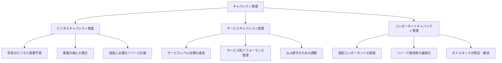
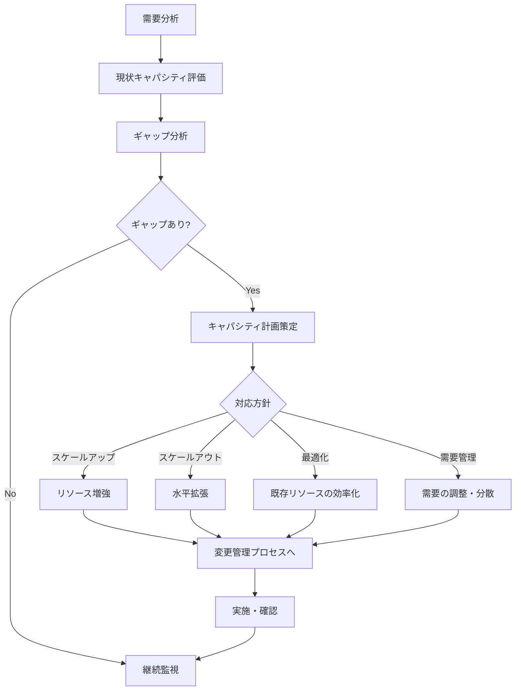
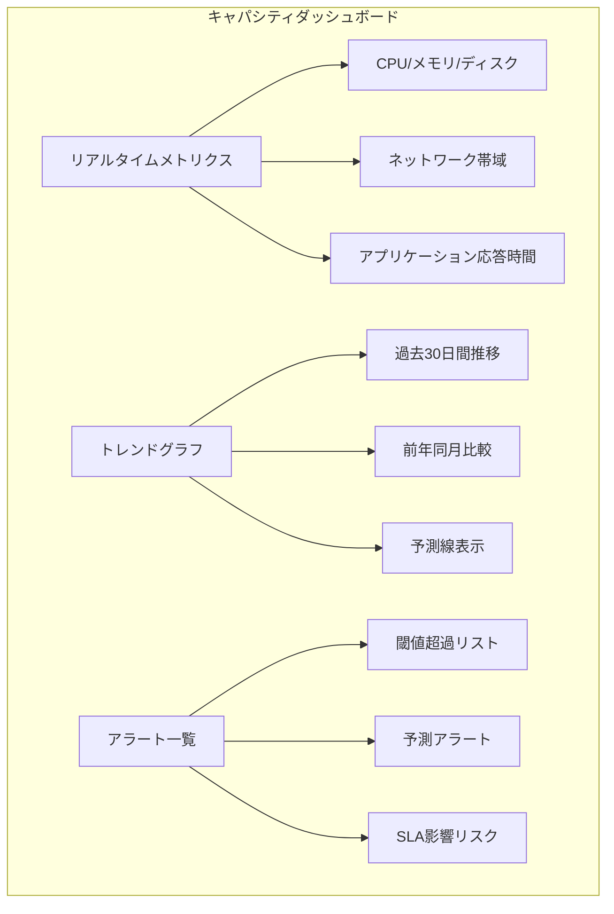
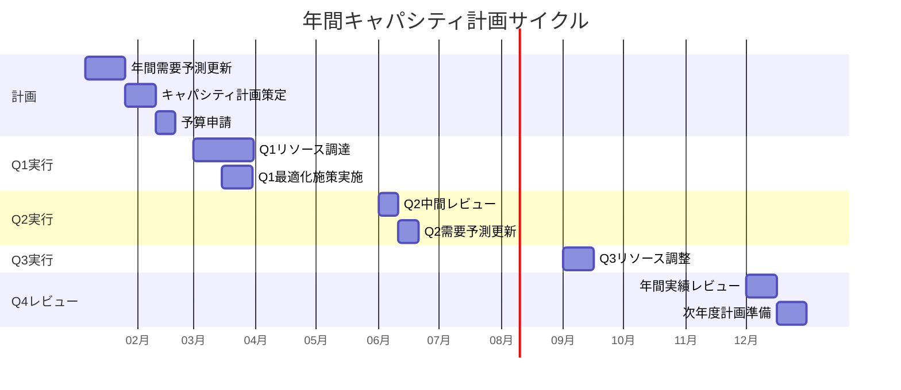
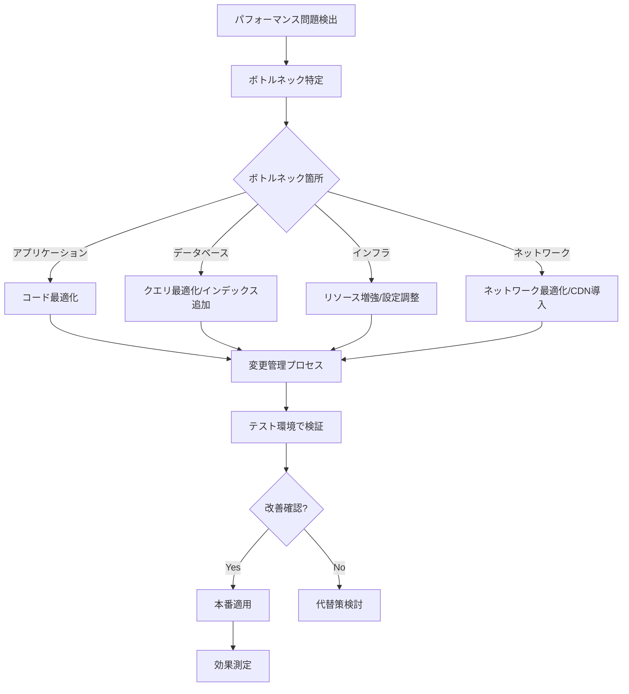

# キャパシティ管理
ServiceMatrix Capacity Management

Version: 1.0
Status: Active
Owner: Capacity Manager
Classification: ITIL 4 Aligned

---

## 1. 目的と適用範囲

### 1.1 目的

本ドキュメントは、ServiceMatrix におけるキャパシティ管理プロセスを定義する。
サービス需要を予測し、適切なリソースを効率的に配置することで、
コスト効率を維持しながらサービスレベル要件を確実に満たすことを目的とする。

### 1.2 適用範囲

- コンピューティングリソース（CPU、メモリ、ストレージ）
- ネットワークリソース（帯域幅、接続数）
- アプリケーションリソース（スレッド、コネクションプール）
- ライセンスキャパシティ
- 人的リソースのキャパシティ

### 1.3 キャパシティ管理の3つの視点

---

## 2. キャパシティ管理プロセス

### 2.1 プロセスフロー

### 2.2 需要予測

| 予測期間 | 手法 | 精度目標 | 用途 |
|---------|------|---------|------|
| 短期（1ヶ月） | トレンド分析 + 季節調整 | ±10% | 運用調整 |
| 中期（3-6ヶ月） | 回帰分析 + ビジネス計画反映 | ±20% | 調達計画 |
| 長期（1-3年） | ビジネス成長モデル | ±30% | 戦略計画 |

---

## 3. リソース監視

### 3.1 監視対象と閾値

| リソース | 正常 | 警告閾値 | 危険閾値 | 対応 |
|---------|------|---------|---------|------|
| CPU使用率 | < 60% | 60-80% | > 80% | スケールアップ/アウト |
| メモリ使用率 | < 70% | 70-85% | > 85% | メモリ増設/最適化 |
| ディスク使用率 | < 75% | 75-90% | > 90% | ディスク拡張/データパージ |
| ネットワーク帯域 | < 60% | 60-80% | > 80% | 帯域増強/トラフィック最適化 |
| DB接続数 | < 50% | 50-70% | > 70% | プール拡張/接続最適化 |
| キュー長 | < 100 | 100-500 | > 500 | ワーカー増設/処理最適化 |

### 3.2 監視ダッシュボード構成

### 3.3 AI Agent によるキャパシティ分析

AI Agent は以下の分析を自動実行する：

1. **異常検知**: ベースラインからの逸脱をリアルタイム検出
2. **トレンド予測**: 機械学習による72時間〜30日先のキャパシティ予測
3. **相関分析**: リソース間の相関関係分析（例：CPU増加→メモリ増加パターン）
4. **最適化提案**: リソース使用パターンに基づく最適化推奨
5. **コスト分析**: リソース追加のコスト対効果分析

---

## 4. キャパシティ計画

### 4.1 年間キャパシティ計画

### 4.2 スケーリング戦略

| 戦略 | 適用条件 | メリット | デメリット |
|------|---------|---------|-----------|
| 垂直スケーリング（スケールアップ） | 単一コンポーネントのボトルネック | シンプル、アプリ変更不要 | 上限あり、コスト高い |
| 水平スケーリング（スケールアウト） | 並列処理可能なワークロード | 柔軟、上限なし | アプリ対応必要 |
| 自動スケーリング | 需要変動が大きいサービス | 需要追従、コスト最適 | 設定の複雑さ |
| 需要管理 | リソース追加が困難な場合 | コスト削減 | ユーザー体験への影響 |

---

## 5. パフォーマンス管理

### 5.1 パフォーマンス指標

| 指標 | 目標値 | 測定方法 |
|------|--------|---------|
| ページロード時間 | 3秒以内 | 合成監視 |
| API レスポンスタイム（p50） | 200ms以内 | APMツール |
| API レスポンスタイム（p95） | 1秒以内 | APMツール |
| API レスポンスタイム（p99） | 3秒以内 | APMツール |
| スループット | SLA定義値以上 | 負荷テスト |
| エラーレート | 0.1%以内 | APMツール |
| Apdex スコア | 0.9以上 | APMツール |

### 5.2 パフォーマンスチューニングプロセス

---

## 6. コスト最適化

### 6.1 リソース効率化指標

| 指標 | 計算方法 | 目標値 |
|------|---------|--------|
| CPU効率 | 実使用率 / 割当量 | 60% 以上 |
| メモリ効率 | 実使用量 / 割当量 | 70% 以上 |
| ストレージ効率 | 有効データ / 割当量 | 75% 以上 |
| ライセンス使用率 | 使用数 / 購入数 | 85% 以上 |

### 6.2 コスト削減機会の特定

- 未使用・低使用率リソースの特定と回収
- リザーブドインスタンスの活用（長期安定ワークロード）
- スポットインスタンスの活用（バッチ処理等）
- データの階層化（ホット/ウォーム/コールド）
- AI Agent によるコスト最適化の自動提案

---

## 7. GitHub Issues 連携

### 7.1 キャパシティ関連 Issue

| ラベル | 用途 |
|--------|------|
| `capacity:alert` | 閾値超過アラート |
| `capacity:planning` | キャパシティ計画 |
| `capacity:optimization` | 最適化提案 |
| `capacity:scaling` | スケーリング要求 |

### 7.2 自動 Issue 作成条件

- リソース使用率が警告閾値を24時間以上超過
- AI Agent の予測で30日以内に危険閾値到達が見込まれる場合
- パフォーマンス指標がSLA目標を下回った場合
- コスト最適化の機会が検出された場合

---

## 8. メトリクスと KPI

| KPI | 目標値 | 計測頻度 |
|-----|--------|---------|
| リソース使用率（平均） | 40-70% | 月次 |
| キャパシティ予測精度 | ±20% 以内 | 四半期 |
| SLAブリーチ（キャパシティ起因） | 0件 | 月次 |
| 自動スケーリング成功率 | 99% 以上 | 月次 |
| コスト効率（利用率あたりコスト） | 前年比改善 | 四半期 |
| 計画的キャパシティ増強率 | 90% 以上（緊急対応10%以下） | 四半期 |

---

## 9. 継続的改善

### 9.1 レビューサイクル

| レビュー | 頻度 | 内容 |
|---------|------|------|
| 日次キャパシティチェック | 日次 | 閾値超過の確認、トレンド確認 |
| 月次キャパシティレビュー | 月次 | 使用率トレンド、予測精度、コスト |
| 四半期キャパシティ計画更新 | 四半期 | 需要予測の更新、計画見直し |
| 年次キャパシティ戦略レビュー | 年次 | 長期戦略、技術トレンドの反映 |

### 9.2 継続的改善の重点

- AI Agent による予測精度の継続的向上
- 自動スケーリングルールの最適化
- コスト効率の改善機会の発見と実施
- 新技術導入によるキャパシティ管理の高度化

---

## 改訂履歴

| バージョン | 日付 | 変更内容 | 承認者 |
|-----------|------|---------|--------|
| 1.0 | 2026-03-02 | 初版作成 | Capacity Manager |
