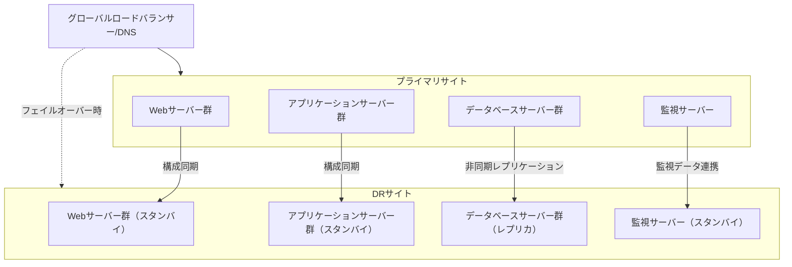
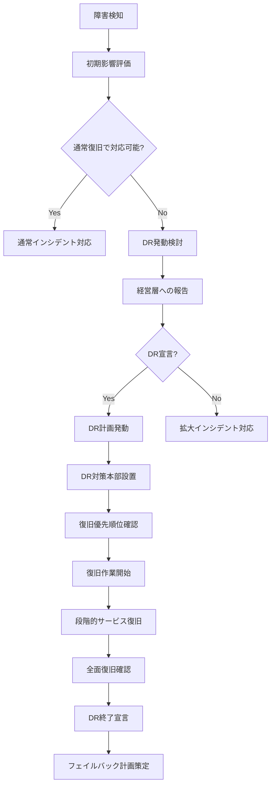
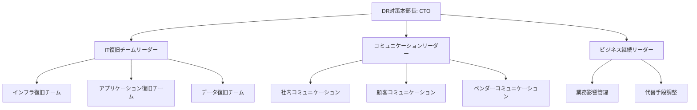
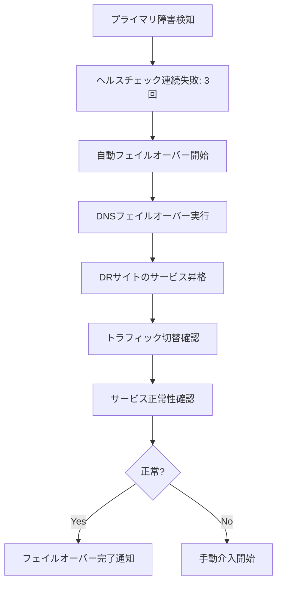
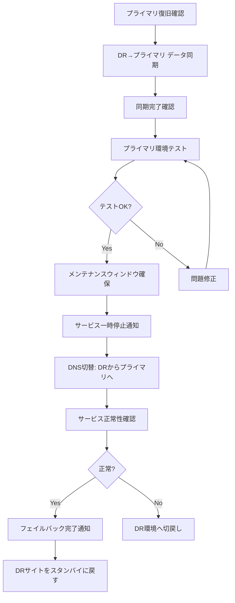

# 災害復旧計画（DR計画）
ServiceMatrix Disaster Recovery Plan

Version: 1.0
Status: Active
Owner: IT Continuity Manager
Classification: ITIL 4 Aligned / ISO 22301 Aligned

---

## 1. 目的と適用範囲

### 1.1 目的

本ドキュメントは、ServiceMatrix の災害復旧（Disaster Recovery）計画を定義する。
大規模障害・自然災害・人的災害発生時に、事業継続に必要なITサービスを
定められた RTO/RPO 内で復旧し、事業への影響を最小化することを目的とする。

### 1.2 適用範囲

- 自然災害（地震、台風、洪水、火災）
- インフラ障害（データセンター全損、広域ネットワーク障害）
- サイバー攻撃（ランサムウェア、大規模データ漏洩）
- 電力障害（長時間停電）
- パンデミック対応

### 1.3 DR 宣言の基準

| レベル | 状況 | 宣言者 |
|--------|------|--------|
| Level 1 | 単一コンポーネント障害（通常復旧で対応可） | 運用マネージャー |
| Level 2 | 複数システム障害（DR計画の部分発動） | IT部門長 |
| Level 3 | サイト全体障害（DR計画の全面発動） | CTO / 経営層 |

---

## 2. DR アーキテクチャ

### 2.1 システム構成



### 2.2 ティア別 DR 構成

| ティア | DR方式 | 同期方式 | フェイルオーバー | RTO |
|--------|--------|---------|----------------|-----|
| Tier 1 | ホットスタンバイ | 同期レプリケーション | 自動 | < 1時間 |
| Tier 2 | ウォームスタンバイ | 非同期レプリケーション | 半自動 | < 4時間 |
| Tier 3 | コールドスタンバイ | 日次バックアップ転送 | 手動 | < 8時間 |
| Tier 4 | バックアップ復元 | 日次バックアップ転送 | 手動 | < 24時間 |

---

## 3. DR 発動プロセス

### 3.1 発動判断フロー



### 3.2 復旧優先順位

| 優先度 | 対象サービス | 復旧目標 | 最低限の機能 |
|--------|------------|---------|-------------|
| 1 | インシデント管理 | 1時間以内 | インシデント登録・通知 |
| 2 | 監視ダッシュボード | 1時間以内 | 主要メトリクス表示 |
| 3 | 認証・認可システム | 2時間以内 | ログイン・基本認可 |
| 4 | 変更管理システム | 4時間以内 | 変更申請・承認 |
| 5 | CI/CDパイプライン | 4時間以内 | 基本ビルド・デプロイ |
| 6 | ナレッジベース | 8時間以内 | 参照機能 |
| 7 | レポートシステム | 8時間以内 | 基本レポート出力 |
| 8 | 開発環境 | 24時間以内 | 基本開発機能 |

---

## 4. DR 対策本部

### 4.1 組織体制



### 4.2 役割と責任

| 役割 | 担当者 | 責任 |
|------|--------|------|
| DR対策本部長 | CTO | DR発動/終了判断、全体統括 |
| IT復旧チームリーダー | IT部門長 | 技術的な復旧作業の指揮 |
| コミュニケーションリーダー | 広報担当 | 内外ステークホルダーへの情報発信 |
| インフラ復旧チーム | インフラエンジニア | サーバー・ネットワークの復旧 |
| アプリケーション復旧チーム | 開発エンジニア | アプリケーションの復旧・確認 |
| データ復旧チーム | DBA | データベースの復旧・整合性確認 |

---

## 5. フェイルオーバー手順

### 5.1 自動フェイルオーバー（Tier 1）



### 5.2 手動フェイルオーバー（Tier 2-4）

```
【手動フェイルオーバー手順】
1. DR宣言の確認
2. プライマリサイトのサービス停止確認
3. DRサイトの最新バックアップ状態確認
4. DRサイトのデータベース起動
   - レプリカの昇格（Tier 2）
   - バックアップからの復元（Tier 3-4）
5. アプリケーションサーバー起動
6. DNS切替の実行
7. サービス正常性確認
   - エンドポイント応答確認
   - 主要機能のスモークテスト
   - データ整合性の確認
8. 外部連携先への通知
9. ユーザーへの復旧報告
```

---

## 6. フェイルバック手順

### 6.1 フェイルバック判断基準

| 条件 | 詳細 |
|------|------|
| プライマリサイト復旧確認 | インフラが完全に復旧していること |
| データ同期完了 | DR→プライマリのデータ同期が完了していること |
| テスト完了 | プライマリサイトでの動作確認が完了していること |
| メンテナンスウィンドウ確保 | 計画的な切替時間が確保されていること |

### 6.2 フェイルバック手順



---

## 7. コミュニケーション計画

### 7.1 通知マトリクス

| ステークホルダー | 通知タイミング | 通知手段 | 通知内容 |
|----------------|---------------|---------|---------|
| 経営層 | DR発動時、1時間毎 | 電話 + メール | 状況、影響、復旧見込み |
| 全社員 | DR発動時、復旧時 | メール + Slack | 影響範囲、代替手段 |
| 顧客 | DR発動時、復旧時 | ステータスページ + メール | サービス状況、復旧見込み |
| ベンダー | 必要時 | 電話 + メール | 支援要請、状況共有 |
| 規制当局 | 法定報告義務時 | 書面 | 法定報告事項 |

### 7.2 ステータスページ運用

- DR 発動時は即座にステータスページを更新する
- 30分ごとにステータスを更新する
- サービスごとの影響状況を明示する
- 復旧見込み時刻を可能な限り提示する
- 復旧完了後、事後報告を公開する

---

## 8. テストと訓練

### 8.1 DRテスト計画

| テスト種別 | 頻度 | 参加者 | 内容 |
|-----------|------|--------|------|
| 机上訓練 | 四半期 | DR対策本部全員 | シナリオに基づく机上シミュレーション |
| コンポーネントテスト | 月次 | IT復旧チーム | 個別コンポーネントのフェイルオーバー確認 |
| 部分切替テスト | 四半期 | IT復旧チーム | Tier 1サービスの実切替テスト |
| 全面切替テスト | 年次 | 全チーム | DRサイトへの完全切替テスト |
| フェイルバックテスト | 半期 | IT復旧チーム | DRサイトからプライマリへの切戻しテスト |

### 8.2 テストシナリオ例

| シナリオ | 想定状況 | テスト内容 |
|---------|---------|-----------|
| データセンター電源障害 | 全サーバー停止 | 全面フェイルオーバー |
| ランサムウェア感染 | 本番データ暗号化 | クリーンバックアップからの復元 |
| ネットワーク分断 | 外部からアクセス不可 | DNS切替によるDRサイト利用 |
| データベース破損 | プライマリDB使用不可 | レプリカへの切替 |
| 地震による建物損壊 | サイト使用不可 | 完全DRサイト移行 |

### 8.3 テスト評価基準

| 評価項目 | 合格基準 |
|---------|---------|
| RTO 達成 | 各ティアのRTO以内に復旧 |
| RPO 達成 | 各ティアのRPO以内のデータ損失 |
| 手順の正確性 | 手順書通りに実行可能 |
| コミュニケーション | 全ステークホルダーへ適時通知 |
| 役割遂行 | 各チームが役割を適切に遂行 |

---

## 9. AI Agent の役割

### 9.1 DR 支援機能

| 機能 | 説明 |
|------|------|
| 障害影響分析 | 障害の影響範囲と復旧優先順位の自動判定 |
| 復旧手順ガイド | 状況に応じた最適な復旧手順のリアルタイムガイダンス |
| 進捗追跡 | 復旧作業の進捗をリアルタイム追跡・報告 |
| コミュニケーション支援 | ステークホルダー通知の自動生成・配信 |
| 事後分析 | DR訓練・実発動時のデータ分析・改善提案 |

---

## 10. メトリクスと KPI

| KPI | 目標値 | 計測頻度 |
|-----|--------|---------|
| DR テスト成功率 | 95% 以上 | 四半期 |
| RTO 目標達成率 | 99% 以上 | テスト/実発動時 |
| RPO 目標達成率 | 99.9% 以上 | テスト/実発動時 |
| DR計画更新適時率 | 100% | 半期 |
| DR訓練実施率 | 100%（計画比） | 年次 |
| フェイルオーバー自動化率 | Tier 1: 100% | 年次 |

---

## 11. 継続的改善

### 11.1 レビューサイクル

| レビュー | 頻度 | 内容 |
|---------|------|------|
| DRテスト結果レビュー | テスト後 | テスト結果の評価・改善計画 |
| DR計画更新 | 半期 | 計画全体の更新・環境変化の反映 |
| DRアーキテクチャレビュー | 年次 | DR構成の妥当性・技術トレンド反映 |

### 11.2 事後レビュー（AAR: After Action Review）

DR発動後（訓練含む）は必ず事後レビューを実施する：

- 発動から復旧完了までのタイムライン記録
- 計画と実績の差異分析
- うまくいった点・改善すべき点の洗い出し
- 改善アクションの策定と担当者割り当て
- 次回訓練への反映事項

---

## 改訂履歴

| バージョン | 日付 | 変更内容 | 承認者 |
|-----------|------|---------|--------|
| 1.0 | 2026-03-02 | 初版作成 | IT Continuity Manager |
