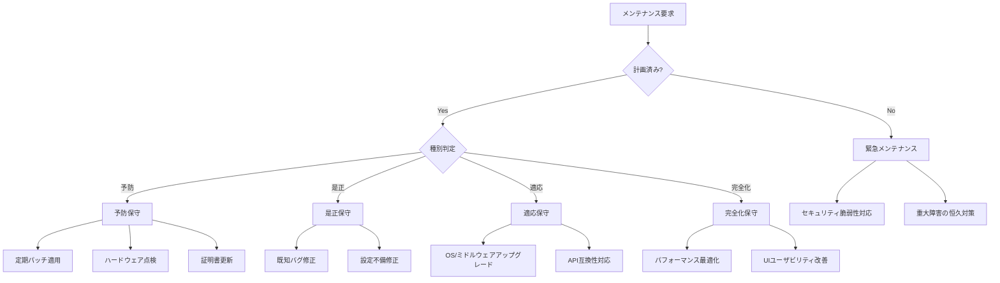
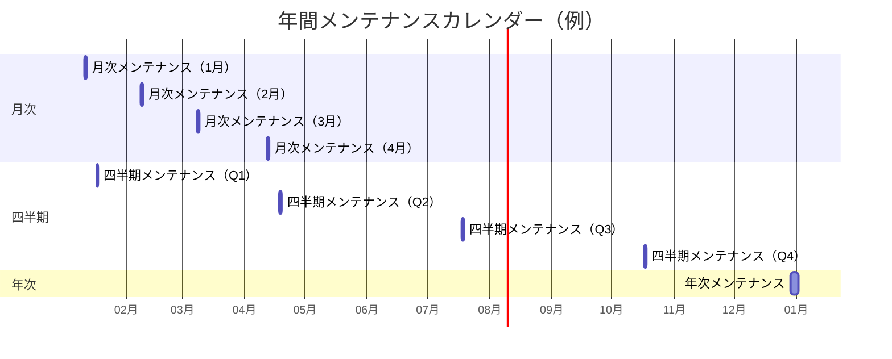
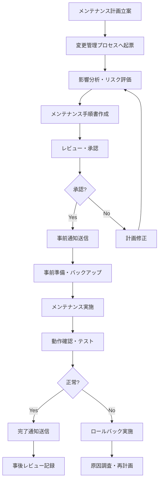
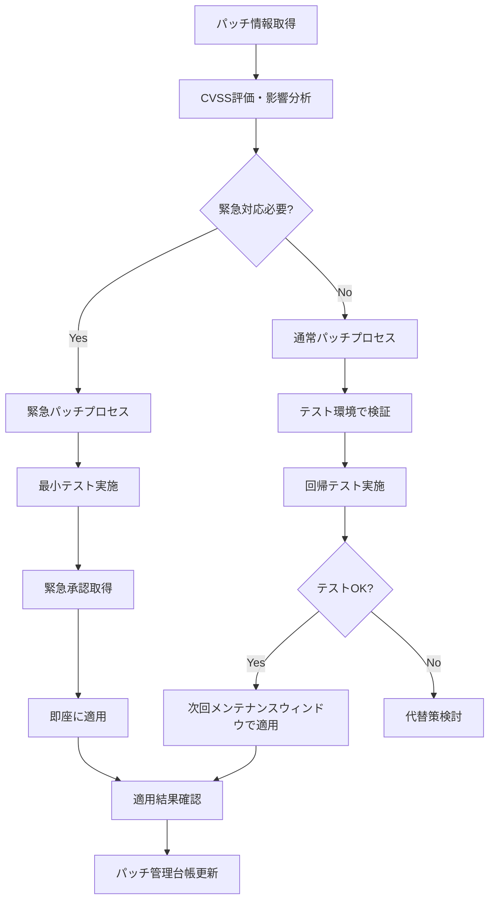

# メンテナンスポリシー
ServiceMatrix Maintenance Policy

Version: 1.0
Status: Active
Owner: Operations Lead
Classification: ITIL 4 Aligned

---

## 1. 目的と適用範囲

### 1.1 目的

本ドキュメントは、ServiceMatrix における計画的メンテナンス活動の方針と手順を定義する。
サービス品質を維持しながら、システムの安定性・セキュリティ・パフォーマンスを
継続的に確保するための統一的なメンテナンス管理フレームワークを提供する。

### 1.2 適用範囲

- 予防保守（Preventive Maintenance）
- 是正保守（Corrective Maintenance）
- 適応保守（Adaptive Maintenance）
- 完全化保守（Perfective Maintenance）
- 緊急メンテナンス（Emergency Maintenance）

### 1.3 メンテナンスの分類



---

## 2. メンテナンスウィンドウ

### 2.1 定期メンテナンスウィンドウ

| 種別 | 実施時間帯 | 頻度 | 最大停止時間 | 事前通知 |
|------|-----------|------|------------|---------|
| 月次メンテナンス | 第2日曜 02:00-06:00 | 月次 | 4時間 | 5営業日前 |
| 四半期メンテナンス | 第3土曜 22:00-翌06:00 | 四半期 | 8時間 | 10営業日前 |
| 年次メンテナンス | 年末年始期間 | 年次 | 24時間 | 20営業日前 |
| パッチ適用 | 毎週水曜 02:00-04:00 | 週次 | 2時間 | 3営業日前 |

### 2.2 メンテナンスウィンドウカレンダー



### 2.3 緊急メンテナンスの条件

以下の条件を満たす場合、定期ウィンドウ外でのメンテナンスを許可する：

| 条件 | 承認者 | 事前通知 |
|------|--------|---------|
| CVSS 9.0以上の脆弱性が公開 | IT部門長 | 可能な限り早期 |
| サービス完全停止の恒久対策 | 運用マネージャー | 最低2時間前 |
| データ損失リスクがある障害 | IT部門長 | 最低1時間前 |
| 法令・規制対応の期限切迫 | CTO | 最低4時間前 |

---

## 3. メンテナンスプロセス

### 3.1 計画メンテナンスフロー



### 3.2 事前準備チェックリスト

| # | 項目 | 担当 | 確認 |
|---|------|------|------|
| 1 | メンテナンス手順書の最終確認 | L2 | |
| 2 | ロールバック手順の確認 | L2 | |
| 3 | バックアップの取得・検証 | L2 | |
| 4 | 関係者への通知完了確認 | L1 | |
| 5 | 監視アラートの抑制設定 | L1 | |
| 6 | メンテナンスページの準備 | L1 | |
| 7 | 外部連携先への事前通知 | L2 | |
| 8 | ロールバック判断基準の確認 | L3 | |

### 3.3 実施後チェックリスト

| # | 項目 | 担当 | 確認 |
|---|------|------|------|
| 1 | 全サービスの正常稼働確認 | L2 | |
| 2 | ヘルスチェックエンドポイント応答確認 | L1 | |
| 3 | 主要機能の動作確認（スモークテスト） | L2 | |
| 4 | パフォーマンスメトリクスの正常確認 | L2 | |
| 5 | エラーログの異常確認 | L2 | |
| 6 | 監視アラート抑制の解除 | L1 | |
| 7 | メンテナンスページの解除 | L1 | |
| 8 | 完了報告の送信 | L1 | |

---

## 4. パッチ管理

### 4.1 パッチ分類と適用方針

| パッチ種別 | 適用期限 | テスト要件 | 承認レベル |
|-----------|---------|-----------|-----------|
| 緊急セキュリティ（CVSS 9.0+） | 24時間以内 | 最小限の回帰テスト | IT部門長 |
| 重要セキュリティ（CVSS 7.0-8.9） | 7日以内 | 標準テスト | 運用マネージャー |
| 通常セキュリティ（CVSS 4.0-6.9） | 30日以内 | 標準テスト | チームリード |
| 機能アップデート | 次回定期メンテナンス | フルテスト | チームリード |
| バグフィックス | 次回定期メンテナンス | 標準テスト | チームリード |

### 4.2 パッチ適用フロー



### 4.3 依存関係管理

- Dependabot による自動脆弱性検出を有効化
- GitHub Security Advisory の監視を自動化
- パッチ適用の依存関係はCI/CDパイプラインで自動検証
- AI Agent がパッチ影響範囲を自動分析し推奨適用順序を提示

---

## 5. 通知管理

### 5.1 通知テンプレート

#### 5.1.1 事前通知

```
件名: [ServiceMatrix] 計画メンテナンスのお知らせ - {日付}

概要:
  メンテナンス種別: {種別}
  実施日時: {開始日時} - {終了日時}
  影響範囲: {影響を受けるサービス}
  停止時間: {予定停止時間}

目的:
  {メンテナンスの目的}

影響:
  - {影響1}
  - {影響2}

代替手段:
  {利用可能な代替手段がある場合}

問合せ先:
  {連絡先}
```

#### 5.1.2 完了通知

```
件名: [ServiceMatrix] メンテナンス完了のお知らせ - {日付}

概要:
  メンテナンス種別: {種別}
  実施結果: {成功/一部成功/失敗}
  実施時間: {開始時刻} - {終了時刻}

実施内容:
  - {実施内容1}
  - {実施内容2}

確認事項:
  {ユーザーに確認してほしい事項}

問合せ先:
  {連絡先}
```

### 5.2 通知チャネル

| 通知種別 | GitHub Issue | メール | Slack | ステータスページ |
|---------|-------------|--------|-------|----------------|
| 計画メンテナンス事前 | Yes | Yes | Yes | Yes |
| 緊急メンテナンス事前 | Yes | Yes | Yes | Yes |
| メンテナンス開始 | Yes | - | Yes | Yes |
| メンテナンス完了 | Yes | Yes | Yes | Yes |

---

## 6. データベースメンテナンス

### 6.1 定期作業

| 作業 | 頻度 | 所要時間 | 影響 |
|------|------|---------|------|
| インデックス再構築 | 月次 | 30-60分 | 一時的パフォーマンス低下 |
| 統計情報更新 | 週次 | 15-30分 | なし |
| 不要データパージ | 月次 | 30-60分 | なし |
| テーブルスペース管理 | 四半期 | 60-120分 | 一時的パフォーマンス低下 |
| バキューム処理 | 日次（自動） | 10-30分 | なし |

### 6.2 データ保持ポリシー

| データ種別 | 保持期間 | アーカイブ | 削除方法 |
|-----------|---------|-----------|---------|
| 運用ログ | 90日 | コールドストレージ（1年） | 自動パージ |
| 監査ログ | 7年 | 長期アーカイブ | 手動（承認必要） |
| パフォーマンスデータ | 180日 | 集約後アーカイブ（1年） | 自動パージ |
| インシデント記録 | 3年 | 長期アーカイブ | 手動（承認必要） |
| ユーザーデータ | アクティブ期間+90日 | なし | 退会処理連動 |

---

## 7. インフラメンテナンス

### 7.1 サーバーメンテナンス

| 作業 | 頻度 | 手順 |
|------|------|------|
| OSアップデート | 月次 | パッチ管理プロセスに準拠 |
| ファームウェア更新 | 四半期 | ベンダー推奨に従い計画的に実施 |
| ディスク健全性チェック | 週次 | SMART値の確認、異常検知時即交換 |
| メモリテスト | 四半期 | memtest実施、エラー検出時交換 |

### 7.2 ネットワークメンテナンス

| 作業 | 頻度 | 手順 |
|------|------|------|
| ファイアウォールルールレビュー | 月次 | 不要ルールの削除、新規要件の追加 |
| SSL証明書更新 | 有効期限30日前 | 自動更新確認、手動更新（必要時） |
| DNS設定確認 | 四半期 | レコードの正確性・不要エントリの整理 |
| ロードバランサー設定確認 | 月次 | ヘルスチェック設定・分散設定の確認 |

---

## 8. メトリクスと KPI

| KPI | 目標値 | 計測頻度 |
|-----|--------|---------|
| 計画メンテナンス成功率 | 98% 以上 | 月次 |
| メンテナンスウィンドウ遵守率 | 95% 以上 | 月次 |
| 緊急メンテナンス発生率 | 月2回以下 | 月次 |
| パッチ適用期限遵守率 | 95% 以上 | 月次 |
| メンテナンス起因障害率 | 2% 以下 | 四半期 |
| 事前通知遵守率 | 100% | 月次 |

---

## 9. 継続的改善

### 9.1 事後レビュー（PIR）

すべての計画メンテナンスおよび緊急メンテナンスについて事後レビューを実施する。

| レビュー項目 | 内容 |
|-------------|------|
| 計画との差異 | 予定時間との差異、予定外作業の有無 |
| 問題・障害 | メンテナンス中に発生した問題 |
| ロールバック発動有無 | ロールバックの有無と理由 |
| 改善事項 | 次回への改善提案 |
| ユーザー影響 | 実際のユーザー影響と事前予測との差異 |

### 9.2 レビューサイクル

| レビュー | 頻度 | 内容 |
|---------|------|------|
| メンテナンス個別PIR | 都度 | 各メンテナンスの振り返り |
| 月次メンテナンスレビュー | 月次 | 月間のメンテナンス実績評価 |
| 四半期ポリシーレビュー | 四半期 | ポリシー全体の有効性評価 |

---

## 改訂履歴

| バージョン | 日付 | 変更内容 | 承認者 |
|-----------|------|---------|--------|
| 1.0 | 2026-03-02 | 初版作成 | Operations Lead |
