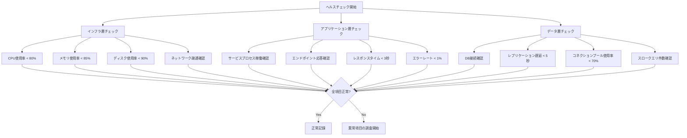
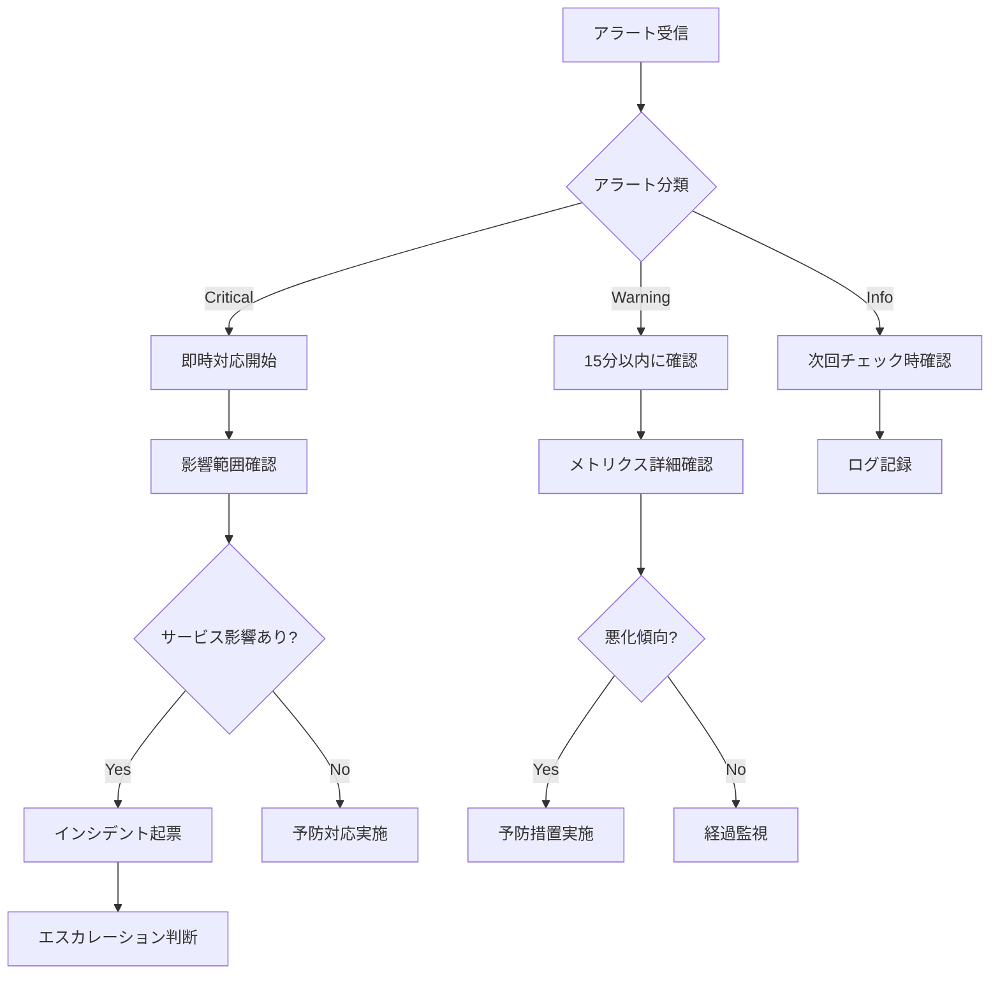
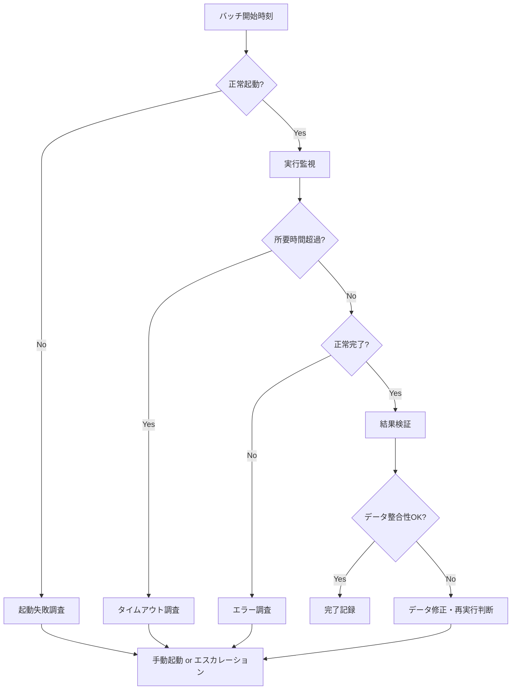
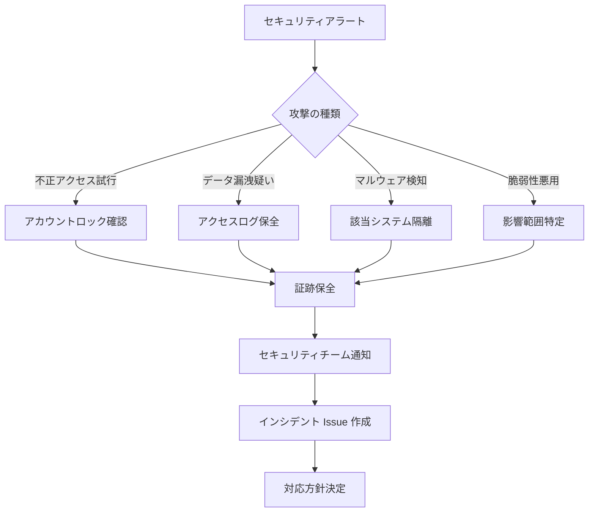

# 運用手順書（Operations Runbook）
ServiceMatrix Operations Runbook

Version: 1.0
Status: Active
Owner: Operations Lead
Classification: ITIL 4 Aligned

---

## 1. 目的と適用範囲

### 1.1 目的

本ドキュメントは、ServiceMatrix の日常運用に必要な標準作業手順（SOP）を体系化し、
運用チームが一貫性のある高品質なサービス運用を実現するための手順書である。

### 1.2 適用範囲

- 日常監視・点検作業
- 定期バッチ処理の実行と監視
- アラート対応手順
- 障害初動対応手順
- 定期メンテナンス作業
- データ管理作業
- セキュリティ運用作業

### 1.3 利用者

| 役割 | 利用範囲 |
|------|---------|
| L1 オペレーター | 日常監視、アラート初動対応 |
| L2 エンジニア | 障害調査、復旧作業 |
| L3 スペシャリスト | 高度障害対応、設計変更 |
| 運用マネージャー | 運用品質管理、エスカレーション判断 |

---

## 2. 日常運用スケジュール

### 2.1 日次作業スケジュール

```mermaid
gantt
    title 日次運用スケジュール
    dateFormat HH:mm
    axisFormat %H:%M

    section 朝作業
    システムヘルスチェック       :08:30, 30min
    夜間バッチ結果確認           :09:00, 30min
    朝会報告準備                 :09:30, 15min

    section 日中監視
    定常監視（AM）               :09:45, 150min
    昼休憩                       :12:15, 60min
    定常監視（PM）               :13:15, 180min

    section 夕方作業
    日次レポート作成             :16:15, 30min
    翌日準備・申し送り           :16:45, 30min
    夜間バッチ起動確認           :17:15, 15min
```



### 2.2 週次作業

| 曜日 | 作業内容 | 担当 | 時間帯 |
|------|---------|------|--------|
| 月曜 | 週次ヘルスチェック（拡張版） | L2 | 10:00-11:00 |
| 火曜 | セキュリティログレビュー | L2 | 14:00-15:00 |
| 水曜 | キャパシティトレンド確認 | L2 | 14:00-14:30 |
| 木曜 | バックアップ整合性検証 | L2 | 10:00-11:00 |
| 金曜 | 週次運用レポート作成 | 運用マネージャー | 15:00-16:00 |

### 2.3 月次作業

| 作業 | 実施日 | 担当 | 所要時間 |
|------|--------|------|---------|
| 月次パフォーマンスレポート | 第1営業日 | L2 | 2時間 |
| SSL証明書有効期限確認 | 第1営業日 | L2 | 30分 |
| ユーザーアカウント棚卸 | 第2営業日 | L2 | 1時間 |
| ディスク使用量トレンド分析 | 第2営業日 | L2 | 1時間 |
| セキュリティパッチ適用検討 | 第2週火曜 | L3 | 2時間 |
| DR訓練（四半期） | 第3週金曜 | 全員 | 4時間 |

---

## 3. システムヘルスチェック手順

### 3.1 チェック項目一覧



### 3.2 閾値定義

| チェック項目 | 正常 | 警告 | 異常 |
|-------------|------|------|------|
| CPU使用率 | < 60% | 60-80% | > 80% |
| メモリ使用率 | < 70% | 70-85% | > 85% |
| ディスク使用率 | < 75% | 75-90% | > 90% |
| レスポンスタイム | < 1秒 | 1-3秒 | > 3秒 |
| エラーレート | < 0.1% | 0.1-1% | > 1% |
| DB接続数 | < 50% | 50-70% | > 70% |
| レプリケーション遅延 | < 1秒 | 1-5秒 | > 5秒 |

### 3.3 AI Agent 自動ヘルスチェック

AI Agent は以下の自動監視を実行する：

1. **継続的監視**: 1分間隔でメトリクス収集
2. **異常検知**: ベースラインからの逸脱を機械学習で検出
3. **予測分析**: トレンドベースのキャパシティ予測（72時間先）
4. **自動アラート**: 閾値超過時に GitHub Issue 自動作成
5. **根本原因推定**: 複数メトリクスの相関分析による原因推定

---

## 4. アラート対応手順

### 4.1 アラート分類と対応フロー



### 4.2 Critical アラート対応チェックリスト

| 手順 | 作業内容 | 制限時間 | 担当 |
|------|---------|---------|------|
| 1 | アラート内容確認・影響範囲特定 | 5分以内 | L1 |
| 2 | 関係者への初報通知 | 10分以内 | L1 |
| 3 | インシデント Issue 作成 | 10分以内 | L1 |
| 4 | 詳細調査・原因特定 | 30分以内 | L2 |
| 5 | 暫定対処実施 | 60分以内 | L2/L3 |
| 6 | サービス復旧確認 | 暫定対処後即時 | L2 |
| 7 | 関係者への復旧報告 | 復旧後15分以内 | L1 |

### 4.3 代表的アラートの対応手順

#### 4.3.1 CPU高負荷アラート

```
【対応手順】
1. top コマンドで高負荷プロセス特定
2. プロセスの正当性確認（バッチ処理 or 異常）
3. バッチ処理の場合：完了まで経過監視
4. 異常プロセスの場合：
   a. プロセスダンプ取得
   b. L3 への相談判断
   c. 影響がある場合はプロセス再起動
5. 根本原因の調査・記録
```

#### 4.3.2 ディスク容量逼迫アラート

```
【対応手順】
1. df -h で使用状況確認
2. du -sh で大容量ディレクトリ特定
3. 不要ログ・テンポラリファイル削除候補の特定
4. 削除対象の承認取得（L2以上）
5. ファイル削除実施
6. 使用率回復確認
7. 再発防止策の検討（ログローテーション設定見直し等）
```

#### 4.3.3 DB接続枯渇アラート

```
【対応手順】
1. 現在のアクティブ接続数確認
2. 長時間保持接続の特定
3. アイドル接続の強制切断（L2承認後）
4. アプリケーション側のコネクション管理確認
5. コネクションプール設定の見直し検討
6. 必要に応じてアプリケーション再起動
```

---

## 5. 定期バッチ処理管理

### 5.1 バッチ処理一覧

| バッチID | 名称 | スケジュール | 開始時刻 | 所要時間 | 依存 |
|---------|------|------------|---------|---------|------|
| BAT-001 | 日次データ集計 | 毎日 | 02:00 | 約30分 | なし |
| BAT-002 | ログローテーション | 毎日 | 03:00 | 約15分 | BAT-001 |
| BAT-003 | バックアップ（増分） | 毎日 | 04:00 | 約60分 | BAT-002 |
| BAT-004 | SLAレポート生成 | 毎日 | 06:00 | 約20分 | BAT-001 |
| BAT-005 | バックアップ（フル） | 毎週日曜 | 01:00 | 約180分 | なし |
| BAT-006 | DB統計情報更新 | 毎週日曜 | 05:00 | 約45分 | BAT-005 |
| BAT-007 | 月次レポート生成 | 毎月1日 | 06:00 | 約60分 | BAT-001 |

### 5.2 バッチ処理監視手順



---

## 6. セキュリティ運用手順

### 6.1 日次セキュリティ確認

| 確認項目 | 手順 | ツール |
|---------|------|--------|
| 認証失敗ログ確認 | 過去24時間の認証失敗を集計、閾値超過を調査 | GitHub Audit Log |
| 権限変更ログ確認 | 予定外の権限変更がないか確認 | GitHub Audit Log |
| 脆弱性アラート確認 | Dependabot アラートの新規発生確認 | GitHub Security |
| WAFログ確認 | ブロックされたリクエストのパターン分析 | WAF Dashboard |

### 6.2 セキュリティインシデント初動



---

## 7. GitHub Issues 運用連携

### 7.1 運用作業の Issue 管理

| ラベル | 用途 |
|--------|------|
| `ops:daily` | 日次運用作業 |
| `ops:weekly` | 週次運用作業 |
| `ops:monthly` | 月次運用作業 |
| `ops:alert` | アラート対応 |
| `ops:batch` | バッチ処理関連 |
| `ops:security` | セキュリティ運用 |

### 7.2 運用 Issue テンプレート

```
タイトル: [OPS-{種別}] {作業概要} - {日付}

ラベル:
  - ops:{種別}
  - priority:{urgent|normal|low}

本文:
  ## 作業概要
  {作業の概要}

  ## 実施手順
  - [ ] 手順1
  - [ ] 手順2
  - [ ] 手順3

  ## 確認事項
  - [ ] 作業前確認
  - [ ] 作業後確認

  ## 作業者
  - 担当: {GitHub ユーザー名}
  - 実施日: {ISO 8601}
```

---

## 8. 連絡体制

### 8.1 エスカレーション連絡先

| レベル | 連絡先 | 連絡手段 | 応答期待時間 |
|--------|--------|---------|-------------|
| L1 → L2 | 担当L2エンジニア | GitHub Issue + Slack | 15分 |
| L2 → L3 | 技術リード | GitHub Issue + Slack + 電話 | 30分 |
| L3 → 管理者 | 運用マネージャー | 電話 + Slack | 即時 |
| P1 緊急 | オンコール担当 | 電話（自動架電） | 5分 |

### 8.2 オンコール体制

- ローテーション: 週次交代（月曜 09:00 切替）
- 対象時間: 平日 18:00〜翌 09:00、休日終日
- 応答義務: アラート受信後5分以内
- バックアップ: プライマリ未応答時、15分後にセカンダリへ自動転送

---

## 9. メトリクスと KPI

| KPI | 目標値 | 計測頻度 |
|-----|--------|---------|
| 計画作業実施率 | 98% 以上 | 月次 |
| アラート初動時間（Critical） | 5分以内 | 月次 |
| アラート初動時間（Warning） | 15分以内 | 月次 |
| バッチ処理成功率 | 99.5% 以上 | 月次 |
| ヘルスチェック実施率 | 100% | 日次 |
| 運用 Issue SLA 遵守率 | 95% 以上 | 月次 |

---

## 10. 継続的改善

### 10.1 レビューサイクル

| レビュー | 頻度 | 内容 |
|---------|------|------|
| 日次振り返り | 日次 | 当日の異常事象・改善点 |
| 週次運用レビュー | 週次 | KPI確認、手順改善、ナレッジ共有 |
| 月次品質レビュー | 月次 | 運用品質全体評価、手順書更新 |
| 四半期プロセスレビュー | 四半期 | 運用プロセス全体の最適化 |

### 10.2 手順書更新ルール

- 運用中に発見した手順の不備は即座に Issue 化する
- 手順変更は変更管理プロセスを経て承認後に反映する
- 四半期ごとに全手順の網羅性と正確性をレビューする
- AI Agent が運用パターンを分析し、手順最適化を提案する

---

## 改訂履歴

| バージョン | 日付 | 変更内容 | 承認者 |
|-----------|------|---------|--------|
| 1.0 | 2026-03-02 | 初版作成 | Operations Lead |
