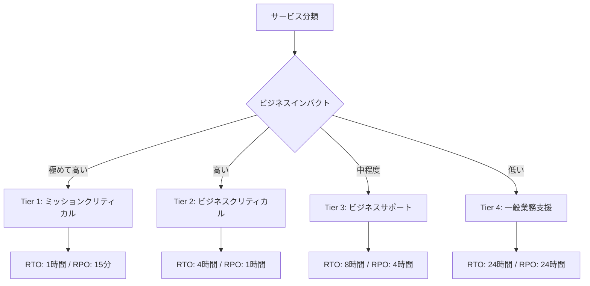
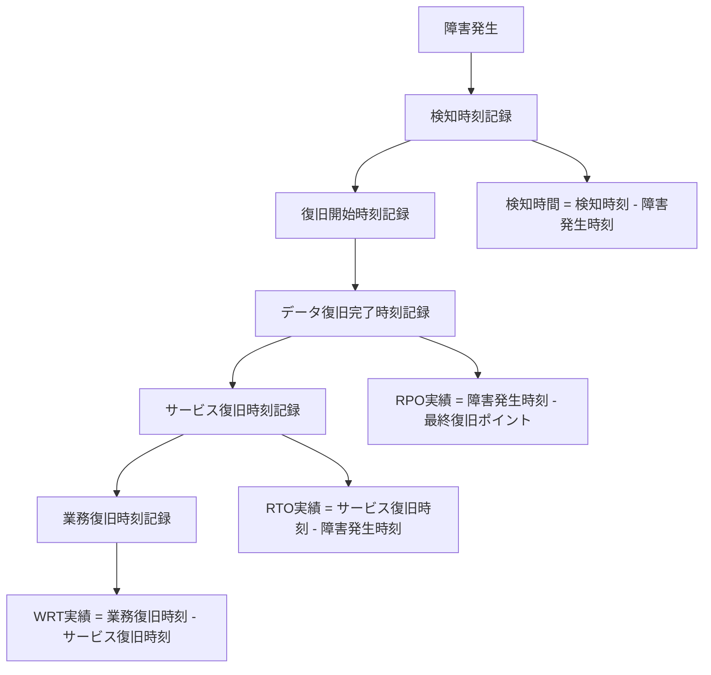

# RTO/RPO 定義
ServiceMatrix RTO/RPO Definition

Version: 1.0
Status: Active
Owner: Service Continuity Manager
Classification: ITIL 4 Aligned

---

## 1. 目的と適用範囲

### 1.1 目的

本ドキュメントは、ServiceMatrix におけるサービス継続性の基盤となる
RTO（Recovery Time Objective: 目標復旧時間）および
RPO（Recovery Point Objective: 目標復旧時点）を定義する。
サービス階層ごとに適切な復旧目標を設定し、事業継続性を確保する。

### 1.2 基本概念

### 1.3 用語定義

| 用語 | 定義 |
|------|------|
| RTO | 障害発生からサービスが復旧するまでの最大許容時間 |
| RPO | 障害発生時に許容されるデータ損失量（時間で表現） |
| MTPD | Maximum Tolerable Period of Disruption: 事業が許容できる最大中断期間 |
| MBCO | Minimum Business Continuity Objective: 最低限維持すべき事業機能レベル |
| WRT | Work Recovery Time: データ復旧後の業務復旧に要する時間 |

---

## 2. サービス階層分類

### 2.1 サービスティア定義

### 2.2 ティア別詳細定義

| 属性 | Tier 1 | Tier 2 | Tier 3 | Tier 4 |
|------|--------|--------|--------|--------|
| 名称 | ミッションクリティカル | ビジネスクリティカル | ビジネスサポート | 一般業務支援 |
| RTO | 1時間 | 4時間 | 8時間 | 24時間 |
| RPO | 15分 | 1時間 | 4時間 | 24時間 |
| MTPD | 4時間 | 12時間 | 24時間 | 72時間 |
| WRT | 30分 | 2時間 | 4時間 | 8時間 |
| 可用性目標 | 99.99% | 99.95% | 99.9% | 99.5% |
| DR方式 | ホットスタンバイ | ウォームスタンバイ | コールドスタンバイ | バックアップ復元 |
| バックアップ頻度 | 15分毎 | 1時間毎 | 日次 | 日次 |

### 2.3 ServiceMatrix サービスの分類

| サービス名 | ティア | RTO | RPO | 根拠 |
|-----------|--------|-----|-----|------|
| インシデント管理システム | Tier 1 | 1時間 | 15分 | 障害対応の即時性が必要 |
| 変更管理・承認システム | Tier 2 | 4時間 | 1時間 | 承認遅延は許容範囲内 |
| 監視ダッシュボード | Tier 1 | 1時間 | 15分 | リアルタイム監視が必須 |
| ナレッジベース | Tier 3 | 8時間 | 4時間 | 代替手段で対応可能 |
| レポート生成システム | Tier 3 | 8時間 | 4時間 | 遅延は許容可能 |
| ユーザー管理システム | Tier 2 | 4時間 | 1時間 | 認証に影響 |
| CI/CDパイプライン | Tier 2 | 4時間 | 1時間 | 開発効率に影響 |
| ドキュメント管理 | Tier 3 | 8時間 | 4時間 | Git ミラーで補完可能 |
| 監査ログシステム | Tier 2 | 4時間 | 15分 | コンプライアンス要件 |
| 開発環境 | Tier 4 | 24時間 | 24時間 | ローカルで代替可能 |

---

## 3. 復旧戦略

### 3.1 ティア別復旧戦略

```mermaid
flowchart TD
    subgraph Tier1 [Tier 1: ホットスタンバイ]
        T1A[アクティブ-アクティブ構成] --> T1B[リアルタイムレプリケーション]
        T1B --> T1C[自動フェイルオーバー]
        T1C --> T1D[RTO < 1時間]
    end

    subgraph Tier2 [Tier 2: ウォームスタンバイ]
        T2A[アクティブ-パッシブ構成] --> T2B[準リアルタイムレプリケーション]
        T2B --> T2C[手動/半自動フェイルオーバー]
        T2C --> T2D[RTO < 4時間]
    end

    subgraph Tier3 [Tier 3: コールドスタンバイ]
        T3A[待機環境の事前構築] --> T3B[日次バックアップ復元]
        T3B --> T3C[手動フェイルオーバー]
        T3C --> T3D[RTO < 8時間]
    end

    subgraph Tier4 [Tier 4: バックアップ復元]
        T4A[バックアップからの再構築] --> T4B[手動環境構築]
        T4B --> T4C[手動復旧]
        T4C --> T4D[RTO < 24時間]
    end
```

### 3.2 復旧手順の段階

| 段階 | 内容 | 完了条件 |
|------|------|---------|
| 1. 検知 | 障害の検知と影響評価 | 障害内容と影響範囲が特定済み |
| 2. 宣言 | 復旧プロセスの発動宣言 | 復旧方式と担当者が確定 |
| 3. インフラ復旧 | インフラストラクチャの復元 | サーバー/ネットワークが稼働 |
| 4. データ復旧 | バックアップからのデータ復元 | RPO範囲内のデータが利用可能 |
| 5. アプリケーション復旧 | アプリケーションの起動確認 | 全機能が正常動作 |
| 6. 業務復旧 | 業務処理の再開 | エンドユーザーが業務利用可能 |
| 7. 正常化 | 完全な正常運用への復帰 | すべてのSLAが遵守される状態 |

---

## 4. RTO/RPO の達成手段

### 4.1 技術的手段

| 手段 | 目的 | 対象ティア |
|------|------|-----------|
| データベースレプリケーション | RPO最小化 | Tier 1-2 |
| トランザクションログ配信 | PITR確保 | Tier 1-3 |
| スナップショット | 迅速な復旧ポイント | 全ティア |
| ロードバランサー自動切替 | RTO最小化 | Tier 1-2 |
| コンテナオーケストレーション | 自動復旧 | Tier 1-3 |
| Infrastructure as Code | 環境再構築の高速化 | 全ティア |

### 4.2 運用的手段

| 手段 | 目的 | 頻度 |
|------|------|------|
| 復旧手順書の整備 | 復旧時間の短縮 | 四半期更新 |
| 復旧訓練 | 手順の習熟 | 四半期実施 |
| オンコール体制 | 初動時間の短縮 | 常時 |
| 自動アラート | 検知時間の最小化 | 常時 |
| エスカレーション自動化 | 意思決定の迅速化 | 常時 |

---

## 5. 測定と監視

### 5.1 RTO/RPO 達成状況の測定

### 5.2 KPI

| KPI | 目標値 | 計測頻度 |
|-----|--------|---------|
| RTO 目標達成率 | 99% 以上 | 四半期 |
| RPO 目標達成率 | 99.9% 以上 | 四半期 |
| 平均復旧時間（MTTR） | RTO の 70% 以内 | 月次 |
| 復旧訓練成功率 | 95% 以上 | 四半期 |
| バックアップ完全性 | 100% | 月次 |
| レプリケーション遅延 | RPO の 50% 以内 | 日次 |

---

## 6. テストと検証

### 6.1 テスト計画

| テスト種別 | 頻度 | 対象 | 内容 |
|-----------|------|------|------|
| 机上訓練 | 四半期 | 全ティア | 手順の確認・机上シミュレーション |
| 部分復旧テスト | 月次 | Tier 1-2 | 個別コンポーネントの復元確認 |
| 完全復旧テスト | 四半期 | Tier 1-2 | エンドツーエンドの復旧確認 |
| DR 切替テスト | 半期 | Tier 1 | DR サイトへの完全切替テスト |
| 全体復旧訓練 | 年次 | 全ティア | 大規模災害想定の総合訓練 |

### 6.2 テスト記録要件

- テスト実施日時
- テスト対象サービスとティア
- RTO/RPO 目標値と実績値
- 復旧手順の有効性評価
- 発見された問題と改善提案
- 次回テストへの反映事項

---

## 7. ビジネスインパクト分析（BIA）連携

### 7.1 BIA の実施

- RTO/RPO の設定根拠はビジネスインパクト分析に基づく
- BIA は年次で実施し、ビジネス環境の変化を反映する
- サービスのティア分類は BIA の結果に基づいて更新する

### 7.2 BIA 評価基準

| 評価軸 | 評価内容 |
|--------|---------|
| 財務影響 | サービス停止による収益損失 |
| 顧客影響 | 顧客満足度・信頼性への影響 |
| 法的影響 | コンプライアンス違反のリスク |
| 運用影響 | 他サービスへの波及影響 |
| 評判影響 | ブランド・信頼への影響 |

---

## 8. 継続的改善

### 8.1 レビューサイクル

| レビュー | 頻度 | 内容 |
|---------|------|------|
| 実績レビュー | 四半期 | RTO/RPO達成状況の評価 |
| BIA更新 | 年次 | ビジネス要件の変化を反映 |
| ティア分類レビュー | 半期 | サービス分類の妥当性確認 |
| 技術戦略レビュー | 年次 | 復旧技術の最新化検討 |

### 8.2 改善プロセス

- 実際の障害復旧時のRTO/RPO実績を記録し、目標との差異を分析
- 復旧テストの結果から改善項目を抽出し、次回テストに反映
- 新技術の導入によるRTO/RPO改善の可能性を継続的に評価
- AI Agent による復旧パターンの分析と最適化提案

---

## 改訂履歴

| バージョン | 日付 | 変更内容 | 承認者 |
|-----------|------|---------|--------|
| 1.0 | 2026-03-02 | 初版作成 | Service Continuity Manager |
