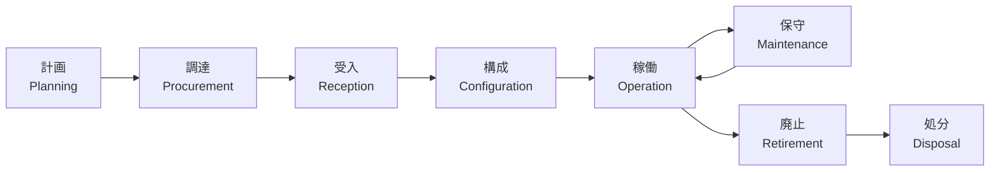
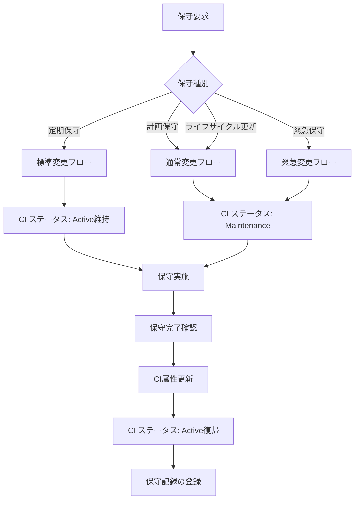
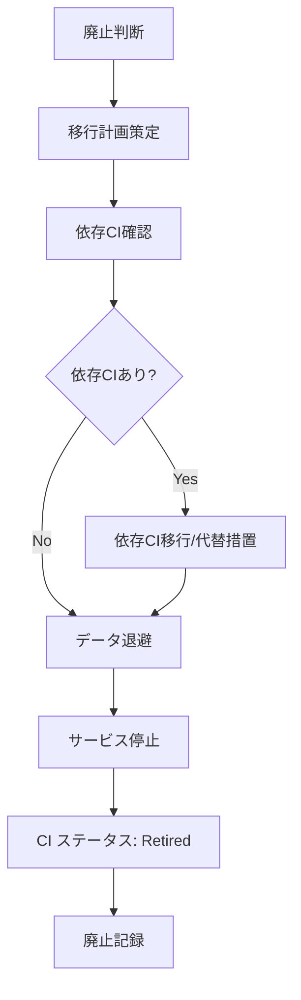

# 資産ライフサイクルモデル（Asset Lifecycle Model）

ServiceMatrix 資産ライフサイクル仕様
Version: 1.0
Status: Active
Classification: Internal Governance Document
Applicable Standard: ITIL 4 / ISO 20000

---

## 1. 目的

本ドキュメントは、ServiceMatrixが管理するIT資産（CI）の
ライフサイクル全体にわたる管理プロセスを定義する。

計画・調達から廃止・処分まで、すべてのフェーズにおける
管理責任・承認フロー・記録要件を規定する。

---

## 2. ライフサイクル全体像

### 2.1 ライフサイクルフェーズ



### 2.2 フェーズ詳細

| フェーズ | CIステータス | 期間目安 | 主要活動 |
|---------|-------------|---------|---------|
| 計画 | Planned | 1〜4週 | 要件定義、見積取得、予算確保 |
| 調達 | Ordered | 1〜8週 | 発注、納期管理 |
| 受入 | Received | 1〜2週 | 検収、資産番号付与、CMDB登録 |
| 構成 | Received → Active | 1〜4週 | セットアップ、テスト、本番展開 |
| 稼働 | Active | 3〜7年 | 運用、監視、SLA管理 |
| 保守 | Maintenance | 随時 | パッチ適用、アップグレード、修理 |
| 廃止 | Retired | 1〜4週 | 移行、データ退避、サービス停止 |
| 処分 | Disposed | 1〜2週 | データ消去、物理廃棄/返却 |

---

## 3. 各フェーズの詳細

### 3.1 計画フェーズ（Planning）

#### 目的
新規CI導入の必要性を評価し、導入計画を策定する。

#### 活動

| 活動 | 責任者 | 成果物 |
|------|--------|--------|
| 要件定義 | サービスオーナー | 要件定義書 |
| 既存CI評価 | CMDB管理者 | 既存CI活用可能性レポート |
| コスト見積 | 調達担当 | 見積書 |
| 予算承認 | マネージャー | 承認記録 |
| 導入スケジュール | プロジェクトリーダー | スケジュール |
| CMDB事前登録 | CMDB管理者 | CI（ステータス: Planned） |

#### CI登録時の必須情報

```json
{
  "ci_id": "CI-SRV-xxx",
  "ci_type": "Server",
  "name": "（仮称）",
  "status": "Planned",
  "owner": "要件定義者",
  "criticality": "（予定重要度）",
  "environment": "（予定環境）",
  "planned_date": "YYYY-MM-DD",
  "budget_ref": "BUDGET-YYYY-NNN"
}
```

### 3.2 調達フェーズ（Procurement）

#### 活動

| 活動 | 責任者 | 成果物 |
|------|--------|--------|
| 発注 | 調達担当 | 発注書 |
| 納期管理 | 調達担当 | 納期トラッキング |
| ベンダー連絡 | 調達担当 | 連絡記録 |
| CIステータス更新 | CMDB管理者 | CI（ステータス: Ordered） |

### 3.3 受入フェーズ（Reception）

#### 活動

| 活動 | 責任者 | 成果物 |
|------|--------|--------|
| 物理検収 | インフラチーム | 検収記録 |
| スペック確認 | インフラチーム | スペック確認書 |
| 資産番号付与 | CMDB管理者 | 資産台帳更新 |
| CMDB属性更新 | CMDB管理者 | CI属性（実スペック入力） |
| CIステータス更新 | CMDB管理者 | CI（ステータス: Received） |

### 3.4 構成フェーズ（Configuration）

#### 活動

| 活動 | 責任者 | 成果物 |
|------|--------|--------|
| OSインストール | インフラチーム | セットアップ記録 |
| ミドルウェア構成 | アプリチーム/インフラチーム | 構成記録 |
| セキュリティ設定 | セキュリティチーム | セキュリティ設定記録 |
| ネットワーク接続 | ネットワークチーム | 接続確認記録 |
| テスト実施 | テストチーム | テスト結果 |
| CMDB関係性設定 | CMDB管理者 | リレーションシップ登録 |
| 監視設定 | 運用チーム | 監視設定記録 |
| 本番展開承認 | サービスオーナー | 展開承認記録 |
| CIステータス更新 | CMDB管理者 | CI（ステータス: Active） |

### 3.5 稼働フェーズ（Operation）

#### 活動

| 活動 | 頻度 | 責任者 |
|------|------|--------|
| 日常監視 | 継続 | 運用チーム |
| SLA測定 | 月次 | SLA管理者 |
| CI属性確認 | 四半期 | CIオーナー |
| セキュリティスキャン | 月次 | セキュリティチーム |
| 性能評価 | 四半期 | 運用チーム |
| キャパシティ管理 | 月次 | インフラチーム |

#### 稼働中のCI属性自動更新

| 自動更新項目 | 取得元 | 頻度 |
|-------------|--------|------|
| OS パッチレベル | 監視エージェント | 日次 |
| ディスク使用率 | 監視エージェント | 15分 |
| 稼働状態 | ヘルスチェック | 5分 |
| 接続中サービス数 | ロードバランサ | 15分 |

### 3.6 保守フェーズ（Maintenance）

#### 保守の種別

| 種別 | 説明 | 承認 | CIステータス |
|------|------|------|-------------|
| 定期保守 | パッチ適用、バックアップ検証 | 標準変更 | Active のまま |
| 計画保守 | ファームウェア更新、ハード交換 | 通常変更 | Maintenance |
| 緊急保守 | 障害対応、緊急パッチ | 緊急変更 | Maintenance |
| ライフサイクル更新 | メジャーバージョン更新 | 通常変更 | Maintenance |

#### 保守フロー



### 3.7 廃止フェーズ（Retirement）

#### 廃止判断基準

| 基準 | 説明 |
|------|------|
| EOL（End of Life） | ベンダーのサポート終了 |
| 技術的陳腐化 | 性能要件を満たせなくなった |
| コスト非効率 | 維持コストが更新コストを上回る |
| リプレース | 後継システムへの移行完了 |
| サービス終了 | 関連サービスが終了した |

#### 廃止フロー



### 3.8 処分フェーズ（Disposal）

#### 処分プロセス

| 活動 | 責任者 | 要件 |
|------|--------|------|
| データ消去 | セキュリティチーム | NIST 800-88準拠の消去 |
| 消去証明書取得 | セキュリティチーム | 消去証明書の保管 |
| 物理廃棄/返却 | インフラチーム | 廃棄業者への引渡し記録 |
| CMDB最終更新 | CMDB管理者 | CI ステータス: Disposed |
| 資産台帳更新 | 経理部門 | 除却処理 |

---

## 4. ライフサイクル管理指標

### 4.1 資産管理KPI

| KPI | 計算式 | 目標 |
|-----|--------|------|
| CI情報鮮度 | 最終更新が90日以内のCIの割合 | 95%以上 |
| 未登録CI率 | 検出された未登録CIの割合 | 2%以下 |
| 廃止CI処分率 | Retired後90日以内にDisposedになったCIの割合 | 90%以上 |
| 資産利用率 | Active CI / (Active + Maintenance) CI の割合 | 90%以上 |
| 計画精度 | 計画日±2週以内に稼働開始したCIの割合 | 85%以上 |

### 4.2 ライフサイクルコスト追跡

| コストカテゴリ | 記録タイミング | 記録項目 |
|--------------|-------------|---------|
| 初期費用 | 調達フェーズ | ハードウェア/ライセンス費用 |
| 構成費用 | 構成フェーズ | セットアップ工数 |
| 運用費用 | 稼働フェーズ（月次） | 電力・ラック・監視・保守費用 |
| 保守費用 | 保守フェーズ | パーツ交換・工数 |
| 廃止費用 | 廃止・処分フェーズ | データ消去・廃棄費用 |

---

## 5. ライフサイクルイベントの記録

### 5.1 ライフサイクルイベント JSON Schema

```json
{
  "$schema": "http://json-schema.org/draft-07/schema#",
  "title": "Asset Lifecycle Event",
  "type": "object",
  "required": ["event_id", "ci_id", "event_type", "timestamp", "actor"],
  "properties": {
    "event_id": {
      "type": "string",
      "pattern": "^LCE-[0-9]{4}-[0-9]{6}$",
      "description": "ライフサイクルイベントID"
    },
    "ci_id": {
      "type": "string",
      "description": "対象CI ID"
    },
    "event_type": {
      "type": "string",
      "enum": [
        "planned", "ordered", "received", "configured",
        "activated", "maintenance_start", "maintenance_end",
        "retired", "disposed", "cancelled"
      ],
      "description": "イベント種別"
    },
    "from_status": {
      "type": "string",
      "description": "遷移前ステータス"
    },
    "to_status": {
      "type": "string",
      "description": "遷移後ステータス"
    },
    "timestamp": {
      "type": "string",
      "format": "date-time",
      "description": "イベント日時"
    },
    "actor": {
      "type": "string",
      "description": "実行者（user/agent）"
    },
    "reason": {
      "type": "string",
      "description": "イベント理由"
    },
    "related_issue": {
      "type": "string",
      "description": "関連GitHub Issue番号"
    },
    "related_change": {
      "type": "string",
      "description": "関連変更要求ID"
    },
    "cost": {
      "type": "object",
      "properties": {
        "amount": { "type": "number" },
        "currency": { "type": "string", "default": "JPY" },
        "category": { "type": "string" }
      },
      "description": "関連コスト"
    },
    "notes": {
      "type": "string",
      "description": "備考"
    }
  }
}
```

---

## 6. 資産タイプ別ライフサイクル特性

### 6.1 ハードウェア資産

| 属性 | 値 |
|------|-----|
| 標準耐用年数 | サーバー: 5年、ネットワーク機器: 7年、ストレージ: 5年 |
| 減価償却 | 定額法 |
| EOL管理 | ベンダーEOLアナウンスから12ヶ月以内にリプレース計画策定 |
| 廃棄要件 | データ消去証明必須、産業廃棄物処理 |

### 6.2 ソフトウェア資産

| 属性 | 値 |
|------|-----|
| ライセンス管理 | ライセンスキー・契約期間・更新日を記録 |
| EOL管理 | ベンダーサポート終了前にアップグレード計画策定 |
| パッチ管理 | セキュリティパッチは30日以内に適用 |
| バージョン管理 | メジャー・マイナーバージョンをCMDBに記録 |

### 6.3 サービス資産

| 属性 | 値 |
|------|-----|
| SLA連携 | サービスCIにSLA定義を紐付け |
| 依存関係管理 | サービスを構成するCI群の依存関係を管理 |
| サービスカタログ | サービスCIの情報をカタログとして公開 |

---

## 7. 自動化

### 7.1 ライフサイクル自動化ルール

| トリガー | 自動アクション |
|----------|--------------|
| CI作成（Planned） | 計画レビューIssue自動作成 |
| ステータス→Active | 監視設定の自動適用 |
| ステータス→Maintenance | SLA除外時間の記録開始 |
| ステータス→Active復帰 | SLA除外時間の記録終了 |
| 稼働期間が耐用年数の80%超過 | リプレース検討Issue自動作成 |
| ベンダーEOL日まで6ヶ月 | EOLアラートIssue自動作成 |
| ステータス→Retired | 処分計画Issue自動作成 |
| Retired後90日経過 | 処分催促通知 |

---

## 8. 関連ドキュメント

| ドキュメント | 参照先 |
|-------------|--------|
| CMDBデータモデル | `docs/10_cmdb/CMDB_DATA_MODEL.md` |
| CI管理ポリシー | `docs/10_cmdb/CONFIGURATION_ITEM_POLICY.md` |
| リレーションシップモデル | `docs/10_cmdb/RELATIONSHIP_MODEL.md` |
| 影響分析ロジック | `docs/10_cmdb/IMPACT_ANALYSIS_LOGIC.md` |
| データ保持ポリシー | `docs/11_data_model/DATA_RETENTION_POLICY.md` |

---

## 9. 改定履歴

| 版数 | 日付 | 変更内容 | 承認者 |
|------|------|----------|--------|
| 1.0 | 2026-03-02 | 初版作成 | Service Governance Authority |

---

本ドキュメントはServiceMatrix統治フレームワークの一部であり、
SERVICEMATRIX_CHARTER.md に定められた統治原則に従う。
