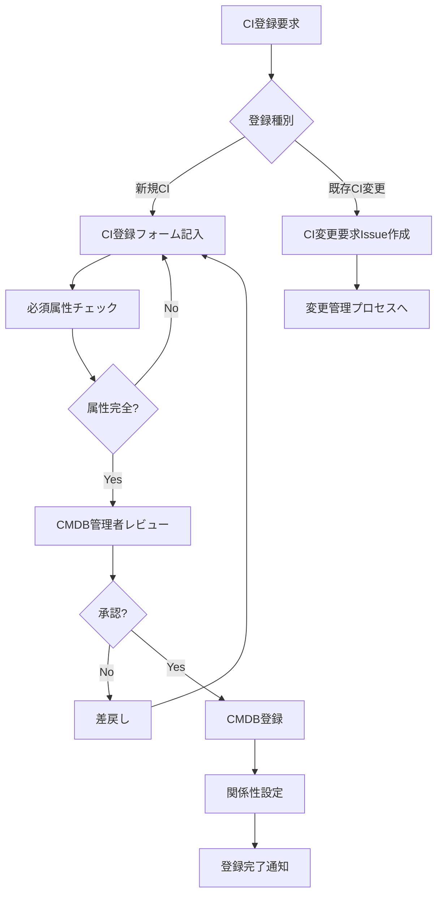
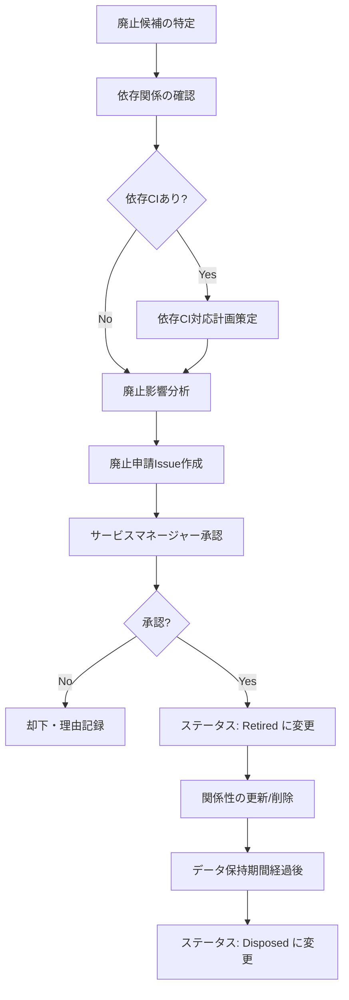

# 構成アイテム管理ポリシー（Configuration Item Policy）

ServiceMatrix CI管理ポリシー
Version: 1.0
Status: Active
Classification: Internal Governance Document
Applicable Standard: ITIL 4 / ISO 20000

---

## 1. 目的

本ドキュメントは、ServiceMatrixのCMDBにおける
構成アイテム（CI）の登録、分類、管理、廃止に関するポリシーを定義する。

すべてのCIは本ポリシーに従って管理されなければならない。

---

## 2. CI管理の原則

### 2.1 基本原則

1. **網羅性**: サービス提供に関わるすべてのコンポーネントをCIとして登録する
2. **正確性**: CI情報は常に最新かつ正確であること
3. **追跡可能性**: CIの変更履歴はすべて記録される
4. **一貫性**: CI命名規則・分類体系を統一する
5. **責任明確化**: すべてのCIにオーナーを割り当てる

### 2.2 CI管理の範囲

| 管理対象 | 管理対象外 |
|----------|-----------|
| 本番環境のすべてのハードウェア/ソフトウェア | 個人のPC・モバイルデバイス |
| ステージング環境の主要コンポーネント | 開発環境の一時的リソース |
| サービスに影響するネットワーク機器 | 物理的なオフィス設備 |
| ビジネスサービス/ITサービス定義 | 外部SaaSのサービス内部構成 |
| 統治ドキュメント | 一般的なオフィスドキュメント |
| 担当者/チーム情報 | 組織図全体 |

---

## 3. CI命名規則

### 3.1 CI ID体系

```
CI-{TYPE}-{SEQ}
```

| 要素 | 説明 | 例 |
|------|------|-----|
| CI | 固定プレフィックス | CI |
| TYPE | CIタイプ略称（3文字） | SRV, APP, NET, SVC, DB, STR, MID, PER, DOC, ENV |
| SEQ | 連番（3〜6桁、ゼロ埋め） | 001, 000012 |

#### CIタイプ略称一覧

| タイプ | 略称 | 連番範囲 |
|--------|------|---------|
| Server | SRV | 001-999 |
| Application | APP | 001-999 |
| Network | NET | 001-999 |
| Service | SVC | 001-999 |
| Database | DB | 001-999 |
| Storage | STR | 001-999 |
| Middleware | MID | 001-999 |
| Person | PER | 001-999 |
| Document | DOC | 001-999 |
| Environment | ENV | 001-099 |

### 3.2 CI名称規則

| ルール | 例 |
|--------|-----|
| 環境 + 役割 + 連番（サーバー） | prod-web-01, stg-api-01 |
| サービス名 + バージョン（アプリ） | ServiceMatrix App v2.1 |
| ロケーション + 種別 + 連番（ネットワーク） | dc1-fw-01, dc1-lb-01 |
| ビジネス名称（サービス） | Email Service, CRM Service |

---

## 4. CI登録プロセス

### 4.1 登録フロー



### 4.2 CI登録要求テンプレート

```markdown
# CI登録要求

## 基本情報
| 項目 | 値 |
|------|-----|
| CI名称 | |
| CIタイプ | [Server/Application/Network/Service/Database/Storage/Middleware/Person/Document/Environment] |
| 環境 | [Production/Staging/Development/DR] |
| 重要度 | [Critical/High/Medium/Low] |
| オーナー | |
| 説明 | |

## タイプ別属性
（CIタイプに応じた属性を記入）

## 関係性
| 対象CI | 関係種別 | 説明 |
|--------|---------|------|
| | | |

## 登録理由
（新規導入、既存の未登録CI発見 等）

Labels: `cmdb/registration`
```

### 4.3 CI登録の承認基準

| チェック項目 | 基準 |
|-------------|------|
| CI IDの一意性 | 既存CIと重複しないこと |
| 必須属性の完全性 | すべての必須属性が入力されていること |
| 命名規則の遵守 | 命名規則に準拠していること |
| オーナーの有効性 | 有効なユーザー/チームであること |
| 関係性の妥当性 | 参照先CIが存在し、関係種別が適切であること |
| 重要度の妥当性 | ビジネス影響に基づく適切な重要度であること |

---

## 5. CI変更管理

### 5.1 変更の分類

| 変更カテゴリ | 説明 | 承認要否 |
|-------------|------|---------|
| 属性更新（軽微） | バージョン更新、タグ変更 | CMDB管理者承認 |
| 属性更新（重要） | オーナー変更、重要度変更 | サービスマネージャー承認 |
| ステータス変更 | Active → Retired 等 | 変更管理プロセス準拠 |
| 関係性変更 | 新規依存関係の追加/削除 | CMDB管理者承認 |
| CI削除 | CMDBからのCI削除 | サービスマネージャー承認 |

### 5.2 変更記録

すべてのCI変更は以下の情報とともに記録される。

| 記録項目 | 説明 |
|----------|------|
| history_id | 変更履歴ID |
| ci_id | 対象CI ID |
| change_type | 変更種別（create/update/delete/status_change） |
| field_name | 変更フィールド名 |
| old_value | 変更前の値 |
| new_value | 変更後の値 |
| changed_by | 変更者（user/agent） |
| changed_at | 変更日時 |
| change_reason | 変更理由 |
| related_issue | 関連Issue番号 |

---

## 6. CI重要度分類

### 6.1 重要度判定基準

| 重要度 | ビジネス影響 | SLA対応 | 冗長構成要件 | 例 |
|--------|------------|---------|------------|-----|
| Critical | サービス全体に影響、事業停止リスク | P1 SLA適用 | 必須（冗長構成 + DR） | 本番DBプライマリ、認証基盤 |
| High | 主要機能に影響、業務遅延 | P2 SLA適用 | 推奨（冗長構成） | APIサーバー、ロードバランサ |
| Medium | 一部機能に影響、代替手段あり | P3 SLA適用 | 任意 | バッチサーバー、監視ツール |
| Low | 利便性への影響のみ | P4 SLA適用 | 不要 | 開発ツール、ドキュメントサーバー |

### 6.2 重要度の定期レビュー

| 頻度 | レビュー者 | 内容 |
|------|-----------|------|
| 四半期 | サービスオーナー | ビジネス影響の変化に応じた重要度見直し |
| 年次 | CMDB管理者 + サービスマネージャー | 全CI重要度の棚卸し |
| 随時 | 変更管理プロセスにて | 構成変更に伴う重要度見直し |

---

## 7. CI棚卸しプロセス

### 7.1 棚卸しスケジュール

| 対象 | 頻度 | 方法 |
|------|------|------|
| Critical CI | 月次 | オーナー確認 + 自動属性チェック |
| High CI | 四半期 | オーナー確認 + サンプリング検証 |
| Medium/Low CI | 半期 | 自動チェック + 異常時のみ手動確認 |
| 全CI | 年次 | 全数棚卸し |

### 7.2 棚卸しチェックリスト

| チェック項目 | 確認内容 |
|-------------|---------|
| 存在確認 | CIが物理的/論理的に存在するか |
| ステータス確認 | CMDBのステータスが実態と一致するか |
| 属性確認 | IPアドレス、バージョン等が最新か |
| オーナー確認 | オーナーが在籍・担当しているか |
| 関係性確認 | 依存関係が実態と一致するか |
| 重要度確認 | ビジネス影響に応じた適切な重要度か |

---

## 8. CI廃止プロセス

### 8.1 廃止条件

以下のいずれかに該当する場合、CIの廃止を検討する。

| 条件 | 説明 |
|------|------|
| サービス終了 | CIが関連するサービスが終了した |
| リプレース | 後継CIに置き換えられた |
| 不要判定 | 棚卸しで不要と判定された |
| 障害廃止 | 修復不能な障害により使用不可 |

### 8.2 廃止フロー



### 8.3 廃止後のデータ保持

| データ種別 | 保持期間 |
|-----------|---------|
| CI基本情報 | 廃止後3年 |
| CI変更履歴 | 廃止後7年（監査要件） |
| 関係性情報 | 廃止後1年 |

---

## 9. CMDB管理体制

### 9.1 役割と責任

| 役割 | 責任 |
|------|------|
| CMDB管理者 | CMDB全体の管理・品質保証・アクセス制御 |
| CIオーナー | 担当CIの情報正確性の維持 |
| サービスマネージャー | サービスCIの重要度・関係性の承認 |
| 変更マネージャー | CI変更の変更管理プロセス連携 |
| 監査担当 | CMDB棚卸しの実施・監査レポート作成 |

### 9.2 アクセス制御

| 操作 | CMDB管理者 | CIオーナー | サービスマネージャー | 運用チーム | 一般ユーザー |
|------|-----------|-----------|-------------------|-----------|------------|
| CI参照 | Yes | Yes | Yes | Yes | Yes（公開CIのみ） |
| CI登録 | Yes | 申請のみ | 申請のみ | 申請のみ | No |
| CI属性変更 | Yes | 担当CIのみ | 担当サービスCIのみ | No | No |
| CI削除 | Yes | No | 申請のみ | No | No |
| 関係性変更 | Yes | 担当CIのみ | No | No | No |
| レポート参照 | Yes | Yes | Yes | Yes | No |

---

## 10. 関連ドキュメント

| ドキュメント | 参照先 |
|-------------|--------|
| CMDBデータモデル | `docs/10_cmdb/CMDB_DATA_MODEL.md` |
| リレーションシップモデル | `docs/10_cmdb/RELATIONSHIP_MODEL.md` |
| 影響分析ロジック | `docs/10_cmdb/IMPACT_ANALYSIS_LOGIC.md` |
| 資産ライフサイクル | `docs/10_cmdb/ASSET_LIFECYCLE_MODEL.md` |

---

## 11. 改定履歴

| 版数 | 日付 | 変更内容 | 承認者 |
|------|------|----------|--------|
| 1.0 | 2026-03-02 | 初版作成 | Service Governance Authority |

---

本ドキュメントはServiceMatrix統治フレームワークの一部であり、
SERVICEMATRIX_CHARTER.md に定められた統治原則に従う。
