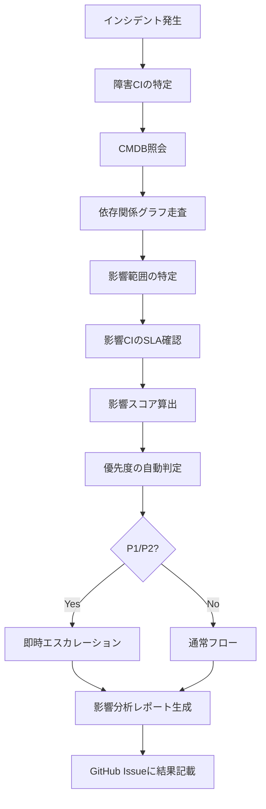
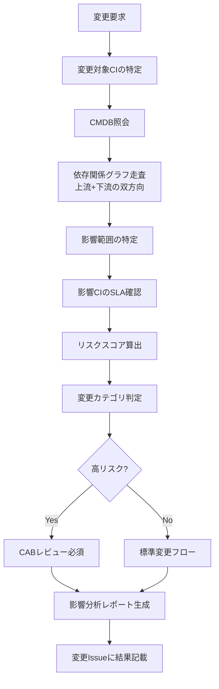
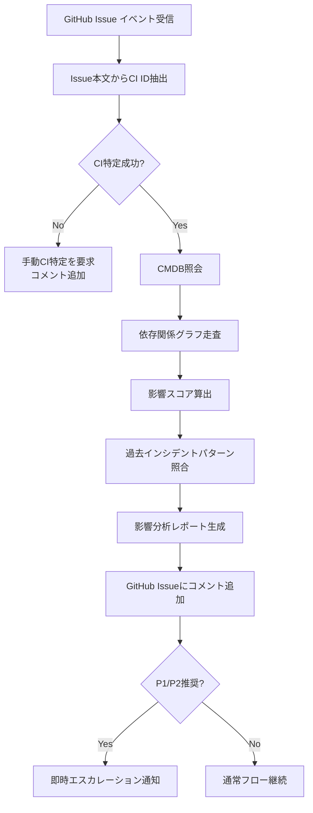

# 影響分析ロジック（Impact Analysis Logic）

ServiceMatrix 影響分析仕様
Version: 1.0
Status: Active
Classification: Internal Technical Document
Applicable Standard: ITIL 4 / ISO 20000

---

## 1. 目的

本ドキュメントは、ServiceMatrixにおけるインシデント発生時および
変更実施時の影響分析ロジックを定義する。

影響分析はCMDBの依存関係グラフを基盤とし、
SLA判定・エスカレーション判断・優先度決定に直結する重要な機能である。

---

## 2. 影響分析の全体フロー

### 2.1 インシデント発生時の影響分析フロー



### 2.2 変更実施時の影響分析フロー



---

## 3. 影響分析の入力データ

### 3.1 CMDB照会データ

| データ | 取得元 | 用途 |
|--------|--------|------|
| 障害/変更対象CI | GitHub Issue 本文から CI ID 抽出 | 起点CIの特定 |
| CI属性 | CMDB CI レコード | criticality, environment, status |
| 依存関係 | CMDB Relationship レコード | グラフ走査 |
| SLA定義 | SLA定義書 | 影響サービスのSLA確認 |
| 過去インシデント | GitHub Issues 履歴 | パターン分析 |

### 3.2 GitHub Issue からのCI抽出

```
正規表現パターン: CI-[A-Z]{3}-[0-9]{3,6}

抽出対象:
  - Issue 本文
  - Issue コメント
  - ラベル（ci/* ラベル）
```

---

## 4. 依存関係グラフ走査

### 4.1 走査方向

| 分析種別 | 走査方向 | 説明 |
|----------|---------|------|
| インシデント影響分析 | 上流（Upstream）走査 | 障害CIに依存するCIを再帰的に辿る |
| 変更影響分析 | 双方向走査 | 変更対象CIの上流・下流の両方を走査 |
| サービス影響分析 | 下流（Downstream）走査 | サービスCIが依存するCIの状態を確認 |

### 4.2 BFS走査アルゴリズム

```
function impactAnalysis(trigger_ci_id, analysis_type):
    graph = loadCMDBGraph()
    impacted_cis = []
    visited = Set()
    queue = Queue()

    queue.enqueue({ci_id: trigger_ci_id, depth: 0, path: [trigger_ci_id]})
    visited.add(trigger_ci_id)

    while queue is not empty:
        current = queue.dequeue()

        // 深さ制限（最大20ホップ）
        if current.depth > 20:
            continue

        // 走査方向に応じた隣接CI取得
        if analysis_type == "incident":
            neighbors = graph.getUpstreamCIs(current.ci_id)
        elif analysis_type == "change":
            neighbors = graph.getAllAdjacentCIs(current.ci_id)
        else:
            neighbors = graph.getDownstreamCIs(current.ci_id)

        for each neighbor in neighbors:
            if neighbor.ci_id in visited:
                continue

            relationship = graph.getRelationship(current.ci_id, neighbor.ci_id)

            // 影響伝播の判定
            impact = evaluateImpact(relationship, neighbor)

            if impact.propagates:
                impacted_cis.append({
                    ci_id: neighbor.ci_id,
                    ci_name: neighbor.name,
                    ci_type: neighbor.ci_type,
                    criticality: neighbor.criticality,
                    impact_type: impact.type,  // full / partial / none
                    impact_score: impact.score,
                    depth: current.depth + 1,
                    path: current.path + [neighbor.ci_id],
                    relationship_type: relationship.type
                })

                visited.add(neighbor.ci_id)
                queue.enqueue({
                    ci_id: neighbor.ci_id,
                    depth: current.depth + 1,
                    path: current.path + [neighbor.ci_id]
                })

    return impacted_cis
```

### 4.3 走査制限

| 制限項目 | 値 | 理由 |
|----------|-----|------|
| 最大走査深度 | 20ホップ | 計算量の制御 |
| 最大影響CI数 | 500件 | メモリ・処理時間の制御 |
| タイムアウト | 30秒 | レスポンス性能の確保 |

---

## 5. 影響スコア算出ロジック

### 5.1 重み付けグラフモデル

影響スコアは以下の要素の重み付け合計で算出する。

```
Impact Score = Σ(CI Criticality Weight x Relationship Weight x Distance Weight x Environment Weight)
```

### 5.2 CI重要度の重み

| CI Criticality | Weight |
|---------------|--------|
| Critical | 10 |
| High | 7 |
| Medium | 4 |
| Low | 1 |

### 5.3 リレーション種別の重み

| Relationship Type | Weight | 備考 |
|-------------------|--------|------|
| Depends On (Hard) | 1.0 | 完全依存 |
| Depends On (Soft) | 0.5 | 部分依存 |
| Hosted On | 1.0 | 基盤障害は完全影響 |
| Runs On | 0.9 | ランタイム障害は高影響 |
| Connects To | 0.7 | 通信断は接続先に影響 |
| Part Of | 0.8 | 構成要素の障害 |
| Used By | 0.6 | 利用関係 |
| Clustered With | 0.3 | クラスター内は部分影響 |
| Backed Up By | 0.0 | バックアップは影響伝播しない |
| Managed By | 0.0 | 管理関係は影響伝播しない |

### 5.4 距離（深さ）による減衰

```
Distance Weight = 1.0 / (1.0 + 0.2 x depth)
```

| Depth | Distance Weight |
|-------|----------------|
| 0 | 1.000 |
| 1 | 0.833 |
| 2 | 0.714 |
| 3 | 0.625 |
| 4 | 0.556 |
| 5 | 0.500 |

### 5.5 環境の重み

| Environment | Weight |
|-------------|--------|
| Production | 1.0 |
| DR | 0.8 |
| Staging | 0.3 |
| Development | 0.1 |

### 5.6 影響スコアの計算例

```
障害CI: CI-SRV-005 (DB Server, Production, Critical)

影響CI 1: CI-DB-001 (PostgreSQL, Production, Critical)
  Relationship: Hosted On (weight 1.0)
  Depth: 1 (distance weight 0.833)
  Score = 10 x 1.0 x 0.833 x 1.0 = 8.33

影響CI 2: CI-APP-002 (REST API, Production, High)
  Relationship: Depends On Hard (weight 1.0)
  Depth: 2 (distance weight 0.714)
  Score = 7 x 1.0 x 0.714 x 1.0 = 5.00

影響CI 3: CI-APP-001 (Web App, Production, High)
  Relationship: Depends On Hard (weight 1.0)
  Depth: 3 (distance weight 0.625)
  Score = 7 x 1.0 x 0.625 x 1.0 = 4.38

影響CI 4: CI-SVC-001 (Web Service, Production, Critical)
  Relationship: Part Of (weight 0.8)
  Depth: 4 (distance weight 0.556)
  Score = 10 x 0.8 x 0.556 x 1.0 = 4.44

総合影響スコア = 8.33 + 5.00 + 4.38 + 4.44 = 22.15
```

### 5.7 影響レベル判定

| 総合影響スコア | 影響レベル | 推奨優先度 |
|---------------|-----------|-----------|
| 20以上 | Critical | P1 |
| 10〜19 | High | P2 |
| 5〜9 | Medium | P3 |
| 5未満 | Low | P4 |

---

## 6. AI Agentによる自動影響分析

### 6.1 AI Agent の機能

| 機能 | 説明 | 自律レベル |
|------|------|-----------|
| 自動CI特定 | Issue本文からCIを自動抽出 | 完全自動 |
| グラフ走査 | 依存関係グラフの自動走査 | 完全自動 |
| 影響スコア算出 | 重み付けスコアの自動計算 | 完全自動 |
| 優先度提案 | 影響スコアに基づく優先度の提案 | 提案のみ（人間承認必要） |
| パターン分析 | 過去の類似インシデントとの照合 | 提案のみ |
| レポート生成 | 影響分析レポートの自動生成 | 完全自動 |

### 6.2 AI Agent の自動影響分析フロー



### 6.3 AI Agent の判断記録

```json
{
  "analysis_id": "IA-2026-03-001",
  "timestamp": "2026-03-15T10:30:00+09:00",
  "agent_id": "impact-analysis-agent",
  "trigger": {
    "type": "incident",
    "issue_number": 42,
    "detected_cis": ["CI-SRV-005"]
  },
  "analysis_result": {
    "impacted_cis_count": 4,
    "total_impact_score": 22.15,
    "impact_level": "Critical",
    "recommended_priority": "P1",
    "impacted_services": ["CI-SVC-001"],
    "impacted_critical_cis": ["CI-DB-001", "CI-SVC-001"]
  },
  "actions_taken": [
    "影響分析レポートをIssue #42にコメント追加",
    "P1推奨のため即時エスカレーション通知発行"
  ],
  "confidence": 0.92
}
```

---

## 7. 影響分析レポート

### 7.1 レポートテンプレート

```markdown
## 影響分析レポート

| 項目 | 内容 |
|------|------|
| 分析ID | IA-YYYY-MM-NNN |
| 分析日時 | YYYY-MM-DD HH:MM:SS JST |
| トリガー | [インシデント / 変更要求] #[Issue番号] |
| 障害/変更対象CI | [CI ID] ([CI名]) |
| 分析者 | [agent / user] |

### 影響範囲サマリ
| 指標 | 値 |
|------|-----|
| 影響CI数 | N件 |
| 影響サービス数 | N件 |
| 総合影響スコア | XX.XX |
| 影響レベル | [Critical/High/Medium/Low] |
| 推奨優先度 | [P1/P2/P3/P4] |

### 影響CI一覧
| CI ID | CI名 | タイプ | 重要度 | 影響種別 | スコア | 経路 |
|-------|------|--------|--------|---------|--------|------|
| | | | | | | |

### 影響サービスとSLA
| サービス | SLA優先度 | 現在の可用性 | SLA目標 | リスク |
|----------|----------|------------|---------|--------|
| | | | | |

### 依存関係図
（Mermaid図を自動生成）

### 過去の類似ケース
| Issue | 日時 | 影響 | 解決方法 |
|-------|------|------|---------|
| | | | |

### 推奨アクション
1. [アクション内容]
2. [アクション内容]
```

---

## 8. 変更影響分析の追加ロジック

### 8.1 変更リスクスコア

変更の場合は影響スコアに加えて、変更自体のリスクを加味する。

```
Change Risk Score = Impact Score x Change Type Weight x Complexity Weight
```

| Change Type | Weight |
|-------------|--------|
| Standard | 0.5 |
| Normal | 1.0 |
| Emergency | 1.5 |

| Complexity | Weight |
|------------|--------|
| 単一CI変更 | 0.5 |
| 複数CI変更（同一タイプ） | 1.0 |
| 複数CI変更（クロスタイプ） | 1.5 |
| アーキテクチャ変更 | 2.0 |

### 8.2 変更承認レベル判定

| Change Risk Score | 承認レベル | 承認者 |
|-------------------|-----------|--------|
| 30以上 | CAB全体承認 + 経営層報告 | CAB + CTO |
| 15〜29 | CAB承認 | CAB |
| 5〜14 | チームリーダー承認 | 変更対象CIのチームリーダー |
| 5未満 | 自動承認（標準変更の場合） | 自動 |

---

## 9. 関連ドキュメント

| ドキュメント | 参照先 |
|-------------|--------|
| CMDBデータモデル | `docs/10_cmdb/CMDB_DATA_MODEL.md` |
| リレーションシップモデル | `docs/10_cmdb/RELATIONSHIP_MODEL.md` |
| SLA定義書 | `docs/07_sla_metrics/SLA_DEFINITION.md` |
| SLA違反対応モデル | `docs/07_sla_metrics/SLA_BREACH_HANDLING_MODEL.md` |
| 監査ログスキーマ | `docs/11_data_model/AUDIT_LOG_SCHEMA.md` |

---

## 10. 改定履歴

| 版数 | 日付 | 変更内容 | 承認者 |
|------|------|----------|--------|
| 1.0 | 2026-03-02 | 初版作成 | Service Governance Authority |

---

本ドキュメントはServiceMatrix統治フレームワークの一部であり、
SERVICEMATRIX_CHARTER.md に定められた統治原則に従う。
