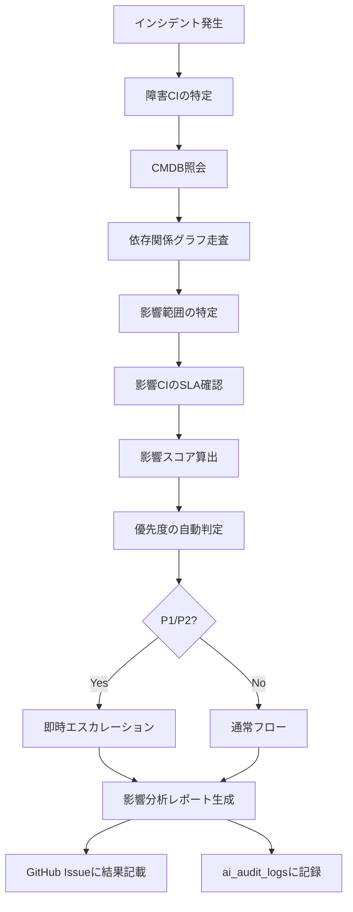
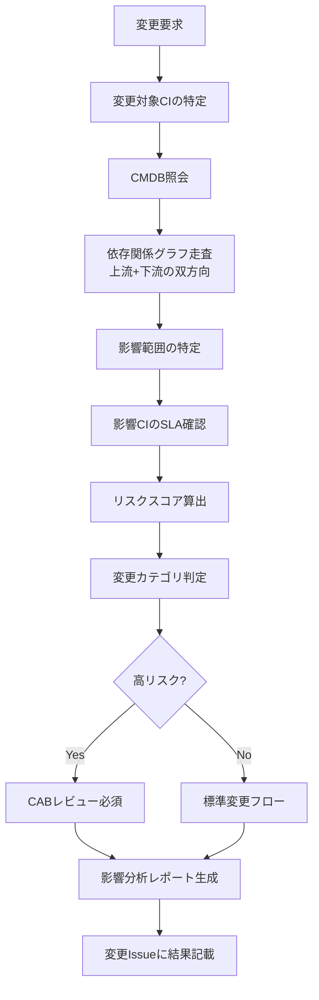
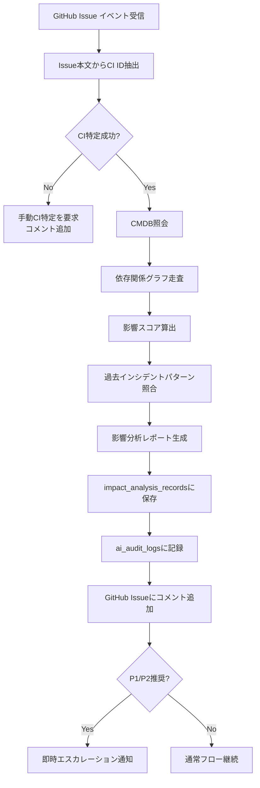

# 影響分析ロジック（Impact Analysis Logic）

IMPACT_ANALYSIS_LOGIC.md
Version: 2.0
Category: CMDB
Compliance: ITIL 4 / ISO 20000

---

## 1. 目的

本ドキュメントは、ServiceMatrixにおけるインシデント発生時および
変更実施時の影響分析ロジックを定義する。

影響分析はCMDBの依存関係グラフを基盤とし、
SLA判定・エスカレーション判断・優先度決定に直結する重要な機能である。

---

## 2. 影響分析の全体フロー

### 2.1 インシデント発生時の影響分析フロー



### 2.2 変更実施時の影響分析フロー



---

## 3. 影響分析の入力データ

### 3.1 CMDB照会データ

| データ | 取得元 | 用途 |
|--------|--------|------|
| 障害/変更対象CI | GitHub Issue 本文から CI ID 抽出 | 起点CIの特定 |
| CI属性 | CMDB CI レコード | criticality, environment, status |
| 依存関係 | CMDB Relationship レコード | グラフ走査 |
| SLA定義 | SLA定義書 | 影響サービスのSLA確認 |
| 過去インシデント | GitHub Issues 履歴 | パターン分析 |

### 3.2 GitHub Issue からのCI抽出

```
正規表現パターン: CI-[A-Z]{3}-[0-9]{3,6}

抽出対象:
  - Issue 本文
  - Issue コメント
  - ラベル（ci/* ラベル）
```

---

## 4. 依存関係グラフ走査

### 4.1 走査方向

| 分析種別 | 走査方向 | 説明 |
|----------|---------|------|
| インシデント影響分析 | 上流（Upstream）走査 | 障害CIに依存するCIを再帰的に辿る |
| 変更影響分析 | 双方向走査 | 変更対象CIの上流・下流の両方を走査 |
| サービス影響分析 | 下流（Downstream）走査 | サービスCIが依存するCIの状態を確認 |

### 4.2 BFS走査アルゴリズム（Python実装）

```python
from collections import deque
from dataclasses import dataclass, field
from typing import List, Set, Optional
from enum import Enum

class AnalysisType(Enum):
    INCIDENT = "incident"
    CHANGE = "change"
    SERVICE = "service"

@dataclass
class ImpactedCI:
    ci_id: str
    ci_name: str
    ci_type: str
    criticality: str
    impact_type: str          # full / partial / none
    impact_score: float
    depth: int
    path: List[str]
    relationship_type: str

@dataclass
class BFSNode:
    ci_id: str
    depth: int
    path: List[str]

def impact_analysis(
    trigger_ci_id: str,
    analysis_type: AnalysisType,
    cmdb_graph,
    max_depth: int = 20,
    max_cis: int = 500,
    timeout_seconds: int = 30
) -> List[ImpactedCI]:
    """
    CMDBグラフをBFSで走査して影響CIリストを返す。

    Args:
        trigger_ci_id: 起点CI（障害/変更対象）
        analysis_type: 分析種別
        cmdb_graph: CMDBグラフオブジェクト
        max_depth: 最大走査深度（デフォルト20）
        max_cis: 最大影響CI数（デフォルト500）
        timeout_seconds: タイムアウト（デフォルト30秒）

    Returns:
        影響CIのリスト（スコア降順）
    """
    import time
    start_time = time.time()

    impacted_cis: List[ImpactedCI] = []
    visited: Set[str] = set()
    queue: deque[BFSNode] = deque()

    queue.append(BFSNode(ci_id=trigger_ci_id, depth=0, path=[trigger_ci_id]))
    visited.add(trigger_ci_id)

    while queue:
        # タイムアウトチェック
        if time.time() - start_time > timeout_seconds:
            break

        # 最大CI数チェック
        if len(impacted_cis) >= max_cis:
            break

        current = queue.popleft()

        # 深さ制限
        if current.depth >= max_depth:
            continue

        # 走査方向に応じた隣接CI取得
        if analysis_type == AnalysisType.INCIDENT:
            neighbors = cmdb_graph.get_upstream_cis(current.ci_id)
        elif analysis_type == AnalysisType.CHANGE:
            neighbors = cmdb_graph.get_all_adjacent_cis(current.ci_id)
        else:
            neighbors = cmdb_graph.get_downstream_cis(current.ci_id)

        for neighbor in neighbors:
            if neighbor.ci_id in visited:
                continue

            relationship = cmdb_graph.get_relationship(current.ci_id, neighbor.ci_id)

            # 影響伝播の判定
            impact = evaluate_impact(relationship, neighbor)

            if impact.propagates:
                score = calculate_impact_score(
                    criticality=neighbor.criticality,
                    relationship=relationship,
                    depth=current.depth + 1,
                    environment=neighbor.environment
                )

                impacted_cis.append(ImpactedCI(
                    ci_id=neighbor.ci_id,
                    ci_name=neighbor.name,
                    ci_type=neighbor.ci_type,
                    criticality=neighbor.criticality,
                    impact_type=impact.impact_type,
                    impact_score=score,
                    depth=current.depth + 1,
                    path=current.path + [neighbor.ci_id],
                    relationship_type=relationship.relationship_type
                ))

                visited.add(neighbor.ci_id)
                queue.append(BFSNode(
                    ci_id=neighbor.ci_id,
                    depth=current.depth + 1,
                    path=current.path + [neighbor.ci_id]
                ))

    # スコア降順でソート
    return sorted(impacted_cis, key=lambda x: x.impact_score, reverse=True)
```

### 4.3 走査制限

| 制限項目 | 値 | 理由 |
|----------|-----|------|
| 最大走査深度 | 20ホップ | 計算量の制御 |
| 最大影響CI数 | 500件 | メモリ・処理時間の制御 |
| タイムアウト | 30秒 | レスポンス性能の確保 |

---

## 5. 影響スコア算出ロジック

### 5.1 重み付けグラフモデル

影響スコアは以下の要素の重み付け合計で算出する。

```
Impact Score = Σ(CI Criticality Weight × Relationship Weight × Distance Weight × Environment Weight)
```

### 5.2 CI重要度の重み

| CI Criticality | Weight |
|---------------|--------|
| Critical | 10 |
| High | 7 |
| Medium | 4 |
| Low | 1 |

### 5.3 リレーション種別の重み

| Relationship Type | Weight | 備考 |
|-------------------|--------|------|
| Depends On (Hard) | 1.0 | 完全依存 |
| Depends On (Soft) | 0.5 | 部分依存 |
| Hosted On | 1.0 | 基盤障害は完全影響 |
| Runs On | 0.9 | ランタイム障害は高影響 |
| Connects To | 0.7 | 通信断は接続先に影響 |
| Part Of | 0.8 | 構成要素の障害 |
| Used By | 0.6 | 利用関係 |
| Clustered With | 0.3 | クラスター内は部分影響 |
| Backed Up By | 0.0 | バックアップは影響伝播しない |
| Managed By | 0.0 | 管理関係は影響伝播しない |

### 5.4 距離（深さ）による減衰

```
Distance Weight = 1.0 / (1.0 + 0.2 × depth)
```

| Depth | Distance Weight |
|-------|----------------|
| 0 | 1.000 |
| 1 | 0.833 |
| 2 | 0.714 |
| 3 | 0.625 |
| 4 | 0.556 |
| 5 | 0.500 |

### 5.5 環境の重み

| Environment | Weight |
|-------------|--------|
| Production | 1.0 |
| DR | 0.8 |
| Staging | 0.3 |
| Development | 0.1 |

### 5.6 スコア計算実装

```python
CRITICALITY_WEIGHTS = {
    "Critical": 10,
    "High": 7,
    "Medium": 4,
    "Low": 1
}

RELATIONSHIP_WEIGHTS = {
    "depends_on_hard": 1.0,
    "depends_on_soft": 0.5,
    "hosted_on": 1.0,
    "runs_on": 0.9,
    "connects_to": 0.7,
    "part_of": 0.8,
    "used_by": 0.6,
    "clustered_with": 0.3,
    "backed_up_by": 0.0,
    "managed_by": 0.0
}

ENVIRONMENT_WEIGHTS = {
    "Production": 1.0,
    "DR": 0.8,
    "Staging": 0.3,
    "Development": 0.1
}

def calculate_impact_score(
    criticality: str,
    relationship,
    depth: int,
    environment: str
) -> float:
    """
    単一CIの影響スコアを計算する。

    Returns:
        影響スコア（0.0以上）
    """
    criticality_weight = CRITICALITY_WEIGHTS.get(criticality, 1)

    rel_key = f"{relationship.relationship_type}_{'hard' if relationship.strength == 'hard' else 'soft'}"
    relationship_weight = RELATIONSHIP_WEIGHTS.get(
        rel_key,
        RELATIONSHIP_WEIGHTS.get(relationship.relationship_type, 0.5)
    )

    distance_weight = 1.0 / (1.0 + 0.2 * depth)

    environment_weight = ENVIRONMENT_WEIGHTS.get(environment, 1.0)

    return criticality_weight * relationship_weight * distance_weight * environment_weight
```

### 5.7 影響スコアの計算例

```
障害CI: CI-SRV-005 (DB Server, Production, Critical)

影響CI 1: CI-DB-001 (PostgreSQL, Production, Critical)
  Relationship: Hosted On (weight 1.0)
  Depth: 1 (distance weight 0.833)
  Score = 10 × 1.0 × 0.833 × 1.0 = 8.33

影響CI 2: CI-APP-002 (REST API, Production, High)
  Relationship: Depends On Hard (weight 1.0)
  Depth: 2 (distance weight 0.714)
  Score = 7 × 1.0 × 0.714 × 1.0 = 5.00

影響CI 3: CI-APP-001 (Web App, Production, High)
  Relationship: Depends On Hard (weight 1.0)
  Depth: 3 (distance weight 0.625)
  Score = 7 × 1.0 × 0.625 × 1.0 = 4.38

影響CI 4: CI-SVC-001 (Web Service, Production, Critical)
  Relationship: Part Of (weight 0.8)
  Depth: 4 (distance weight 0.556)
  Score = 10 × 0.8 × 0.556 × 1.0 = 4.44

総合影響スコア = 8.33 + 5.00 + 4.38 + 4.44 = 22.15
```

### 5.8 影響レベル判定

| 総合影響スコア | 影響レベル | 推奨優先度 |
|---------------|-----------|-----------|
| 20以上 | Critical | P1 |
| 10〜19 | High | P2 |
| 5〜9 | Medium | P3 |
| 5未満 | Low | P4 |

---

## 6. 影響分析記録テーブル

### 6.1 PostgreSQL DDL

```sql
-- 影響分析記録テーブル
CREATE TABLE impact_analysis_records (
    analysis_id         UUID PRIMARY KEY DEFAULT gen_random_uuid(),

    -- トリガー情報
    trigger_type        VARCHAR(20) NOT NULL,
    -- 例: 'incident', 'change', 'service'
    trigger_ref_id      VARCHAR(100) NOT NULL,
    -- 例: 'INC-2026-000042', 'CHG-2026-000015'
    trigger_ci_id       UUID REFERENCES configuration_items(ci_id),

    -- 分析パラメータ
    analysis_type       VARCHAR(20) NOT NULL,
    -- 例: 'incident', 'change'
    max_depth_used      SMALLINT NOT NULL DEFAULT 20,
    timeout_seconds     SMALLINT NOT NULL DEFAULT 30,

    -- 分析結果サマリ
    impacted_ci_count   INTEGER NOT NULL DEFAULT 0,
    total_impact_score  DECIMAL(10, 4) NOT NULL DEFAULT 0,
    impact_level        VARCHAR(20) NOT NULL,
    -- 例: 'Critical', 'High', 'Medium', 'Low'
    recommended_priority VARCHAR(5),
    -- 例: 'P1', 'P2', 'P3', 'P4'

    -- 影響CI詳細（JSONB）
    impacted_cis        JSONB NOT NULL DEFAULT '[]'::jsonb,
    impacted_services   UUID[],

    -- 分析メタデータ
    analysis_duration_ms INTEGER,
    graph_nodes_visited  INTEGER,
    reached_max_depth    BOOLEAN NOT NULL DEFAULT FALSE,
    reached_max_cis      BOOLEAN NOT NULL DEFAULT FALSE,
    timed_out            BOOLEAN NOT NULL DEFAULT FALSE,

    -- AI エージェント情報
    analyzed_by         VARCHAR(100),
    -- 例: 'impact-analysis-agent', 'manual'
    confidence_score    DECIMAL(5, 4),
    agent_version       VARCHAR(50),

    -- 監査
    created_at          TIMESTAMPTZ NOT NULL DEFAULT NOW(),
    github_issue_number INTEGER,

    -- 外部参照
    ai_log_id           UUID REFERENCES ai_audit_logs(ai_log_id)
);

-- インデックス
CREATE INDEX idx_impact_analysis_trigger ON impact_analysis_records (trigger_type, trigger_ref_id);
CREATE INDEX idx_impact_analysis_ci ON impact_analysis_records (trigger_ci_id);
CREATE INDEX idx_impact_analysis_created ON impact_analysis_records (created_at DESC);
CREATE INDEX idx_impact_analysis_level ON impact_analysis_records (impact_level, created_at DESC);

-- impacted_cis JSONBの検索用インデックス
CREATE INDEX idx_impact_analysis_cis_gin ON impact_analysis_records USING GIN (impacted_cis);
```

### 6.2 影響CI詳細のJSONB構造

```json
[
  {
    "ci_id": "CI-DB-001",
    "ci_name": "Primary PostgreSQL",
    "ci_type": "Database",
    "criticality": "Critical",
    "impact_type": "full",
    "impact_score": 8.33,
    "depth": 1,
    "path": ["CI-SRV-005", "CI-DB-001"],
    "relationship_type": "hosted_on"
  },
  {
    "ci_id": "CI-APP-002",
    "ci_name": "REST API Server",
    "ci_type": "Application",
    "criticality": "High",
    "impact_type": "full",
    "impact_score": 5.00,
    "depth": 2,
    "path": ["CI-SRV-005", "CI-DB-001", "CI-APP-002"],
    "relationship_type": "depends_on"
  }
]
```

---

## 7. AI Agentによる自動影響分析

### 7.1 AI Agent の機能

| 機能 | 説明 | 自律レベル |
|------|------|-----------|
| 自動CI特定 | Issue本文からCIを自動抽出 | 完全自動（L3） |
| グラフ走査 | 依存関係グラフの自動走査 | 完全自動（L3） |
| 影響スコア算出 | 重み付けスコアの自動計算 | 完全自動（L3） |
| 優先度提案 | 影響スコアに基づく優先度の提案 | 提案のみ（L1） |
| パターン分析 | 過去の類似インシデントとの照合 | 提案のみ（L1） |
| レポート生成 | 影響分析レポートの自動生成 | 完全自動（L3） |

### 7.2 AI Agent の自動影響分析フロー



### 7.3 AI Agent の判断記録（ai_audit_logs形式）

```json
{
  "ai_log_id": "uuid-xxx",
  "log_id": "uuid-yyy",
  "agent_id": "impact-analysis-agent-v2",
  "agent_type": "impact-analyzer",
  "agent_version": "2.0.0",
  "model_name": "claude-opus-4",
  "input_context": {
    "analysis_id": "uuid-zzz",
    "trigger_type": "incident",
    "trigger_ref_id": "INC-2026-000042",
    "trigger_ci_id": "CI-SRV-005",
    "cmdb_snapshot_at": "2026-03-15T10:29:55+09:00"
  },
  "decision_type": "impact_assessment",
  "decision": {
    "impacted_cis_count": 4,
    "total_impact_score": 22.15,
    "impact_level": "Critical",
    "recommended_priority": "P1",
    "impacted_services": ["CI-SVC-001"],
    "impacted_critical_cis": ["CI-DB-001", "CI-SVC-001"]
  },
  "confidence_score": 0.9200,
  "rationale": "障害CI CI-SRV-005はProduction環境のCriticalサーバー。依存グラフ走査で4 CIに影響確認。総スコア22.15はCritical閾値(20)を超過。P1推奨。",
  "autonomy_level": 1,
  "requires_human_approval": true,
  "was_executed": true,
  "execution_outcome": "accepted"
}
```

---

## 8. 影響分析レポート

### 8.1 レポートテンプレート

```markdown
## 影響分析レポート

| 項目 | 内容 |
|------|------|
| 分析ID | IA-YYYY-MM-NNN |
| 分析日時 | YYYY-MM-DD HH:MM:SS JST |
| トリガー | [インシデント / 変更要求] #[Issue番号] |
| 障害/変更対象CI | [CI ID] ([CI名]) |
| 分析者 | [agent / user] |

### 影響範囲サマリ
| 指標 | 値 |
|------|-----|
| 影響CI数 | N件 |
| 影響サービス数 | N件 |
| 総合影響スコア | XX.XX |
| 影響レベル | [Critical/High/Medium/Low] |
| 推奨優先度 | [P1/P2/P3/P4] |

### 影響CI一覧
| CI ID | CI名 | タイプ | 重要度 | 影響種別 | スコア | 経路 |
|-------|------|--------|--------|---------|--------|------|
| | | | | | | |

### 影響サービスとSLA
| サービス | SLA優先度 | 現在の可用性 | SLA目標 | リスク |
|----------|----------|------------|---------|--------|
| | | | | |

### 依存関係図
（Mermaid図を自動生成）

### 過去の類似ケース
| Issue | 日時 | 影響 | 解決方法 |
|-------|------|------|---------|
| | | | |

### 推奨アクション
1. [アクション内容]
2. [アクション内容]
```

---

## 9. 変更影響分析の追加ロジック

### 9.1 変更リスクスコア

変更の場合は影響スコアに加えて、変更自体のリスクを加味する。

```
Change Risk Score = Impact Score × Change Type Weight × Complexity Weight
```

| Change Type | Weight |
|-------------|--------|
| Standard | 0.5 |
| Normal | 1.0 |
| Emergency | 1.5 |

| Complexity | Weight |
|------------|--------|
| 単一CI変更 | 0.5 |
| 複数CI変更（同一タイプ） | 1.0 |
| 複数CI変更（クロスタイプ） | 1.5 |
| アーキテクチャ変更 | 2.0 |

### 9.2 変更承認レベル判定

| Change Risk Score | 承認レベル | 承認者 |
|-------------------|-----------|--------|
| 30以上 | CAB全体承認 + 経営層報告 | CAB + CTO |
| 15〜29 | CAB承認 | CAB |
| 5〜14 | チームリーダー承認 | 変更対象CIのチームリーダー |
| 5未満 | 自動承認（標準変更の場合） | 自動 |

---

## 10. 影響分析 KPI

| KPI | 計算式 | 目標値 |
|-----|--------|-------|
| 自動CI特定成功率 | 自動特定成功件数 / 総インシデント件数 | 90%以上 |
| 分析精度（優先度一致率） | 推奨優先度 = 最終確定優先度の件数割合 | 85%以上 |
| 平均分析時間 | 全分析のanalysis_duration_ms平均 | 5秒以内 |
| タイムアウト率 | timed_out = true の割合 | 1%以下 |
| P1誤検知率 | P1推奨だったが確定P2以下の割合 | 5%以下 |

---

## 11. 関連ドキュメント

| ドキュメント | 参照先 |
|-------------|--------|
| CMDBデータモデル | `docs/10_cmdb/CMDB_DATA_MODEL.md` |
| リレーションシップモデル | `docs/10_cmdb/RELATIONSHIP_MODEL.md` |
| SLA定義書 | `docs/07_sla_metrics/SLA_DEFINITION.md` |
| SLA違反対応モデル | `docs/07_sla_metrics/SLA_BREACH_HANDLING_MODEL.md` |
| 監査ログスキーマ | `docs/11_data_model/AUDIT_LOG_SCHEMA.md` |

---

## 12. 改定履歴

| 版数 | 日付 | 変更内容 | 承認者 |
|------|------|----------|--------|
| 1.0 | 2026-03-02 | 初版作成 | Service Governance Authority |
| 2.0 | 2026-03-02 | PostgreSQL DDL追加、Python実装追加、AI統治ログ統合、KPI追加 | Architecture Committee |

---

*最終更新: 2026-03-02*
*バージョン: 2.0.0*
*承認者: Architecture Committee*
