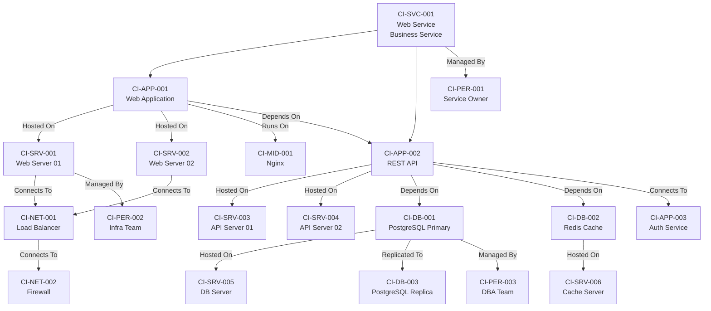
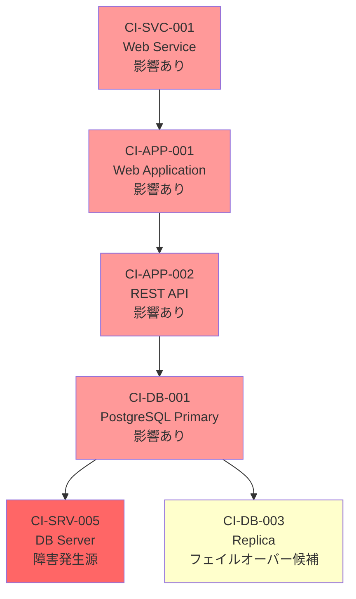

# リレーションシップモデル（CI Relationship Model）

ServiceMatrix CI間リレーション仕様
Version: 1.0
Status: Active
Classification: Internal Technical Document
Applicable Standard: ITIL 4 / ISO 20000

---

## 1. 目的

本ドキュメントは、ServiceMatrixのCMDBにおける
CI（Configuration Item）間のリレーションシップ（関係性）の
種別、定義、方向性、影響伝播ルールを規定する。

CI間のリレーションシップは影響分析とSLA判定の基盤である。

---

## 2. リレーションシップ種別

### 2.1 リレーションシップ一覧

| 種別ID | 名称 | 説明 | 方向性 | 影響伝播 |
|--------|------|------|--------|---------|
| REL-001 | Depends On | 稼働のために依存する | 有向 | 上流→下流 |
| REL-002 | Hosted On | 物理/仮想基盤上で稼働する | 有向 | 基盤→被基盤 |
| REL-003 | Runs On | OS/ミドルウェア上で実行される | 有向 | 基盤→被基盤 |
| REL-004 | Connects To | ネットワーク接続する | 双方向 | 双方向 |
| REL-005 | Managed By | 管理される | 有向 | なし（管理関係） |
| REL-006 | Used By | 利用される | 有向 | 下流→上流 |
| REL-007 | Part Of | 構成要素である | 有向 | 部分→全体 |
| REL-008 | Backed Up By | バックアップされる | 有向 | なし（保護関係） |
| REL-009 | Clustered With | クラスター構成である | 双方向 | 条件付き |
| REL-010 | Replicated To | レプリケーション先 | 有向 | なし（冗長関係） |

### 2.2 リレーションシップ定義詳細

#### REL-001: Depends On（依存）

```
A --[Depends On]--> B
Aの稼働にはBが必要
Bの障害はAに影響する
```

| 属性 | 説明 |
|------|------|
| 方向性 | A → B（AがBに依存） |
| 影響伝播 | Bの障害 → Aに影響 |
| 強度 | Hard（完全依存）/ Soft（部分依存） |
| 代替有無 | フェイルオーバー先の有無 |

例: `CI-APP-001 (Web App) --[Depends On]--> CI-DB-001 (PostgreSQL)`

#### REL-002: Hosted On（ホスティング）

```
A --[Hosted On]--> B
AはBの基盤上で稼働する
Bの障害はA上の全コンポーネントに影響する
```

| 属性 | 説明 |
|------|------|
| 方向性 | A → B（AがB上で稼働） |
| 影響伝播 | Bの障害 → B上のすべてのAに影響 |

例: `CI-APP-001 (Web App) --[Hosted On]--> CI-SRV-001 (Web Server)`

#### REL-003: Runs On（実行）

```
A --[Runs On]--> B
AはBのランタイム/ミドルウェア上で実行される
```

| 属性 | 説明 |
|------|------|
| 方向性 | A → B（AがB上で実行） |
| 影響伝播 | Bの障害 → Aに影響 |

例: `CI-APP-001 (Web App) --[Runs On]--> CI-MID-001 (Nginx)`

#### REL-004: Connects To（接続）

```
A --[Connects To]--> B
AとBはネットワークで通信する
```

| 属性 | 説明 |
|------|------|
| 方向性 | 双方向 |
| 影響伝播 | 通信断は双方に影響 |
| プロトコル | 通信プロトコル（TCP/HTTP/gRPC等） |
| ポート | 通信ポート |

例: `CI-APP-001 (Web App) --[Connects To]--> CI-APP-002 (Auth API)`

#### REL-005: Managed By（管理）

```
A --[Managed By]--> B
AはBによって管理される
```

| 属性 | 説明 |
|------|------|
| 方向性 | A → B（AがBに管理される） |
| 影響伝播 | なし（管理関係のため障害は伝播しない） |

例: `CI-SRV-001 (Web Server) --[Managed By]--> CI-PER-001 (Infra Lead)`

---

## 3. 依存関係図（サンプル）

### 3.1 典型的なWebサービスの依存関係



### 3.2 影響伝播の例



上図: `CI-SRV-005 (DB Server)` の障害が依存関係を通じて上流に伝播する様子。

---

## 4. リレーションシップ JSON Schema

```json
{
  "$schema": "http://json-schema.org/draft-07/schema#",
  "title": "CI Relationship",
  "type": "object",
  "required": ["relationship_id", "source_ci_id", "target_ci_id", "relationship_type", "created_at"],
  "properties": {
    "relationship_id": {
      "type": "string",
      "pattern": "^REL-[0-9]{6}$",
      "description": "リレーションシップ一意識別子"
    },
    "source_ci_id": {
      "type": "string",
      "description": "ソースCI ID"
    },
    "target_ci_id": {
      "type": "string",
      "description": "ターゲットCI ID"
    },
    "relationship_type": {
      "type": "string",
      "enum": [
        "depends_on", "hosted_on", "runs_on", "connects_to",
        "managed_by", "used_by", "part_of", "backed_up_by",
        "clustered_with", "replicated_to"
      ],
      "description": "リレーション種別"
    },
    "direction": {
      "type": "string",
      "enum": ["unidirectional", "bidirectional"],
      "description": "方向性"
    },
    "strength": {
      "type": "string",
      "enum": ["hard", "soft"],
      "description": "依存強度（hard: 完全依存、soft: 部分依存）"
    },
    "impact_propagation": {
      "type": "boolean",
      "description": "影響伝播フラグ"
    },
    "failover_available": {
      "type": "boolean",
      "description": "フェイルオーバー可能フラグ"
    },
    "description": {
      "type": "string",
      "description": "リレーションの説明"
    },
    "metadata": {
      "type": "object",
      "properties": {
        "protocol": { "type": "string" },
        "port": { "type": "integer" },
        "bandwidth": { "type": "string" }
      },
      "description": "追加メタデータ"
    },
    "created_at": {
      "type": "string",
      "format": "date-time"
    },
    "updated_at": {
      "type": "string",
      "format": "date-time"
    },
    "created_by": {
      "type": "string"
    }
  }
}
```

---

## 5. 影響範囲計算アルゴリズム

### 5.1 グラフ走査アルゴリズム

CIの依存関係グラフは有向グラフとしてモデル化される。
影響範囲の計算にはBFS（幅優先探索）を使用する。

#### 擬似コード

```
function calculateImpactScope(failed_ci_id):
    impacted = Set()
    queue = Queue()
    queue.enqueue(failed_ci_id)
    impacted.add(failed_ci_id)

    while queue is not empty:
        current = queue.dequeue()

        // currentに依存しているCI（上流CI）を取得
        dependents = getUpstreamCIs(current)

        for each dependent in dependents:
            relationship = getRelationship(dependent, current)

            // 影響伝播フラグがfalseの場合はスキップ
            if not relationship.impact_propagation:
                continue

            // フェイルオーバーが可能な場合はスキップ
            if relationship.failover_available:
                continue

            // soft依存の場合は部分影響として記録
            if relationship.strength == "soft":
                impacted.add(dependent, impact_type="partial")
            else:
                impacted.add(dependent, impact_type="full")

            if dependent not in visited:
                queue.enqueue(dependent)

    return impacted
```

### 5.2 影響伝播ルール

| 条件 | 伝播 | 備考 |
|------|------|------|
| Hard dependency + 影響伝播ON + フェイルオーバーなし | 完全伝播 | 上流CIに全面影響 |
| Hard dependency + 影響伝播ON + フェイルオーバーあり | 伝播なし | フェイルオーバーが成功する前提 |
| Soft dependency + 影響伝播ON | 部分伝播 | 上流CIに部分影響 |
| 管理関係（Managed By） | 伝播なし | 管理者への通知のみ |
| バックアップ関係（Backed Up By） | 伝播なし | 復旧手段の喪失として記録 |

---

## 6. リレーションシップのバリデーション

### 6.1 整合性ルール

| ルール | 説明 | 検出方法 |
|--------|------|---------|
| 循環依存禁止 | Depends On の循環は許可しない | DFS による循環検出 |
| 自己参照禁止 | 自分自身への関係は作成不可 | source_ci_id != target_ci_id |
| 重複禁止 | 同一ペア・同一種別の重複は不可 | ユニーク制約 |
| 参照整合性 | 参照先CIが存在すること | 外部キー検証 |
| ステータス整合性 | Disposed CI への依存関係は警告 | ステータスチェック |

### 6.2 自動検出バッチ

| チェック | 頻度 | アクション |
|---------|------|-----------|
| 循環依存検出 | 日次 | 検出時にアラートIssue作成 |
| 孤立CI検出 | 週次 | 関係性のないCIのリスト報告 |
| 非アクティブCI依存検出 | 日次 | Retired/Disposed CIへの依存を警告 |
| 深い依存チェーン検出 | 週次 | 深さ10以上の依存チェーンを警告 |

---

## 7. リレーションシップの可視化

### 7.1 ビュー種別

| ビュー | 表示内容 | 用途 |
|--------|---------|------|
| サービスマップ | ビジネスサービスからの依存ツリー | サービスオーナー向け |
| インフラマップ | サーバー/ネットワークの物理構成 | インフラチーム向け |
| 影響範囲マップ | 特定CIの障害影響範囲 | インシデント対応時 |
| 変更影響マップ | 変更対象CIの影響範囲 | 変更管理時 |

### 7.2 Mermaid自動生成

CMDBのリレーションシップデータから
Mermaid図を自動生成する仕組みを提供する。

出力形式:
- GitHub Issue / PRのコメントに埋め込み
- ダッシュボードでの表示
- ドキュメント自動更新

---

## 8. 関連ドキュメント

| ドキュメント | 参照先 |
|-------------|--------|
| CMDBデータモデル | `docs/10_cmdb/CMDB_DATA_MODEL.md` |
| CI管理ポリシー | `docs/10_cmdb/CONFIGURATION_ITEM_POLICY.md` |
| 影響分析ロジック | `docs/10_cmdb/IMPACT_ANALYSIS_LOGIC.md` |
| 資産ライフサイクル | `docs/10_cmdb/ASSET_LIFECYCLE_MODEL.md` |

---

## 9. 改定履歴

| 版数 | 日付 | 変更内容 | 承認者 |
|------|------|----------|--------|
| 1.0 | 2026-03-02 | 初版作成 | Service Governance Authority |

---

本ドキュメントはServiceMatrix統治フレームワークの一部であり、
SERVICEMATRIX_CHARTER.md に定められた統治原則に従う。
