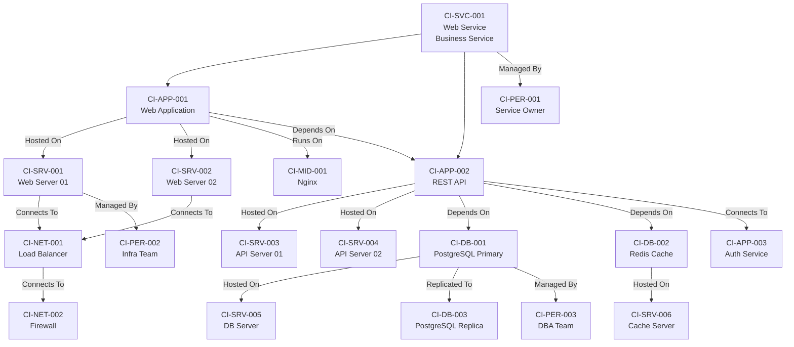

# CI リレーションシップモデル

ServiceMatrix CI間リレーション仕様

Version: 2.0
Status: Approved
Last Updated: 2026-03-02
Owner: CMDB Manager
Compliance: ITIL 4 / ISO/IEC 20000 / J-SOX

---

## 1. 目的

本ドキュメントは、ServiceMatrixのCMDBにおける CI（Configuration Item）間のリレーションシップ（関係性）の種別、定義、方向性、影響伝播ルール、および PostgreSQL DDL を規定する。

CI間のリレーションシップは影響分析とSLA判定の基盤である。

---

## 2. リレーションシップ種別

### 2.1 リレーションシップ一覧

| 種別ID | 名称 | 説明 | 方向性 | 影響伝播 |
|--------|------|------|--------|---------|
| REL-001 | Depends On | 稼働のために依存する | 有向 | 上流→下流 |
| REL-002 | Hosted On | 物理/仮想基盤上で稼働する | 有向 | 基盤→被基盤 |
| REL-003 | Runs On | OS/ミドルウェア上で実行される | 有向 | 基盤→被基盤 |
| REL-004 | Connects To | ネットワーク接続する | 双方向 | 双方向 |
| REL-005 | Managed By | 管理される | 有向 | なし（管理関係） |
| REL-006 | Used By | 利用される | 有向 | 下流→上流 |
| REL-007 | Part Of | 構成要素である | 有向 | 部分→全体 |
| REL-008 | Backed Up By | バックアップされる | 有向 | なし（保護関係） |
| REL-009 | Clustered With | クラスター構成である | 双方向 | 条件付き |
| REL-010 | Replicated To | レプリケーション先 | 有向 | なし（冗長関係） |

### 2.2 リレーションシップ定義詳細

#### REL-001: Depends On（依存）

```
A --[Depends On]--> B
Aの稼働にはBが必要
Bの障害はAに影響する
```

| 属性 | 説明 |
|------|------|
| 方向性 | A → B（AがBに依存） |
| 影響伝播 | Bの障害 → Aに影響 |
| 強度 | Hard（完全依存）/ Soft（部分依存） |
| 代替有無 | フェイルオーバー先の有無 |

例: `CI-APP-001 (Web App) --[Depends On]--> CI-DB-001 (PostgreSQL)`

#### REL-002: Hosted On（ホスティング）

```
A --[Hosted On]--> B
AはBの基盤上で稼働する
Bの障害はA上の全コンポーネントに影響する
```

| 属性 | 説明 |
|------|------|
| 方向性 | A → B（AがB上で稼働） |
| 影響伝播 | Bの障害 → B上のすべてのAに影響 |

例: `CI-APP-001 (Web App) --[Hosted On]--> CI-SRV-001 (Web Server)`

#### REL-003: Runs On（実行）

```
A --[Runs On]--> B
AはBのランタイム/ミドルウェア上で実行される
```

| 属性 | 説明 |
|------|------|
| 方向性 | A → B（AがB上で実行） |
| 影響伝播 | Bの障害 → Aに影響 |

例: `CI-APP-001 (Web App) --[Runs On]--> CI-MID-001 (Nginx)`

#### REL-004: Connects To（接続）

```
A --[Connects To]--> B
AとBはネットワークで通信する
```

| 属性 | 説明 |
|------|------|
| 方向性 | 双方向 |
| 影響伝播 | 通信断は双方に影響 |
| プロトコル | 通信プロトコル（TCP/HTTP/gRPC等） |
| ポート | 通信ポート |

例: `CI-APP-001 (Web App) --[Connects To]--> CI-APP-002 (Auth API)`

---

## 3. リレーションシップ テーブル定義

### 3.1 ci_relationships テーブル

```sql
-- CI間リレーションシップテーブル
CREATE TABLE ci_relationships (
    relationship_id     UUID PRIMARY KEY DEFAULT gen_random_uuid(),
    source_ci_id        UUID NOT NULL REFERENCES configuration_items(ci_id),
    target_ci_id        UUID NOT NULL REFERENCES configuration_items(ci_id),

    -- リレーション種別
    relationship_type   VARCHAR(50) NOT NULL,
    -- 値: depends_on, hosted_on, runs_on, connects_to, managed_by,
    --     used_by, part_of, backed_up_by, clustered_with, replicated_to

    -- 方向性
    direction           VARCHAR(20) NOT NULL DEFAULT 'unidirectional',
    -- 値: unidirectional, bidirectional

    -- 依存強度（depends_on の場合）
    strength            VARCHAR(10),
    -- 値: hard, soft

    -- 影響伝播設定
    impact_propagation  BOOLEAN NOT NULL DEFAULT TRUE,
    failover_available  BOOLEAN NOT NULL DEFAULT FALSE,

    -- 詳細情報
    description         TEXT,
    metadata            JSONB DEFAULT '{}'::jsonb,
    -- 例: {"protocol": "TCP", "port": 5432, "bandwidth": "1Gbps"}

    -- 有効期間
    valid_from          TIMESTAMPTZ NOT NULL DEFAULT NOW(),
    valid_until         TIMESTAMPTZ,

    -- 管理情報
    created_by          UUID REFERENCES users(user_id),
    created_at          TIMESTAMPTZ NOT NULL DEFAULT NOW(),
    updated_at          TIMESTAMPTZ NOT NULL DEFAULT NOW(),

    -- 制約
    CONSTRAINT chk_no_self_reference CHECK (source_ci_id != target_ci_id),
    CONSTRAINT uq_ci_relationship UNIQUE (source_ci_id, target_ci_id, relationship_type),
    CONSTRAINT chk_relationship_type CHECK (
        relationship_type IN (
            'depends_on', 'hosted_on', 'runs_on', 'connects_to',
            'managed_by', 'used_by', 'part_of', 'backed_up_by',
            'clustered_with', 'replicated_to'
        )
    ),
    CONSTRAINT chk_strength CHECK (
        strength IS NULL OR strength IN ('hard', 'soft')
    )
);

-- インデックス定義
CREATE INDEX idx_ci_relationships_source ON ci_relationships (source_ci_id);
CREATE INDEX idx_ci_relationships_target ON ci_relationships (target_ci_id);
CREATE INDEX idx_ci_relationships_type ON ci_relationships (relationship_type);
CREATE INDEX idx_ci_relationships_impact ON ci_relationships (impact_propagation)
    WHERE impact_propagation = TRUE;

-- 更新日時自動更新トリガー
CREATE OR REPLACE FUNCTION update_ci_relationship_updated_at()
RETURNS TRIGGER AS $$
BEGIN
    NEW.updated_at = NOW();
    RETURN NEW;
END;
$$ LANGUAGE plpgsql;

CREATE TRIGGER trg_ci_relationships_updated_at
    BEFORE UPDATE ON ci_relationships
    FOR EACH ROW
    EXECUTE FUNCTION update_ci_relationship_updated_at();
```

### 3.2 リレーションシップ変更履歴テーブル

```sql
-- CI間リレーション変更履歴
CREATE TABLE ci_relationship_history (
    history_id          UUID PRIMARY KEY DEFAULT gen_random_uuid(),
    relationship_id     UUID NOT NULL,
    source_ci_id        UUID NOT NULL,
    target_ci_id        UUID NOT NULL,
    change_type         VARCHAR(20) NOT NULL,
    -- 値: created, updated, deleted

    old_values          JSONB,
    new_values          JSONB,
    changed_by          UUID REFERENCES users(user_id),
    changed_at          TIMESTAMPTZ NOT NULL DEFAULT NOW(),
    change_reason       TEXT NOT NULL,
    related_rfc_id      VARCHAR(50)
);

CREATE INDEX idx_ci_rel_history_rel_id ON ci_relationship_history (relationship_id);
CREATE INDEX idx_ci_rel_history_source ON ci_relationship_history (source_ci_id);
CREATE INDEX idx_ci_rel_history_changed_at ON ci_relationship_history (changed_at DESC);
```

---

## 4. 依存関係図（サンプル）

### 4.1 典型的なWebサービスの依存関係



### 4.2 影響伝播の例

上図において `CI-SRV-005 (DB Server)` に障害が発生した場合の影響伝播：

1. `CI-DB-001 (PostgreSQL Primary)` - Hosted On → 全面影響
2. `CI-APP-002 (REST API)` - Depends On (Hard) → 全面影響
3. `CI-APP-001 (Web App)` - Depends On (Hard) → 全面影響
4. `CI-SVC-001 (Web Service)` - Part Of → サービス停止

---

## 5. 影響範囲計算アルゴリズム

### 5.1 グラフ走査アルゴリズム（BFS）

CIの依存関係グラフは有向グラフとしてモデル化される。
影響範囲の計算にはBFS（幅優先探索）を使用する。

```
function calculateImpactScope(failed_ci_id):
    impacted = Set()
    queue = Queue()
    queue.enqueue(failed_ci_id)
    impacted.add(failed_ci_id)

    while queue is not empty:
        current = queue.dequeue()

        // currentに依存しているCI（上流CI）を取得
        dependents = getUpstreamCIs(current)

        for each dependent in dependents:
            relationship = getRelationship(dependent, current)

            // 影響伝播フラグがfalseの場合はスキップ
            if not relationship.impact_propagation:
                continue

            // フェイルオーバーが可能な場合はスキップ
            if relationship.failover_available:
                continue

            // soft依存の場合は部分影響として記録
            if relationship.strength == "soft":
                impacted.add(dependent, impact_type="partial")
            else:
                impacted.add(dependent, impact_type="full")

            if dependent not in visited:
                queue.enqueue(dependent)

    return impacted
```

### 5.2 影響伝播ルール

| 条件 | 伝播 | 備考 |
|------|------|------|
| Hard dependency + 影響伝播ON + フェイルオーバーなし | 完全伝播 | 上流CIに全面影響 |
| Hard dependency + 影響伝播ON + フェイルオーバーあり | 伝播なし | フェイルオーバーが成功する前提 |
| Soft dependency + 影響伝播ON | 部分伝播 | 上流CIに部分影響 |
| 管理関係（Managed By） | 伝播なし | 管理者への通知のみ |
| バックアップ関係（Backed Up By） | 伝播なし | 復旧手段の喪失として記録 |

---

## 6. リレーションシップ JSON Schema

```json
{
  "$schema": "http://json-schema.org/draft-07/schema#",
  "title": "CI Relationship",
  "type": "object",
  "required": ["relationship_id", "source_ci_id", "target_ci_id", "relationship_type", "created_at"],
  "properties": {
    "relationship_id": {
      "type": "string",
      "pattern": "^[0-9a-f]{8}-[0-9a-f]{4}-[0-9a-f]{4}-[0-9a-f]{4}-[0-9a-f]{12}$",
      "description": "リレーションシップ一意識別子（UUID）"
    },
    "source_ci_id": {
      "type": "string",
      "description": "ソースCI ID（UUID）"
    },
    "target_ci_id": {
      "type": "string",
      "description": "ターゲットCI ID（UUID）"
    },
    "relationship_type": {
      "type": "string",
      "enum": [
        "depends_on", "hosted_on", "runs_on", "connects_to",
        "managed_by", "used_by", "part_of", "backed_up_by",
        "clustered_with", "replicated_to"
      ],
      "description": "リレーション種別"
    },
    "direction": {
      "type": "string",
      "enum": ["unidirectional", "bidirectional"],
      "description": "方向性"
    },
    "strength": {
      "type": "string",
      "enum": ["hard", "soft"],
      "description": "依存強度（hard: 完全依存、soft: 部分依存）"
    },
    "impact_propagation": {
      "type": "boolean",
      "description": "影響伝播フラグ"
    },
    "failover_available": {
      "type": "boolean",
      "description": "フェイルオーバー可能フラグ"
    },
    "description": {
      "type": "string",
      "description": "リレーションの説明"
    },
    "metadata": {
      "type": "object",
      "properties": {
        "protocol": { "type": "string" },
        "port": { "type": "integer" },
        "bandwidth": { "type": "string" }
      },
      "description": "追加メタデータ"
    },
    "created_at": {
      "type": "string",
      "format": "date-time"
    },
    "updated_at": {
      "type": "string",
      "format": "date-time"
    },
    "created_by": {
      "type": "string"
    }
  }
}
```

---

## 7. リレーションシップのバリデーション

### 7.1 整合性ルール

| ルール | 説明 | 検出方法 |
|--------|------|---------|
| 循環依存禁止 | Depends On の循環は許可しない | DFS による循環検出 |
| 自己参照禁止 | 自分自身への関係は作成不可 | CHECK制約（source != target） |
| 重複禁止 | 同一ペア・同一種別の重複は不可 | UNIQUE制約 |
| 参照整合性 | 参照先CIが存在すること | 外部キー制約 |
| ステータス整合性 | Disposed CI への依存関係は警告 | ステータスチェック |

### 7.2 自動検出バッチ

| チェック | 頻度 | アクション |
|---------|------|-----------|
| 循環依存検出 | 日次 | 検出時にアラートIssue作成 |
| 孤立CI検出 | 週次 | 関係性のないCIのリスト報告 |
| 非アクティブCI依存検出 | 日次 | Retired/Disposed CIへの依存を警告 |
| 深い依存チェーン検出 | 週次 | 深さ10以上の依存チェーンを警告 |

### 7.3 循環依存チェック SQL

```sql
-- PostgreSQL再帰CTEによる循環依存検出
WITH RECURSIVE dependency_chain AS (
    -- ベースケース: 起点CI
    SELECT
        source_ci_id,
        target_ci_id,
        ARRAY[source_ci_id] AS path,
        FALSE AS has_cycle
    FROM ci_relationships
    WHERE relationship_type = 'depends_on'
      AND impact_propagation = TRUE

    UNION ALL

    -- 再帰ステップ
    SELECT
        r.source_ci_id,
        r.target_ci_id,
        dc.path || r.source_ci_id,
        r.source_ci_id = ANY(dc.path)  -- 循環検出
    FROM ci_relationships r
    JOIN dependency_chain dc ON r.target_ci_id = dc.source_ci_id
    WHERE NOT dc.has_cycle
      AND array_length(dc.path, 1) < 20  -- 深さ制限
)
SELECT path, has_cycle
FROM dependency_chain
WHERE has_cycle = TRUE;
```

---

## 8. リレーションシップの可視化

### 8.1 ビュー種別

| ビュー | 表示内容 | 用途 |
|--------|---------|------|
| サービスマップ | ビジネスサービスからの依存ツリー | サービスオーナー向け |
| インフラマップ | サーバー/ネットワークの物理構成 | インフラチーム向け |
| 影響範囲マップ | 特定CIの障害影響範囲 | インシデント対応時 |
| 変更影響マップ | 変更対象CIの影響範囲 | 変更管理時 |

### 8.2 Mermaid自動生成クエリ

```sql
-- 特定CIからの依存関係を取得してMermaid図生成に利用
SELECT
    c1.ci_id AS source_id,
    c1.name AS source_name,
    cr.relationship_type,
    c2.ci_id AS target_id,
    c2.name AS target_name
FROM ci_relationships cr
JOIN configuration_items c1 ON cr.source_ci_id = c1.ci_id
JOIN configuration_items c2 ON cr.target_ci_id = c2.ci_id
WHERE c1.status NOT IN ('Disposed')
  AND c2.status NOT IN ('Disposed')
  AND cr.impact_propagation = TRUE
ORDER BY c1.name, cr.relationship_type;
```

---

## 9. 改定履歴

| 版数 | 日付 | 変更内容 | 承認者 |
|------|------|----------|--------|
| 1.0 | 2026-03-02 | 初版作成 | Service Governance Authority |
| 2.0 | 2026-03-02 | PostgreSQL DDL追加・循環依存チェックSQL追加・履歴テーブル追加 | Service Governance Authority |

---

本ドキュメントはServiceMatrix統治フレームワークの一部であり、
SERVICEMATRIX_CHARTER.md に定められた統治原則に従う。
