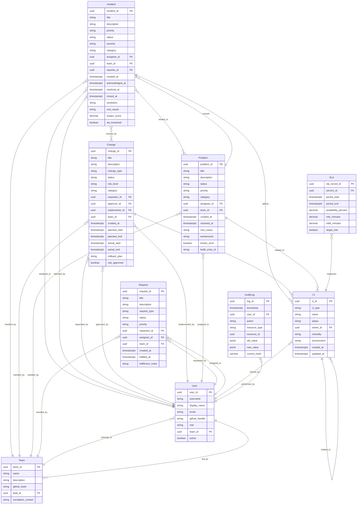

# データスキーマ定義（Data Schema Definition）

DATA_SCHEMA_DEFINITION.md
Version: 2.0
Category: Data Model
Compliance: ITIL 4 / ISO 20000

---

## 1. 目的

本ドキュメントは、ServiceMatrixにおける全エンティティの
データスキーマを統一的に定義する。

各エンティティの構造、必須フィールド、データ型、制約、
およびエンティティ間のリレーションを規定する。

---

## 2. エンティティ一覧

| エンティティ | 説明 | 主キー |
|-------------|------|--------|
| Incident | インシデント記録 | incident_id |
| Change | 変更要求記録 | change_id |
| Problem | 問題記録 | problem_id |
| Request | サービスリクエスト記録 | request_id |
| CI | 構成アイテム | ci_id |
| SLA | SLA計測記録 | sla_record_id |
| AuditLog | 監査ログ | log_id |
| User | ユーザー情報 | user_id |
| Team | チーム情報 | team_id |

---

## 3. エンティティ間リレーション（ER図）



---

## 4. PostgreSQL DDL（テーブル定義）

### 4.1 users テーブル

```sql
CREATE TABLE users (
    user_id         UUID PRIMARY KEY DEFAULT gen_random_uuid(),
    username        VARCHAR(100) NOT NULL UNIQUE,
    display_name    VARCHAR(255) NOT NULL,
    email           VARCHAR(255) NOT NULL UNIQUE,
    github_handle   VARCHAR(100),
    role            VARCHAR(50) NOT NULL,
    CONSTRAINT chk_user_role CHECK (
        role IN ('SystemAdmin', 'ServiceManager', 'ProcessOwner',
                 'ChangeManager', 'Operator', 'Auditor', 'Viewer', 'Agent')
    ),
    team_id         UUID,  -- REFERENCES teams(team_id) after teams is created
    phone           VARCHAR(50),
    escalation_level SMALLINT CHECK (escalation_level BETWEEN 1 AND 4),
    active          BOOLEAN NOT NULL DEFAULT TRUE,
    password_hash   VARCHAR(255),
    last_login_at   TIMESTAMPTZ,
    created_at      TIMESTAMPTZ NOT NULL DEFAULT NOW(),
    updated_at      TIMESTAMPTZ NOT NULL DEFAULT NOW()
);

CREATE INDEX idx_users_email ON users (email);
CREATE INDEX idx_users_role ON users (role);
CREATE INDEX idx_users_active ON users (active) WHERE active = TRUE;
```

### 4.2 teams テーブル

```sql
CREATE TABLE teams (
    team_id             UUID PRIMARY KEY DEFAULT gen_random_uuid(),
    name                VARCHAR(255) NOT NULL UNIQUE,
    description         TEXT,
    github_team         VARCHAR(255),
    lead_id             UUID REFERENCES users(user_id),
    escalation_contact  VARCHAR(255),
    on_call_schedule    TEXT,
    ola_applicable      BOOLEAN NOT NULL DEFAULT TRUE,
    created_at          TIMESTAMPTZ NOT NULL DEFAULT NOW(),
    updated_at          TIMESTAMPTZ NOT NULL DEFAULT NOW()
);

-- users.team_id への外部キーを後から追加
ALTER TABLE users ADD CONSTRAINT fk_users_team
    FOREIGN KEY (team_id) REFERENCES teams(team_id);
```

### 4.3 incidents テーブル

```sql
CREATE TABLE incidents (
    incident_id         UUID PRIMARY KEY DEFAULT gen_random_uuid(),

    -- 識別子（INC-YYYY-NNNNNN形式）
    incident_number     VARCHAR(20) NOT NULL UNIQUE,

    -- 基本属性
    title               VARCHAR(500) NOT NULL,
    description         TEXT,
    priority            VARCHAR(5) NOT NULL,
    CONSTRAINT chk_incident_priority CHECK (priority IN ('P1', 'P2', 'P3', 'P4')),

    status              VARCHAR(30) NOT NULL DEFAULT 'New',
    CONSTRAINT chk_incident_status CHECK (
        status IN ('New', 'Acknowledged', 'In_Progress', 'Pending',
                   'Workaround_Applied', 'Resolved', 'Closed')
    ),

    severity            VARCHAR(20),
    CONSTRAINT chk_incident_severity CHECK (
        severity IS NULL OR severity IN ('Critical', 'Major', 'Minor', 'Informational')
    ),

    category            VARCHAR(50) NOT NULL,
    CONSTRAINT chk_incident_category CHECK (
        category IN ('Infrastructure', 'Application', 'Network',
                     'Security', 'Database', 'Other')
    ),

    -- アサイン
    assignee_id         UUID REFERENCES users(user_id),
    team_id             UUID REFERENCES teams(team_id),
    reporter_id         UUID NOT NULL REFERENCES users(user_id),

    -- 関連CI
    affected_ci_ids     UUID[] DEFAULT ARRAY[]::UUID[],

    -- 関連レコード
    related_incident_ids UUID[] DEFAULT ARRAY[]::UUID[],
    related_problem_id   UUID,  -- REFERENCES problems(problem_id)
    caused_by_change_id  UUID,  -- REFERENCES changes(change_id)

    -- タイムスタンプ（ビジネスルール: 時系列順序制約）
    created_at          TIMESTAMPTZ NOT NULL DEFAULT NOW(),
    acknowledged_at     TIMESTAMPTZ,
    resolved_at         TIMESTAMPTZ,
    closed_at           TIMESTAMPTZ,
    CONSTRAINT chk_incident_timestamps CHECK (
        (acknowledged_at IS NULL OR acknowledged_at >= created_at) AND
        (resolved_at IS NULL OR resolved_at >= created_at) AND
        (closed_at IS NULL OR (resolved_at IS NOT NULL AND closed_at >= resolved_at))
    ),

    -- 解決情報
    resolution          TEXT,
    root_cause          TEXT,

    -- SLA
    sla_target_response_min  INTEGER,
    sla_target_resolution_min INTEGER,
    sla_response_breached    BOOLEAN NOT NULL DEFAULT FALSE,
    sla_resolution_breached  BOOLEAN NOT NULL DEFAULT FALSE,
    sla_breach_at            TIMESTAMPTZ,
    sla_warning_at           TIMESTAMPTZ,

    -- 影響分析
    impact_score        DECIMAL(10, 4),
    impact_analysis_id  UUID,  -- REFERENCES impact_analysis_records(analysis_id)

    -- GitHub連携
    github_issue_number INTEGER,

    -- メタデータ
    tags                TEXT[] DEFAULT ARRAY[]::TEXT[],
    metadata            JSONB DEFAULT '{}'::jsonb,
    archived_at         TIMESTAMPTZ
)
PARTITION BY RANGE (created_at);

-- 月次パーティション（2026年）
CREATE TABLE incidents_2026_03 PARTITION OF incidents
    FOR VALUES FROM ('2026-03-01') TO ('2026-04-01');
CREATE TABLE incidents_2026_04 PARTITION OF incidents
    FOR VALUES FROM ('2026-04-01') TO ('2026-05-01');

-- インデックス
CREATE INDEX idx_incidents_number ON incidents (incident_number);
CREATE INDEX idx_incidents_status ON incidents (status, created_at DESC);
CREATE INDEX idx_incidents_priority ON incidents (priority, created_at DESC);
CREATE INDEX idx_incidents_assignee ON incidents (assignee_id, status);
CREATE INDEX idx_incidents_created ON incidents (created_at DESC);
```

### 4.4 changes テーブル

```sql
CREATE TABLE changes (
    change_id           UUID PRIMARY KEY DEFAULT gen_random_uuid(),
    change_number       VARCHAR(20) NOT NULL UNIQUE,

    title               VARCHAR(500) NOT NULL,
    description         TEXT,

    change_type         VARCHAR(20) NOT NULL,
    CONSTRAINT chk_change_type CHECK (
        change_type IN ('Standard', 'Normal', 'Emergency')
    ),

    status              VARCHAR(30) NOT NULL DEFAULT 'Draft',
    CONSTRAINT chk_change_status CHECK (
        status IN ('Draft', 'Submitted', 'Under_Review', 'CAB_Pending',
                   'Approved', 'Scheduled', 'In_Progress', 'Completed',
                   'Rolled_Back', 'Cancelled', 'Failed')
    ),

    risk_level          VARCHAR(20) NOT NULL,
    CONSTRAINT chk_change_risk CHECK (
        risk_level IN ('Critical', 'High', 'Medium', 'Low')
    ),

    category            VARCHAR(50),
    requestor_id        UUID NOT NULL REFERENCES users(user_id),
    approver_id         UUID REFERENCES users(user_id),
    implementor_id      UUID REFERENCES users(user_id),
    team_id             UUID REFERENCES teams(team_id),

    -- 対象CI
    target_ci_ids       UUID[] DEFAULT ARRAY[]::UUID[],

    -- 影響分析
    impact_analysis_id  UUID,
    change_risk_score   DECIMAL(10, 4),

    -- スケジュール
    created_at          TIMESTAMPTZ NOT NULL DEFAULT NOW(),
    planned_start       TIMESTAMPTZ,
    planned_end         TIMESTAMPTZ,
    actual_start        TIMESTAMPTZ,
    actual_end          TIMESTAMPTZ,
    CONSTRAINT chk_change_schedule CHECK (
        (planned_end IS NULL OR planned_start IS NULL OR planned_end >= planned_start) AND
        (actual_end IS NULL OR actual_start IS NULL OR actual_end >= actual_start)
    ),

    -- 承認
    cab_approved        BOOLEAN DEFAULT FALSE,
    cab_approved_at     TIMESTAMPTZ,
    cab_approved_by     UUID REFERENCES users(user_id),

    -- 実施内容
    rollback_plan       TEXT,
    test_plan           TEXT,
    post_implementation_review TEXT,

    -- J-SOX対応: 7年保管
    github_issue_number INTEGER,
    github_pr_number    INTEGER,
    tags                TEXT[] DEFAULT ARRAY[]::TEXT[],
    metadata            JSONB DEFAULT '{}'::jsonb,
    archived_at         TIMESTAMPTZ
)
PARTITION BY RANGE (created_at);

CREATE TABLE changes_2026_03 PARTITION OF changes
    FOR VALUES FROM ('2026-03-01') TO ('2026-04-01');

CREATE INDEX idx_changes_number ON changes (change_number);
CREATE INDEX idx_changes_status ON changes (status, created_at DESC);
CREATE INDEX idx_changes_type ON changes (change_type, status);
CREATE INDEX idx_changes_created ON changes (created_at DESC);
```

### 4.5 problems テーブル

```sql
CREATE TABLE problems (
    problem_id          UUID PRIMARY KEY DEFAULT gen_random_uuid(),
    problem_number      VARCHAR(20) NOT NULL UNIQUE,

    title               VARCHAR(500) NOT NULL,
    description         TEXT,

    status              VARCHAR(30) NOT NULL DEFAULT 'New',
    CONSTRAINT chk_problem_status CHECK (
        status IN ('New', 'Under_Investigation', 'Root_Cause_Identified',
                   'Known_Error', 'Resolved', 'Closed')
    ),

    priority            VARCHAR(5) NOT NULL,
    CONSTRAINT chk_problem_priority CHECK (priority IN ('P1', 'P2', 'P3', 'P4')),

    category            VARCHAR(50) NOT NULL,
    assignee_id         UUID REFERENCES users(user_id),
    team_id             UUID REFERENCES teams(team_id),

    related_incident_ids UUID[] DEFAULT ARRAY[]::UUID[],
    affected_ci_ids      UUID[] DEFAULT ARRAY[]::UUID[],

    created_at          TIMESTAMPTZ NOT NULL DEFAULT NOW(),
    resolved_at         TIMESTAMPTZ,
    CONSTRAINT chk_problem_timestamps CHECK (
        resolved_at IS NULL OR resolved_at >= created_at
    ),

    root_cause          TEXT,
    workaround          TEXT,
    permanent_fix       TEXT,
    known_error         BOOLEAN NOT NULL DEFAULT FALSE,
    kedb_entry_id       VARCHAR(100),
    -- known_error=trueの場合、workaroundは必須（アプリ層でバリデーション）

    prevention_measures TEXT[],
    github_issue_number INTEGER,
    tags                TEXT[] DEFAULT ARRAY[]::TEXT[],
    metadata            JSONB DEFAULT '{}'::jsonb,
    archived_at         TIMESTAMPTZ
);

CREATE INDEX idx_problems_number ON problems (problem_number);
CREATE INDEX idx_problems_status ON problems (status);
CREATE INDEX idx_problems_known_error ON problems (known_error) WHERE known_error = TRUE;
```

### 4.6 service_requests テーブル

```sql
CREATE TABLE service_requests (
    request_id          UUID PRIMARY KEY DEFAULT gen_random_uuid(),
    request_number      VARCHAR(20) NOT NULL UNIQUE,

    title               VARCHAR(500) NOT NULL,
    description         TEXT,

    request_type        VARCHAR(50) NOT NULL,
    CONSTRAINT chk_request_type CHECK (
        request_type IN ('Account_Creation', 'Access_Change', 'VM_Provision',
                         'Software_Install', 'Network_Change', 'DB_Creation',
                         'Information_Request', 'Other')
    ),

    status              VARCHAR(30) NOT NULL DEFAULT 'New',
    CONSTRAINT chk_request_status CHECK (
        status IN ('New', 'Accepted', 'In_Progress', 'Pending_Approval',
                   'Fulfilled', 'Cancelled', 'Rejected')
    ),

    priority            VARCHAR(5) NOT NULL DEFAULT 'P4',
    CONSTRAINT chk_request_priority CHECK (priority IN ('P1', 'P2', 'P3', 'P4')),

    requestor_id        UUID NOT NULL REFERENCES users(user_id),
    assignee_id         UUID REFERENCES users(user_id),
    team_id             UUID REFERENCES teams(team_id),

    created_at          TIMESTAMPTZ NOT NULL DEFAULT NOW(),
    fulfilled_at        TIMESTAMPTZ,
    CONSTRAINT chk_request_timestamps CHECK (
        fulfilled_at IS NULL OR fulfilled_at >= created_at
    ),

    fulfillment_notes   TEXT,
    approval_required   BOOLEAN NOT NULL DEFAULT FALSE,
    approved_by         UUID REFERENCES users(user_id),
    approved_at         TIMESTAMPTZ,

    github_issue_number INTEGER,
    tags                TEXT[] DEFAULT ARRAY[]::TEXT[],
    metadata            JSONB DEFAULT '{}'::jsonb,
    archived_at         TIMESTAMPTZ
);

CREATE INDEX idx_requests_number ON service_requests (request_number);
CREATE INDEX idx_requests_status ON service_requests (status, created_at DESC);
CREATE INDEX idx_requests_requestor ON service_requests (requestor_id);
```

---

## 5. エンティティ別 JSON Schema

### 5.1 Incident（インシデント）

```json
{
  "$schema": "http://json-schema.org/draft-07/schema#",
  "title": "Incident",
  "type": "object",
  "required": [
    "incident_id", "title", "priority", "status",
    "category", "reporter_id", "created_at"
  ],
  "properties": {
    "incident_id": {
      "type": "string",
      "pattern": "^INC-[0-9]{4}-[0-9]{4,6}$",
      "description": "インシデントID（例: INC-2026-0001）"
    },
    "title": {
      "type": "string",
      "minLength": 5,
      "maxLength": 500
    },
    "priority": {
      "type": "string",
      "enum": ["P1", "P2", "P3", "P4"]
    },
    "status": {
      "type": "string",
      "enum": ["New", "Acknowledged", "In_Progress", "Pending",
               "Workaround_Applied", "Resolved", "Closed"]
    },
    "severity": {
      "type": "string",
      "enum": ["Critical", "Major", "Minor", "Informational"]
    },
    "category": {
      "type": "string",
      "enum": ["Infrastructure", "Application", "Network",
               "Security", "Database", "Other"]
    },
    "affected_ci_ids": {
      "type": "array",
      "items": { "type": "string" }
    },
    "sla_breached": { "type": "boolean" },
    "impact_score": { "type": "number" },
    "github_issue_number": { "type": "integer" },
    "created_at": { "type": "string", "format": "date-time" },
    "resolved_at": { "type": "string", "format": "date-time" }
  }
}
```

### 5.2 Change（変更要求）

```json
{
  "$schema": "http://json-schema.org/draft-07/schema#",
  "title": "Change Request",
  "type": "object",
  "required": [
    "change_id", "title", "change_type", "status",
    "risk_level", "requestor_id", "created_at"
  ],
  "properties": {
    "change_id": {
      "type": "string",
      "pattern": "^CHG-[0-9]{4}-[0-9]{4,6}$"
    },
    "change_type": {
      "type": "string",
      "enum": ["Standard", "Normal", "Emergency"]
    },
    "status": {
      "type": "string",
      "enum": ["Draft", "Submitted", "Under_Review", "CAB_Pending", "Approved",
               "Scheduled", "In_Progress", "Completed", "Rolled_Back", "Cancelled", "Failed"]
    },
    "risk_level": {
      "type": "string",
      "enum": ["Critical", "High", "Medium", "Low"]
    },
    "cab_approved": { "type": "boolean" },
    "target_ci_ids": {
      "type": "array",
      "items": { "type": "string" }
    },
    "github_issue_number": { "type": "integer" },
    "github_pr_number": { "type": "integer" }
  }
}
```

### 5.3 User（ユーザー）

```json
{
  "$schema": "http://json-schema.org/draft-07/schema#",
  "title": "User",
  "type": "object",
  "required": ["user_id", "username", "display_name", "email", "role", "active"],
  "properties": {
    "user_id": {
      "type": "string",
      "pattern": "^USR-[0-9]{4,6}$"
    },
    "role": {
      "type": "string",
      "enum": ["SystemAdmin", "ServiceManager", "ProcessOwner",
               "ChangeManager", "Operator", "Auditor", "Viewer", "Agent"]
    },
    "email": { "type": "string", "format": "email" },
    "active": { "type": "boolean" }
  }
}
```

---

## 6. ID体系

### 6.1 エンティティID命名規則

| エンティティ | プレフィックス | 形式 | 例 |
|-------------|-------------|------|-----|
| Incident | INC | INC-YYYY-NNNNNN | INC-2026-000042 |
| Change | CHG | CHG-YYYY-NNNNNN | CHG-2026-000015 |
| Problem | PRB | PRB-YYYY-NNNNNN | PRB-2026-000003 |
| Request | REQ | REQ-YYYY-NNNNNN | REQ-2026-000128 |
| CI | CI | CI-TYP-NNNNNN | CI-SRV-001 |
| SLA Record | SLA | SLA-YYYY-MM-ID | SLA-2026-03-SVC001 |
| Audit Log | LOG | LOG-YYYYMMDD-NNN | LOG-20260302-001 |
| User | USR | USR-NNNNNN | USR-000001 |
| Team | TEAM | TEAM-NAME | TEAM-INFRA |

### 6.2 連番管理

- 各エンティティの連番は年単位でリセット（YYYY部分が年を示す）
- CIの連番はリセットしない（通し番号）
- 欠番は許容する（削除されたエンティティの番号は再利用しない）

---

## 7. 共通データ型定義

### 7.1 日時型

| フィールド名パターン | 形式 | タイムゾーン | 例 |
|------------------|------|-----------|-----|
| *_at | ISO 8601 | UTC（DBストア）→ JST（表示） | 2026-03-02T01:30:00Z |
| period_start / period_end | ISO 8601 | UTC | 2026-02-28T15:00:00Z |
| planned_* | ISO 8601 | UTC | 2026-03-15T00:00:00Z |

> **注意**: PostgreSQLはTIMESTAMPTZ（UTC）でストア。フロントエンドでJST（UTC+9）に変換して表示する。

### 7.2 列挙型の統一

本スキーマで定義されたenumは、システム全体で統一して使用する。
enum値の追加・変更はデータスキーマ変更として変更管理プロセスに従う。

---

## 8. データ制約

### 8.1 参照整合性

| 外部キー | 参照先 | 制約 |
|----------|--------|------|
| assignee_id | users.user_id | users.active = true であること |
| team_id | teams.team_id | 存在するTeamであること |
| affected_ci_ids | configuration_items.ci_id | 存在するCIであること |
| reporter_id | users.user_id | 存在するUserであること |

### 8.2 ビジネスルール制約

| エンティティ | ルール | 実装 |
|-------------|--------|------|
| Incident | resolved_at は created_at より後 | CHECK制約 |
| Incident | closed_at は resolved_at より後 | CHECK制約 |
| Change | planned_end は planned_start より後 | CHECK制約 |
| Change | Emergency変更はCAB事後承認可 | アプリ層 |
| Problem | known_error = true の場合、workaround は必須 | アプリ層 |
| Request | fulfilled_at は created_at より後 | CHECK制約 |

### 8.3 パーティション戦略

ITSM系テーブル（incidents, changes）は月次レンジパーティションを採用する。

```sql
-- パーティション一括作成関数（年次バッチで実行）
CREATE OR REPLACE FUNCTION create_monthly_partitions(
    table_name TEXT,
    year INTEGER
) RETURNS VOID AS $$
DECLARE
    month INTEGER;
    partition_name TEXT;
    start_date DATE;
    end_date DATE;
BEGIN
    FOR month IN 1..12 LOOP
        partition_name := table_name || '_' || year || '_' ||
                          LPAD(month::TEXT, 2, '0');
        start_date := MAKE_DATE(year, month, 1);
        end_date := start_date + INTERVAL '1 month';

        EXECUTE format(
            'CREATE TABLE IF NOT EXISTS %I PARTITION OF %I FOR VALUES FROM (%L) TO (%L)',
            partition_name, table_name, start_date, end_date
        );
    END LOOP;
END;
$$ LANGUAGE plpgsql;
```

---

## 9. 関連ドキュメント

| ドキュメント | 参照先 |
|-------------|--------|
| イベントスキーマ | `docs/11_data_model/EVENT_SCHEMA.md` |
| 監査ログスキーマ | `docs/11_data_model/AUDIT_LOG_SCHEMA.md` |
| バージョニングポリシー | `docs/11_data_model/VERSIONING_POLICY.md` |
| データ保持ポリシー | `docs/11_data_model/DATA_RETENTION_POLICY.md` |
| CMDBデータモデル | `docs/10_cmdb/CMDB_DATA_MODEL.md` |
| SLA定義書 | `docs/07_sla_metrics/SLA_DEFINITION.md` |

---

## 10. 改定履歴

| 版数 | 日付 | 変更内容 | 承認者 |
|------|------|----------|--------|
| 1.0 | 2026-03-02 | 初版作成 | Service Governance Authority |
| 2.0 | 2026-03-02 | PostgreSQL DDL全テーブル追加、パーティション戦略追加、UTC/JST方針明確化 | Architecture Committee |

---

*最終更新: 2026-03-02*
*バージョン: 2.0.0*
*承認者: Architecture Committee*
