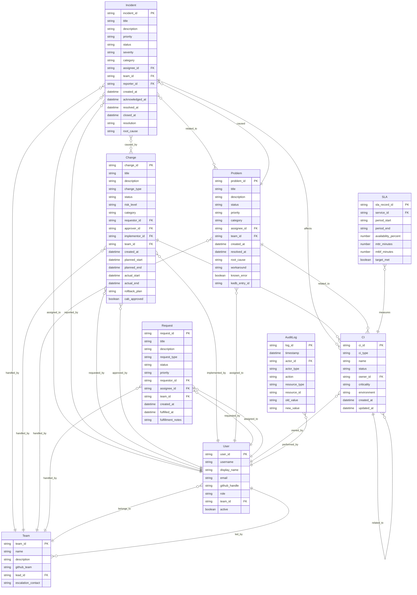

# データスキーマ定義（Data Schema Definition）

ServiceMatrix データスキーマ仕様
Version: 1.0
Status: Active
Classification: Internal Technical Document
Applicable Standard: ITIL 4 / ISO 20000

---

## 1. 目的

本ドキュメントは、ServiceMatrixにおける全エンティティの
データスキーマを統一的に定義する。

各エンティティの構造、必須フィールド、データ型、制約、
およびエンティティ間のリレーションを規定する。

---

## 2. エンティティ一覧

| エンティティ | 説明 | 主キー |
|-------------|------|--------|
| Incident | インシデント記録 | incident_id |
| Change | 変更要求記録 | change_id |
| Problem | 問題記録 | problem_id |
| Request | サービスリクエスト記録 | request_id |
| CI | 構成アイテム | ci_id |
| SLA | SLA計測記録 | sla_record_id |
| AuditLog | 監査ログ | log_id |
| User | ユーザー情報 | user_id |
| Team | チーム情報 | team_id |

---

## 3. エンティティ間リレーション（ER図）



---

## 4. エンティティ別 JSON Schema

### 4.1 Incident（インシデント）

```json
{
  "$schema": "http://json-schema.org/draft-07/schema#",
  "title": "Incident",
  "type": "object",
  "required": [
    "incident_id", "title", "priority", "status",
    "category", "reporter_id", "created_at"
  ],
  "properties": {
    "incident_id": {
      "type": "string",
      "pattern": "^INC-[0-9]{4}-[0-9]{4,6}$",
      "description": "インシデントID（例: INC-2026-0001）"
    },
    "title": {
      "type": "string",
      "minLength": 5,
      "maxLength": 500,
      "description": "インシデント概要"
    },
    "description": {
      "type": "string",
      "description": "インシデント詳細"
    },
    "priority": {
      "type": "string",
      "enum": ["P1", "P2", "P3", "P4"],
      "description": "優先度"
    },
    "status": {
      "type": "string",
      "enum": ["New", "Acknowledged", "In_Progress", "Pending", "Workaround_Applied", "Resolved", "Closed"],
      "description": "ステータス"
    },
    "severity": {
      "type": "string",
      "enum": ["Critical", "Major", "Minor", "Informational"],
      "description": "重大度"
    },
    "category": {
      "type": "string",
      "enum": ["Infrastructure", "Application", "Network", "Security", "Database", "Other"],
      "description": "カテゴリ"
    },
    "assignee_id": {
      "type": "string",
      "description": "担当者ID"
    },
    "team_id": {
      "type": "string",
      "description": "担当チームID"
    },
    "reporter_id": {
      "type": "string",
      "description": "報告者ID"
    },
    "affected_ci_ids": {
      "type": "array",
      "items": { "type": "string" },
      "description": "影響CI IDリスト"
    },
    "related_incident_ids": {
      "type": "array",
      "items": { "type": "string" },
      "description": "関連インシデントIDリスト"
    },
    "related_problem_id": {
      "type": "string",
      "description": "関連問題ID"
    },
    "caused_by_change_id": {
      "type": "string",
      "description": "原因となった変更ID"
    },
    "created_at": {
      "type": "string",
      "format": "date-time"
    },
    "acknowledged_at": {
      "type": "string",
      "format": "date-time"
    },
    "resolved_at": {
      "type": "string",
      "format": "date-time"
    },
    "closed_at": {
      "type": "string",
      "format": "date-time"
    },
    "resolution": {
      "type": "string",
      "description": "解決方法"
    },
    "root_cause": {
      "type": "string",
      "description": "根本原因"
    },
    "impact_score": {
      "type": "number",
      "description": "影響スコア"
    },
    "sla_target_response": {
      "type": "integer",
      "description": "SLA応答目標（分）"
    },
    "sla_target_resolution": {
      "type": "integer",
      "description": "SLA解決目標（分）"
    },
    "sla_breached": {
      "type": "boolean",
      "description": "SLA違反フラグ"
    },
    "github_issue_number": {
      "type": "integer",
      "description": "GitHub Issue番号"
    },
    "tags": {
      "type": "array",
      "items": { "type": "string" }
    }
  }
}
```

### 4.2 Change（変更要求）

```json
{
  "$schema": "http://json-schema.org/draft-07/schema#",
  "title": "Change Request",
  "type": "object",
  "required": [
    "change_id", "title", "change_type", "status",
    "risk_level", "requestor_id", "created_at"
  ],
  "properties": {
    "change_id": {
      "type": "string",
      "pattern": "^CHG-[0-9]{4}-[0-9]{4,6}$",
      "description": "変更要求ID（例: CHG-2026-0001）"
    },
    "title": {
      "type": "string",
      "minLength": 5,
      "maxLength": 500
    },
    "description": {
      "type": "string"
    },
    "change_type": {
      "type": "string",
      "enum": ["Standard", "Normal", "Emergency"],
      "description": "変更種別"
    },
    "status": {
      "type": "string",
      "enum": ["Draft", "Submitted", "Under_Review", "CAB_Pending", "Approved", "Scheduled", "In_Progress", "Completed", "Rolled_Back", "Cancelled", "Failed"],
      "description": "ステータス"
    },
    "risk_level": {
      "type": "string",
      "enum": ["Critical", "High", "Medium", "Low"],
      "description": "リスクレベル"
    },
    "category": {
      "type": "string",
      "enum": ["Infrastructure", "Application", "Network", "Security", "Database", "Configuration", "Other"]
    },
    "requestor_id": { "type": "string" },
    "approver_id": { "type": "string" },
    "implementor_id": { "type": "string" },
    "team_id": { "type": "string" },
    "target_ci_ids": {
      "type": "array",
      "items": { "type": "string" },
      "description": "変更対象CI IDリスト"
    },
    "impact_analysis_id": {
      "type": "string",
      "description": "影響分析ID"
    },
    "created_at": { "type": "string", "format": "date-time" },
    "planned_start": { "type": "string", "format": "date-time" },
    "planned_end": { "type": "string", "format": "date-time" },
    "actual_start": { "type": "string", "format": "date-time" },
    "actual_end": { "type": "string", "format": "date-time" },
    "rollback_plan": { "type": "string" },
    "test_plan": { "type": "string" },
    "cab_approved": { "type": "boolean" },
    "cab_approved_at": { "type": "string", "format": "date-time" },
    "post_implementation_review": { "type": "string" },
    "github_issue_number": { "type": "integer" },
    "github_pr_number": { "type": "integer" },
    "tags": {
      "type": "array",
      "items": { "type": "string" }
    }
  }
}
```

### 4.3 Problem（問題）

```json
{
  "$schema": "http://json-schema.org/draft-07/schema#",
  "title": "Problem",
  "type": "object",
  "required": [
    "problem_id", "title", "status", "priority",
    "category", "created_at"
  ],
  "properties": {
    "problem_id": {
      "type": "string",
      "pattern": "^PRB-[0-9]{4}-[0-9]{4,6}$"
    },
    "title": { "type": "string", "minLength": 5, "maxLength": 500 },
    "description": { "type": "string" },
    "status": {
      "type": "string",
      "enum": ["New", "Under_Investigation", "Root_Cause_Identified", "Known_Error", "Resolved", "Closed"]
    },
    "priority": {
      "type": "string",
      "enum": ["P1", "P2", "P3", "P4"]
    },
    "category": {
      "type": "string",
      "enum": ["Infrastructure", "Application", "Network", "Security", "Database", "Process", "Other"]
    },
    "assignee_id": { "type": "string" },
    "team_id": { "type": "string" },
    "related_incident_ids": {
      "type": "array",
      "items": { "type": "string" }
    },
    "affected_ci_ids": {
      "type": "array",
      "items": { "type": "string" }
    },
    "created_at": { "type": "string", "format": "date-time" },
    "resolved_at": { "type": "string", "format": "date-time" },
    "root_cause": { "type": "string" },
    "workaround": { "type": "string" },
    "permanent_fix": { "type": "string" },
    "known_error": { "type": "boolean", "default": false },
    "kedb_entry_id": { "type": "string" },
    "prevention_measures": {
      "type": "array",
      "items": { "type": "string" }
    },
    "github_issue_number": { "type": "integer" },
    "tags": {
      "type": "array",
      "items": { "type": "string" }
    }
  }
}
```

### 4.4 Request（サービスリクエスト）

```json
{
  "$schema": "http://json-schema.org/draft-07/schema#",
  "title": "Service Request",
  "type": "object",
  "required": [
    "request_id", "title", "request_type", "status",
    "requestor_id", "created_at"
  ],
  "properties": {
    "request_id": {
      "type": "string",
      "pattern": "^REQ-[0-9]{4}-[0-9]{4,6}$"
    },
    "title": { "type": "string", "minLength": 5, "maxLength": 500 },
    "description": { "type": "string" },
    "request_type": {
      "type": "string",
      "enum": ["Account_Creation", "Access_Change", "VM_Provision", "Software_Install", "Network_Change", "DB_Creation", "Information_Request", "Other"]
    },
    "status": {
      "type": "string",
      "enum": ["New", "Accepted", "In_Progress", "Pending_Approval", "Fulfilled", "Cancelled", "Rejected"]
    },
    "priority": {
      "type": "string",
      "enum": ["P1", "P2", "P3", "P4"],
      "default": "P4"
    },
    "requestor_id": { "type": "string" },
    "assignee_id": { "type": "string" },
    "team_id": { "type": "string" },
    "created_at": { "type": "string", "format": "date-time" },
    "fulfilled_at": { "type": "string", "format": "date-time" },
    "fulfillment_notes": { "type": "string" },
    "approval_required": { "type": "boolean", "default": false },
    "approved_by": { "type": "string" },
    "approved_at": { "type": "string", "format": "date-time" },
    "github_issue_number": { "type": "integer" },
    "tags": {
      "type": "array",
      "items": { "type": "string" }
    }
  }
}
```

### 4.5 User（ユーザー）

```json
{
  "$schema": "http://json-schema.org/draft-07/schema#",
  "title": "User",
  "type": "object",
  "required": ["user_id", "username", "display_name", "email", "role", "active"],
  "properties": {
    "user_id": {
      "type": "string",
      "pattern": "^USR-[0-9]{4,6}$"
    },
    "username": { "type": "string", "minLength": 1 },
    "display_name": { "type": "string" },
    "email": { "type": "string", "format": "email" },
    "github_handle": { "type": "string" },
    "role": {
      "type": "string",
      "enum": ["Admin", "Service_Manager", "Team_Lead", "Operator", "Developer", "Viewer", "Agent"]
    },
    "team_id": { "type": "string" },
    "phone": { "type": "string" },
    "escalation_level": { "type": "integer", "minimum": 1, "maximum": 4 },
    "active": { "type": "boolean" },
    "created_at": { "type": "string", "format": "date-time" },
    "last_login_at": { "type": "string", "format": "date-time" }
  }
}
```

### 4.6 Team（チーム）

```json
{
  "$schema": "http://json-schema.org/draft-07/schema#",
  "title": "Team",
  "type": "object",
  "required": ["team_id", "name", "lead_id"],
  "properties": {
    "team_id": {
      "type": "string",
      "pattern": "^TEAM-[A-Z]{2,10}$"
    },
    "name": { "type": "string" },
    "description": { "type": "string" },
    "github_team": {
      "type": "string",
      "description": "GitHub Team名（@org/team-name）"
    },
    "lead_id": { "type": "string" },
    "members": {
      "type": "array",
      "items": { "type": "string" },
      "description": "メンバーuser_idリスト"
    },
    "escalation_contact": { "type": "string" },
    "on_call_schedule": { "type": "string" },
    "ola_applicable": { "type": "boolean", "default": true },
    "created_at": { "type": "string", "format": "date-time" }
  }
}
```

---

## 5. ID体系

### 5.1 エンティティID命名規則

| エンティティ | プレフィックス | 形式 | 例 |
|-------------|-------------|------|-----|
| Incident | INC | INC-YYYY-NNNNNN | INC-2026-000042 |
| Change | CHG | CHG-YYYY-NNNNNN | CHG-2026-000015 |
| Problem | PRB | PRB-YYYY-NNNNNN | PRB-2026-000003 |
| Request | REQ | REQ-YYYY-NNNNNN | REQ-2026-000128 |
| CI | CI | CI-TYP-NNNNNN | CI-SRV-001 |
| SLA Record | SLA | SLA-YYYY-MM-ID | SLA-2026-03-SVC001 |
| Audit Log | LOG | LOG-YYYYMMDD-NNN | LOG-20260302-001 |
| User | USR | USR-NNNNNN | USR-000001 |
| Team | TEAM | TEAM-NAME | TEAM-INFRA |

### 5.2 連番管理

- 各エンティティの連番は年単位でリセット（YYYY部分が年を示す）
- CIの連番はリセットしない（通し番号）
- 欠番は許容する（削除されたエンティティの番号は再利用しない）

---

## 6. 共通データ型定義

### 6.1 日時型

| フィールド名パターン | 形式 | タイムゾーン | 例 |
|------------------|------|-----------|-----|
| *_at | ISO 8601 | JST（UTC+9） | 2026-03-02T10:30:00+09:00 |
| period_start / period_end | ISO 8601 | JST | 2026-03-01T00:00:00+09:00 |
| planned_* | ISO 8601 | JST | 2026-03-15T09:00:00+09:00 |

### 6.2 列挙型の統一

本スキーマで定義されたenumは、システム全体で統一して使用する。
enum値の追加・変更はデータスキーマ変更として変更管理プロセスに従う。

---

## 7. データ制約

### 7.1 参照整合性

| 外部キー | 参照先 | 制約 |
|----------|--------|------|
| assignee_id | User.user_id | User.active = true であること |
| team_id | Team.team_id | 存在するTeamであること |
| affected_ci_ids | CI.ci_id | 存在するCIであること |
| reporter_id | User.user_id | 存在するUserであること |

### 7.2 ビジネスルール制約

| エンティティ | ルール |
|-------------|--------|
| Incident | resolved_at は created_at より後であること |
| Incident | closed_at は resolved_at より後であること |
| Change | planned_end は planned_start より後であること |
| Change | Emergency変更はCAB事後承認可 |
| Problem | known_error = true の場合、workaround は必須 |
| Request | fulfilled_at は created_at より後であること |

---

## 8. 関連ドキュメント

| ドキュメント | 参照先 |
|-------------|--------|
| イベントスキーマ | `docs/11_data_model/EVENT_SCHEMA.md` |
| 監査ログスキーマ | `docs/11_data_model/AUDIT_LOG_SCHEMA.md` |
| バージョニングポリシー | `docs/11_data_model/VERSIONING_POLICY.md` |
| データ保持ポリシー | `docs/11_data_model/DATA_RETENTION_POLICY.md` |
| CMDBデータモデル | `docs/10_cmdb/CMDB_DATA_MODEL.md` |
| SLA定義書 | `docs/07_sla_metrics/SLA_DEFINITION.md` |

---

## 9. 改定履歴

| 版数 | 日付 | 変更内容 | 承認者 |
|------|------|----------|--------|
| 1.0 | 2026-03-02 | 初版作成 | Service Governance Authority |

---

本ドキュメントはServiceMatrix統治フレームワークの一部であり、
SERVICEMATRIX_CHARTER.md に定められた統治原則に従う。
