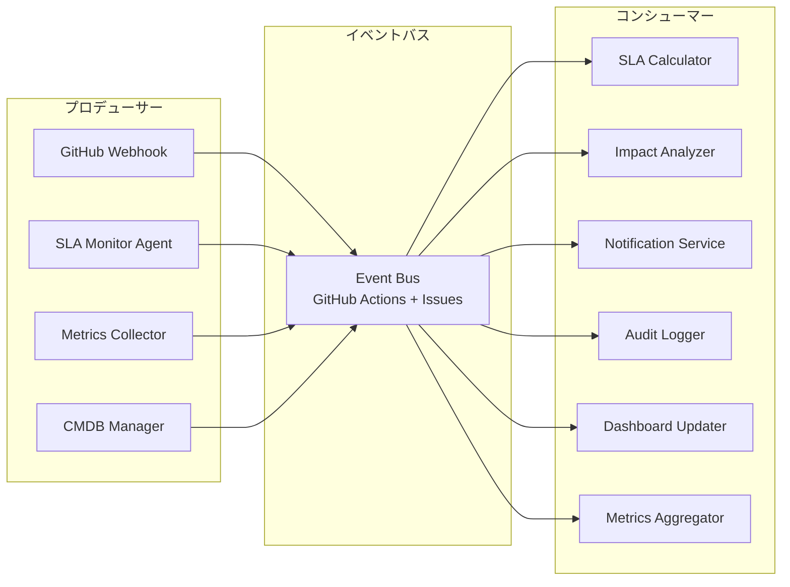

# イベントスキーマ（Event Schema）

ServiceMatrix イベントスキーマ仕様
Version: 1.0
Status: Active
Classification: Internal Technical Document
Applicable Standard: ITIL 4 / ISO 20000

---

## 1. 目的

本ドキュメントは、ServiceMatrixにおけるイベント駆動アーキテクチャの
イベントスキーマを定義する。

すべてのシステムイベントは本スキーマに従って発行・消費される。
イベントはメトリクス収集、監査ログ、自動化トリガーの基盤となる。

---

## 2. イベント種別一覧

### 2.1 インシデント関連イベント

| イベント種別 | 説明 | トリガー |
|-------------|------|---------|
| incident.created | インシデント起票 | GitHub Issue作成（incident ラベル） |
| incident.acknowledged | インシデント受付 | 初回コメントまたはアサイン |
| incident.updated | インシデント更新 | Issue 本文/ラベル/アサイン変更 |
| incident.priority_changed | 優先度変更 | priority/* ラベルの変更 |
| incident.escalated | エスカレーション実行 | escalated ラベル付与 |
| incident.workaround_applied | 暫定対処完了 | status/workaround ラベル付与 |
| incident.resolved | インシデント解決 | status/resolved ラベル付与 |
| incident.closed | インシデントクローズ | Issue クローズ |
| incident.reopened | インシデント再オープン | Issue 再オープン |

### 2.2 変更管理関連イベント

| イベント種別 | 説明 | トリガー |
|-------------|------|---------|
| change.created | 変更要求作成 | GitHub Issue作成（change ラベル） |
| change.submitted | 変更要求提出 | status/submitted ラベル付与 |
| change.under_review | レビュー開始 | status/under-review ラベル付与 |
| change.approved | 変更承認 | approved ラベル付与 |
| change.rejected | 変更却下 | rejected ラベル付与 |
| change.cab_approved | CAB承認 | cab/approved ラベル付与 |
| change.scheduled | 変更スケジュール確定 | status/scheduled ラベル付与 |
| change.started | 変更実施開始 | status/in-progress ラベル付与 |
| change.completed | 変更完了 | Issue クローズ（成功） |
| change.rolled_back | ロールバック実施 | change/rollback ラベル付与 |
| change.failed | 変更失敗 | change/failed ラベル付与 |

### 2.3 問題管理関連イベント

| イベント種別 | 説明 | トリガー |
|-------------|------|---------|
| problem.created | 問題登録 | GitHub Issue作成（problem ラベル） |
| problem.updated | 問題更新 | Issue更新 |
| problem.root_cause_identified | 根本原因特定 | problem/rca-identified ラベル付与 |
| problem.known_error_registered | 既知エラー登録 | problem/known-error ラベル付与 |
| problem.resolved | 問題解決 | Issue クローズ |

### 2.4 SLA関連イベント

| イベント種別 | 説明 | トリガー |
|-------------|------|---------|
| sla.at_risk | SLA違反リスク | SLAタイマー80%消費 |
| sla.breached | SLA違反 | SLAタイマー100%超過 |
| sla.met | SLA達成 | SLA目標時間内に解決 |
| sla.report_generated | SLAレポート生成 | 月次バッチ処理 |
| sla.target_changed | SLA目標変更 | SLA定義ファイルの更新 |

### 2.5 CMDB関連イベント

| イベント種別 | 説明 | トリガー |
|-------------|------|---------|
| ci.created | CI新規登録 | CMDB登録処理 |
| ci.updated | CI属性更新 | CMDB更新処理 |
| ci.status_changed | CIステータス変更 | ステータス遷移 |
| ci.relationship_added | 関係性追加 | リレーションシップ登録 |
| ci.relationship_removed | 関係性削除 | リレーションシップ削除 |
| ci.retired | CI廃止 | ステータス → Retired |

### 2.6 システム関連イベント

| イベント種別 | 説明 | トリガー |
|-------------|------|---------|
| system.health_check | ヘルスチェック | 定期実行 |
| system.metrics_collected | メトリクス収集完了 | 収集バッチ完了 |
| system.alert_fired | アラート発火 | 閾値超過検出 |
| system.maintenance_started | メンテナンス開始 | メンテナンスウィンドウ開始 |
| system.maintenance_ended | メンテナンス終了 | メンテナンスウィンドウ終了 |

---

## 3. イベントペイロード JSON Schema

### 3.1 基本イベントスキーマ（全イベント共通）

```json
{
  "$schema": "http://json-schema.org/draft-07/schema#",
  "title": "ServiceMatrix Event",
  "type": "object",
  "required": [
    "event_id", "event_type", "timestamp",
    "actor", "resource_type", "resource_id"
  ],
  "properties": {
    "event_id": {
      "type": "string",
      "pattern": "^EVT-[0-9]{8}-[A-Za-z0-9]{8}$",
      "description": "イベント一意識別子（例: EVT-20260302-a1b2c3d4）"
    },
    "event_type": {
      "type": "string",
      "description": "イベント種別（例: incident.created）"
    },
    "timestamp": {
      "type": "string",
      "format": "date-time",
      "description": "イベント発生日時（ISO 8601 JST）"
    },
    "actor": {
      "type": "object",
      "required": ["actor_id", "actor_type"],
      "properties": {
        "actor_id": {
          "type": "string",
          "description": "実行者ID"
        },
        "actor_type": {
          "type": "string",
          "enum": ["user", "agent", "system", "webhook"],
          "description": "実行者種別"
        },
        "actor_name": {
          "type": "string",
          "description": "実行者表示名"
        }
      }
    },
    "resource_type": {
      "type": "string",
      "enum": ["incident", "change", "problem", "request", "ci", "sla", "system"],
      "description": "対象リソース種別"
    },
    "resource_id": {
      "type": "string",
      "description": "対象リソースID"
    },
    "diff": {
      "type": "object",
      "properties": {
        "fields_changed": {
          "type": "array",
          "items": {
            "type": "object",
            "properties": {
              "field": { "type": "string" },
              "old_value": {},
              "new_value": {}
            },
            "required": ["field", "new_value"]
          }
        }
      },
      "description": "変更差分"
    },
    "metadata": {
      "type": "object",
      "properties": {
        "github_issue_number": { "type": "integer" },
        "github_event_type": { "type": "string" },
        "github_event_action": { "type": "string" },
        "github_sender": { "type": "string" },
        "source_ip": { "type": "string" },
        "correlation_id": { "type": "string" },
        "parent_event_id": { "type": "string" }
      },
      "description": "イベントメタデータ"
    },
    "tags": {
      "type": "array",
      "items": { "type": "string" },
      "description": "イベントタグ"
    }
  }
}
```

### 3.2 インシデント作成イベントの例

```json
{
  "event_id": "EVT-20260302-a1b2c3d4",
  "event_type": "incident.created",
  "timestamp": "2026-03-02T10:30:00+09:00",
  "actor": {
    "actor_id": "USR-000042",
    "actor_type": "user",
    "actor_name": "ops-engineer-01"
  },
  "resource_type": "incident",
  "resource_id": "INC-2026-000042",
  "diff": {
    "fields_changed": [
      { "field": "status", "new_value": "New" },
      { "field": "priority", "new_value": "P1" },
      { "field": "title", "new_value": "本番DBサーバー応答不可" },
      { "field": "affected_ci_ids", "new_value": ["CI-SRV-005", "CI-DB-001"] }
    ]
  },
  "metadata": {
    "github_issue_number": 42,
    "github_event_type": "issues",
    "github_event_action": "opened",
    "github_sender": "ops-engineer-01",
    "correlation_id": "CORR-20260302-xyz789"
  },
  "tags": ["p1", "database", "production"]
}
```

### 3.3 SLA違反イベントの例

```json
{
  "event_id": "EVT-20260302-e5f6g7h8",
  "event_type": "sla.breached",
  "timestamp": "2026-03-02T11:30:00+09:00",
  "actor": {
    "actor_id": "sla-monitor-agent",
    "actor_type": "agent",
    "actor_name": "SLA Monitor Agent"
  },
  "resource_type": "incident",
  "resource_id": "INC-2026-000042",
  "diff": {
    "fields_changed": [
      { "field": "sla_breached", "old_value": false, "new_value": true },
      { "field": "sla_breach_type", "new_value": "response_time" },
      { "field": "sla_target_minutes", "new_value": 60 },
      { "field": "sla_actual_minutes", "new_value": 75 }
    ]
  },
  "metadata": {
    "github_issue_number": 42,
    "correlation_id": "CORR-20260302-xyz789"
  },
  "tags": ["sla-breach", "p1", "response-time"]
}
```

---

## 4. GitHub Webhookイベントとの対応マッピング

### 4.1 Issues イベント

| GitHub Webhook Action | ServiceMatrix Event | 条件 |
|----------------------|---------------------|------|
| issues.opened | incident.created | ラベル: incident |
| issues.opened | change.created | ラベル: change |
| issues.opened | problem.created | ラベル: problem |
| issues.opened | (request作成) | ラベル: request |
| issues.assigned | incident.acknowledged | ラベル: incident |
| issues.labeled | incident.priority_changed | priority/* ラベル変更 |
| issues.labeled | incident.escalated | escalated ラベル追加 |
| issues.labeled | sla.breached | sla/breached ラベル追加 |
| issues.labeled | change.approved | approved ラベル追加 |
| issues.closed | incident.closed | ラベル: incident |
| issues.closed | change.completed | ラベル: change |
| issues.closed | problem.resolved | ラベル: problem |
| issues.reopened | incident.reopened | ラベル: incident |

### 4.2 Issue Comment イベント

| GitHub Webhook Action | ServiceMatrix Event | 条件 |
|----------------------|---------------------|------|
| issue_comment.created | incident.updated | ラベル: incident |
| issue_comment.created | incident.acknowledged | 初回コメント（incidentラベル） |

### 4.3 Pull Request イベント

| GitHub Webhook Action | ServiceMatrix Event | 条件 |
|----------------------|---------------------|------|
| pull_request.merged | change.completed | 関連changeIssueリンクあり |
| pull_request.closed (not merged) | change.rejected | 関連changeIssueリンクあり |

---

## 5. イベント配信

### 5.1 イベントバスアーキテクチャ



### 5.2 イベント配信保証

| 特性 | 方針 |
|------|------|
| 配信保証 | At-least-once（最低1回配信） |
| 順序保証 | 同一リソース内では発行順を維持 |
| 冪等性 | コンシューマーはevent_idによる重複排除を実装 |
| 再配信 | 処理失敗時は最大3回リトライ（指数バックオフ） |

### 5.3 イベントフィルタリング

コンシューマーは以下の条件でイベントをフィルタリングできる。

| フィルタ条件 | 用途例 |
|-------------|--------|
| event_type | SLA Calculatorは `incident.*` と `sla.*` のみ受信 |
| resource_type | CMDB Managerは `ci` リソースのみ受信 |
| actor.actor_type | 監査ログは全イベントを受信 |
| tags | P1タグのイベントのみ即時通知 |

---

## 6. イベントの相関（Correlation）

### 6.1 相関ID（Correlation ID）

同一のビジネストランザクションに属するイベント群を
correlation_id で紐付ける。

```
例: インシデントのライフサイクル

incident.created    (correlation_id: CORR-20260302-xyz789)
incident.acknowledged (correlation_id: CORR-20260302-xyz789)
sla.at_risk         (correlation_id: CORR-20260302-xyz789)
incident.escalated  (correlation_id: CORR-20260302-xyz789)
sla.breached        (correlation_id: CORR-20260302-xyz789)
incident.resolved   (correlation_id: CORR-20260302-xyz789)
incident.closed     (correlation_id: CORR-20260302-xyz789)
```

### 6.2 親子イベント

イベントが別のイベントをトリガーした場合、
parent_event_id で因果関係を記録する。

```
incident.created (event_id: EVT-001)
  └── sla.at_risk (event_id: EVT-002, parent_event_id: EVT-001)
       └── sla.breached (event_id: EVT-003, parent_event_id: EVT-002)
```

---

## 7. イベント保管

### 7.1 保管ポリシー

| データ種別 | 保持期間 | 保管場所 |
|-----------|---------|---------|
| 生イベント | 90日 | イベントストア |
| 集約イベント | 1年 | アーカイブストア |
| SLA関連イベント | 7年 | 長期保管（監査要件） |
| 監査対象イベント | 7年 | 長期保管（監査要件） |

---

## 8. 関連ドキュメント

| ドキュメント | 参照先 |
|-------------|--------|
| データスキーマ定義 | `docs/11_data_model/DATA_SCHEMA_DEFINITION.md` |
| 監査ログスキーマ | `docs/11_data_model/AUDIT_LOG_SCHEMA.md` |
| メトリクス収集モデル | `docs/07_sla_metrics/METRICS_COLLECTION_MODEL.md` |
| SLA定義書 | `docs/07_sla_metrics/SLA_DEFINITION.md` |
| データ保持ポリシー | `docs/11_data_model/DATA_RETENTION_POLICY.md` |

---

## 9. 改定履歴

| 版数 | 日付 | 変更内容 | 承認者 |
|------|------|----------|--------|
| 1.0 | 2026-03-02 | 初版作成 | Service Governance Authority |

---

本ドキュメントはServiceMatrix統治フレームワークの一部であり、
SERVICEMATRIX_CHARTER.md に定められた統治原則に従う。
