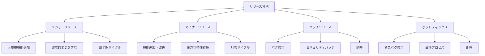
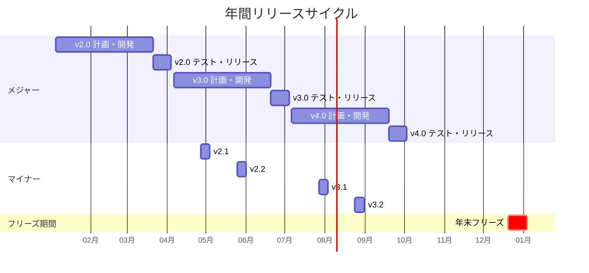
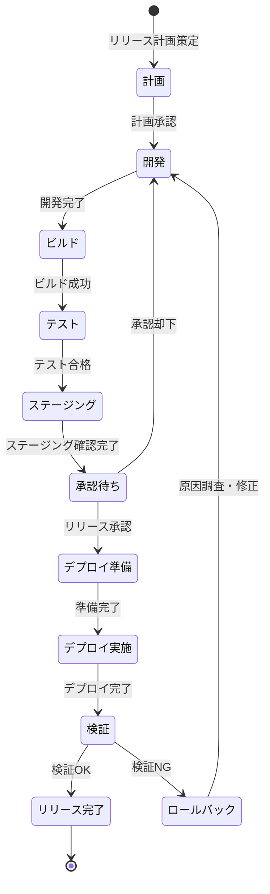
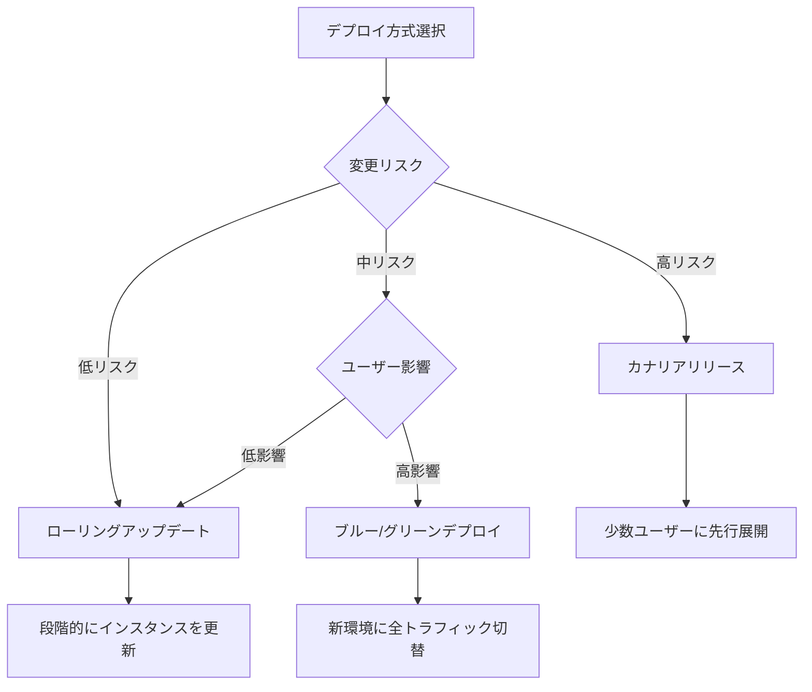
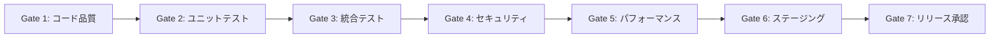

# リリース戦略
ServiceMatrix Release Strategy

Version: 1.0
Status: Active
Owner: Release Manager
Classification: ITIL 4 Aligned

---

## 1. 目的と適用範囲

### 1.1 目的

本ドキュメントは、ServiceMatrix におけるリリース戦略を定義する。
安全かつ効率的なリリースを実現し、サービス品質を維持しながら
継続的な価値提供を可能にするためのフレームワークを提供する。

### 1.2 適用範囲

- アプリケーションリリース
- インフラストラクチャ変更のリリース
- 設定変更のリリース
- ドキュメント・ナレッジのリリース
- データベーススキーマ変更のリリース

---

## 2. リリースモデル

### 2.1 リリースタイプ

### 2.2 リリースタイプ比較

| 属性 | メジャー | マイナー | パッチ | ホットフィックス |
|------|---------|---------|--------|----------------|
| 頻度 | 四半期 | 月次 | 随時 | 緊急時のみ |
| 変更規模 | 大 | 中 | 小 | 最小限 |
| テスト範囲 | フルリグレッション | 機能テスト+回帰 | 対象テスト | 最小限の回帰 |
| 承認レベル | CAB + IT部門長 | CAB | チームリード | 緊急変更管理 |
| リリースノート | 詳細 | 標準 | 簡易 | 速報 |
| ロールバック計画 | 必須（詳細） | 必須 | 必須 | 必須（簡易） |
| メンテナンスウィンドウ | 要 | 要 | 状況次第 | 不要 |

---

## 3. リリースサイクル

### 3.1 年間リリースカレンダー

### 3.2 リリースフリーズ期間

| 期間 | 理由 | 例外 |
|------|------|------|
| 年末年始（12/20-1/5） | 運用体制縮小 | CVSS 9.0+ のセキュリティパッチのみ |
| 大型連休前後（3日前-1日後） | 変更リスク軽減 | P1インシデント対応のホットフィックスのみ |
| 四半期決算期間（最終週） | 業務影響回避 | セキュリティパッチのみ |

---

## 4. リリースプロセス

### 4.1 リリースライフサイクル

### 4.2 リリース準備チェックリスト

| # | 確認項目 | 担当 | 完了 |
|---|---------|------|------|
| 1 | 全CIパイプラインが緑（成功） | 開発チーム | |
| 2 | コードレビュー完了・承認済み | レビュアー | |
| 3 | セキュリティスキャン合格 | セキュリティチーム | |
| 4 | パフォーマンステスト合格 | QAチーム | |
| 5 | ステージング環境での確認完了 | QAチーム | |
| 6 | リリースノート作成完了 | PM | |
| 7 | ロールバック手順確認済み | 運用チーム | |
| 8 | データベースマイグレーション確認済み | DBA | |
| 9 | 外部依存サービスとの互換性確認 | 開発チーム | |
| 10 | 変更管理承認取得済み | リリースマネージャー | |

---

## 5. リリース戦略パターン

### 5.1 デプロイ方式の選択

### 5.2 方式比較

| 方式 | 特徴 | ダウンタイム | ロールバック速度 | 適用場面 |
|------|------|------------|----------------|---------|
| ローリングアップデート | 段階的更新 | ゼロ | 中速 | 低リスク変更 |
| ブルー/グリーン | 環境切替 | ほぼゼロ | 高速 | 中〜高リスク変更 |
| カナリアリリース | 段階的展開 | ゼロ | 高速 | 高リスク変更 |
| リクリエイト | 全置換 | あり | 低速 | 互換性がない変更 |
| フィーチャーフラグ | 機能トグル | ゼロ | 即時 | 段階的機能公開 |

### 5.3 推奨パターン

- **メジャーリリース**: ブルー/グリーン + カナリア（段階展開）
- **マイナーリリース**: ブルー/グリーン
- **パッチリリース**: ローリングアップデート
- **ホットフィックス**: ローリングアップデート（最速）

---

## 6. 品質ゲート

### 6.1 7段階品質ゲート

| ゲート | 基準 | 自動化 |
|--------|------|--------|
| Gate 1 | Lint合格、コードカバレッジ80%以上 | 完全自動 |
| Gate 2 | ユニットテスト全件合格 | 完全自動 |
| Gate 3 | 統合テスト全件合格 | 完全自動 |
| Gate 4 | 脆弱性スキャン合格、SAST/DAST合格 | 完全自動 |
| Gate 5 | レスポンスタイム基準内、負荷テスト合格 | 半自動 |
| Gate 6 | ステージング環境での受入テスト合格 | 手動確認 |
| Gate 7 | CAB承認、リリースノート確認 | 手動承認 |

---

## 7. GitHub 連携

### 7.1 リリースラベル

| ラベル | 用途 |
|--------|------|
| `release:major` | メジャーリリース関連 |
| `release:minor` | マイナーリリース関連 |
| `release:patch` | パッチリリース関連 |
| `release:hotfix` | ホットフィックス関連 |
| `release:blocked` | リリースブロッカー |
| `release:ready` | リリース準備完了 |

### 7.2 GitHub Release との連携

- リリースタグは SemVer に準拠する（v{major}.{minor}.{patch}）
- GitHub Release にはリリースノートと変更ログを自動生成
- リリース成果物は GitHub Release に添付
- AI Agent がリリースノートのドラフトを自動生成

---

## 8. コミュニケーション計画

### 8.1 リリース前通知

| 通知タイミング | 通知先 | 内容 |
|---------------|--------|------|
| リリース1週間前 | 全ステークホルダー | リリース予定、主要変更内容 |
| リリース1日前 | 運用チーム | 詳細スケジュール、ロールバック計画 |
| リリース直前 | 全ユーザー | メンテナンス開始通知 |

### 8.2 リリース後通知

| 通知タイミング | 通知先 | 内容 |
|---------------|--------|------|
| リリース直後 | 全ユーザー | リリース完了、主要変更点 |
| リリース翌営業日 | 全ステークホルダー | リリースレポート |
| リリース1週間後 | 開発チーム | リリース振り返り結果 |

---

## 9. メトリクスと KPI

| KPI | 目標値 | 計測頻度 |
|-----|--------|---------|
| リリース成功率 | 98% 以上 | 月次 |
| リリース頻度 | 計画通り | 月次 |
| 平均リリースサイクルタイム | 計画比±10% | 四半期 |
| リリース起因インシデント率 | 5% 以下 | 月次 |
| ロールバック発生率 | 3% 以下 | 月次 |
| 品質ゲート合格率 | 90% 以上（初回） | 月次 |

---

## 10. 継続的改善

### 10.1 リリース振り返り

すべてのメジャー/マイナーリリース後にリリース振り返り（PIR）を実施する。

| 評価項目 | 内容 |
|---------|------|
| 計画精度 | スケジュール通りに進行したか |
| 品質 | リリース後のインシデント件数 |
| プロセス | プロセスで改善すべき点 |
| ツール | ツール・自動化で改善すべき点 |
| コミュニケーション | 通知は適切だったか |

### 10.2 レビューサイクル

| レビュー | 頻度 | 内容 |
|---------|------|------|
| リリース個別PIR | 都度 | 各リリースの振り返り |
| 月次リリースレビュー | 月次 | 月間のリリース実績評価 |
| 四半期戦略レビュー | 四半期 | リリース戦略全体の評価・更新 |

---

## 改訂履歴

| バージョン | 日付 | 変更内容 | 承認者 |
|-----------|------|---------|--------|
| 1.0 | 2026-03-02 | 初版作成 | Release Manager |
